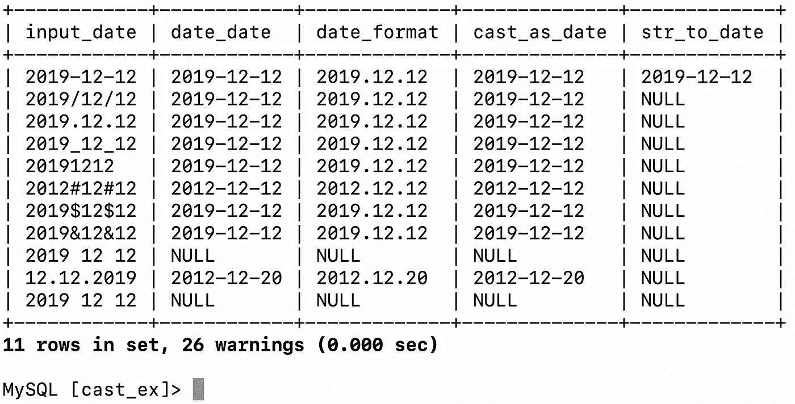
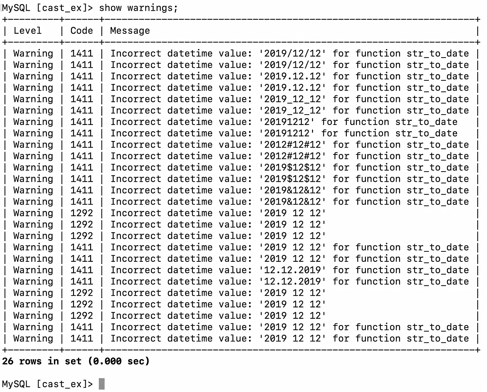
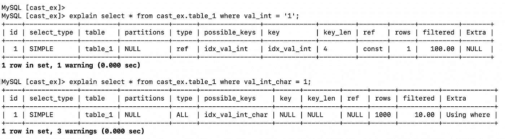
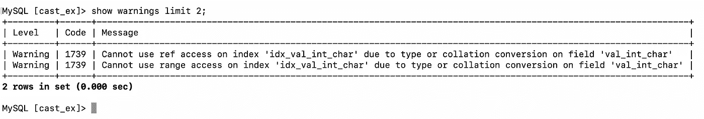
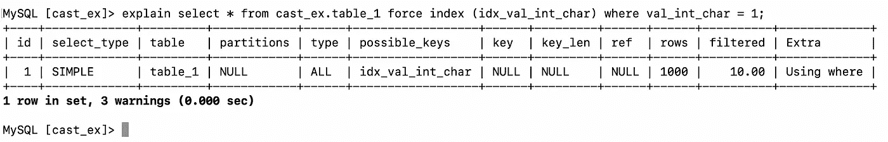

# SQL 中的类型转换

> 原文：<https://towardsdatascience.com/type-casting-in-sql-2f92dc34a74b?source=collection_archive---------41----------------------->

照片由 [Oliur](https://unsplash.com/@ultralinx?utm_source=unsplash&utm_medium=referral&utm_content=creditCopyText) 在 [Unsplash](https://unsplash.com/s/photos/conversion?utm_source=unsplash&utm_medium=referral&utm_content=creditCopyText) 上拍摄

## 软件开发

## 如何转换 SQL 中的数据类型及其对[数据库&查询性能](https://linktr.ee/kovid)的影响

从一种类型转换到另一种类型在 SQL 查询中非常常见。这种使用基本上源于糟糕的数据库设计、不断变化的需求、遗留的应用程序和懒惰的数据库维护。不是有意的，但是这些事情确保了数据消费者的需求永远不会被直接满足。消费者必须想出变通的解决方案来获取他们的数据。类型转换是主要的工具之一，尽管很少被提及。

我们将使用下面的样本数据集来浏览在查询中进行转换的不同示例。

# 资料组

对于本文的范围，假设当我们谈论造型时，它包括所有 SQL 风格中所有与造型相关的函数，如 Oracle 中的`to_date`、MySQL 中的`cast(something as int)`等等。然而，这些例子是基于 MariaDB (MySQL)的。

# 隐式铸造

下例中的所有查询都会给出完全相同的输出——这意味着数据库引擎隐式地理解了我们给它的`where`子句输入。它根据自己的要求在`where`子句中把`'1'`内部转换为`1`，反之亦然。以下示例中的所有四个查询将产生相同的输出。

这同样适用于从字符串到浮点数的转换，反之亦然。但是，并非所有数据库都在相同程度上支持隐式类型转换。对于本文的范围，我使用了 MariaDB。

当数据库能够隐式转换值时，我们可以假设它会对性能产生影响。隐式转换不是没有成本的，因为根据定义，它会为查询引擎增加更多的工作。事实上，隐式转换最终会比显式转换花费更多的成本，因为在显式转换中，您可以控制成本，而在隐式转换中，数据库处于控制之中，它决定采取什么行动，这反过来又会产生成本。

# 显式造型

这是人类指定铸造什么和铸造成什么的地方。因为字符串-整数、字符串-浮点转换由数据库引擎本身负责，所以当我们讨论日期时，转换的下一个最重要的用例就出现了。日期是数据库系统中最不同的存储信息。这里有很多变体，其中两个主要的是——时区和日期格式。大多数时候，日期不是以日期或时间戳的形式存储的，而是以字符串的形式存储的。这就是一切变得太有趣的地方。:)

下面的示例显示了数据库引擎为将字符串转换为日期提供的许多选项。

仔细查看数据库，当涉及到用字符串存储日期时，它是非常可靠和容易理解的。它可以解释几乎所有的日期格式，只有一个例外——`2019 12 12`——这是一个明显的数据库不能识别空间的例子。我猜也没人会这样写日期。但你无论如何也不能这么肯定。如果你的日期是这种格式，你可以做一个`replace(_date,' ','')`并把它转换成日期。

注意，数据库已经返回了结果集，但是有 26 个警告。让我们看看它们是什么。

警告不是错误。这里的警告是一个通知，表明数据库怀疑可能有问题。当您试图将一个副本`insert ignore`到一个表中时，也会发生类似的情况。如果你`insert`，它不会抛出警告，它会抛出错误。对于警告，数据库会假设您会在需要时查看这些警告。如果出现错误，除非您修复它们，否则无法继续。

就像我们从字符串转换日期一样，许多其他的转换也是可能的，但是要小心。

# 对性能的影响

如前所述，添加到查询引擎的任何工作都会对性能产生一些影响。对于合理大小的数据集，隐式和显式转换(类型转换)可能**而不是**本身会大大降低查询速度。但是，您的查询很慢完全有可能是因为类型转换引起的其他问题。

类型转换(强制转换)会使查询的一个或多个索引变得无用。您可以使用`explain`或`explain extended`来检查查询计划中是否使用了索引。如果索引没有被使用，我们可以在`where`子句或`join`子句中显式类型转换列，等等。

让我们看看这是如何影响索引的。

运行下面的两个查询告诉我们，当我们在`where`子句中传递一个要与整数字段进行比较的字符串时，它会选择索引`idx_val_int`，但是在下一个查询中，当我们在`where`子句中传递一个要与字符串字段进行比较的整数时，它不会使用索引。它在可能的关键字中显示了索引的名称。

还有关于为什么没有选择索引的附加信息。

连强行索引`idx_val_int_char`都不管用

唯一的解决方法是以字符串的形式提供值，即`'1'`而不是`1`或`cast(1 as char)`，`1`是应用程序的输入，因此是可参数化的。

# 结论

每个数据库都有许多将一种数据类型转换成另一种数据类型的选项，这些选项可以解决我们日常面临的大多数用例。尽管类型转换是一个很好的特性，但它确实伴随着*性能成本*，无论是隐式转换还是显式转换。

虽然并不总是可行，但是避免这一切的一个很好的方法是以这样一种方式设计和维护数据库和查询，即需要最少的类型转换。如果这不可能，请确保您的查询使用了正确的索引，这样性能就不会受到更大的影响。还有更多关于字符集和排序的内容。我们将在另一个时间谈论那件事。