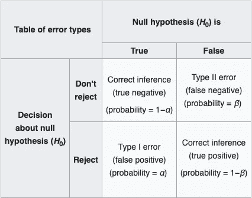

# 第一类和第二类错误

> 原文：<https://towardsdatascience.com/type-i-type-ii-errors-5b7eaf493dab?source=collection_archive---------47----------------------->

## 当统计测试结果与现实不符时

在 [Unsplash](https://unsplash.com/s/photos/wrong?utm_source=unsplash&utm_medium=referral&utm_content=creditCopyText) 上 [NeONBRAND](https://unsplash.com/@neonbrand?utm_source=unsplash&utm_medium=referral&utm_content=creditCopyText) 拍摄的照片

当执行统计测试时，目标是查看在给定数据的情况下，某个陈述是否明显不太可能。用更简单的语言来说，你试图确定你认为一个陈述是真的还是假的。这种说法被称为**零假设** (H₀)，相反的说法被称为**替代假设** (H₁).在某种程度上，零假设是默认的陈述，因为它可能是真的，测试的工作就是挑战这一点。很像在法庭上，你是“无罪的，直到被证明有罪”，不幸的是，有时无辜的人被判有罪，而有罪的人却被释放，因为他们实际上犯了罪。这两个错误分别对应于统计测试中已知的第一类**和第二类**错误。

> 在高中，我的 AP 统计老师教我们记住，在第二类错误中，你会拒绝失败。

# 第一类错误

当你拒绝零假设时，第一类错误就发生了。在前面提到的法庭例子中，第一类错误是给一个无辜的人定罪——无罪的零假设被拒绝，当它不应该被拒绝的时候。第一类错误也可以被认为是假阳性，因为你错误地声称*是*手头变量之间的统计显著差异，而实际上*不是*。

# 第二类错误

相反，当*没有*拒绝零假设，而*应该*拒绝零假设时，就会发生第二类错误。在高中，我的 AP 统计老师教我们记住，在第二类错误中，你会拒绝失败。在我们一直在处理的例子中，第二类错误将是未能给那些*是* *有罪*的人定罪，因此应该被定罪。第二类错误也可以被认为是假阴性，因为你错误地声称*不是*手头的变量之间的统计显著差异，而实际上*是*。

维基百科:第一类和第二类错误

第一类和第二类误差彼此成反比，因为减少一种误差会增加另一种误差。在不同的情况下，一种类型的错误可能更有害，因此最小化更重要。例如，在法庭上，让一个有罪的人走，比把一个无辜的人送进监狱要好。因此，在这种情况下，I 型错误会更糟。然而，在医疗情况下，对于你*没有*的东西，最好有一个*阳性*的检测结果，而不是对于你*有*的东西，有一个*阴性*的检测结果。通过对你实际上患有的疾病的测试呈阴性，你的生命可能由于缺乏治疗而处于危险之中。因此，在这种情况下，第二类错误会更糟。虽然完全消除这些错误的可能性对于[非确定性方程](https://en.wikipedia.org/wiki/Nondeterministic_algorithm)来说是不可能的，但是最小化它们是统计学和数据科学的一个大目标。

## 参考资料:

 [## 第一类和第二类错误

### 在统计假设检验中，第一类错误是拒绝一个真的零假设(也称为“假…

en.wikipedia.org](https://en.wikipedia.org/wiki/Type_I_and_type_II_errors)