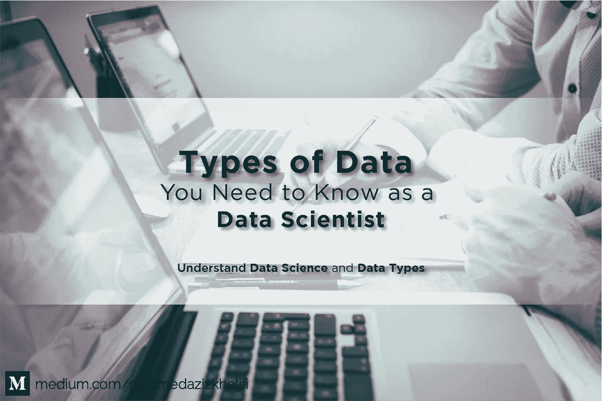
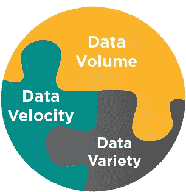

# 作为数据科学家，您需要了解的数据类型

> 原文：<https://towardsdatascience.com/types-of-data-you-need-to-know-as-a-data-scientist-8f432154b5a5?source=collection_archive---------37----------------------->

## 数据科学

## 了解数据科学和数据类型(结构化、非结构化……)

背景由[hello queue](https://unsplash.com/@helloquence?utm_source=medium&utm_medium=referral)上的 [Unsplash](https://unsplash.com?utm_source=medium&utm_medium=referral)

# 目录

1.  **什么是数据科学？**
2.  数据科学是一个新领域吗？
3.  **数据类型**
4.  **数据格式/来源**
5.  **总结与结论**

## 什么是数据科学？

数据科学是对大量数据的研究。就像生物科学是对生物学的研究一样，物理科学是对物理反应的研究。这是使用数据来理解不同事物，理解世界的过程。
数据科学是关于从各种形式中提取数据的方式的领域，无论是**非结构化**还是**结构化**形式。这是一个多学科领域，汇集了来自**计算机科学**、**数学/统计学**和**数据分析**的概念。

数据科学的核心是**总是问问题**。数据科学家总是需要对这个世界保持好奇。

1.  我们能从这些数据中学到什么？
2.  一旦我们找到了我们要找的东西，我们可以采取什么行动？

> “在未来 10 年，数据科学和软件对医学的贡献将超过所有生物科学的总和”。*维诺德·科斯拉*

## 数据科学是一个新领域吗？

早在第二次世界大战后的几年里，因肺癌死亡的人数有所上升，科学家和医生没有就具体原因达成一致，没有人认为香烟可能是原因的假设，因为那时每个人都吸烟。在英国，所有医生的数据和细节都写在一个中央登记簿上(包括:吸烟者？；活着/死亡？，如果他死了，死亡的原因是什么？)所以无意中，我们有了他们可以操纵的庞大数据，来预测和理解这种现象。于是*布拉德福德·希尔*和*理查德·多尔*开始操纵这些数据，提取死于肺癌的医生，看看他们是不是烟民。结果很明显，在过去的 29 个月里，死于肺癌的人 100%都是吸烟者。因此**数据科学并不新鲜，新鲜的是从各种来源获得的大量数据**。

> 在数据科学领域有很多职业道路；大多数，但不是全部，涉及一点数学，一点科学，以及对数据的好奇心。

## 数据类型

**大数据**:大数据没有精确或通用的定义...海量数据集，或包含更多*种类*的数据，以不断增加的*量*和更高的速度(3V 法则)到达。

图片来源:[作者](https://medium.com/@ahmedazizkhelifi)

1.  **数据量**:巨大的数据量，TB—Pb。
2.  **数据速度**:数据流动、数据变化、数据处理的高速。
3.  **数据种类**:各种数据源(社交媒体、移动、结构化数据、非结构化数据……)。

> “世界是一个大数据问题”。安德鲁·迈克菲

**结构化数据**:具有预定义结构的数据，这些数据已经以有序的方式存储在关系数据库或电子表格中(传统的行列数据库)。结构化数据有两个来源:

1.  **机器生成的**:从传感器、网络日志和金融系统接收的所有数据，包括医疗设备、GPS 数据、服务器捕获的使用统计数据。
2.  **人为生成的**:主要包括人类输入计算机的所有数据，如姓名和其他个人信息、访问的网站、观看的电影类型(公司可以利用这些数据来了解其客户行为并做出适当的商业决策，例如网飞、Youtube 或 Medium 的推荐系统)…

**非结构化数据:**没有预定义结构的数据，以任何大小或形式出现(它们在存储中没有明确的格式)，不容易存储在表中。它还根据其来源进行分类:

1.  **机器生成:**说明了所有的卫星图像、安全摄像头、雷达数据捕捉以及其他更多信息。
2.  **人为生成:**在互联网上大量存在，因为它包括社交媒体数据、移动数据、电子邮件和网站内容。这意味着我们上传到脸书或 Instagram 的图片，我们在 Youtube 上观看的视频，甚至我们发送的短信。

**半结构化数据:**非结构化数据和半结构化数据之间的界限一直不清楚，因为大多数半结构化数据一眼看上去都是非结构化的。不像结构化数据那样采用传统数据库格式，但包含一些易于处理的组织属性的信息。例如，NoSQL 文档被认为是半结构化的，因为它们包含可用于轻松处理文档的关键字。

## 其他数据类型

**定量数据**:数值。比如:身高，体重，工资，物价…

**分类数据:**可以标记或分组的数据。比如:性别、发色、种族、水果、动物…

## 数据格式/来源

**最常见的数据格式**:

*   **CSV -逗号分隔值:**顾名思义，是一个使用逗号分隔值的分隔文本文件。
*   **XML -可扩展标记语言**
*   **SQL 结构化查询语言**
*   **JSON - JavaScript 对象符号**
*   **协议缓冲区**

**数据来源**:公司、API、政府、学术、网络抓取/抓取…

## 摘要

*   数据科学是对大量数据的研究，可以揭示帮助组织做出战略选择的洞察力。
*   **数据科学并不新鲜**，新鲜的是来自各种来源的大量数据:博客、社交媒体、销售数据、GPS 数据、服务器捕获的使用统计数据、电子邮件、患者信息文件、运动表现数据、传感器数据、安全摄像头等等。
*   术语“大数据”描述了海量数据的集合，无论是结构化、半结构化还是非结构化的数据，都可以被处理和利用，以获得可理解的相关信息。我们用 **3V 法则总结大数据的问题:量、速度、多样性**。

## 结论

除了解决今天的问题，数据科学家也是未来项目的核心。你肯定听说过自动驾驶汽车。事实上，通过更好地利用数据，我们能够建造更强大、更智能的机器人。而这是数据科学家的责任。

## 资源:

*   [https://www . goodreads . com/book/show/7170627-万病之王](https://www.goodreads.com/book/show/7170627-the-emperor-of-all-maladies)
*   [https://www.goodreads.com/book/show/705365.现代医学的兴衰](https://www.goodreads.com/book/show/705365.The_Rise_and_Fall_of_Modern_Medicine)
*   [https://www . the guardian . com/news/2005/jun/02/thisweekssciencequestions . cancer](https://www.theguardian.com/news/2005/jun/02/thisweekssciencequestions.cancer)
*   [https://en.wikipedia.org/wiki/Comma-separated_values](https://en.wikipedia.org/wiki/Comma-separated_values)
*   [https://www . edvancer . in/50-amazing-big-data-and-data-science-quotes-to-inspire-you/](https://www.edvancer.in/50-amazing-big-data-and-data-science-quotes-to-inspire-you/)

**感谢阅读！😄**

查看**我的其他文章**，关注我的 [**中型**](https://medium.com/@ahmedazizkhelifi)

[哈利菲艾哈迈德阿齐兹](https://medium.com/u/862a0903708d?source=post_page-----8f432154b5a5--------------------------------)