# 机器学习中集成方法的类型

> 原文：<https://towardsdatascience.com/types-of-ensemble-methods-in-machine-learning-4ddaf73879db?source=collection_archive---------10----------------------->


弗拉德·希利塔努在 [Unsplash](https://unsplash.com?utm_source=medium&utm_medium=referral) 上拍摄的照片

在我之前的文章中，我们讨论了机器学习中不同类型的[回归](https://medium.com/datadriveninvestor/types-of-regression-in-machine-learning-bd0f5c4772fc)。因此，今天我将重点讨论数据科学中的各种集成方法。

我在职业生涯中经历的一件事是，在学习任何技能时，当我们试图将概念与我们日常生活中面临的事件联系起来时，事情会变得更容易。当我们有一个真实的生活类比时，记住事情是毫不费力的。因此，记住这一点，我们将通过与日常场景的比较来研究各种集合技术。

# 目录

1.介绍

2.集合方法的类型

3.装袋和增压方法之间的相似性

4.两种方法之间的差异

5.投票的类型

6.对概念的详细理解

*   制袋材料
*   助推

7.结论

# **1。简介**

***什么是合奏？***

在简单的英语中，ensemble 指的是一组项目。例如:一群牧师、一群舞蹈演员等。

***什么是机器学习中的集成方法？***

集成方法是一种使用多个独立的相似或不同的模型/弱学习器来获得输出或做出一些预测的技术。

例如

*随机森林是多个决策树的集合。*

*集合也可以通过不同模型的组合来构建，如随机森林、SVM、逻辑回归等。*

现在，让我们用一个真实的例子来比较一下。

假设议会通过了一项法案，并召开了部长会议。

而不是总统或总理独自做出决定可能不是一个很好的主意，因为这说明了独裁统治，结果可能不是那么有利于公众。因此，这种类比可以指机器学习中的单一模型，如决策树、逻辑回归等，它们的性能总是略低于集成方法。

然而，如果在不同的部长之间举行会议，比如说四个部长，他们每个人都会提供一个有正反两面的意见。最后，最佳意见将在多数投票的基础上选出。这正是系综方法。

**部长 1** :基于他的赞成和反对意见，认为该法案应该通过。

部长 2 :基于他的支持和反对，他说这个法案没有用，可能会引发很多挑战。因此不应通过。

**部长 3:** 表示议案可以通过。

**部长 4:** 也表示议案可以通过。

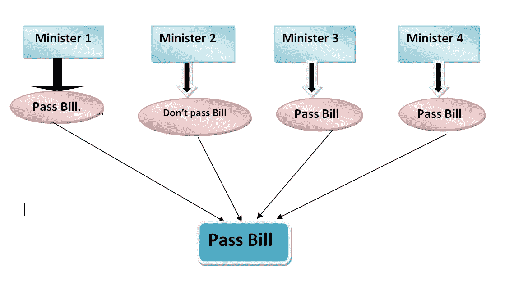

大多数人说“通过议案”。因此，该法案在议会获得通过。

类似地，我们可以在下面看到使用了不同的模型，并且基于每个模型的输出，最终的决定将通过多数投票做出。

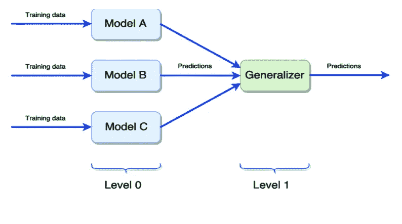

来源:谷歌

***为什么我们需要合奏技巧？***

众所周知，任何机器学习模型中的错误和预测都会受到偏差、方差和噪声的不利影响。为了克服这些缺点，使用了集合方法。

# ***2。集成方法的类型***

有许多可用的集成技术，但我们将讨论以下两种最广泛使用的方法:

**1。装袋**

**2。增压**

让我们首先了解这两个术语之间的异同。

# ***3。装袋和增压方法的相似性***

这两种方法都可以用于分类(离散输出)和回归(连续输出)问题。

与单一模型相比，这两种方法在性能上都更好，因为它们通过投票聚集了所有弱学习者的输出，从而导致预测更准确。

# ***4。*两种方法的区别**

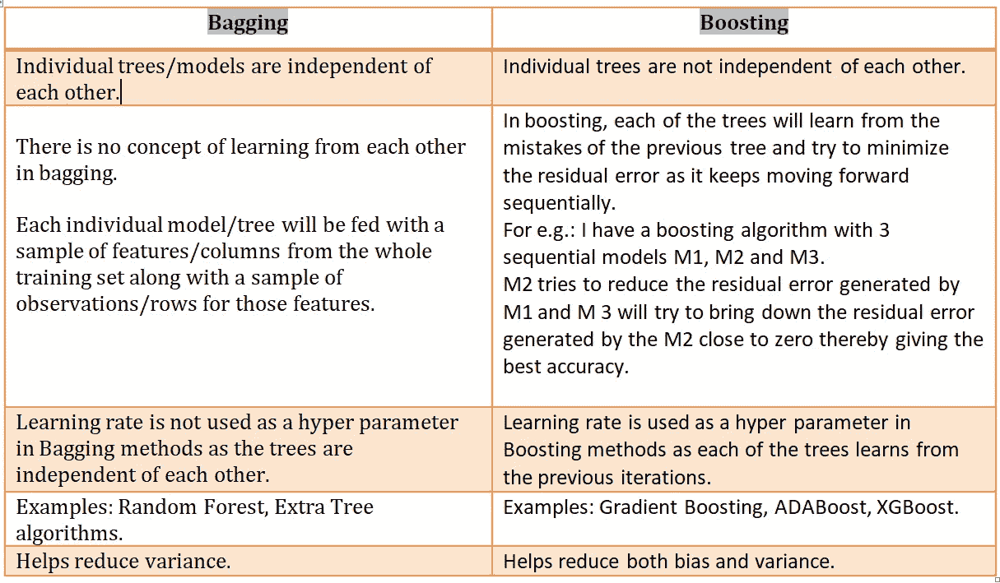

装袋和增压的区别

# ***5。*投票类型**

有两种类型的投票用于汇总所有弱学习者的输出。

**硬投票** —如果我们收到每个弱学习者在类中的输出(例如:0/1)，最后我们选择多数返回的输出类，那么这种方法称为硬投票。

例如:在我们的部长小组的例子中，由于 3 名部长赞成该法案，最终决定通过该法案。这是艰难的投票。多数获胜。

**软投票** —有许多算法也为我们提供预测概率，如果我们收到概率输出，我们会取每个类别概率的平均值，平均值最高的类别将成为最终预测。这种预测方式被称为软投票，它比硬投票更好，因为我们在概率方面获得了更多的信息。

另一件要记住的重要事情是，这种投票方法被用作随机森林等群体的默认技术。

让我们使用下图来理解这两个概念，其中 1 是类 1，0 是类 0。

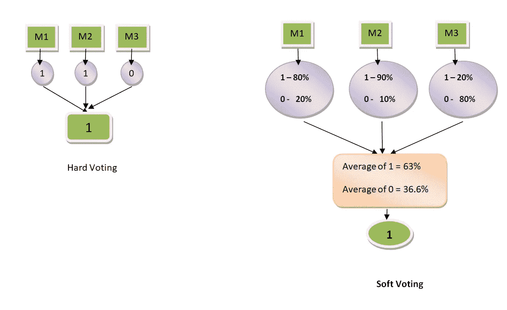

因为类 1 的平均概率在软投票中更高(63%)，所以我们选择类 1 作为最终输出

# **6。概念的详细理解**

## **装袋:**

也称为 Bootstrap aggregating，因为训练集被分成多个子样本，并被提供给每个弱学习器(例如:每个决策树)。并且每个子样本包含几组特征以及随机选择的几个观察值。

*既然这篇文章的主旨是用通俗的语言来理解概念，那么让我们举一个简单的例子来理解装袋。*

我们都参加面试，面试过程是我能遇到的最简单的场景，类似于装袋。

假设你去参加一个面试，一进房间，你就看到五个表情严肃的人坐在那里，向你提出所有的问题。你是做什么的？感到紧张，冲出房间！！没有对吗？你去那里是因为你需要这份工作，你知道你足够勇敢，足够聪明，可以面对任何事情，无论如何你都会和他们打招呼，坐在他们面前。所以，让我们面对现实吧。

现在考虑一下，五位面试官中的每一位都将从五个不同的方面对应聘者进行面试，比如能力、基本技能、高级技能、沟通和管理技能。

此外，公司可能已经准备了一套基于不同方面的问题来测试候选人的技能。我们称之为“问题集”。

那么，采访现在开始。我们的目标变量是候选人是否被选中。

**面试官 1** — **面试官 1 开始测试你的能力倾向技能**从“问题集”中抽取一个基于能力倾向的问题样本，并设定你是否应该被选中的概率。

**面试官 2** — **面试官 2 也开始测试你的基本技能，**再次从“问题集”中抽取初步技术问题的样本，并设定你是否应该被选中的概率。

**面试官 3**—**同样，面试官 3 开始测试你的高级技能**从“问题集”中抽取另一个稍微困难的技术问题样本，并再次设定你是否应该被选中的概率。

*现在，他也有可能问你一些从“问题集”中随机挑选的问题，但这些问题是相似的，并且已经在基本技术测试或任何先前的测试中被问过。这种情况在 bagging 方法中被称为 bootstrap，因为由于使用替换随机抽样，可能会再次选取相同的样本。*

**面试者 4 &面试者 5:** 面试者 4 和面试者 5 重复上述相同的过程，从“问题集”中抽取相关问题的样本，测试候选人的沟通和管理技能，并相应地设定一些选择或不选择的概率。

**结果:**最后，候选人面试结束，他走出房间，让面试官根据“问题集”中对他进行评分的问题的子样本来分析他们各自对他技能的评分。最终，他们汇总所有个人意见，做出是否选择该候选人的最终决定。

***这与合奏的方法完全相似。***

*让我们使用 python 尝试几种集成方法，并比较它们对应于几种单一模型的准确性。*

**注**:jupyter 笔记本完整代码在 [github 中。](https://github.com/anjuraj-ops/Projects-in-data-science/blob/master/advertisment_success_Anju.ipynb)

*为此，我使用 Kaggle 的广告成功数据集，并希望预测广告的成功。*

## 1. ***单款***

**a .决策树**

```
*# Decision tree classifier with grid seacrh CV and model evaluation using accuracy score, precision score and AUC/ROC curve.*

**from** **sklearn.tree** **import** DecisionTreeClassifier
**from** **sklearn.model_selection** **import** GridSearchCV

parameters = {'max_features': [0.5,0.6,0.7,0.8,0.9,1.0], 'max_depth': [2,3,4,5,6,7],'min_samples_leaf':[1,10,100],'random_state':[14]} 

clf = GridSearchCV(DecisionTreeClassifier(), parameters, cv=5, scoring='roc_auc')
clf.fit(X_train, y_train)
```

**应用于示例数据的决策树评估指标:**

**AUC 评分**为 85.84%。

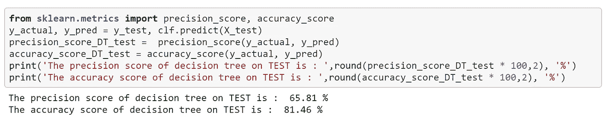

决策树的精确度和准确性

*决策树总是容易出现* [*过拟合*](https://medium.com/analytics-vidhya/overfitting-and-underfitting-in-machine-learning-d829d8501335) *如果我们没有选择正确的参数，如树叶的最小样本、节点的最小样本、树的最大深度，那么随着深度的增加，模型将更精确地捕捉训练集的数据点，从而在训练数据集本身中产生出色的预测，但在新数据上却失败了。因此，集成方法是有助于减少方差从而解决单个决策树遇到的* [*过拟合*](https://medium.com/analytics-vidhya/overfitting-and-underfitting-in-machine-learning-d829d8501335) *的技术之一。*

**b .单一逻辑回归分类器**

```
*#Single Logistic Regression*

**from** **sklearn.linear_model** **import** LogisticRegression
log = LogisticRegression(random_state=0, solver='lbfgs') 
log.fit(X_train, y_train)

y_pred = log.predict(X_test)
```

**单个 Logistic 回归分类器应用于实例数据的评价指标:**

AUC 评分为 83.84 %。

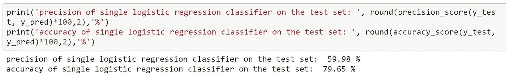

单一逻辑回归分类器的精度和准确度

## 2.**相同分类器的集成**

几个例子是随机森林、额外树分类器/回归器、线性回归器集成、逻辑回归分类器集成、SVM 集成等。

**a.** **随机森林——多个决策树的集合**

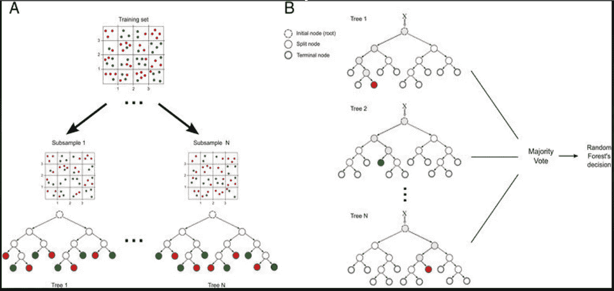

来源:谷歌

```
**from** **sklearn.ensemble** **import** RandomForestClassifier
parameters = {'n_estimators':[700],'n_jobs':[-1], 'max_features': [0.5,0.7,0.9], 'max_depth': [3,5,7],'min_samples_leaf':[1,10],'random_state':[14]} 

clf1 = GridSearchCV(RandomForestClassifier(), parameters, cv=5, scoring='roc_auc')
clf1.fit(X_train, y_train)
```

**随机森林评价指标应用于实例数据:**

**AUC** 得分为 86.53 %。

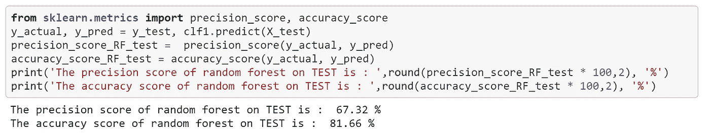

随机森林的精度和准确度

b.**逻辑回归分类器集成。**

当我们使用相同分类器的集合时，Sklearn 的 **BaggingClassifier** 用于获得 OOB(袋外)分数，这是在 bagging 中检查分类器性能的一个非常重要的分数，因为它给我们提供了在测试集上要达到的准确度的概念。众所周知，在训练期间，子样本被馈送到每个独立的分类器，但是在 bagging 技术中，同样的样本也可能被传递两到三次到任何其他单独的分类器。因此，在这种情况下，对于特定分类器来说是新的样本，即还没有看到的样本被称为袋外样本。它与测试集的目的相同，因为 OOB 实例是以前没有见过的东西**。在使用 Bagging 分类器构建集成之后，我们可以使用‘Classifier . OOB _ score _’函数**来获得 OOB 分数。

```
*# Multiple logistic regression classifiers using bagging Classifier.
# Number of logistic regression classifiers we are using here are 400.*logbagClf = BaggingClassifier(LogisticRegression(random_state=0, solver='lbfgs'), n_estimators = 400, oob_score = **True**, random_state = 90)
logbagClf.fit(X_train, y_train)
```

**bagging 分类器(多重逻辑回归分类器)的评价指标:**

AUC 评分为 84.44 %。

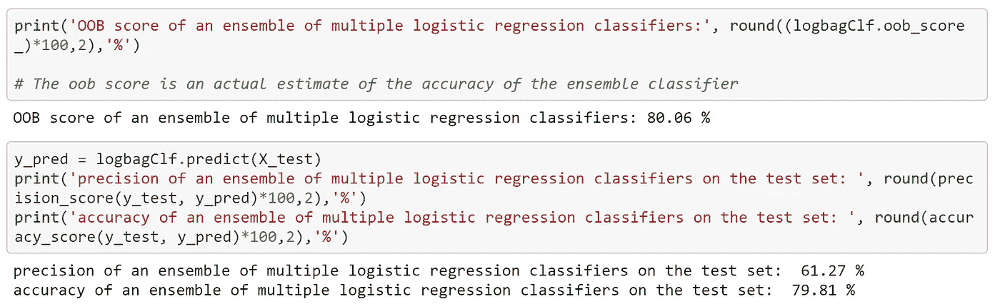

bagging 分类器(多重逻辑回归分类器)的精度和准确度

## **3。几种不同类型模型的集合**

对于这个技术，我们可以使用 Sklearn 的 VotingClassifier **。**

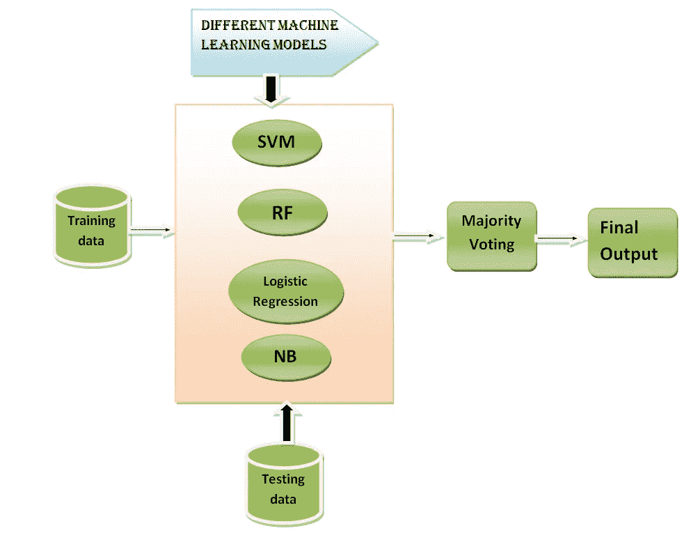

不同机器学习模型的集成

为了我的测试目的，我使用了 RandomForestClassifier、支持向量机和逻辑回归的集成。

```
**from** **sklearn.ensemble** **import** RandomForestClassifier, VotingClassifier
**from** **sklearn.svm** **import** SVC
**from** **sklearn.linear_model** **import** LogisticRegression
**from** **sklearn.naive_bayes** **import** GaussianNB

rfClf = RandomForestClassifier(n_estimators=500, random_state=0) *# 500 trees.* 
svmClf = SVC(probability=**True**, random_state=0) *# probability calculation*
logClf = LogisticRegression(random_state=0)
*#nbclf = GaussianNB(random_state=0)*

*# constructing the ensemble classifier by mentioning the individual classifiers.*
clf2 = VotingClassifier(estimators = [('rf',rfClf), ('svm',svmClf), ('log', logClf)], voting='soft') 

*# train the ensemble classifier*
clf2.fit(X_train, y_train)
```

***投票分类器(多模型集成)的评价指标:***

**AUC** 得分为 84.92 %

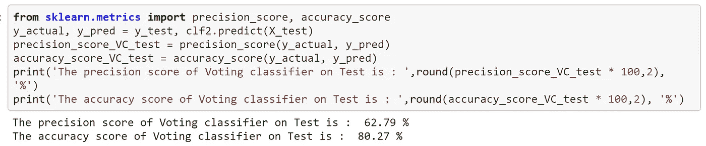

*投票分类器的精度和准确度(多个模型的集成)*

# **增压:**

boosting 背后的主要思想是在连续迭代中将弱学习者转化为强学习者。

让我们再次以面试为例来理解助推的概念。

假设一个应聘者在五家不同的公司参加了五次面试。根据他在这五次面试中的表现，他想对自己的技能进行评估。

面试 1 —公司 1 —他只能回答几个问题，但他知道可能会再次被问到什么类型的问题。他回家学习。他的学习速度提高了。

**面试 2 —公司 2** —在这里，他比第一家公司做得更好，因为他学会了他在第一次面试中错过的所有概念，但仍然没有被选中。他回到家，进行了更多的学习，从而纠正了他在前两次面试中犯的所有错误。

**面试 3 和面试 4 同样，**他面临着同样的问题，当他参加第 5 次面试时，他成了专家，几乎能回答所有的问题。

***最终，我们在这里看到的是候选人接触到不同的问题样本，他逐渐学习和提高自己，直到成为专家。结果是，在从错误中吸取教训并改正自己之后，他可以给自己一个最好的评价。每一步都有一个学习率。同样是助推的概念。***

我将在数据集上实现 boosting 算法 XGBoost。

```
**import** **xgboost** **as** **xgb**

xgb_clf = xgb.XGBClassifier(max_depth=3,n_estimators=300,learning_rate=0.05)

xgb_clf.fit(X_train,y_train)
```

**XGBoost 的评估指标*应用于示例数据:***

**AUC** 得分为 86.46 %。

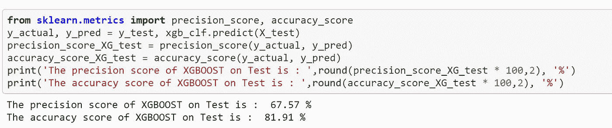

*XGBoost 算法的精度和准确度*

# **7。结论**

***让我们比较一下单一模型和集合模型的准确度、精度和 AUC 得分。***

1.  **准确率:** Boosting 算法‘XGBoost’在准确率上领先。

*   我们还可以注意到，集成分类器'随机森林'和'多重逻辑回归分类器'分别比单一分类器'决策树'和'逻辑回归'具有更好准确性。

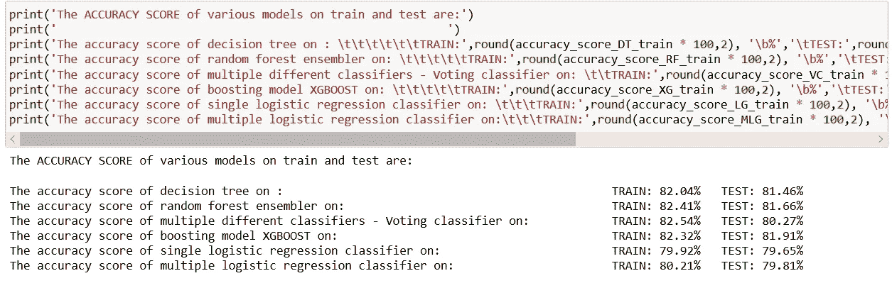

各种算法的准确率评分。

**2。精度分数:** Boosting 算法' XGboost '在精度分数上领先。

*   我们可以注意到，集成分类器'随机森林'和'多重逻辑回归分类器'分别比单一分类器'决策树'和'逻辑回归'具有更好精度。

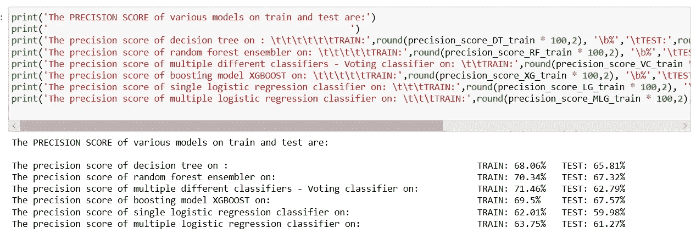

各种算法的精度评分。

**3。** **AUC 得分:** Bagging 算法**Random forest 在 AUC 得分上领先，尽管与 XGboost 的 AUC 得分有非常微小的差异。**

*   **我们可以注意到，集成分类器'随机森林'和'多重逻辑回归分类器'分别比单一分类器'决策树'和'逻辑回归'具有更好 AUC 分数。**

**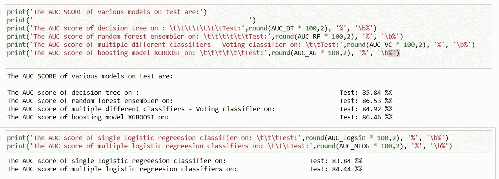**

**各种分类器的 AUC 分数。**

**因此，我们可以得出结论，boosting 方法在我们的数据集上表现最佳，我们最终可以部署 XGBoost 模型，因为它将最精确地预测广告活动的成功，这是我们问题陈述的主要议程。**

**然而，这取决于我们正在处理的数据的类型。**

**此外，我们可以推断，与单一模型相比，装袋和增压方法总是表现得更好，精确度更高。**

**请添加任何额外的想法，评论，因为这将有助于我更好地理解事情。**

**感谢阅读！！**