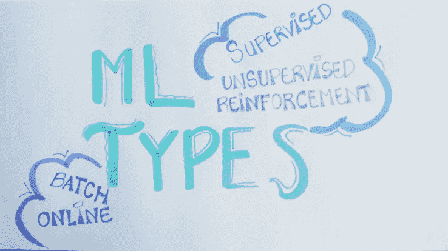
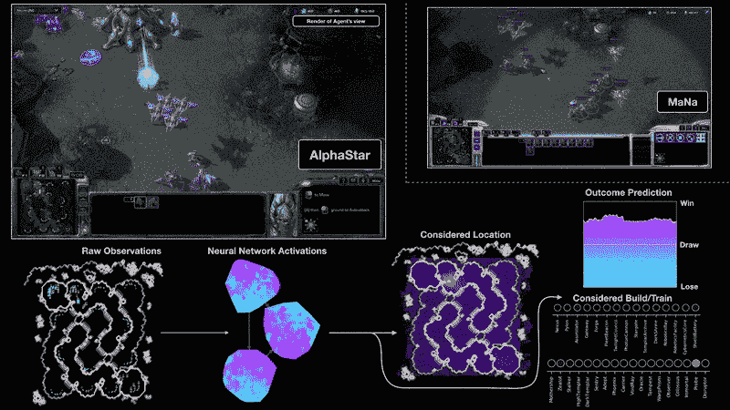

# 机器学习的类型

> 原文：<https://towardsdatascience.com/types-of-machine-learning-ddb20d3199f4?source=collection_archive---------36----------------------->

## 探索如何根据人类互动和训练对 ML 算法进行分类。

*作者图片*

自从我在[上写了第一篇关于什么是机器学习(ML)以及编程范式如何随着时间的推移而改变的文章](/on-the-journey-to-machine-learning-ai-6059ffa87d5f)并描述了一些用例/应用以来，已经有一段时间了。这一次，我将分享如何从不同的角度看待机器学习和人工智能，具体涵盖以下两个领域:

1.不同 ML 算法的训练过程中涉及到多少人为的交互。

2.培训是如何进行的。

在进入每个领域之前，让我们澄清一些关于机器学习过程的概念。如果你熟悉机器学习的工作原理，你可以跳过这一节。

机器学习的高层次定义可以被视为:

给定一些你正在分析的代表一个领域(销售、政治、教育)的 ***数据*** 和一个 ***算法*** ，计算机能够 ***从这些数据中学习*** 并在其上检测某些 ***模式*** 的能力。其次是能够告诉( ***预测*** )你并确定新数据的类型或者至少是它的近似值。

对这个概念要有所保留，因为有太多关于 ML 实际上是如何执行的背景知识。

换句话说，计算机能够从输入数据中通过 ***训练*** (学习)来检测 ***模式*** 。这个过程是高度迭代的，需要大量的调整。例如，它需要检查预测值与实际值有多远或多近，然后通过调整其参数来进行自我修正，直到达到某个点，在该点上模型肯定足够精确，可以使用。

好了，现在我们对这个过程有了一个大概的了解。让我们进入机器学习的类型。

# **ML 算法和人工干预。**

这一领域的机器学习系统可以被视为训练过程中的 ***【监督】即人类互动*** 的数量。这些分为 3 个主要类别，我将尝试用例子来说明以下定义。

## **1。监督学习**

假设你是当地一家书店的老板。

*照片由作者拍摄*

您的女儿 Ana 是一名数据科学家，她提出采用您库存系统中记录的图书数据集，并实施一个新系统来加快销售新书的登记。

安娜知道这些书的一些特点:

*   类型(小说、非小说、奇幻、惊悚)
*   精装书，如果有精装书
*   ISBN，这本书的商业标识
*   标题，页数
*   书籍或封面图片的摘录
*   作者

现在，想象一下必须在书架中分配一本书。如果你在网上查找元数据，把书放在小说书架上，这就很容易了。

然而，在现实中，如果你每天收到多达 200 本书，你不能独自完成这项工作，在系统上手动输入数据很容易出错，你可能会把书放错书架。这种错位可能会导致收入减少，因为当新顾客进来时并不满意，因为他们找不到这本书，即使它实际上在商店里。

Ana 的新系统非常简单，只需给系统输入你要找的书的摘录或封面，它就能告诉你这本书应该放在哪个书架上。

这个特殊的例子被称为 ***分类*** ，因为系统只是在帮助你根据你作为用户提供给它的某些特征来分类(组织)一些数据。

这种系统的一个真实例子是**谷歌照片。**

另一种监督算法是在给定一组称为预测器的特征或特性的情况下，预测一个数值。

现在，你可能会问这是怎么发生的？

一个例子就是使用 ***回归*** 。一种常见且广泛使用的算法称为线性回归，其目的是预测一个连续值作为结果。

这实际上转化为具有一组特征或变量，以及一组匹配该输入特征的标签，并且您想要算法做的只是学习如何" ***拟合*** *"* 与这些特征相关联的权重(*参数*)，以给出更接近真实值的近似值。

## **2。无监督学习。**

***无监督*** 算法涵盖了我们没有标签或真实值可以对比的所有情况。相反，我们确实有数据集，模型将根据数据如何 ***分组*** 在一起，它如何检测模式，以及它是否显示某些行为来训练和预测。

这种类型的机器学习的一个典型例子是 ***聚类*** ，根据相似性对数据进行分组。真实的例子包括推荐系统，例如:

*   零售商网站，如亚马逊和 Zalando。
*   媒体/流媒体系统，如网飞、Youtube 等。

在这种类型中使用了许多其他算法，例如，异常检测可能涵盖信用卡欺诈或帐户盗用情况，这些情况可以通过使用 ML 来预防和预测。

我最近发现的另一种我最喜欢的无监督学习算法是那些用于数据可视化的算法，如 [t-SNE](http://www.jmlr.org/papers/volume9/vandermaaten08a/vandermaaten08a.pdf) 或 t-分布式随机邻居嵌入。

我在几个宠物项目中使用 t-SNE 进行 ***情感分析可视化*** ，你可以实际看到集群在高维空间中形成，同时使用降维。

## **3。强化学习。**

很多书和网站都提到这些算法，比如 ***野兽*** 但是我喜欢想到冰淇淋的顶部。由于该领域正在取得的成就，目前成为一个热门话题，我稍后会提到这一点。

在这种情况下你会怎么做？最有可能的是，你会玩几次，试图研究什么是最好的动作和最好的路线，你可以使用，最终从庇护所救出狗。这类似于强化算法要做的事情，你可以这样想:

1.给你一个 ***环境*** 。(视频游戏环境中的空间)，代表空间上某些变量的状态。就像路障或蟋蟀从天而降。

2.事件期间要执行的操作。(动作，像向上、向下、向建筑者扔球)，值得注意的是，有些动作可能会被*奖励为“*好”*，而其他一些则被奖励为“坏”，这意味着它会降低你实现目标的能力。*

*3.代理人(*视频游戏中的角色，救援者，或建设者*)，他们将采取行动以尽可能低的成本实现目标。*

*它的工作方式是代理观察环境，试图执行行动，并根据这些行动将获得奖励或没有。潜在的情况是，代理将自己学习什么是追求的最佳方法/策略，以获得最大数量的积分(奖励)。*

*迄今为止，我见过的用它构建的最好的系统之一是:*

*   ***捉迷藏**，由 OpenAI 开发。在那里他们使用多智能体的方法教孩子们玩捉迷藏。有两个代理“隐藏者”和“搜索者”,通过观察环境，他们能够学习甚至没有提供的行为/行动，如使用障碍通过障碍。如果你想深入了解它是如何工作的，你可以看看下面的视频和 [**论文**](https://arxiv.org/abs/1909.07528)*

*来源:[多智能体捉迷藏](https://openai.com/blog/emergent-tool-use/)*

*   *视频游戏，如 StarCraf 或 AlphaStar。代理人与人类对弈，事实上它在几秒钟内就击败了世界上最好的玩家或其他代理人。为了实现这一目标，开发 AlphaStar 的团队不仅使用了强化学习，还使用了监督学习来训练神经网络，这些网络将创建玩游戏的指令。如果你好奇是怎么做到的，可以查看他们的博文 [**这里**](https://deepmind.com/blog/article/alphastar-mastering-real-time-strategy-game-starcraft-ii) **。***

**

*来源:[https://deepmind.com/](https://deepmind.com/)*

*到目前为止，我们已经学习了不同类型的机器学习系统，这些系统基于人类与这些系统的互动的应用程度。现在我们可以继续探索接下来的 2。*

# ***ML 算法和训练过程。***

*在前面的部分中，我们概述了训练过程是您的算法将如何“学习”最佳参数来进行预测。话虽如此，培训本身是一门艺术，可以根据用例、可用资源和数据本身以不同的方式进行。*

*这分为两种:*

1.  *批量学习。*
2.  *在线学习，也称为增量学习。*

*让我们看看这些是如何工作的:*

## ***1。批量学习***

*批量学习是指用一次获得的所有数据训练模型，而不是增量学习。通常执行这个动作需要很多时间。想象一下，如果不能一次训练更多的数据，也要训练数 TB 的数据。但是你为什么需要这么做呢？*

*例如，由于业务或用例的性质，以特定频率(如每周/每月)交付的报告或决策可能不需要实时培训。*

*这种类型的培训通常是离线完成的，因为它需要很长时间(几小时/几天/几周)才能完成。*

*培训是如何进行的？*

1.  *模型被训练。*
2.  *模型被部署并投入生产。*
3.  *模型在没有进一步“学习”的情况下持续运行。*

*这个过程叫做离线学习。现在，您可能想知道，如果我的数据或用例发生了变化，会发生什么？您需要针对合并新数据或特征再次训练您的模型。*

*一个实际的例子，在我以前的工作中，一些模型以批量学习的方式部署到生产中，一些模型不需要如此频繁地刷新，所以它可以大约每周发生一次。生成新模型的另一个原因是查看监控系统中部署的指标，并检查模型的性能是否正在下降。*

*这些类型的模型与 IO、CPU、内存或网络等资源密切相关，因此在决定采用哪种方法之前，记住这一点非常重要。如今这可能真的很昂贵，但与此同时，你可以利用云平台提供的现成解决方案来做到这一点，例如 [AWS Batch](https://docs.aws.amazon.com/batch/latest/userguide/what-is-batch.html) 、[Azure Machine Learning——Batch Prediction](https://docs.microsoft.com/en-us/azure/machine-learning/how-to-run-batch-predictions-designer)，或[谷歌云人工智能平台](https://cloud.google.com/ai-platform/training/docs)。*

*接下来，让我们谈谈在线学习*

## ***2。在线学习***

*你有没有想过网飞、迪士尼、亚马逊 Prime Video 是如何推荐你看什么的？或者为什么 Zalando 和亚马逊一直告诉你买这些惊人的裤子，可能会搭配一双白色的鞋子？你可能会说，是的，推荐系统，但更重要的是，它怎么能做得这么快？系统是如何快速适应变化的？*

*您可能又答对了，这是因为训练是动态进行的，这意味着数据在到达系统时就被处理。这种方法适用于持续接收数据的系统，如零售商，或者需要快速适应变化的系统，如新闻网站或股票市场。*

*就如何进行培训而言，如下所示:*

1.  *数据被分成小块或小批。*
2.  *(连续地)训练模型。*
3.  *持续评估/监测。*
4.  *部署到生产。*

*进行在线学习的一个好处是，如果你没有足够的计算资源或存储，你可以在训练时丢弃数据。为您节省大量资源。另一方面，如果您需要重放数据，您可能希望将其存储一段时间。*

*正如我们处理的每一个系统一样，这种类型的培训有其优点和缺点。使用这种方法的一个缺点是，模型的性能可能会很快下降，或者最终由于数据可能会快速变化，您可能会注意到在某个时间点预测准确性的下降。出于这个原因，也是我很少看到的一个经常谈论的话题，就是建立良好的监控系统。这些将帮助您的团队或公司预防和理解何时开始改变或调整模型以使它们有效。*

# ***亮点***

*你已经走了这么远，我希望你喜欢它。最初，我们讨论了机器学习如何工作，然后深入研究了机器学习如何根据人类与算法交互的角度进行划分。最后，我试图用我在周围看到的很酷的例子和应用程序来尽可能多地描述这些类型的监督、非监督和强化学习。*

*我可能会开始张贴我在旅途中学到的更多实用的东西，并愿意分享。#分享伤疤。*

*保重，很快再见。*