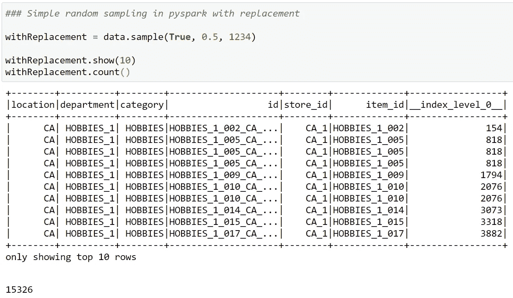
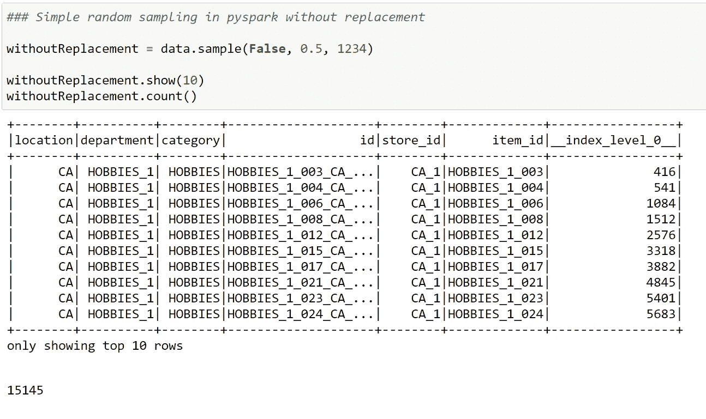
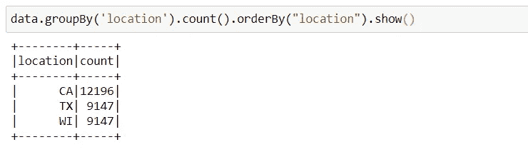
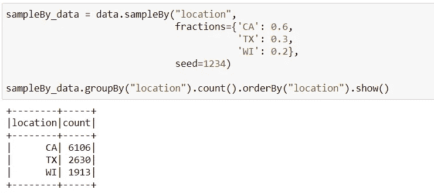
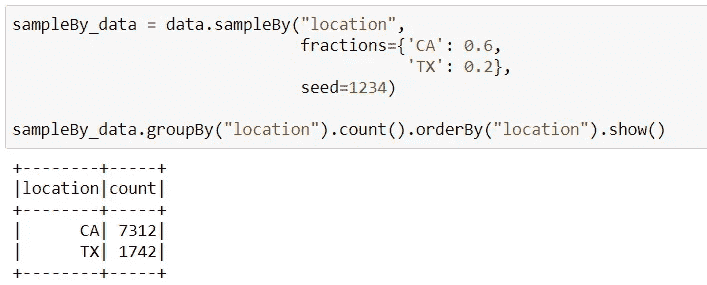

# PySpark 3 中的采样类型

> 原文：<https://towardsdatascience.com/types-of-samplings-in-pyspark-3-16afc64c95d4?source=collection_archive---------4----------------------->

## Spark 中采样技术的解释及其在 Pyspark 中的具体实现步骤

[**来源**](https://pixabay.com/photos/color-letters-colorful-letters-4003283/)

[**抽样**](https://www.scribbr.com/methodology/sampling-methods/) 是为特定的案例研究从数据集中确定一个有代表性的亚组的过程。抽样代表重要的研究和商业决策结果。因此，在所提供的技术中使用最合适和最有用的取样方法是至关重要的。本文主要面向希望在采样子领域使用 [Apache Spark](https://spark.apache.org/) 最新增强功能的数据科学家和数据工程师。

Spark 支持的采样方法有两种:[***sample***](https://spark.apache.org/docs/latest/api/python/_modules/pyspark/sql/dataframe.html#DataFrame.sample)和[***sample by***](https://spark.apache.org/docs/latest/api/python/_modules/pyspark/sql/dataframe.html#DataFrame.sampleBy)*详见后面的章节。*

# *1.样本()*

*如果使用 [**sample()**](https://spark.apache.org/docs/latest/api/python/_modules/pyspark/sql/dataframe.html#DataFrame.sample) ， [**简单随机抽样**](https://www.investopedia.com/terms/s/simple-random-sample.asp) ，数据集中的每个元素都有相似的机会被优先选择。以随机指定的分数比率从数据集中选择变量，而不基于任何变量进行分组或聚类。*

*该方法使用 3 个参数。***with replacement***参数默认设置为***False****，因此该元素只能被选作样本一次。如果该值被更改为 ***真*** ，则可以再次在同一采样中选择一个样本值。由于可以多次选择元素，因此***with replacement = True***和***with replacement = False***的数量可能略有不同。**

**另一个参数是 ***分数*** 字段，需要填写，在 [*Spark 的官方文档*](https://spark.apache.org/docs/latest/api/python/pyspark.sql.html#pyspark.sql.DataFrame.sampleBy) 中有说明，不能除以指定的百分比值。**

**如果任何数字被分配给 ***种子*** 字段，它可以被认为是分配一个特殊的 id 给那个采样。这样，每次运行脚本时都会选择相同的样本。如果该值保留为 ***无*** ，则每次创建不同的采样组。**

**下面我用 [**Kaggle 数据集**](https://www.kaggle.com/yassinealouini/m5-sales-hierarchy-dataset) **添加一个我在本地 Jupyter 笔记本上编码的例子。****

**在下面的例子中，***with replacement***值被设置为 ***True* ，**的 ***分数*** 参数被设置为 ***0.5*** ， ***种子*** 参数被设置为 ***1234*** ，这是一个可以赋值的 id**

****

****图一。** sample()方法同***【with replacement = True】*(图片由作者提供)****

****在下面的例子中，***with replacement***值被设置为 ***False* ，**的**分数被设置为 ***0.5*** ， ***种子*** 参数被设置为 ***1234*********

************

********图二。** sample()方法同***【with replacement = False】*(图片由作者提供)********

********下面，有对 **sample()** 方法的详细解释。********

## ********样本(替换=无，分数=无，种子=无)********

********该方法返回一个 [**数据帧**](https://spark.apache.org/docs/2.3.0/api/python/pyspark.sql.html#pyspark.sql.DataFrame) 的采样子集。********

***********参数:***********

> **********有替换的** —有替换或没有替换的样本(默认值设置为假)。**(可选)**********
> 
> **********— withReplacement=True:** 同一个元素在样本的最终结果集中有被重现多次的概率。********
> 
> **********— withReplacement=False** :数据的每一个特征只被采样一次。********
> 
> **********分数** —要生成的行的分数，范围[0.0，1.0]。**(必选)**********
> 
> **********种子** —抽样的种子(默认为随机种子)**(可选)**********

***********注:*** *不保证准确提供给定* [*数据帧*](https://spark.apache.org/docs/latest/api/python/pyspark.sql.html#pyspark.sql.DataFrame) *的总计数的指定分数。*********

# ********2.抽样依据()********

********另一种可以作为采样方法的技术是[**sample by()**](https://spark.apache.org/docs/latest/api/python/_modules/pyspark/sql/dataframe.html#DataFrame.sampleBy)***。***********

********第一个参数是 ***col*** 字段，它决定在采样过程中对哪个变量进行子分组和采样。********

********例如，如果**位置**写在该域中，将根据**位置**值进行采样。**位置**下的值将包含在采样中的百分比在 ***分数*** 字段中确定，这是另一个参数。不是强制填充，如果不是，则设置为 0，没有指定分数率的值将不包括在抽样中。********

****************

**********图三。**位置特征在数据集中的分布(图片由作者提供)********

********在下面的例子中，选择了数据集字段中具有 **CA** 的元素的 **50%** ，具有 **TX、**的元素的 **30%** ，以及具有 **WI** 的元素的最后 **20%** 。在本例中， *1234* id 被分配给 ***种子*** 字段，也就是说，每次运行脚本时都将选择用 *1234* id 选择的样本。如果 ***种子*** 值保留为 ***无*** ，则在执行过程中每次都会选择不同的样本。********

****************

**********图 4。**所有“位置”变量的值都在“分数”参数中指定(图片由作者提供)********

********下面再举一个例子，dataset 字段中带有 **CA** 的元素的 **60%** ，带有 **TX** 的元素的 **20%** 被选中，由于没有指定所有其他元素的百分比，所以它们没有包含在最终的采样结果集中。在本例中，再次将 *1234* id 分配给 ***种子*** 字段，也就是说，每次运行脚本时都将选择用 *1234* id 选择的样本。如果 ***种子*** 值保留为 ***无*** ，则在执行过程中每次选择不同的样本。********

****************

**********图 5。**在“分数”中只指定了“位置”变量的两个值(图片由作者提供)********

## ********sampleBy(列，分数，种子=无)********

********这种方法返回一个分层样本，而不根据每个层上给出的分数进行替换。********

***********参数:***********

> **********col** —定义地层的列********
> 
> **********分数** —每个地层的取样分数。如果未指定地层，其分数将被视为零。********
> 
> **********种子**—随机种子 id。********

********非常感谢您的提问和评论！********

## ********参考********

1.  ********[样品](https://spark.apache.org/docs/latest/api/python/_modules/pyspark/sql/dataframe.html#DataFrame.sample)********
2.  ********[取样依据](https://spark.apache.org/docs/latest/api/python/_modules/pyspark/sql/dataframe.html#DataFrame.sampleBy)********
3.  ********[简单随机抽样](https://www.investopedia.com/terms/s/simple-random-sample.asp)********
4.  ********[分层抽样](https://www.investopedia.com/terms/stratified_random_sampling.asp)********