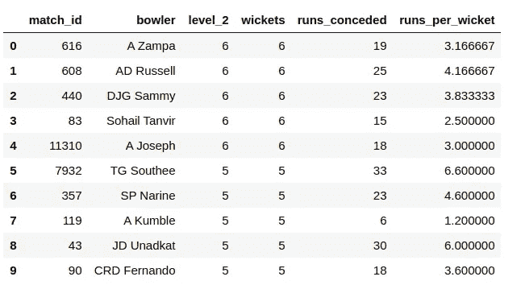

# 每个数据科学爱好者都应该知道的结构化数据类型

> 原文：<https://towardsdatascience.com/types-of-structured-data-every-data-science-enthusiast-should-know-a656b95afbe2?source=collection_archive---------16----------------------->

## 了解数据类型的分类

艾萨克·史密斯在 [Unsplash](https://unsplash.com/s/photos/graphs?utm_source=unsplash&utm_medium=referral&utm_content=creditCopyText) 上拍摄的照片

在我的[上一篇博客](/statistics-for-data-science-practical-tips-misconceptions-curriculum-and-learning-plan-66e40e443fd2)中，T4 对数据科学中的统计数据的需求变得很明显，现在是时候深入了解统计方法了。这将是一系列的博客文章和视频(在我的 YT 频道)。

## 你是谁？

我开始了这一系列关于统计和概率的博客，以帮助所有的编码人员和分析人员理解这些概念和方法。你熟悉 Python 编程，并试图更好地掌握统计学，以掌握数据科学技能。

# 数据和数据分析的增长

我们知道，数据分析的发展已经超出了其最初的预期范围，这是因为技术的快速发展，越来越多的数据的产生，以及各种学科对定量分析的积极使用。

由于这种基础设施的发展，我们可以达到一个阶段，我们有多种数据源，如传感器，CRM，事件，文本，图像，音频和视频。

## 非结构化数据

现在，大部分生成的数据是非结构化的，即没有预定义模型/结构的数据。例如，图像是像素的集合，文本数据是没有特定预定义存储模型的字符序列，以及来自用户在 web 应用上的操作的点击流。

非结构化数据面临的挑战是，需要将其预处理为结构化数据，以便对其应用统计方法，并获取原始数据中包含的信息。

## 结构数据

当我们谈论结构化数据时，我们经常谈论表格数据(矩形数据)，即数据库中的行和列。

这些表还主要包含两种类型的结构化数据:

1.  **数值数据**

用数字表示的数据。它进一步表现为两种形式:

*   ***连续—*** 可以在一个区间内取任意值的数据。比如车速、心率等。
*   ***离散—*** 只能进行整数值的数据，如计数。例如，抛 20 次硬币的正面数。

**2。分类数据**

只能接受代表可能类别的一组特定值的数据。这些也被称为枚举，枚举，因素，或名义。

*   ***二进制—*** 分类数据的一种特殊情况，其特征是二分的，即只能接受 0/1 或真/假。
*   ***序数—*** 具有明确排序的分类数据。例如，餐厅的五星评级(1、2、3、4、5)

但问题来了，**为什么需要了解数据？**答案是，如果不知道数据的类型，你将无法运用正确的统计方法来处理这种类型的数据。

例如，如果 dataframe 中的一列有序号数据，我们就必须对它进行预处理，在 python 中，scikit-learn 包提供了一个`OrdinalEncoder`来处理序号数据。

下一步是深入研究结构化数据，以及我们如何使用第三方包和库来操作这种结构。我们主要有两种类型的结构或数据存储模型:

1.  矩形的
2.  非矩形

# 矩形数据

数据科学中的大多数分析都是用矩形二维数据对象完成的，如数据帧、电子表格、CSV 文件或数据库表。

这主要由代表记录(观察)的行和代表列(特征/变量)的行组成。另一方面，Dataframe 是一种特殊的数据结构，具有表格格式，提供超高效的操作来操作数据。

数据帧是最常用的数据结构，在这里介绍一些定义很重要:

***数据帧***

矩形数据结构(像电子表格一样),用于统计和机器学习模型的高效操作和应用。

***特征***

数据帧中的一列通常被称为*特征*。

同义词-属性、输入、预测值、变量

***胜负***

许多数据科学项目涉及预测*结果*——通常是/否结果。

同义词—因变量、响应、目标、输出

***记录***

数据帧中的一行通常被称为*记录*。

同义词—案例、例子、实例、观察、模式、样本

**举例:**

板球比赛数据的数据帧

关系数据库表有一个或多个列被指定为索引，本质上是一个行号。这可以极大地提高某些数据库查询的效率。在 pandas `dataframe`中，根据行的顺序创建一个自动整数索引。在`pandas`中，还可以设置多级/分层索引，以提高某些操作的效率

# 非矩形数据

除了矩形数据之外，我们还有其他几种属于非矩形数据的数据结构。

地理位置分析中使用的空间数据结构更复杂，不同于矩形数据结构。在*对象*表示中，数据的焦点是一个对象(如一个公园)及其空间坐标。相比之下，*字段*视图关注的是小空间单元和相关度量值(例如像素亮度)。

图形数据结构用于表示物理的、社会的和抽象的关系。例如，脸书或 Twitter 将网络中人们之间的联系表示为社会关系图。图结构对于某些类型的问题是有用的，例如网络优化和推荐系统。

在数据科学中，每种数据类型都有一套特定的方法。本系列的重点是矩形数据，它构成了预测建模的基础构件。

# 接下来…

现在，我们已经清楚地了解了我们必须经常处理的数据类型，我们现在可以开始研究处于统计和数据科学核心的基本数据分布。

在下一篇博客的[中，我们将讨论](/how-to-explain-data-using-gaussian-distribution-and-summary-statistics-with-python-cb960f213ab3)[高斯分布和数据](/how-to-explain-data-using-gaussian-distribution-and-summary-statistics-with-python-cb960f213ab3)中位置和可变性的其他基本估计。我们将学习如何使用 NumPy 生成正态分布数据，并使用 matplotlib 之类的库绘制数据。

# [数据科学与 Harshit](https://www.youtube.com/c/DataSciencewithHarshit?sub_confirmation=1)

通过这个渠道，我计划推出几个涵盖整个数据科学领域的[系列](/hitchhikers-guide-to-learning-data-science-2cc3d963b1a2?source=---------8------------------)。以下是你应该订阅[频道](https://www.youtube.com/channel/UCH-xwLTKQaABNs2QmGxK2bQ)的原因:

*   本系列将涵盖所有必需/要求的高质量教程，涉及每个主题和子主题，如 [Python 数据科学基础](/python-fundamentals-for-data-science-6c7f9901e1c8?source=---------5------------------)。
*   解释了[数学和推导](/practical-reasons-to-learn-mathematics-for-data-science-1f6caec161ea?source=---------9------------------)为什么我们在 ML 和深度学习中这样做。
*   [与谷歌、微软、亚马逊等公司的数据科学家和工程师](https://www.youtube.com/watch?v=a2pkZCleJwM&t=2s)以及大数据驱动型公司的首席执行官的播客。
*   [项目和说明](/building-covid-19-analysis-dashboard-using-python-and-voila-ee091f65dcbb?source=---------2------------------)实施到目前为止所学的主题。了解新的认证、训练营以及破解这些认证的资源，例如 Google 举办的 [**TensorFlow 开发者证书考试。**](https://youtu.be/yapSsspJzAw)

请随时在 [Twitter](https://twitter.com/tyagi_harshit24) 或 [LinkedIn](https://www.linkedin.com/in/tyagiharshit/) 上与我联系。