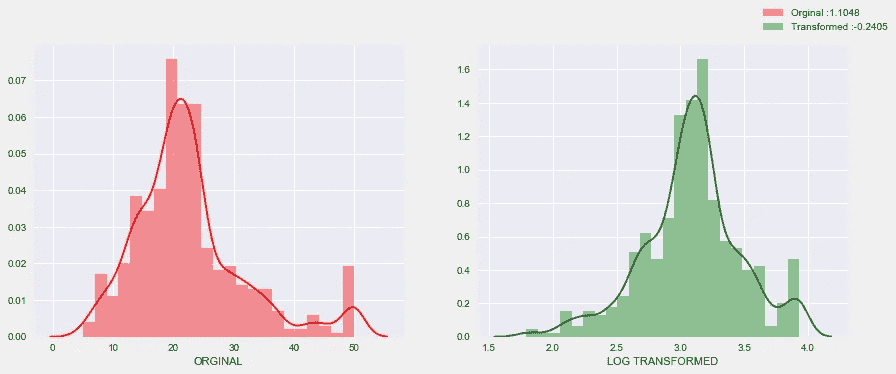
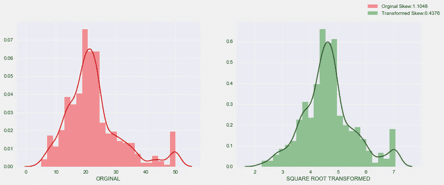
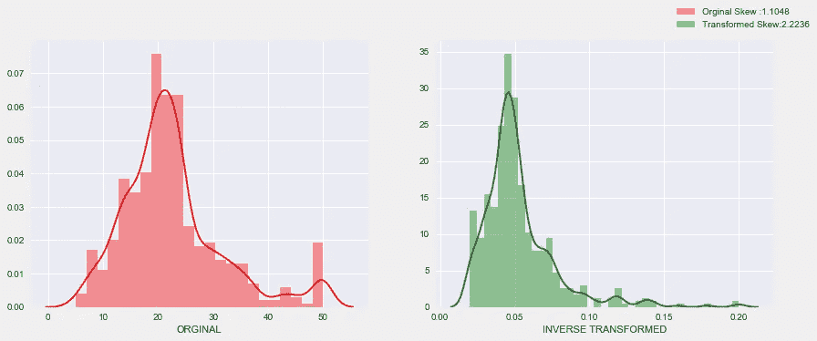
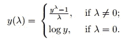
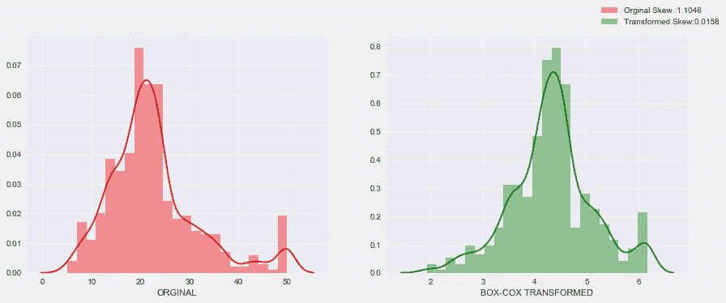
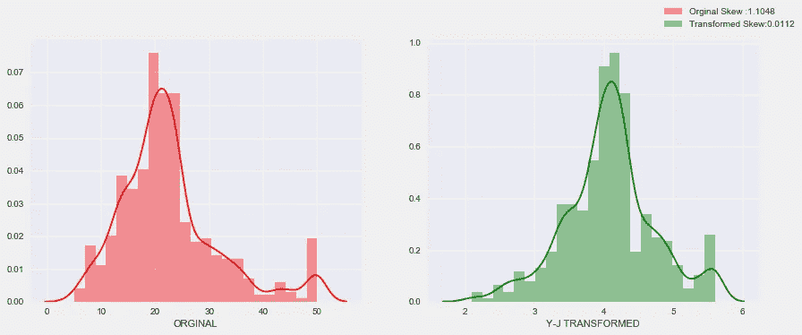

# 更好的正态分布的变换类型

> 原文：<https://towardsdatascience.com/types-of-transformations-for-better-normal-distribution-61c22668d3b9?source=collection_archive---------6----------------------->

## 正态分布的必要性

统计分析中最常见的假设之一是正态性。你同意吗？


你好，世界，这是我为数据科学社区写的第一篇博客。在这篇博客中，我们将看到各种类型的数据转换，以更好地适应正态分布(高斯分布)。

我们知道，在回归分析中，响应变量应该是正态分布的，以获得更好的预测结果。

大多数数据科学家声称，当他们转换自变量时，他们会得到更准确的结果。这意味着独立变量的偏斜校正。偏斜度越低，结果越好。

***变换无非是取一个数学函数，并将其应用于数据。***

让我们开始吧！

# 概观

1.  对数变换
2.  平方根变换
3.  相互转化
4.  博克斯-考克斯变换
5.  Yeo-Johnson 变换(奖金)

为了更加清晰，请访问我的 Github repo [这里](https://github.com/tamilselvan15/types-of-distributions-to-get-better-fit)

# 1.日志转换:

数值变量可能具有由异常值、高指数分布等引起的高偏斜和非正态分布(高斯分布)。因此，我们选择数据转换。

在对数变换中，x 的每个变量将被以 10 为底、以 2 为底或自然对数的 log(x)代替。

```
import numpy as np
log_target = np.log1p(df["Target"])
```



上图是原始数据和对数转换数据的比较。在这里，我们可以看到转换数据中的偏斜度降低了。(最佳偏斜值应该接近零)

# 2.平方根变换:

这一转变将对分配产生适度的影响。平方根变换的主要优点是，它可以应用于零值。

这里 x 将被平方根(x)代替。它比对数变换弱。

```
sqrt_target = df["Target"]**(1/2)
```



# 3.相互转换:

在这个变换中，x 将替换为 x 的倒数(1/x)。

互易变换对分布的形状几乎没有影响。此转换只能用于非零值。

```
reciprocal_target = 1/df["Target"]
```



变换数据的偏斜度增加。

# 4.Box-Cox 变换；

这是我最喜欢的转换技术之一。

Box-cox 变换对许多数据性质都非常有效。下图是 Box-cox 变换的数学公式。



考虑从-5 到 5 变化的所有λ值，并选择数据的最佳值。“最佳”值是导致分布的最佳偏斜度的值。当λ为零时，将发生对数变换。

```
from scipy.stats import boxcox
bcx_target, lam = boxcox(df["Target"])
#lam is the best lambda for the distribution
```



博克斯-考克斯变换

在这里，我们注意到 Box-cox 函数降低了偏斜度，它几乎等于零。工作良好；)

对于这种转换，值严格地为正。

# 5.杨-约翰逊变换；

这是一种较老的变换技术，非常类似于 Box-cox 变换，但不要求值严格为正。

这种转变也有能力使分布更加对称。

```
from scipy.stats import yeojohnson
yf_target, lam = yeojohnson(df["TARGET"])
```



约-约翰逊变换

Yeo-Johnson 变换工作得很好，比 Box-cox 变换更好。

# 结论:

在这篇博客中，我们看到了不同类型的变换(有一个额外的最古老的变换技术)来更好地适应常态。杨永强永远不会是正确的选择。对于某些类型的数据，Box-cox 会工作得更好，所以我们必须使用最好的转换技术。

在下一篇博客中，我们将看到均匀分布。:)

通过 [LinkedIn](https://www.linkedin.com/in/tamilselvan15/) 联系我；)

欢迎评论:)