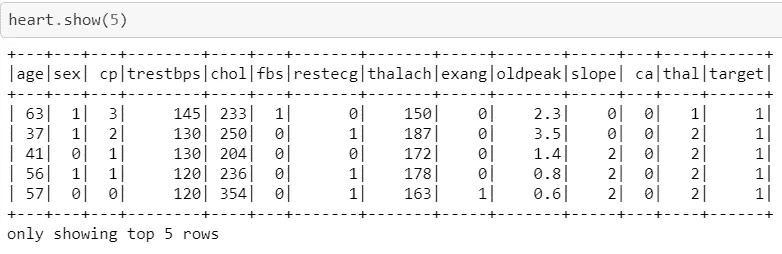
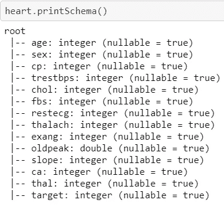
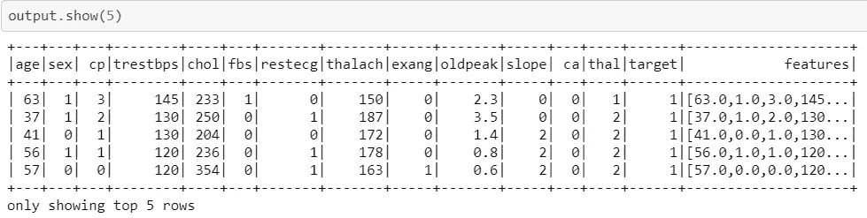
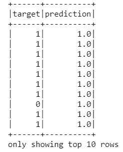
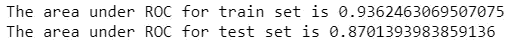

# PySpark 分类

> 原文：<https://towardsdatascience.com/uci-heart-disease-classification-with-pyspark-eadc8e99663f?source=collection_archive---------73----------------------->

## 分类问题如何使用 PySpark？


照片由 Jair Lazaro 在 Unsplash 上拍摄

这是一个如何在分类问题中使用 PySpark 的快速学习。这里的目的是根据不同的特征对患者进行分类，以预测他们是否患有心脏病。对于此示例，使用了 LogisticRegression，它可以导入为:

```
**from** **pyspark.ml.classification** **import** LogisticRegression
```

让我们来看看这个数据集。它被命名为 UCI 心脏病数据集，你可以从[这里](https://www.kaggle.com/ronitf/heart-disease-uci)下载。



上面显示了前五行。目标特征被用作我们的输出，它或者是 1 或者是 0。我们希望根据其他 13 个可用特征来计算，即年龄、性别、cp 等。

为了找出每个特征的类型，我们可以使用**。printSchema()** 函数为:



下一步是将这些特征转换成矢量；我们需要导入一个合适的库。

```
from pyspark.ml.feature import VectorAssembler
```

在 PySpark 中，除了目标之外的所有列都需要转换成一个向量，我们称之为 features。

```
assembler = VectorAssembler( 
inputCols=[‘age’, ‘sex’, ‘cp’, ‘trestbps’, ‘chol’, ‘fbs’, ‘restecg’, ‘thalach’, ‘exang’, ‘oldpeak’, ‘slope’, ‘ca’, ‘thal’], 
outputCol=”features”)output=assembler.transform(heart)
```

我们可以在下面看到，features 列是一个基于所有 13 列的向量。



为了训练我们的模型，我们将“特征”和“目标”组合起来作为输入/输出。

```
final_data = output.select(“features”, “target”)
```

然后，我们可以将 final_data 拆分为训练和测试，如下所示:

```
train, test = final_data.randomSplit([0.7, 0.3])
```

LogisticRegression 被用作我们的分类方法，labelCol 需要被称为目标特征，而 featuresCol 是已定义的特征，它已经被表示为向量。

```
lr = LogisticRegression(labelCol =”target”, featuresCol =”features”)
```

在下一步中，我们可以训练我们的算法，这非常类似于 scikit，并查看我们的测试用例的预测输出。

```
model=lr.fit(train)
predict_train = model.transform(train)
predict_test  = model.transform(test)
predict_test.select("target", "prediction").show(10)
```

下图显示了我们前十行中的目标和预测；1 例预测不准。



为了评估我们的模型，可以导入 BinaryClassificationEvaluator。

```
from pyspark.ml.evaluation import BinaryClassificationEvaluatorevaluator = BinaryClassificationEvaluator(rawPredictionCol ='rawPrediction', labelCol ='target')predict_test.select("target", "rawPrediction", "prediction", "probability").show(5)
```

该评估器使用 AUC 并比较预测列“预测”和“目标”训练和测试的值分别为 93%和 87%。

```
print(“The area under ROC for train set is {}”.format(evaluator.evaluate(predict_train)))print(“The area under ROC for test set is {}”.format(evaluator.evaluate(predict_test)))
```



对于这个问题，我只使用了默认的超参数，例如 maxIter 和 regParam，但是我们也可以调整它们以获得更好的模型。

完整的代码可以通过这个[链接](https://github.com/shosseini811/UCI-Heart-disease--PYSPARK/blob/master/UCI%20Heart%20disease%20-Pyspark.ipynb)访问。