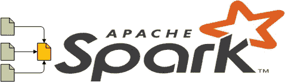
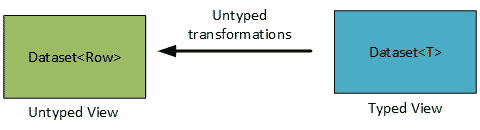
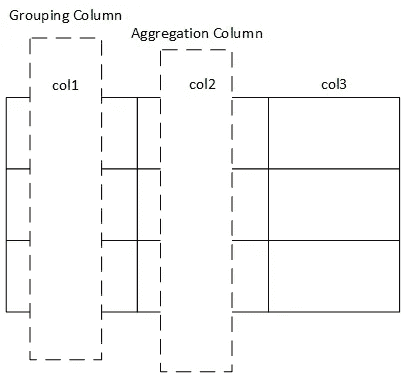
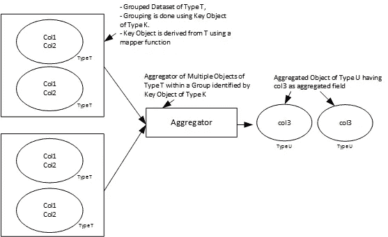

# UDAF 和聚合器:Apache Spark 中数据集的定制聚合方法

> 原文：<https://towardsdatascience.com/udaf-and-aggregators-custom-aggregation-approaches-for-datasets-in-apache-spark-68dc4d09796d?source=collection_archive---------21----------------------->



Apache Spark 中的聚合

## 数据记录的聚合是数据分析工作的必要组成部分，因此 Spark 旨在提出一个强大的聚合框架，以满足用户在各种情况下的需求。

使用 rdd 作为分布式数据收集的表示，Spark 中的聚合更早地与(Hadoop 世界的)map-reduce 框架的缩减部分的概念相一致。然而，随着 Dataframe 和最新数据集表示的引入，聚合框架现在更类似于人们更熟悉的 SQL 世界中的聚合。

## 数据集的类型化和非类型化视图

在数据帧和数据集之间，前者是带有模式定义的数据记录的非类型化视图，而后者是类型化视图。在 Dataframe 中，每条记录都被视为值的集合(类似于表中的一行),并公开一个类似 SQL 的接口来执行转换。而在 Dataset 中，每条记录都被视为某种类型的对象，并公开一个编程接口来执行转换。但是，为了保持非类型化数据帧的概念以方便 SQL 和提高效率，Dataset 还通过编码器框架支持隐藏的非类型化视图。在我之前的博客中阅读更多关于数据集编码器框架的内容: [Apache Spark 数据集编码器揭秘](https://medium.com/me/stats/post/4a3026900d63)。任何 T 类型数据集的显式非类型化视图都由“Row”类型的数据集表示。



## 类型化和非类型化聚合:概述

考虑到类型化和非类型化表示，Spark 也提供了非类型化和类型化聚合。对于非类型化的聚合，只需提到可选的分组列和一个或多个列上的聚合表达式(由聚合函数组成)。这与 SQL 中完成聚合的方式非常相似。非类型化聚合的执行会导致显式的非类型化视图。Spark 使用户能够对属于任何类型的数据集执行非类型化聚合。另一方面，对于类型化聚合，用户必须提供一个聚合器对象(处理 T 类型数据集的 T 类型对象),以便在整个数据集上聚合，或者在返回聚合类型数据集的分组数据集上聚合。

数据集上的非类型化聚合:



数据集的无类型视图上的无类型聚合

```
/* Untyped View - A is collection of Rows with two columns col1 and col2 */
=> Dataset<T> A;/*Sum Aggregation on column col1 of A over entire collection*/
=> A.agg(functions.sum(A("col1")))/*Custom Aggregation on col1 of A over entire collection*/
=> A.agg(functions.udf(MyUDAF(A("col1"))))/*Sum Aggregation on col1 of A over grouped collection of A grouped via col2 */
=> A.grouby(A("col2")).agg(functions.sum(A("col1")))/*Custom Aggregation on col1 of A over grouped collection of A grouped via col2*/
=> A.grouby(A("col2")).agg(functions.udf(MyUDAF(A("col1"))))*All above aggregations return an untyped view (Dataset<Row>)*
```

数据集上的类型化聚合:



通过聚合器对数据集<t>的 T 类型对象进行类型化聚合</t>

```
/* Typed View - A is collection of type T objects where type T consists of two fields col1 and col2 */
=> Dataset<T> A;/* B an Aggregator instance aggregating multiple objects of type T to perform desired aggregation on T's field col1, The aggregated value is returned back via a field inside object of type V */
=> Aggregator<T,U,V> B;/*Aggregation on field col1 of A over entire collection*/
=> A.select(B.toColumn()) returns Dataset<V>/*Aggregation on field col1 of A over grouped collection grouped by Key Object derived from Type T */
=> A.groupbykey(KeyFunc, Encoder<K>).agg(B.toColumn()) 
===> Here KeyFunc is of type MapFunction<T,K> which output grouping Key Object of type K for a given record of type T
===> This grouped aggregation outputs Dataset of Tuple consisting of Key Object of type K and Aggregated object of type V, viz., (Dataset<Tuple<K,V>>) 
```

## 自定义非类型化聚集:UDAF

虽然，针对非类型化聚合的支持，Spark 已经提供了多种这样的聚合函数，但是也支持构建一个定制的非类型化聚合函数，称为 UDAF。通过扩展“org . Apache . Spark . SQL . expressions”包中的“UserDefinedAggregationFunction”类，并在基类中覆盖以下方法的实现，可以在 Spark 中创建 UDAF:

```
/*Return schema for input column(s) to the UDAF, schema being built using StructType*/
=> public StructType inputSchema()/*Return schema of aggregation buffer, schema being built using StructType */
=> public StructType bufferSchema()/*DataType of final aggregation result*/
=> public DataType dataType()/*Initialize aggregation buffer*/
=> public void initialize(MutableAggregationBuffer buffer)/*Update aggregation buffer for each of the untyped view (Row) of an input object*/
=> public void update(MutableAggregationBuffer buffer, Row row)/*Update current aggregation buffer with a partially aggregated buffer*/
=> public void merge(MutableAggregationBuffer buffer, Row buffer)/*Evaluate final aggregation buffer and return the evaluated value of DataType declared earlier */
=> public Object evaluate(Row buffer)
```

> 你可以在定制的 UDAF 类中声明额外的字段(在 UDAF 构造函数中可选地初始化这些字段)和额外的方法，以便使用这些内部的覆盖方法来实现聚合目标。此外，需要注意的是[只有某些数据类型](http://BooleanType ByteType ShortType IntegerType LongType FloatType DoubleType DecimalType TimestampType DateType StringType BinaryType)被允许用于最终结果类型以及定义输入和缓冲模式。

**UDAF 示例**:假设有一个如下声明的类型‘raw data wrapper ’,每个包装器由一个键字段和一个反映射字段组成。

对于“RawDataWrapper”类型的数据集，这里有一个 UDAF 声明，它聚集了 RawDataWrapper 类型的记录之间的反映射。

上述申报的 UDAF 的用途如下所示:

## 自定义类型聚合:聚合器

类型化聚合通过[abstract generic ' Aggregator<IN，BUF，OUT >](https://spark.apache.org/docs/latest/api/java/index.html?org/apache/spark/sql/Dataset.html) '类(存在于包' org . Apache . spark . SQL . expressions '中)来支持。用户可以定义自己的自定义聚合器，方法是使用为 IN(输入记录类型)定义的类型、为 BUF(聚合缓冲区)定义的类型和为 OUT(输出记录类型)定义的类型对其进行扩展，并在基类中覆盖以下方法的实现:

```
/* return Encoder for aggregation buffer of type BUF. This is required for buffer ser/deser during shuffling or disk spilling */
=> public Encoder<BUF> bufferEncoder()/* return Encoder for output object of type OUT after aggregation is performed */
=> public Encoder<OUT> outputEncoder()/* return updated aggregation buffer object of type BUF after aggregating the existing buffer object of type BUF with the input object of type IN*/
=> public BUF reduce(BUF buffer, IN input) ()/* return updated aggregation buffer of type BUF after merging two partially aggregated buffer objects of type BUF */
=> public BUF merge(BUF buffer1, BUF buffer2)/* return output object of type OUT from evaluation of  aggregation buffer of type BUF */
=> public OUT finish(BUF arg0)/* return buffer object of type BUF after initializing the same */
=> public BUF zero()
```

> 与 UDAF 类似，用户可以在自定义的聚合器类中声明额外的字段(在聚合器构造函数中可选地初始化这些字段)和额外的方法，以便使用这些内部的覆盖方法来实现聚合目标。

**聚合器示例:**下面是一个聚合器声明，它将在 RawDataWrapper 记录上实现与 UDAF 示例所描述的相似的聚合目标

上面声明的聚合器的用法如下所示:

## 比较:UDAF 和聚合器

如果聚合字段不涉及 ArrayType 或 MapType 等复杂类型，UDAF 和聚合器的效率是相似的。但是，聚合器在聚合复杂数据类型方面比 UDAF 效率更高。这是因为在 UDAF 的每次更新操作中，scala 数据类型(特定于用户)会转换为 catalyst 数据类型(catalyst 内部数据类型),反之亦然。对于聚合缓冲区中的复杂数据类型，这种转换在效率和内存使用方面变得非常昂贵，使得 UDAF 在这些情况下与对等聚合器相比运行缓慢。在这篇博客中，为了实现相似的聚合目标，提供了 UDAF 和聚合器的示例，当两者都在 180 GB 的样本数据上运行时，UDAF 需要大约 40 分钟，而聚合器只需要大约 7 分钟就可以在集群上完成一组相似的资源。

然而，尽管 UDAF 提供了类似 SQL 的易用性，但聚合器的聚合方式在编写聚合逻辑时提供了更大的灵活性和编程优雅性。

> 此外，与大量可供使用的非类型化聚合函数相比，类型化聚合函数的库很少(基于聚合器概念)。因此，非类型化聚合流仍然是广泛使用的一种。但是，在未来的 Spark 版本中，类型化聚合器将被集成到非类型化聚合流中，以便用户可以通过聚合器使用已经可用的非类型化聚合函数库以及高效灵活的定制聚合函数。很明显，这将最终导致普遍使用 UDAF 来定义自定义聚合函数的做法遭到反对。

如果您对 Spark 聚合框架有更多的疑问，请随时在评论区提问。