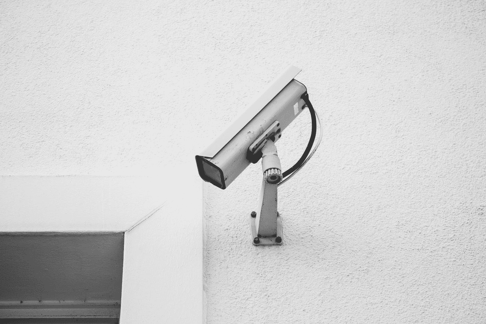
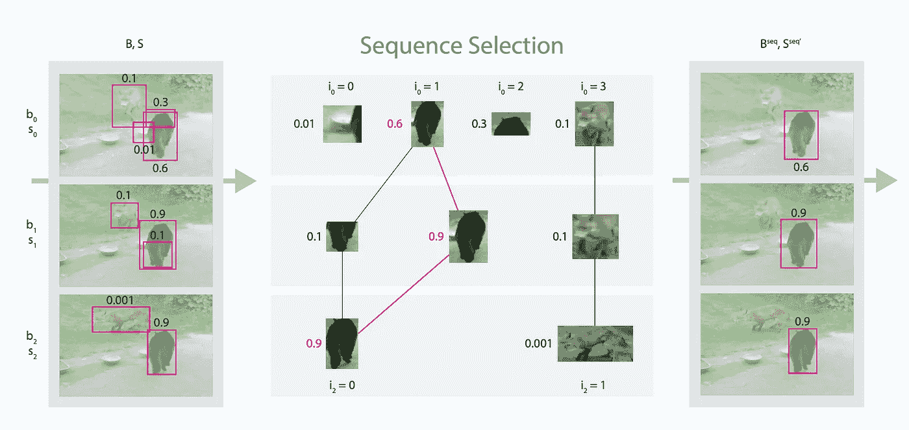
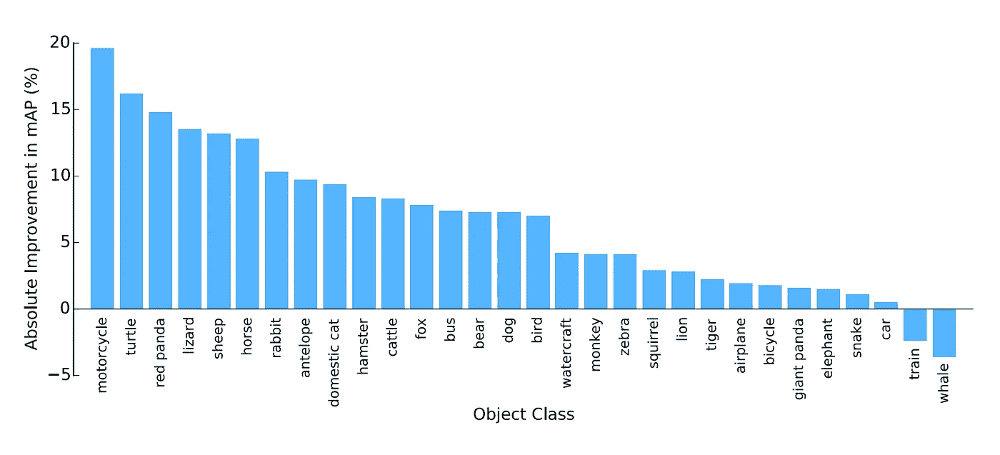
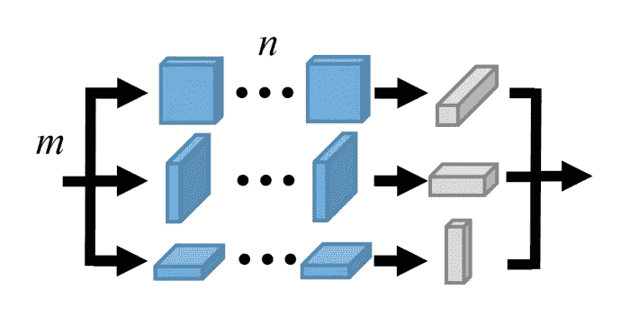
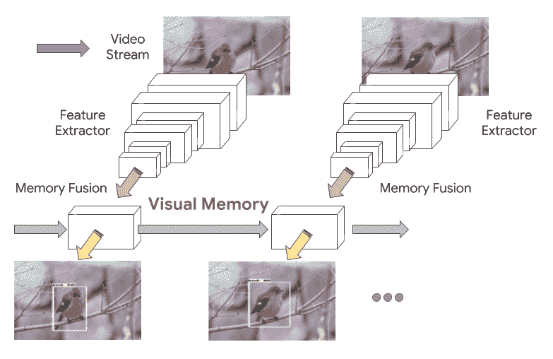
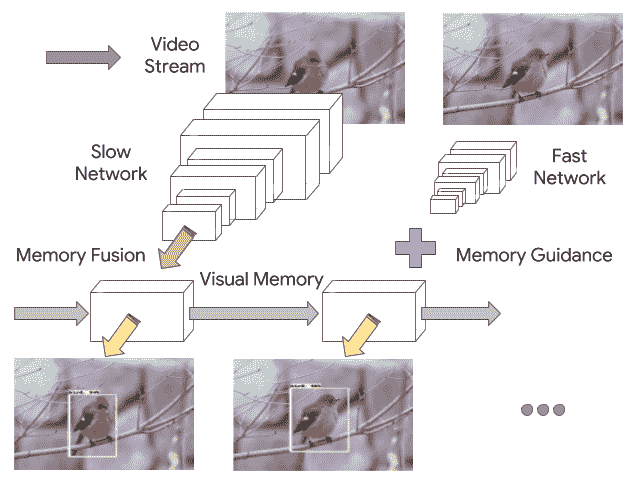
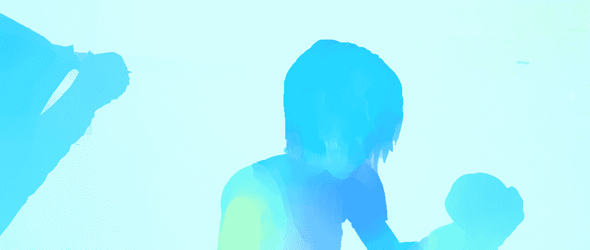
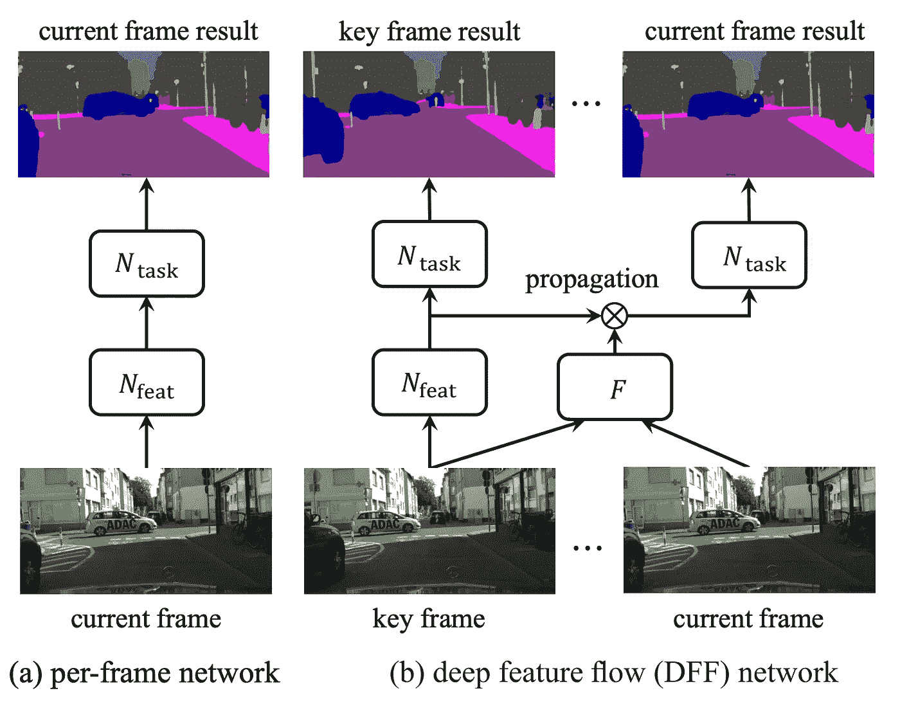
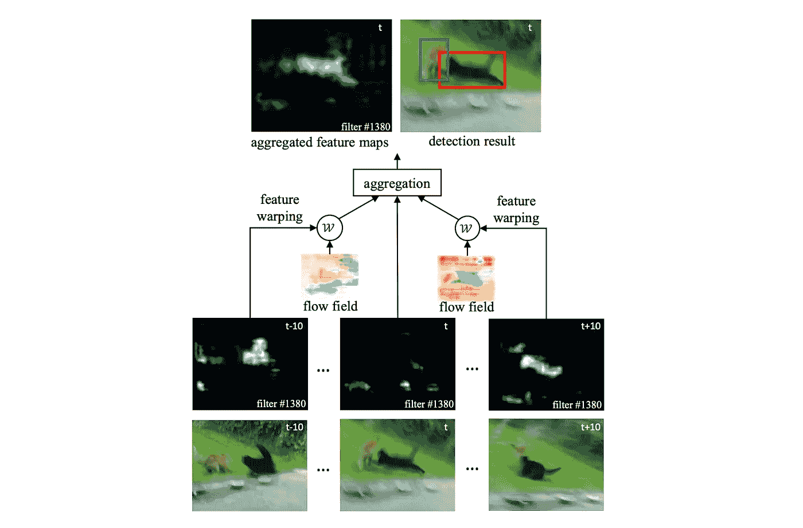
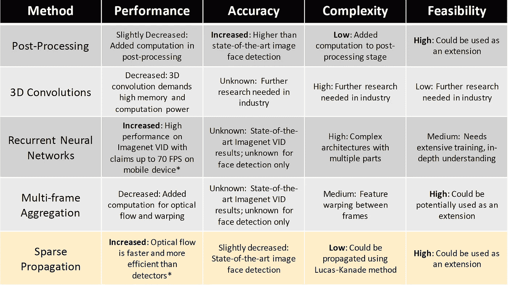

# 视频对象检测终极指南

> 原文：<https://towardsdatascience.com/ug-vod-the-ultimate-guide-to-video-object-detection-816a76073aef?source=collection_archive---------3----------------------->

## 20/20 年前的一切(计算机视觉)

在过去的十年中，在机器学习领域，尤其是计算机视觉领域，已经做了大量的工作。从 Google 的 Inception 等高级分类算法到 Ian Goodfellow 在生成对抗网络方面的开创性工作，以从噪声中生成数据，世界各地许多专注的研究人员已经处理了多个领域。有趣的是，在这十年的前五年，计算机视觉领域最具开创性的工作大多涉及图像处理，如分类、检测、分割和生成，而视频处理领域则没有得到深入探索。

Ibrahim Rifath 在 [Unsplash](https://unsplash.com?utm_source=medium&utm_medium=referral) 上的照片

轻微不平衡的一个明显原因是因为视频本质上是一系列图像(帧)的组合。然而，这个定义不能概括视频处理的全貌，这是因为视频处理给这个问题增加了一个新的维度:时间维度。视频不仅仅是一系列图像，而是一系列相关的图像。虽然这看起来是一个很小的差异，但研究人员能够以多种方式利用这个维度，而不是应用于单个图像。此外，由于视频数据(大小、相关注释)的复杂性以及训练和推理的昂贵计算，在该领域的突破一直较为困难。然而，最近随着 ImageNet VID 和其他大规模视频数据集的发布，越来越多的视频相关研究论文浮出水面。在本指南中，我们将主要探讨在视频检测中已经完成的研究，更准确地说，研究人员如何能够探索时间维度。

# 目录

*   [**后置处理方法**](#8f94)
*   [**多帧方法**:卷积](#0111)
*   [**多框架方法**:递归神经网络](#cadc)
*   [**光流方法**:传播](#3ddf)
*   [**光流方法**:聚合](#f853)
*   [对比](#7a37)

# 后处理方法

最先出现的方法是应用于对象检测流水线的后处理步骤的修改。这是因为它需要更少的基础设施，并且不需要改变模型的架构。后处理方法仍然是每帧检测过程，因此没有性能提升(处理时间可能稍长)。然而，它可以实现相当大的准确性提高。

序列选择的图示。我们构造一个图，其中相邻帧中的框是链接的，如果它们的 IoU > 0.5。来源:Seq-NMS 研究论文([链接](https://arxiv.org/pdf/1602.08465.pdf))

一种值得注意的方法是[序列-NMS](https://arxiv.org/pdf/1602.08465.pdf) (序列非最大抑制)，其通过动态编程基于“轨迹”上的其他检测对检测置信度进行修改。例如，由于遮挡、运动模糊或其他缺陷，可能导致对阳性对象的预测较弱，但是由于它将出现在从先前帧中提取的“轨迹”(重叠标准)中，因此置信度将会提高。这将有效地减少帧之间的错误检测或随机跳跃检测的数量，并稳定输出结果。

使用序列 NMS 在 mAP 中的绝对改善(%)。这种改进是相对于单图像 NMS 而言的。来源:Seq-NMS 研究论文([链接](https://arxiv.org/pdf/1602.08465.pdf))

从上图可以看出，精确度已经有了相应的提高:相对于单图像 NMS，使用 Seq-NMS 的 mAP (%)的绝对提高超过了 10%,有 7 个类别的提高超过了 10%,而只有两个类别显示精确度下降。虽然这项工作是实现更好的视频检测的最初工作之一，但它并没有证明在准确性和性能方面是最好的。然而，明显的好处是，这种方法不需要训练本身，更像是一个可以插入任何对象检测器的附件。

# 多框架方法

## 三维卷积

例如，具有图像分类经验的开发人员的第一本能会想到某种 3D 卷积，这是基于对图像进行的 2D 卷积。这种架构的可能性似乎是合理的:遍历 n 个帧作为模型的输入，并输出对连续帧的顺序检测。这无疑是一个潜在的检测方向，因为它可以提取时空数据的低级特征，但具有 3D 卷积的卷积神经网络已被证明在处理 3D 图像(如 3D MNIST 或 MRI 扫描)时非常有用且富有成效。这就是为什么这些模型更多的是医学成像领域的突破，而不是视频检测。

三维卷积。来源:[https://vcg . seas . Harvard . edu/publications/parallel-separable-3d-convolution for-video-and-volumetric-data-understanding](https://vcg.seas.harvard.edu/publications/parallel-separable-3d-convolution-for-video-and-volumetric-data-understanding)

尽管如此，探索在视频处理中使用 3D 卷积的研究论文的一个例子是[，一个用于视频中动作检测和分割的端到端 3D 卷积神经网络](https://arxiv.org/pdf/1712.01111.pdf)。在研究论文中，首先将视频分成等长的剪辑，然后根据 3D CNN 特征为每个剪辑生成一组管道建议。然后，不同剪辑的管提议被链接在一起，并且使用这些链接的视频提议来执行时空动作检测。尽管该论文主要讨论了分割和动作检测，但是可以训练该体系结构的衍生物来执行对象检测。

就性能而言，由于多维矩阵的高计算量，在当前状态下，处理时间无法与实时(30 fps 或更高)一样快。在这一领域的进一步改进和研究可以改变方向，但扩展 3D 卷积的性能并不是一件容易的事情。说到准确性，我相信肯定能受到正面影响。检测的稳定性以及精度可以通过 3D 卷积来提高，因为该架构可以有效地利用时间维度(帧之间特征的集合)。然而，它目前只是基于其他最先进的 3D 卷积模型的一种推测。还没有一篇深入研究视频检测的论文。

## 递归神经网络

对于其他对序列数据有更多经验的人来说，人们可能倾向于考虑使用递归神经网络，如 LSTM。RNN 是一种特殊类型的网络，用于处理时序数据，包括时态数据。从这种架构中获益匪浅的一个领域是自然语言处理。例如，AWD-LSTM 的表现与最先进的伯特变压器模型不相上下，而参数却少得多。那么，它是否适用于帧完全连续的视频检测呢？像[的具有时间感知特征图的移动视频对象检测](http://openaccess.thecvf.com/content_cvpr_2018/papers/Liu_Mobile_Video_Object_CVPR_2018_paper.pdf)和[的看起来快和慢:记忆引导的移动视频对象检测](https://arxiv.org/pdf/1903.10172.pdf)已经取得了一些进展。

提高性能的 LSTM 层。来源:`"Mobile Video Object Detection with Temporally-Aware Feature Maps", Liu, Mason and Zhu, Menglong, CVPR 2018.`

在前者中，本文将快速单幅图像目标检测与称为瓶颈 LSTM 的卷积长短期记忆(LSTM)层相结合，以创建一种交织递归卷积架构。LSTM 层降低了计算成本，同时仍然在帧间改进和传播特征图。该白皮书旨在低功耗移动和嵌入式设备上实时运行，在移动设备上实现 15 fps。

使用 LSTM 层的大型和小型神经网络。来源:`"Looking Fast and Slow: Memory-Guided Mobile Video Object Detection", Liu, Mason and Zhu, Menglong and White, Marie and Li, Yinxiao and Kalenichenko, Dmitry`

在后者中，研究人员建议通过依赖相关的先验知识来利用场景的“要点”(短时间内复杂环境的丰富表现)，这些先验知识是受人类如何识别和检测物体的启发而产生的。该模型的架构是通过将传统的特征提取器与仅需要识别场景要点(最小计算)的轻量级特征提取器交错。这有效地从捕获“要点”的关键帧为架构创建了长期记忆，该要点指导小型网络检测什么。本文还结合了强化学习算法来实现自适应推理策略。该论文提供了有希望的结果，例如在移动设备上 70 fps，同时在 ImageNet VID 上仍然实现了小型神经网络的最先进结果。

一个关键要点是，该架构是端到端的，这意味着它获取图像并输出屏蔽数据，需要对整个架构进行训练。因为我们正在处理视频数据，所以模型需要在大量数据上进行训练。

# 光流方法

为什么不能在视频上使用图像物体检测器？我们可以。另一种可能的处理视频检测的方法是对视频文件的每一帧应用最先进的图像检测器，如 [YOLOv3](https://arxiv.org/pdf/1804.02767.pdf) 或面部检测器，如 [RetinaFace](https://arxiv.org/pdf/1905.00641.pdf) 和 [DSFD](https://arxiv.org/pdf/1810.10220.pdf) 。每一帧都将被用作模型的输入，视频结果可以像它们在图像上的平均精度一样精确。然而，将这些检测器直接应用于视频文件的每一帧面临着来自两个方面的挑战:

1.  就速度而言，对所有视频帧应用单个图像检测器效率不高，因为主干网络通常又深又慢。将它应用于每个单个帧还会导致大量冗余计算，因为来自视频文件的两个连续帧通常不会有很大差异。
2.  对于精度，检测精度受到在静止图像中很少观察到的视频中的劣化外观的影响，例如运动模糊、视频散焦、罕见姿势。

因此，在每个文件上应用检测器不是解决视频检测挑战的有效方法。然而，通过探索视频的时间维度，我们可以实现不同的方法来解决一个或两个问题。

## 什么是光流？

光流估计是一种估计由摄像机(背景)或对象运动引起的两帧视频之间的物体的表观运动的方法。输出通常是 2D 矢量场，其中每个矢量代表一个像素从第一帧到第二帧的位移矢量。

光流算法的彩色编码输出示例。来源:辛特尔光流数据集([http://sintel.is.tue.mpg.de/](http://sintel.is.tue.mpg.de/))

光流一直是计算机视觉的一个研究领域，自 20 世纪 80 年代以来一直在探索，最近又作为深度学习的一个有趣领域重新浮出水面，由 [Flownet](https://arxiv.org/pdf/1612.01925.pdf) 开创。在此之前，最初的方法是微分的。例如，Lucas-Kannade 方法假设在所考虑的像素的局部邻域中流动基本上是恒定的，并且通过最小二乘法准则求解该邻域中所有像素的基本光流方程。但随着新的进展和新的光流数据集，如 Sintel，越来越多的架构浮出水面，一个比另一个更快更准确。

有多种架构可以利用这项技术。例如，[迈向高性能](https://arxiv.org/pdf/1804.05830.pdf)以及许多其他使用光流来建立跨帧的对应关系(稀疏特征传播)。光流是当前开发视频对象检测的时间维度最多的领域，因此，出于某种原因。光流的结果越来越快，越来越准确。

## 稀疏特征传播提高性能

该体系结构以稀疏关键帧的概念运行。由于光流网络可以相对较小，因此这种网络所需的处理时间和计算能力小于物体检测器。因此，流水线的功能相当于 n 帧的循环。第一帧称为关键帧。这是对象检测器检测到的帧。因为现在检测器给出了所有对象的精确检测，所以检测将服从光流算法。在获得位移向量之后，下 n-1 帧的检测是已知的，并且循环重复。

稀疏特征在纸上传播开来:【https://arxiv.org/pdf/1611.07715.pdf 

## 精确的多帧特征聚合

提高视频检测准确性的一种方法是多帧特征聚合。有不同的实现方式，但都围绕着一个想法:密集计算的每帧检测，同时从相邻帧到当前帧进行特征扭曲，并通过加权平均进行聚合。因此，当前帧将受益于直接帧以及一些进一步的帧，以获得更好的检测。这可以解决视频帧中的运动和裁剪主题问题。

论文多帧特征聚合:[https://arxiv.org/pdf/1703.10025.pdf](https://arxiv.org/pdf/1703.10025.pdf)

一个这样的例子是研究论文[流引导特征聚合(FGDA)](https://arxiv.org/pdf/1703.10025.pdf) 。流动引导的特征聚集聚集来自附近帧的特征地图，这些特征地图通过估计的流动很好地对齐。该架构是一个端到端的框架，在功能级别上利用时间一致性。

# 比较

在介绍完所有这些方法之后，我们可以通过一个比较表来总结这些方法的要点，以帮助理解这些方法与使用图像检测器的简单逐帧方法相比有何不同:

以上方法对比图。*这些方法在处理关键帧时可能会产生一点延迟。

虽然所介绍的方法是目前已经发表的，但随着视频对象检测成为一个更容易理解的话题，目前肯定有更多的研究正在进行。希望随着即将到来的会议，越来越多的突破可以观察到。从 2020 年开始的新十年，人们对更好的视力充满了希望！干杯！