# 使用 Python 为自然语言处理(NLP)收集文本的入门指南— Twitter、Reddit、Genius 等等

> 原文：<https://towardsdatascience.com/ultimate-beginners-guide-to-collecting-text-for-natural-language-processing-nlp-with-python-256d113e6184?source=collection_archive---------26----------------------->

## 通过 API 和 Web 抓取收集文本


[梁杰森](https://unsplash.com/@ninjason?utm_source=medium&utm_medium=referral)在 [Unsplash](https://unsplash.com?utm_source=medium&utm_medium=referral) 上的照片

# 进入自然语言处理领域

自从一年多前进入数据科学以来，我一直对自然语言处理(NLP)着迷。由于迁移学习的进步，该领域已经取得了一些爆炸性的进展，像 Alexa 和 Siri 这样的 NLP 产品已经成为家喻户晓的名字。由于我的背景是技术写作和修辞理论，我立即被涉及文本的项目吸引，如情感分析和主题提取，因为我想了解机器学习如何提供对书面语言的洞察力。[我的第一个数据科学项目是使用谷歌的通用句子编码器来产生葡萄酒推荐](/generating-wine-recommendations-using-the-universal-sentence-encoder-d086edd13d00)。

我一直想要一个像这样的指南，分解如何从流行的社交媒体平台提取数据。随着对 BERT 和 ELMo 等强大的预训练语言模型[的可访问性增加，了解在哪里查找和提取数据变得非常重要。幸运的是，社交媒体是收集 NLP 数据集的丰富资源，只需几行 Python 代码就可以轻松访问。在文章的最后，我还提供了一个流行的 Kaggle NLP 数据集列表，并链接到新的搜索引擎 Google Dataset Search。](https://www.analyticsvidhya.com/blog/2019/03/pretrained-models-get-started-nlp/)

# 先决条件

本文教你如何从 Twitter、Reddit 和 Genius 中提取数据。我假设你已经知道一些 Python 库 [Pandas](https://medium.com/datadriveninvestor/python-pandas-library-for-beginners-a-simplified-guide-for-getting-started-and-ditching-20992b7cd4da) 和 [SQLite](https://medium.com/@erickleppen01/learn-sql-techniques-selecting-data-and-more-in-sql-server-624f81dd16b2) 。

# 管理您的 API 密钥

在进入代码之前，强调 API 键的值是很重要的。如果您是管理 API 密钥的新手，请确保将它们保存到 config.py 文件中，而不是在您的应用程序中硬编码它们。确保不要将它们包含在任何在线代码共享中。 **API 密钥可能非常有价值，有时非常昂贵，必须加以保护**。如果您担心您的密钥被泄露，大多数提供商允许您重新生成密钥。

[***把 config 文件添加到你的 gitignore 文件中，防止它也被推送到你的 repo 中*** *！*](/a-simple-git-workflow-for-github-beginners-and-everyone-else-87e39b50ee08)

# Twitter API

Twitter 提供了大量的数据，很容易通过他们的 API 访问。使用 Tweepy Python 库，可以根据所需主题轻松获取持续的推文流。Twitter 非常适合挖掘趋势和情绪，

对于本教程，[你需要在 Twitter 上注册一个应用程序来获得 API 密匙](https://developer.twitter.com/en.html)。如果你不熟悉 Twitter 的开发者门户，请查看官方的 Twitter 文档！

使用 pip 安装 Tweepy 和 unidecode。

```
pip install tweepy
pip install *unidecode*
```

将以下密钥保存到配置文件中:

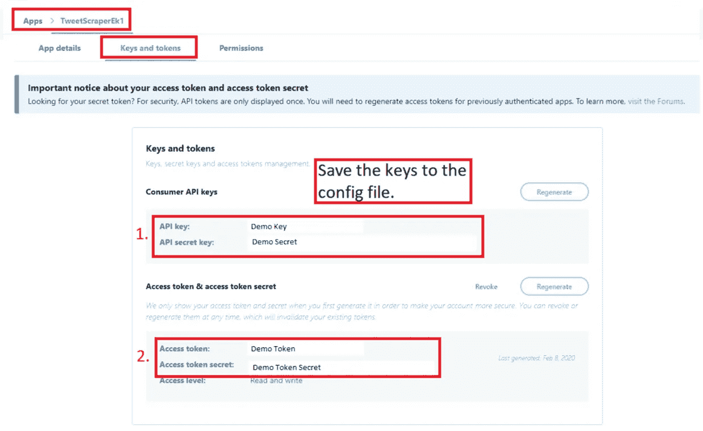

# 使用 Tweepy

将 Tweepy 连接到 Twitter 使用了 [OAuth1](https://en.wikipedia.org/wiki/OAuth) 。如果您是 API 认证的新手，请查看[官方 Tweepy 认证教程](http://docs.tweepy.org/en/latest/auth_tutorial.html)。

为了保存来自传入流的数据，我发现最简单的方法是将其保存到 SQLite 数据库中。如果您不熟悉 SQL 表或者需要复习，请查看这个免费网站的示例或者查看[我的 SQL 教程](https://medium.com/@erickleppen01/learn-sql-techniques-selecting-data-and-more-in-sql-server-624f81dd16b2)。

函数 ***unidecode()*** 获取 Unicode 数据，并尝试用 ASCII 字符表示它。

```
#import dependencies
import tweepy
from tweepy import OAuthHandler
from tweepy.streaming import StreamListener
import json
from unidecode import unidecode
import time
import datetime#import the API keys from the config file.
from config import con_key, con_sec, a_token, a_secret sqlite3conn = sqlite3.connect("twitterStream.sqlite")
c = conn.cursor()
```

我需要创建表来存储葡萄酒数据。我使用 SQLite 是因为它是轻量级的和无服务器的。另外，我喜欢把所有的数据都放在一个地方！

```
def create_table():
    c.execute("CREATE TABLE IF NOT EXISTS Tweets(timestamp REAL, tweet TEXT)")
    conn.commit()create_table()
```

注意，如果不存在，我使用**来确保该表在数据库中不存在。记住使用***conn . commit()***调用提交事务。**

## 创建一个 StreamListner 类

下面是一些样板代码，用于从流 twitter 数据中提取 tweet 和时间戳，并将其插入数据库。

```
class Listener(StreamListener):

    def on_data(self, data):
        **try:**
            data = json.loads(data)
            tweet = unidecode(data['text'])
            time_ms = data['timestamp_ms']
            #print(tweet, time_ms)
            c.execute("INSERT INTO Tweets (timestamp, tweet) VALUES (?, ?)", (time_ms, tweet))

            conn.commit()
            **time.sleep(2)**
        **except KeyError as e**:

                print(str(e))
        return(True)

    def on_error(self, status_code):
        if status_code == 420:
            #returning False in on_error disconnects the stream
            return False**while True**:
       try:
            auth = OAuthHandler(con_key, con_sec)
            auth.set_access_token(a_token, a_secret)
            twitterStream = tweepy.Stream(auth, Listener())
            **twitterStream.filter**(track=['DataScience'])
       except Exception as e:
            print(str(e))
            time.sleep(4)
```

请注意，我使用 ***time.sleep()*** 来减缓流的速度。
注意，代码被包装在 try/except 中，以防止潜在的中断中断流。此外，[文档建议](https://developer.twitter.com/en/docs/basics/response-codes)使用一个 ***on_error()*** 函数，在应用发出过多请求时充当断路器。
注意，我将流对象包装在一个 *while 条件中。*这样，如果遇到 420 错误，它就会停止。
注意***twitterstream . filter***使用 *track* 在推文中查找关键词。如果你想关注特定用户的推文，使用 ***。过滤(follow=[""])*** 。

**从 SQLite 数据库中提取数据**

```
sql = '''select tweet from Tweets 
                where tweet not like 'RT %'
                order by timestamp desc'''
tweet_df = pd.read_sql(sql, conn)
tweet_df
```

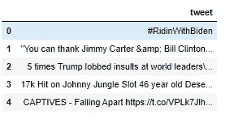

示例推文数据帧

# Reddit API

像 Twitter 一样，社交网络 Reddit 包含了令人瞠目结舌的大量信息，很容易收集。这是一个像互联网论坛一样工作的社交网络，允许用户发表任何他们想要的话题。用户组成名为 *subreddits* 的社区，他们对社区中的帖子投赞成票或反对票，以决定哪些帖子先被浏览，哪些帖子沉到底部。

我将解释如何获得 Reddit API 键，以及如何使用 PRAW 库从 Reddit 提取数据。虽然 [Reddit 有一个 API](https://www.reddit.com/dev/api/) ，但是 [Python Reddit API 包装器，或者简称为 PRAW，提供了一个简化的体验](https://praw.readthedocs.io/en/latest/getting_started/quick_start.html#)。PRAW 支持 Python 3.5+版本

# Reddit API 入门

需要 Reddit 的用户帐户才能使用 API。这是完全免费的，只需要一个电子邮件地址！

[https://www.reddit.com](https://www.reddit.com/)

## 为钥匙注册应用程序

如果有办法使用新的 Reddit 用户界面，请给我留言！如果您是第一次登录 Reddit，请按照以下步骤获取 API 密钥。如果您已经有了密钥，[使用此链接转到您的应用页面](https://old.reddit.com/prefs/apps/)。

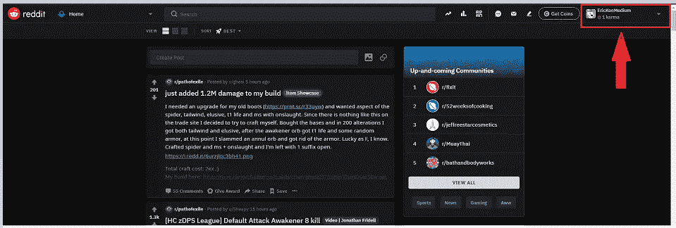

reddit.com 用户帐户按钮

点击**用户账号**下拉列表。显示用户选项。

从用户选项中点击**访问旧 Reddit** 。页面会改变，网址会变成 h[ttps://old . Reddit . com/](https://old.reddit.com/)

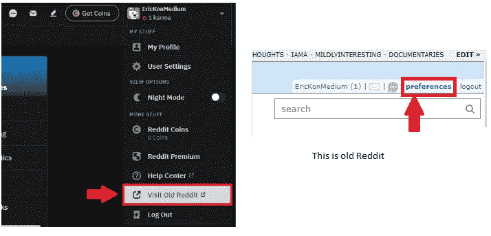

偏好；喜好；优先；参数选择

点击注销按钮旁边的**首选项**链接。
点击首选项屏幕上的**应用**标签。
点击**你是开发者吗？创建 am 应用程序** …按钮。

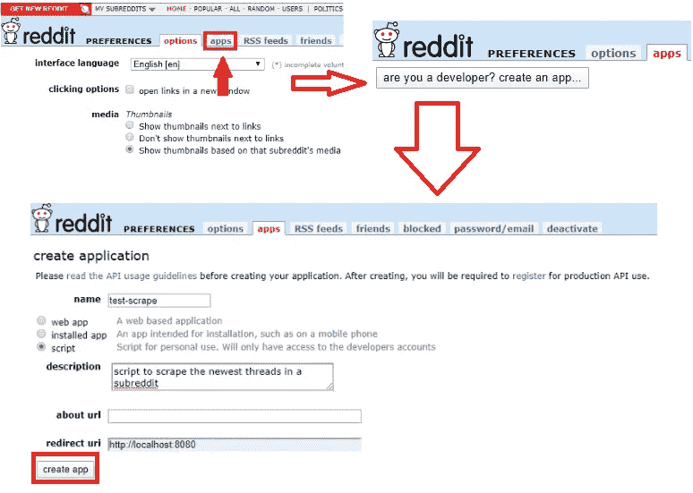

注册 Reddit 应用程序

输入一个**名**。
选择 **app** 的类型。
输入一个**描述**。
[使用 http://localhost:8080 作为**重定向 uri**](https://praw.readthedocs.io/en/latest/getting_started/authentication.html#code-flow) 。
填写完字段后，点击**创建应用**。

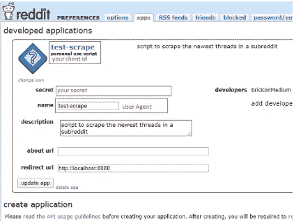

Reddit API 客户端

将显示连接所需的 API 信息。当我开始写代码时，我将通过 PRAW 连接到 API。

祝贺你开始收集 Reddit 数据！

# 使用 PRAW 提取 Reddit 数据

安装 PRAW 的推荐方法是使用 pip 。安装以下软件包来创建仪表板。

```
**pip install praw**
```

首先导入库和配置文件:

```
import praw
import pandas as pd 
from config import cid, csec, ua
```

## 创建 Reddit 实例

创建一个只读 Reddit 实例。这意味着我不需要输入用于发布回复或创建新主题的 Reddit 凭据；该连接只读取数据。

PRAW 使用 OAuth 认证来连接 Reddit API。

```
#create a reddit connection
reddit = praw.Reddit(client_id= cid,
                     client_secret= csec,
                     user_agent= ua)
```

## 识别子记录

以下是我认为值得探究的一些例子:

新闻，数据科学，学习机器学习，游戏，搞笑，政治

## 探索对象和属性

使用 PRAW 中的 Subreddit 类从所需的 subreddit 中检索数据。可以根据以下 Reddit 选项对数据进行排序:

*   **热门**——按访问量最大的帖子排序
*   **新** —按帖子最新的帖子排序
*   **置顶** —按投票最多的帖子排序
*   **上升** —按帖子人气排序

如果您想要包含多个子编辑，请使用 **+** 符号:

```
#single subreddit new 5
subreddit = reddit.subreddit('news').new(limit = 5)#multiple subreddits top 5
subreddit = reddit.subreddit('news' + 'datascience').top(limit = 5)
```

这将返回一个*对象*，它将数据保存在一个*属性*中。该属性就像 [*字典*](https://www.w3schools.com/python/python_dictionaries.asp) 中的*键*。

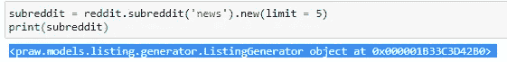

数据链接到对象所拥有的属性。如果*属性*为*键*，则*数据*为*值*。属性是动态生成的，所以最好使用 Python 的内置 **vars()** 函数来检查哪些是可用的。

**使用这个样板代码来查看代表 reddit 帖子**的对象所拥有的所有属性。这是一个很长的列表！

```
subreddit = reddit.subreddit('news').new(limit = 1)
for post in subreddit:
    pprint.pprint(vars(post))
```

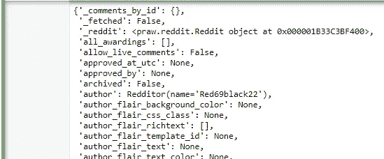

发布对象属性的示例

请注意列表中感兴趣的属性:

**标题** —返回文章标题。
**得分** —返回赞成票或反对票的数量。
**num_comments** —返回线程上的注释数量。
**selftext** —返回帖子的正文。
**创建的** —返回文章的时间戳。
**钉住** —表示线程是否被钉住。
**total _ awards _ received**—返回帖子获得的奖项数。

## 保存 Reddit 数据

既然已经确定了属性，就将它们的数据加载到 pandas 数据帧中，或者保存到 SQLite 数据库中，就像 Twitter 示例中那样。在这个例子中，我将把它保存到一个熊猫数据帧中。

```
#list for df conversion
posts = []#return 100 new posts from wallstreetbets
new_bets = reddit.subreddit('wallstreetbets').new(limit=100)#return the important attributes
for post in new_bets:
    posts.append([post.title, post.score, post.num_comments, post.selftext, post.created, post.pinned, post.total_awards_received])#create a dataframe
posts = pd.DataFrame(posts,columns=['title', 'score', 'comments', 'post', 'created', 'pinned', 'total awards'])#return top 3 df rows
posts.head(3)
```

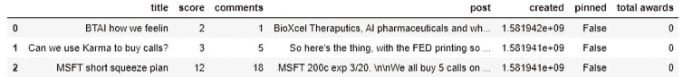

# 天才歌词

我一直是音乐迷，尤其是重金属。在重金属中，歌词有时很难理解，所以我去 Genius 破译它们。网站[Genius.com](https://genius.com/Genius-about-genius-annotated)是一个注释歌词、收集关于音乐、专辑和艺术家的琐事的平台。Genius 允许用户注册一个 API 客户端。

[https://genius.com/api-clients](https://genius.com/api-clients)

## API 客户端注册


要么报名，要么签到。
点击开发者链接。
点击创建 API 客户端。
输入一个应用程序名称。
如果有网址就输入网址，否则 [http://127.0.0.1](http://127.0.0.1) 就可以了。
点击保存。将显示 API 客户端。
点击生成访问令牌，生成访问令牌。

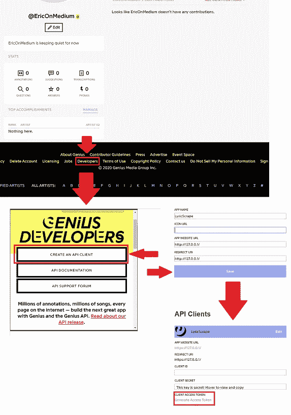

API 客户端注册工作流

## 提取歌词

令人惊讶的是，由于[法律原因](https://genius.com/discussions/277279-Get-the-lyrics-of-a-song)，Genius API 并没有提供下载歌词的方式。可以搜索歌词，但不能下载。对每个人来说幸运的是，Medium 作者 [Ben Wallace](https://medium.com/u/f27d15a817ec?source=post_page-----256d113e6184--------------------------------) [为我们提供了一个方便的抓取歌词的包装器](https://medium.com/linebyline/mac-miller-a-lyrical-analysis-and-admiration-33f5d6575ee4)。也可以在 GitHub 上找到他的原始代码:

[](https://github.com/benfwalla/MusicAnalysis) [## benfwalla/音乐分析

### 此时您不能执行该操作。您已使用另一个标签页或窗口登录。您已在另一个选项卡中注销，或者…

github.com](https://github.com/benfwalla/MusicAnalysis) 

我修改了他的包装器，以便更容易下载艺术家的完整作品，而不是对我想要包含的专辑进行编码，并且我添加了一个艺术家列来存储艺术家的名字。

包装器使用 API 获取链接到歌词的 URL。从那里，BeautifulSoup 用于解析每个 URL 的 HTML。该过程产生包含标题、URL、艺术家、专辑和歌词的数据帧:

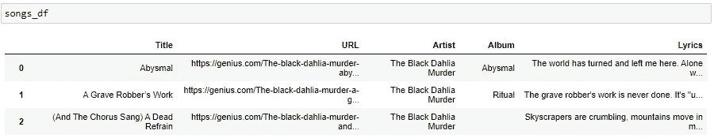

## 查看 GeniusArtistDataCollect 包装

包装器是一个名为**geniusartisdatacollect()**的类。使用它连接到 API 并检索指定艺术家的歌词。在这个例子中，我使用了我最喜欢的金属乐队之一，黑色大丽花谋杀。

要使用**geniusartisdatacollect()**，实例化它，传入*客户端访问令牌*和*艺术家名字*。

```
g = GeniusArtistDataCollect(token, 'The Black Dahlia Murder')
```

从*geniusartistdata collect*对象中调用 **get_artists_songs()** 。这将作为熊猫*数据帧*返回。

```
songs_df = g.get_artist_songs()
```

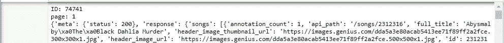

songs_df = g.get_artist_songs()

## 包装纸

下面是我在示例中使用的修改后的包装器:

```
import os
import re
import requests
import pandas as pd
import urllib.request
from bs4 import BeautifulSoup
from config import token class GeniusArtistDataCollect:
    """A wrapper class that is able to retrieve, clean, and organize all the album songs of a given artist
    Uses the Genius API and webscraping techniques to get the data."""def __init__(self, client_access_token, artist_name):
        """
        Instantiate a GeniusArtistDataCollect object
        :param client_access_token: str - Token to access the Genius API. Create one at [https://genius.com/developers](https://genius.com/developers)
        :param artist_name: str - The name of the artist of interest
        THIS HAS BEEN REMOVED :param albums: list - A list of all the artist's albums to be collected
        """self.client_access_token = client_access_tokenself.artist_name = artist_name#self.albums = albumsself.base_url = '[https://api.genius.com/'](https://api.genius.com/')self.headers = {'Authorization': 'Bearer ' + self.client_access_token}self.artist_songs = Nonedef search(self, query):
        """Makes a search request in the Genius API based on the query parameter. Returns a JSON response."""request_url = self.base_url + 'search'
        data = {'q': query}
        response = requests.get(request_url, data=data, headers=self.headers).json()return responsedef get_artist_songs(self):
        """Gets the songs of self.artist_name and places in a pandas.DataFrame"""# Search for the artist and get their id
        search_artist = self.search(self.artist_name)
        artist_id = str(search_artist['response']['hits'][0]['result']['primary_artist']['id'])print("ID: " + artist_id)# Initialize DataFrame
        df = pd.DataFrame(columns=['Title', 'URL'])# Iterate through all the pages of the artist's songs
        more_pages = True
        page = 1
        i = 0
        while more_pages:print("page: " + str(page))# Make a request to get the songs of an artist on a given page
            request_url = self.base_url + 'artists/' + artist_id + '/songs' + '?per_page=50&page=' + str(page)
            response = requests.get(request_url, headers=self.headers).json()print(response)# For each song which the given artist is the primary_artist of the song, add the song title and
            # Genius URL to the DataFrame
            for song in response['response']['songs']:if str(song['primary_artist']['id']) == artist_id:title = song['title']
                    url = song['url']df.loc[i] = [title, url]
                    i += 1page += 1if response['response']['next_page'] is None:
                more_pages = False# Get the HTML, Album Name, and Song Lyrics from helper methods in the class
        df['Artist'] = self.artist_name
        df['html'] = df['URL'].apply(self.get_song_html)
        df['Album'] = df['html'].apply(self.get_album_from_html)
        #df['InAnAlbum'] = df['Album'].apply(lambda a: self.is_track_in_an_album(a, self.albums))
        #df = df[df['InAnAlbum'] == True]
        df['Lyrics'] = df.apply(lambda row: self.get_lyrics(row.html), axis=1)del df['html']self.artist_songs = dfreturn self.artist_songsdef get_song_html(self, url):
        """Scrapes the entire HTML of the url parameter"""request = urllib.request.Request(url)
        request.add_header("Authorization", "Bearer " + self.client_access_token)
        request.add_header("User-Agent",
                           "curl/7.9.8 (i686-pc-linux-gnu) libcurl 7.9.8 (OpenSSL 0.9.6b) (ipv6 enabled)")
        page = urllib.request.urlopen(request)
        html = BeautifulSoup(page, "html")print("Scraped: " + url)
        return htmldef get_lyrics(self, html):
        """Scrapes the html parameter to get the song lyrics on a Genius page in one, large String object"""lyrics = html.find("div", class_="lyrics")all_words = ''# Clean lyrics
        for line in lyrics.get_text():
            all_words += line# Remove identifiers like chorus, verse, etc
        all_words = re.sub(r'[\(\[].*?[\)\]]', '', all_words)# remove empty lines, extra spaces, and special characters
        all_words = os.linesep.join([s for s in all_words.splitlines() if s])
        all_words = all_words.replace('\r', '')
        all_words = all_words.replace('\n', ' ')
        all_words = all_words.replace('  ', ' ')return all_wordsdef get_album_from_html(self, html):
        """Scrapes the html parameter to get the album name of the song on a Genius page"""parse = html.findAll("span")
album = ''for i in range(len(parse)):
            if parse[i].text == 'Album':
                i += 1
                album = parse[i].text.strip()
                breakreturn album
```

# 另外两个网页抓取例子

天才歌词示例使用美丽的汤从网站上刮歌词。Web 抓取是一种有用的技术，它使得收集各种数据变得容易。我在上一篇文章中介绍了一个额外的 web 抓取示例。如果你想多加练习，就去看看吧！

[](/web-scraping-board-game-descriptions-with-python-7b8f6a5be1f3) [## 用 Python 编写的网页刮痧板游戏描述

### 我是如何从网上搜集棋盘游戏描述的。

towardsdatascience.com](/web-scraping-board-game-descriptions-with-python-7b8f6a5be1f3) 

尽管我还没有使用过他的方法，媒体作家威尔·科尔森已经为搜集和解析维基百科做了一个演示。看看他的作品！

[](/wikipedia-data-science-working-with-the-worlds-largest-encyclopedia-c08efbac5f5c) [## 维基百科数据科学:与世界上最大的百科全书合作

### 如何以编程方式下载和解析维基百科

towardsdatascience.com](/wikipedia-data-science-working-with-the-worlds-largest-encyclopedia-c08efbac5f5c) 

# Kaggle 和谷歌数据集搜索

虽然我认为收集和创建自己的数据集很有趣，但 Kaggle 和谷歌的数据集搜索提供了便捷的方法来找到结构化和标签化的数据。Kaggle 是一个流行的竞争数据科学平台。下面是用于 NLP 项目的流行数据集列表。

[https://www.kaggle.com/datasets](https://www.kaggle.com/datasets)https://datasetsearch.research.google.com/[](https://datasetsearch.research.google.com/)

确定新闻故事是否来自洋葱:

*   [https://www.kaggle.com/chrisfilo/onion-or-not](https://www.kaggle.com/chrisfilo/onion-or-not)

Youtube 排名和描述:

*   [https://www.kaggle.com/datasnaek/youtube-new](https://www.kaggle.com/datasnaek/youtube-new)

网飞展示和说明:

*   https://www.kaggle.com/shivamb/netflix-shows

葡萄酒评论。我在几篇文章和项目中使用了它:

*   【https://www.kaggle.com/zynicide/wine-reviews 

亚马逊美食评论集:

*   [https://www.kaggle.com/snap/amazon-fine-food-reviews](https://www.kaggle.com/snap/amazon-fine-food-reviews)

用于假新闻检测的新闻标题:

*   [https://www . ka ggle . com/RMI SRA/news-headlines-dataset-for-spirus-detection](https://www.kaggle.com/rmisra/news-headlines-dataset-for-sarcasm-detection)

实体识别任务语料库。

*   [https://www . ka ggle . com/abhinavwalia 95/entity-annotated-corpus](https://www.kaggle.com/abhinavwalia95/entity-annotated-corpus)

用于情绪分析的航空公司情绪推文

*   [https://www . ka ggle . com/crowd flower/Twitter-airline-情操](https://www.kaggle.com/crowdflower/twitter-airline-sentiment)

Yelp 评论数据集

*   [https://www.kaggle.com/yelp-dataset/yelp-dataset](https://www.kaggle.com/yelp-dataset/yelp-dataset)

# 包扎

随着 NLP 变得越来越主流，了解如何轻松收集丰富的、基于文本的数据集变得非常重要。进入自然语言处理领域可能很难，所以我想分享一个指南，简化收集文本数据的方法。只需几行 Python 代码，Reddit、Twitter 和 Genius 上的惊人数据量人人唾手可得！感谢您的阅读，如果您想使用您知道如何收集的数据，请查看我的其他 NLP 相关文章:

# 谢谢大家！

*   *如果你喜欢这个，* [*跟我上媒*](https://medium.com/@erickleppen) *了解更多*
*   [*通过订阅*](https://erickleppen.medium.com/membership) 获得完全访问权限并帮助支持我的内容
*   *我们连线上*[*LinkedIn*](https://www.linkedin.com/in/erickleppen01/)
*   *用 Python 分析数据？查看我的* [*网站*](https://pythondashboards.com/)

[**—埃里克·克莱本**](http://pythondashboards.com/)

[](/analyzing-wine-descriptions-using-the-natural-language-toolkit-in-python-497ac1e228d5) [## 使用 Python 中的自然语言工具包分析葡萄酒描述

### 用什么词来形容酒？

towardsdatascience.com](/analyzing-wine-descriptions-using-the-natural-language-toolkit-in-python-497ac1e228d5) [](https://medium.com/swlh/dashboards-in-python-for-beginners-and-everyone-else-using-dash-f0a045a86644) [## Python 中的仪表盘，适用于初学者和使用 Dash 的其他人

### 使用 Python 中的 Dash 初学者教程构建一个基本的和高级的仪表板

medium.com](https://medium.com/swlh/dashboards-in-python-for-beginners-and-everyone-else-using-dash-f0a045a86644) [](/using-functiontransformer-and-pipeline-in-sklearn-to-predict-chardonnay-ratings-9b13fdd6c6fd) [## 在 SkLearn 中使用 FunctionTransformer 和 Pipeline 预测 Chardonnay 评级

### 一个将函数转换成可用的管道代码，然后通过传递数据帧来预测葡萄酒评级的例子…

towardsdatascience.com](/using-functiontransformer-and-pipeline-in-sklearn-to-predict-chardonnay-ratings-9b13fdd6c6fd)