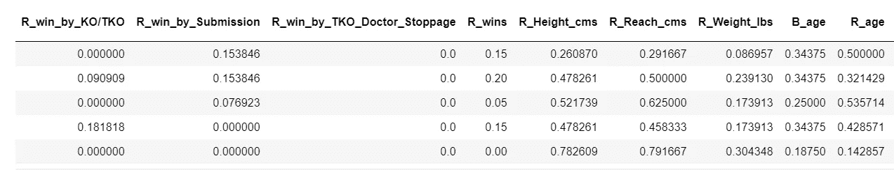
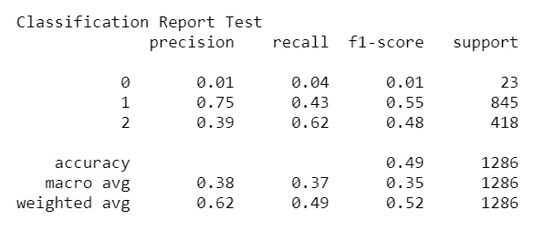
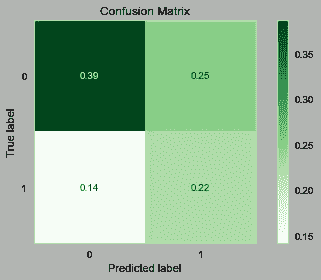
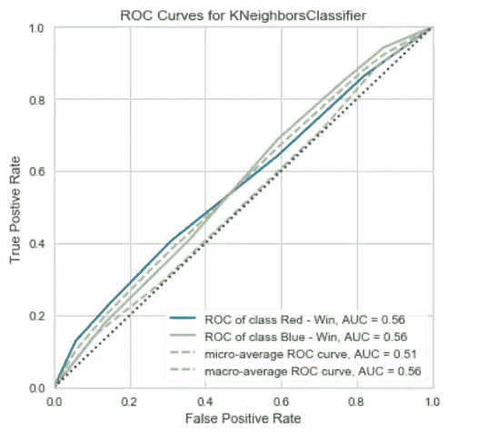
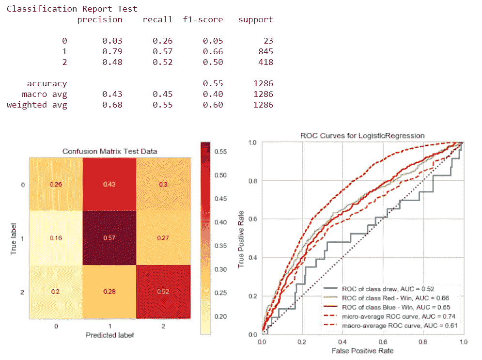

# 分类的最终功能

> 原文：<https://towardsdatascience.com/ultimate-function-for-classification-82f1fc711ab9?source=collection_archive---------34----------------------->

## 使用自定义函数评估分类器

贝勒·格拉姆林在 [Unsplash](https://unsplash.com/s/photos/fighting?utm_source=unsplash&utm_medium=referral&utm_content=creditCopyText) 上的照片

在这篇文章中，我将回顾我是如何用 Python 创建一个函数的，这个函数可以轻松地显示一个训练好的分类模型的一些性能指标。因为这个功能是作为一个更大的任务的一部分出现的，所以我将在分享我的过程的图像和代码时提供上下文来帮助澄清。我将主要使用 [Sci-Kit Learn](https://scikit-learn.org/stable/) 和 [Matplotlib](https://matplotlib.org/3.3.1/index.html) 包，但有一个来自 [Pandas](https://pandas.pydata.org/pandas-docs/stable/index.html) 绘图方法、 [Yellowbrick 的](https://www.scikit-yb.org/en/latest/index.html)分类器模块的特殊外观。

## 背景

我得到了一个简单的项目:使用预先制作的数据集来创建一个分类模型的用例，然后创建这个模型。基本上是从一张白纸开始，我面对的是一整个互联网价值的可能的数据集，作为*的一个*。最终我决定做一些与体育相关的事情，在所有我预料会遇到的运动中，我找到了一个关于终极格斗赛的。

如果你不熟悉这项运动，终极格斗锦标赛( [UFC](https://www.ufc.com/about) )是一个混合武术推广机构。混合武术，通常被称为 MMA，是一种由多种传统格斗学科非特定混合而成的格斗风格。混合格斗风格的一个很好的例子是拳手乔恩·琼斯。他从全国大专摔跤冠军到获得巴西柔术(BJJ)紫带和跆拳道黑带；跆拳道本身是 1992 年由 Greg Jackson 发展起来的一种格斗方式，使用了摔跤、BJJ、跆拳道和柔道的技术。

在 MMA 比赛中，除了在比赛方式上有更大的自由外，比赛结构通常遵循拳击或摔跤等其他格斗项目的结构。如果你对这一切是如何在更精细的层面上运作感到好奇，我推荐你阅读这个[维基百科页面](https://en.wikipedia.org/wiki/Ultimate_Fighting_Championship#Rules)上的“规则”部分。

在 21 世纪初，我是一个超级粉丝；我玩电子游戏，看表演，了解拳手，等等。如果说我对观看这些比赛有什么印象的话，那就是他们感受到的*不可预测的*。似乎直到有人被击倒或投降，无论情况如何，任何一方都有可能获胜。不管某个拳手在统计上是多么的不被看好，他们*仍然有机会获胜，并且偶尔会震惊 MMA 社区。正是这些不可预知的时刻激发了我将这个数据集用于我的项目。我想回答的大问题是:*

> **我能根据他们之前的表现预测 MMA 比赛的获胜者吗？**

## 数据集

如前所述，我在这个项目中的几个限制之一是数据集需要在我开始使用它之前已经编译好。我首先去了 Kaggle，花了很多时间查找数据集。在使用“体育”标签时，我发现了 Rajeev Warrier ( [链接](https://www.kaggle.com/rajeevw/ufcdata))发布的“*UFC-Fight 1993 年至 2019 年的历史数据*”。这个数据集有超过 5000 场比赛的大量信息，包含了比赛各个方面的 145 个特征。

有以下信息:

*   拳击手在比赛前赢/输/平的记录
*   一个拳击手赢得多场比赛的方法
*   首选战斗姿态
*   物理属性
*   战斗相关平均值

** *这些平均值处理高级统计数据，例如:重大打击、提交、地面传球等。***

## 带什么

您需要安装这些软件包才能继续操作:

*   [Sci-Kit 学习](https://scikit-learn.org/stable/)分类器和大多数指标
*   [绘图方法的 Matplotlib](https://matplotlib.org/3.3.1/index.html)
*   [熊猫](https://pandas.pydata.org/pandas-docs/stable/index.html)为标图方法
*   罗考克级的黄砖

我将根据我在 UFC 上的项目来完成这个函数的创建，尽管这个函数应该在任何为机器学习准备的干净数据集上工作。如果你需要关于如何做到这一点的任何信息和一些好的策略，请查看 Omar Elgabry 的数据清理指南([链接](/the-ultimate-guide-to-data-cleaning-3969843991d4))。

否则，为了简洁起见，我将直接跳到可以创建分类器评估函数的地方。此时，我有了数据集:

*   填充和/或删除任何缺失的数据
*   独热编码分类特征
*   数字要素的最小-最大缩放
*   训练测试分为 X 和 y 数据
*   使用 SMOTE 对训练数据进行综合重采样(修复目标类不平衡)

这里有一个*小*窥视数据帧的样子:

详细显示红角战斗机缩放信息的列

## 拟合和预测

这是容易的部分！Sci-Kit Learn 使模型适应训练数据和预测新输入变得非常简单。你需要做的就是首先实例化你选择的 Sci-Kit Learn 机器学习模型，并使用它的*。fit()* 和*。预测()*方法。

使用多类逻辑回归模型进行设置、拟合和预测

这段代码的一个独特之处是使用了`multi_class=`参数，只有当您试图预测更多的这两个类时，这个参数才有意义。在我的项目中，对于每一个拳击手，我都希望预测他们的比赛是否会以如下方式结束:

*   胜利
*   失去
*   画

这个重要的细节就是为什么我们稍后在预测结果时可视化我们的模型的性能时需要使用 Yellowbrick 包，但是现在让我们看看如何将这个过程函数化。

广义 Sci-Kit 学习分类器的拟合与预测

如果你仔细看看，这里真的没有太大的变化。变量(包括分类器本身)需要一般化，并作为必需的参数放置。但是除了为预测添加一个“返回”语句之外，这就是我需要做的全部工作！

## 获得结果

所以现在我有了一个可以预测 UFC 比赛获胜者的模型，我需要一种方法来确认它的准确性。我可以通过将输入的数据用作与地面事实相同的预测的输入来做到这一点，因为我们已经有了模型可以学习的正确结果。这就是为什么这种类型的任务被称为 [*监督学习*](https://en.wikipedia.org/wiki/Supervised_learning#:~:text=Supervised%20learning%20is%20the%20machine,a%20set%20of%20training%20examples.) 的原因，因为我们将能够调整(或监督)我们的模型如何学习，希望提高它在预测未知数据时的性能。

再一次，Sci-Kit Learn 使得一旦一个模型在一些数据上被训练，这变得非常容易。指标模块中的 [*分类报告*](https://scikit-learn.org/stable/modules/generated/sklearn.metrics.classification_report.html?highlight=classification#sklearn.metrics.classification_report) 功能可以方便用户生成四种常用的分类指标。所有需要做的就是为数据输入真实的和预测的标签来得到结果！

这是我项目中的一个例子:

K-Neighbors 分类器的分类报告示例

对于这样一个简单的实现，当试图评估分类器的性能时，Sci-Kit Learn 的分类报告带来了很多东西。它提供了聚合和单个标签级别的主要分类指标，有助于确定调整模型或解释模型性能的策略。一般来说，这些指标是:

*   精度——真实阳性与所有预测阳性*的比率*；具有高精度的模型很少预测不正确的标签，但是经常有许多*假阴性*
*   召回——真实阳性*与所有可能阳性*的比率；召回率高的模型通常会捕获许多*误报*
*   F1 分数—使用精确度和召回分数计算；用于尽量减少*假阴性*和*假阳性*
*   [准确性](https://developers.google.com/machine-learning/crash-course/classification/accuracy)—*真阳性*与所有预测的比率；简单地说，预测正确的百分比

如果这些东西看起来有点过时，你想知道更多，我推荐你看看克莱尔·刘的帖子。

## 炫耀

虽然看起来分类报告已经包含了所有的内容(实际上是这样)，但是实际上还有更多的内容可以轻松地添加到这个函数中，以帮助完善所显示的信息。接下来我将展示如何创建一个*混淆矩阵*和一个 *ROC 曲线*，然后将它们放入一个函数中。

***混淆矩阵***

混淆矩阵是可视化分类模型性能的一个很好的工具。简而言之，它是一个分成小方块的正方形，这些小方块除了表示真阴性和假阴性之外，还表示真阳性和假阳性的值。视觉上更容易理解:

二元分类器的示例混淆矩阵

从左上角开始，沿对角线向下，这些值代表*真值*；或者，它们是该特定类别的召回值。关于他们的更多信息可以在 Sarang Narkhede ( [链接](/understanding-confusion-matrix-a9ad42dcfd62))的帖子中找到。

由于 Sci-Kit Learn，混淆矩阵也很容易实现，以下是实现方法:

***大鹏曲线***

我添加到函数中的第二个图有点高级，但是可以在评估模型性能时提供一些有趣的见解。ROC ( [接收器工作特性](https://en.wikipedia.org/wiki/Receiver_operating_characteristic))曲线，简单来说，说明了*真阳性率* (TPR)和*假阳性率* (FPR)之间的权衡。如果你想更深入地了解这些比率背后的数学，维基百科[做了一个密集但很棒的工作来详述这些公式。](https://en.wikipedia.org/wiki/Sensitivity_and_specificity)

理想的 ROC 曲线看起来像一个更平滑、倾斜的倒“L”型。希望这在看完一个之后会更有意义:

ROC 曲线示例(不良表现)

上面的例子来自我在项目期间测试的一个性能较差的模型。代表每个类别的 TPR 和 FPR 的两条线相对靠近黑色虚线；这条黑线代表“随机机会”线，其中正确的机会基本上是 50%。因此，这个模型并不比抛硬币选择哪个战士会赢好多少。理想的 ROC 曲线应该有一个比 FPR 增长更快的 TPR，这导致了我所说的倒“L”形。

通常，如果一个人正在训练一个二元分类模型，这个图可以使用 Sci-Kit Learn 生成。然而，因为我预测了三个不同的类，所以我将展示如何使用允许多类曲线的 Yellowbrick 包创建 ROC 曲线(不需要指定任何一个)。

我是这样做的:

黄砖 ROC 曲线的单一实现

## 包装它

现在是时候把上面的所有代码放到一个可重用的函数中了，这个函数可以在一行代码中产生前面讨论过的所有内容！

我会一步一步地分解它:

1.  拟合模型并创建预测
2.  使用预测生成分类报告
3.  为绘图创建图形和轴
4.  生成并格式化混淆矩阵
5.  生成和风格化 ROC 曲线
6.  显示绘图
7.  返回预测

开始了。(马里奥的声音):

先前章节的功能化版本

> 附注:在第 48 行，我使用了一个名为 *plot_importance()* 的自定义函数。作为一个附件，它的目的是作为一个选项显示一个只与决策树分类模型相关的附加图。[更多关于特征重要性的信息](https://www.scikit-yb.org/en/latest/api/model_selection/importances.html)；[代号为*【剧情 _ 重要性()*](https://gist.github.com/dfuller22/a9827d49ecda72240b084552a8cf7c88) *。*

这是一个输出结果的例子:

根据 UFC 数据训练的标准逻辑回归示例

## 现在怎么办？

因此，如果您一直在跟进，您应该有一个功能完整的函数*函数*，它将很容易地显示一个总报告和两个关于监督分类模型性能的图。通过使用该函数，可以快速评估模型学习训练数据的程度；在比这三个工具单独提供的更深的层次上这样做。当选择一个分类器在特定数据集上进行训练时，我打算将这个函数用作多个分类器的一个评判标准，并作为一种在调优过程中提供洞察力的方式。我很想知道它的其他用途是什么，或者被改变了(请告诉我！).

当然，为了创建这个函数，确实需要做一些准备，但是总体来说，在这个项目中使用它节省了我很多时间。我希望它能为其他人做同样的事情！

[链接到 UFC 分类项目](https://github.com/dfuller22/dsc-mod-3-project-v2-1-online-ds-pt-100719)