# 强化学习终极指南第 2 部分——培训

> 原文：<https://towardsdatascience.com/ultimate-guide-for-ai-game-creation-part-2-training-e252108dfbd1?source=collection_archive---------7----------------------->

在这个全面的文章系列中，我们将构建自己的环境。稍后，我们将使用强化学习来训练一个神经网络。最后，我们将创建一个视频，展示人工智能在环境中的表现。

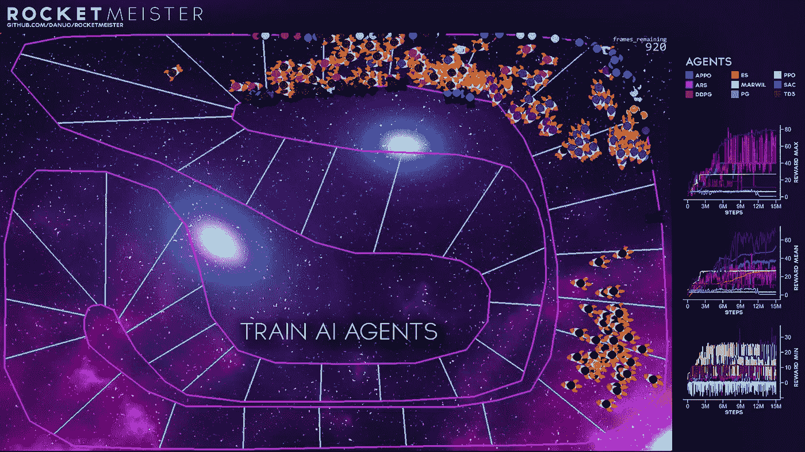

环境、培训和展示的完整代码可以在 https://github.com/danuo/rocket-meister/的 **GitHub** : [上找到](https://github.com/danuo/rocket-meister/)

# 我们将涵盖的内容:

## 第 1 部分——用 Pygame 创建一个可玩的环境

链接:[https://medium . com/@ d . brummer loh/ultimate-guide-for-reinforced-learning-part-1-creating-a-game-956 f1 F2 b 0 a 91](https://medium.com/@d.brummerloh/ultimate-guide-for-reinforced-learning-part-1-creating-a-game-956f1f2b0a91)

*   创造一个健身房的环境。Env 子类。
*   通过`step()`函数实现环境逻辑。
*   用 **Pygame** 获取用户输入，使环境适合人类玩。
*   用 **Pygame** 实现一个`render()`函数来可视化环境状态。
*   用 **Matplotlib** 实现交互级设计。

## 第 2 部分—开始培训

*   在理解可能性和挑战的同时，定义合适的观察。
*   定义合适的奖励。
*   用`gym`环境训练神经网络。
*   对结果的讨论

这是该系列的第二部分，涵盖了神经网络的训练。在我们开始训练之前，我们必须进一步指定环境和人工智能之间的 API。

## 要求

由于我们要训练的模型相对较小，因此可以在合理的时间内(不到一天)在消费级桌面 CPU 上进行训练。你不需要一个强大的 GPU 或访问云计算网络。本指南中使用的 python 包如下所示:

```
**Python** 3.8.x
**ray 1.0**
**tensorflow** 2.3.1
**tensorflow-probability** 0.11
**gym 0.17.3
pygame 2.0.0**
```

# 观察

观察是从环境反馈给代理或神经网络的反馈。这真的是唯一的事情，代理可以看到，以推导出它的下一步行动。更重要的是，代理没有记忆。它的决定将完全基于对当前状态的观察。

定义合适的观察对于获得良好的培训效果至关重要。在我们当前的例子中，定义观察可能是一个微不足道的任务，但是我们将探索几个选项。这可能不是其他机器学习项目的情况，在其他机器学习项目中，开发合适的观测值可能是一项具有挑战性的关键任务。

在我们讨论合适的观测的要求之前，让我们先用最直观的方法来研究:由于火箭不会撞向边界，使用间隙作为观测是有意义的。所以我们计算了各种角度下火箭与环境的距离(-90，-60，...，+90)，如下图所示。

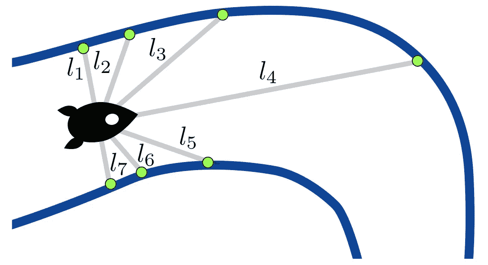

**归一化**现在，我们需要确定每个观测值的取值范围是[-1，1]。这个过程称为规范化，不是强制性的。但是，大多数神经网络将受益于标准化值。这是因为大多数神经网络在计算结束时都有一个反正切函数。在这种情况下，归一化值范围在数值上更合适。

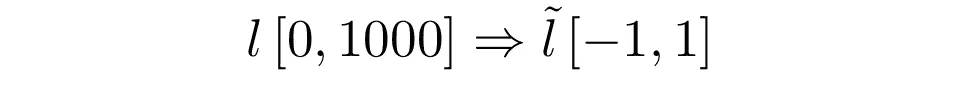

观察的标准化。

实现标准化的一种方法是应用线性插值。实现这一点的简单方法是使用下面的 numpy 函数:

```
obs_norm = np.interp(obs, [0, 1000], [-1, 1])
```

**观察值的唯一性**用数学术语来说，把模型想象成一个确定性函数 *f* ，它根据观察值*【o】计算动作*【a】*。*在本例中，有 *n 个*观察值和 2 个动作:

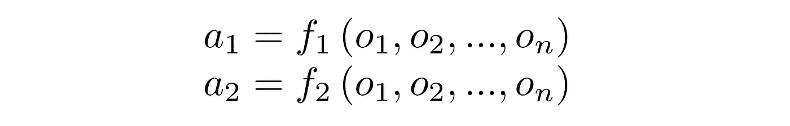

这里有很多理论要探讨，但重要的含义如下:如果两种不同的情况或状态需要两种不同的行动才能成功，那么它们各自的观察也必须不同。只有当观察结果不同时，代理才能产生两种不同的动作。那么这到底意味着什么呢？让我们来看一个例子:

下图中显示的两个场景显示火箭处于完全相同的位置。因此，距离[l1，…，l7](观察值)是相同的。然而，左边场景中的火箭速度要高得多。因为速度不是观测的一部分，代理人不知道火箭太快了。

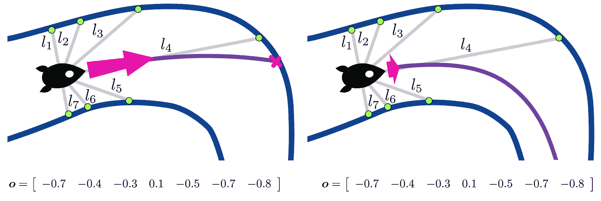

具有相同观测值的不同状态(观测值集 7)

要执行的适当行动分别是:

*   左图:减速，右转。
*   右场景:增加/保持速度，右转。

由于对两种情况的观察是相同的，神经网络将不可避免地对两种情况执行相同的动作。因此，它根本无法在两种情况下执行适当的操作，最多只能完成其中一种。因此，单独使用距离作为整个观测值 o=[l1，…，l7]不是一个好主意。出于测试的目的，我们将把它作为观测的第一次迭代。

**观测值 o7 的第一次迭代:**

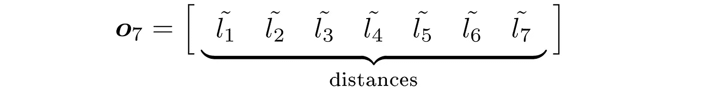

接下来，我们将扩展这个集合。从最近的考虑中，我们已经得出结论，神经网络需要知道火箭的速度。因此，速度大小将起作用:

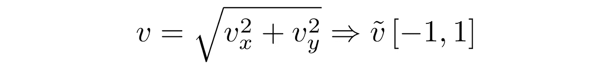

**观测值 o8 的第二次迭代:**

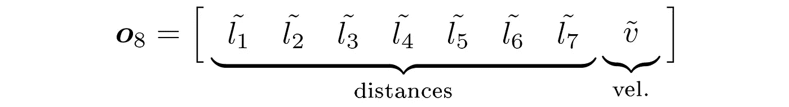

然而，我们可以很容易地想出两个场景，这两个场景需要不同的操作，尽管产生了相同的观察结果。速度转向的方向不能从这组观测值中扣除。因此，移动方向未知，需要另一次观察。

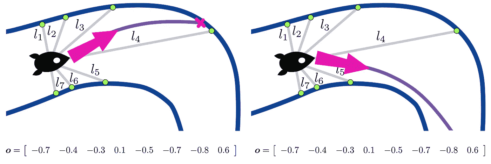

具有相同观测值的不同状态(观测值集 8)

显然，我们需要使观测范围内的速度有方向。作为一个小注释，简单地分别传递 x 和 y 方向的速度是行不通的。火箭的绝对方位也不知道，所以这个问题可以简单地转换成另一个问题。因此，建议将火箭方向与其速度之间的相对角度作为附加观测值:

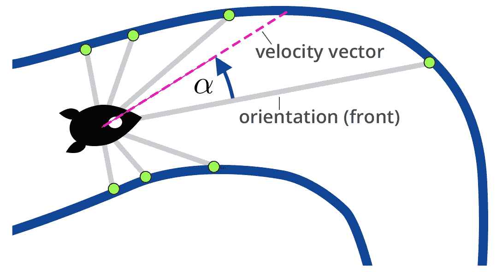

使用角度有点棘手。首先我们需要决定是要有度的工作还是要光芒四射的工作。其次，如果角度不在-180°范围内< α

**第三次迭代观测 o9:**

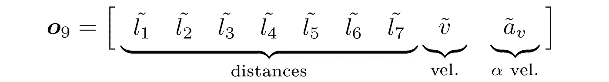

最后但同样重要的是，我们将提供某种导航辅助。对于奖励功能，我们稍后将沿着轨迹定义目标，当达到时将获得奖励。下一个目标的方向是垂直于下一个目标的向量，因此指示到所述目标的直接路线。火箭方向和目标向量之间的角度差是第 10 次也是最后一次观察:

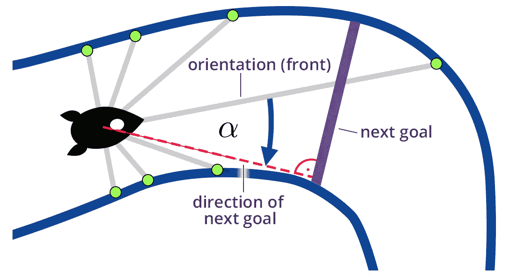

**第四次迭代观测 o10:**

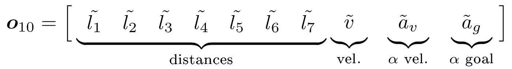

在我们评估不同组的观察值之前，请记住，神经网络不知道已定义观察值的含义或上下文。然而，也不尽然。机器学习的目标是找到观察和成功行动之间的数字相关性。对于这一点，数据的上下文无关紧要。

## 对观察结果的评估

所有四种变体都已经通过用 SAC 代理进行总共 200 万步的训练进行了测试。不要担心，我们稍后将经历开始培训的步骤。现在，让我们先看看观测值的选择所导致的后果。通过查看图表，我们可以看到 *o9* & *o10* 比其他两个表现好得多。设置 *o9* 产生最好的结果，这是一个小惊喜。然而，我们不应急于下结论，并记住以下几点:首先，200 万步并不多。虽然 *o7* 和 *o8* 的曲线看似收敛，但本试验无法确定 *o9* 和 *o10* 的最终性能。经过更长时间的训练， *o10* 很有可能超过 *o9* 。甚至 *o7* 和 *o8* 的停滞都不确定。如果这不是一个有趣的项目，更长时间的训练应该被考虑。

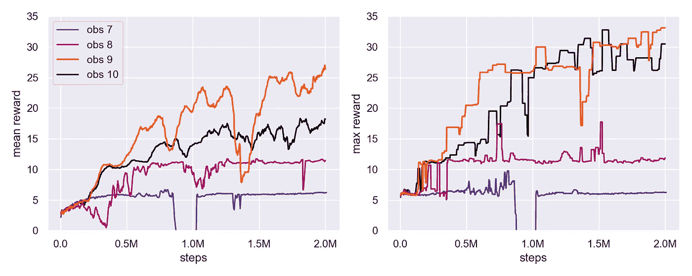

四组不同观察值之间的性能比较。

# 奖励函数

如前所述，奖励功能是环境的一部分，据说在强化学习中被代理人最大化。想出一个好的奖励函数比你想象的要难得多。当最大化奖励函数并不完全符合你实际上想要 AI 做的事情时，问题就出现了。拥有一个只重视符合你意图的行为的奖励功能，实际上比预期的要困难得多。

Rob Miles [Youtube]有一个非常好的视频，讲述了一个被设计用来收集邮票的人工智能，它可能会在收集邮票的过程中引发一场世界大战。该视频非常有趣，同时也很有见地。

回到奖励函数的定义:假设我们在更高的速度下给予更多的奖励。预测代理最有可能以尽可能高的速度撞上墙并不需要太多的创造力。当然，一个更慢的轨迹，实际上是穿过整个过程，会产生更高的总回报。然而，放弃目前最成功的策略，探索一种完全不同的方法，总是令人乏味的。在数学术语中，给定的高速碰撞进近是所有可能进近空间中的局部最大值。

摆脱局部极值并进一步优化其策略是智能体的基本能力。但是，不能保证代理真的做到了这一点。因此，明智的做法是不要在奖励函数中包含速度，或者不给它很大的权重，这样就不会产生这种障碍。相反，我们选择设立检查站，在通过时给予奖励。

## 设置检查点

为了计算奖励，我在赛道上一共设置了 40 个检查站。这是一种跟踪赛道进展的简单方法，也可以计算完成的圈数。

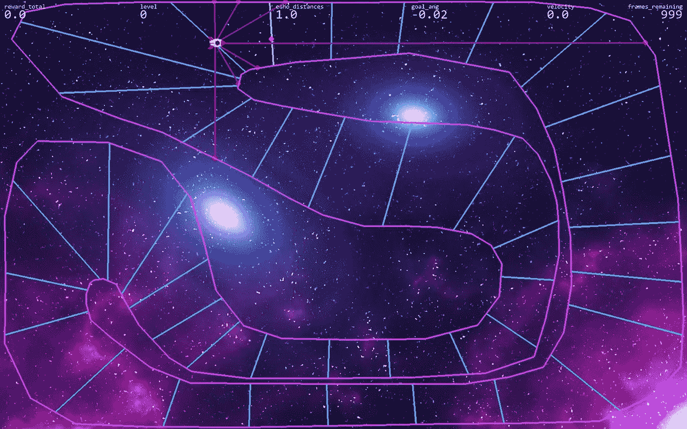

此外，我们提出了三个变量来推断火箭通过的检查站的回报。变量如下所列，并在之后进行比较:

## 变体 1:每个关卡的静态奖励

静态变量将以固定的数量奖励每个到达的检查点。

```
# for each goal 1 point
reward_total += 1
```

## 变体 2:每个关卡的动态奖励

动态变量将奖励每一个达到略低于一点的关卡。到达下一个关卡花费的时间越长，奖励的一分被扣除的就越多。根据所用时间的不同，奖励在 1 到 0.9 分之间不等。变量 **steps** 保存自达到最后一个目标以来执行的步数。这个变量间接依赖于火箭的速度。

```
# for each goal give:
reward_total += max(1, (500 - steps)) / 500
```

## 变体 3:对每个目标的持续奖励

类似于变体 1，这种连续变体将奖励每个目标恰好一分。但是，在执行的每一步中，奖励都是连续分配的。如果火箭正好位于目标 3 和目标 4 之间，那么到目前为止获得的总奖励是 3.5 分。后退时，奖励分别减少。这个奖励变量的计算相当繁琐，但是可以看看 GitHub 库中的代码。

## 比较

正如我们所看到的，在长时间的训练之后，所有的奖励函数都给出了相似的好结果。所有的变化都会产生一个神经网络，它可以相当好地完成课程。这并不奇怪，因为这些奖励函数非常相似。我们可以看到，在很大一部分训练中，有动态奖励的训练有更高的平均奖励。

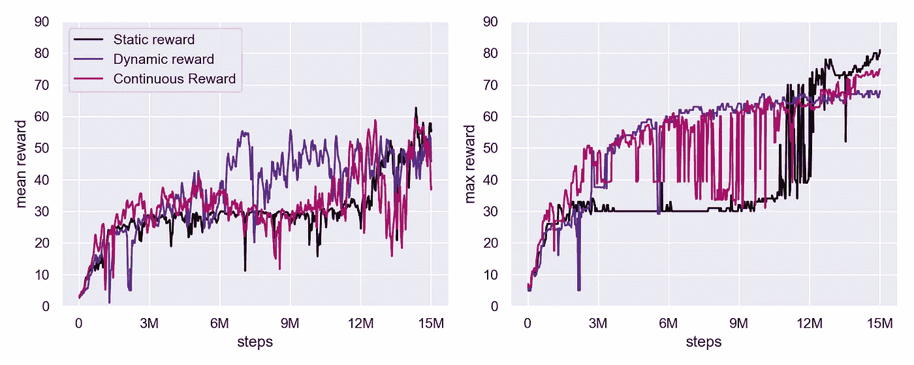

# 培养

为了在我们的环境中训练神经网络，我们将使用**强化学习(RL)，机器学习的领域之一**。虽然有很多方法可以部署 RL，但是我们将使用一个叫做 **Ray** 的框架。

Ray 的核心功能是提供一个多处理框架，允许代码在多个 CPU 核心甚至多个机器上并行运行。这非常有帮助，因为它使我们能够同时用多个代理/环境来训练我们的神经网络。Ray 还包含了一个强化学习库，因此我们可以在很少甚至没有编程的情况下进行训练。我们只需要知道 API，不可否认的是，它很少被记录，而且有时很复杂。

## 在 Windows 10、OSX 和 Linux 上安装 Ray

Ray 刚刚发布了 1.0 版本，终于添加了期待已久的 Windows 10 支持。现在，您可以通过运行简单的 pip 安装在任何主要平台上安装 Ray:

```
pip install --upgrade ray
```

## 雷入门

我们使用 Ray 的主要原因是包含了专用于 RL 的库 **RLlib** 。它实现了大量先进的机器学习代理。正如下面的概述所示，大多数代理都支持 TensorFlow 2 和 Pytorch。你想用哪个框架完全取决于你。如果你不确定，就用 TensorFlow。


RLlib 提供的机器学习代理。

ray 的伟大之处在于已经实现了许多训练代理，并且所有的代理都可以以相同的方式使用。这使得我们可以用 14 个不同的代理来训练网络，只需要在它们之间改变一个字符串。

Ray 的文档可能有点令人不知所措，并且由于普遍缺乏示例而令人困惑。尽管如此，这个库非常强大，完全值得学习，因为繁琐的任务可以通过少量的步骤来完成。如果我们使用算法 **PPO** 在健身房环境 **CartPole-v0** 上开始训练，我们所要做的就是执行这两行代码:

```
from ray import tune
tune.run('PPO', config={"env": "CartPole-v0"})
```

如果您遇到一个错误，您很可能会丢失包`tensorflow-probability`包。要安装，请运行:

```
pip install --upgrade tensorflow-probability
```

为了在一个定制的环境中训练网络(例如，一个不属于`gym`包的环境),我们需要在配置字典中修改 env 关键字。我们可以传递环境类，而不是环境的名称字符串。参考见 **start_ray_training.py:** 中的代码

[https://github . com/danuo/rocket-meister/blob/master/start _ ray _ training . py](https://github.com/danuo/rocket-meister/blob/master/start_ray_training.py)

# 结果

最终，9 个不同的代理被用来训练不同的神经网络。并不是前面列出的所有代理都可以被使用，因为一些代理经常崩溃，而另一些代理只适合于不连续的动作(记住，我们使用的是连续动作)。以下是培训的结果:

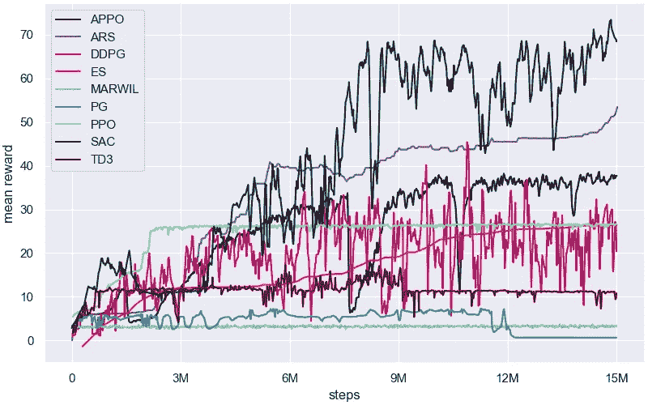

我们看到一些代理人表现很好，比人类更好地通过了课程。还要记住，所有代理都是未调整的，也就是说，它们使用默认参数运行。当选择其他参数时，它们的性能可能会提高很多。

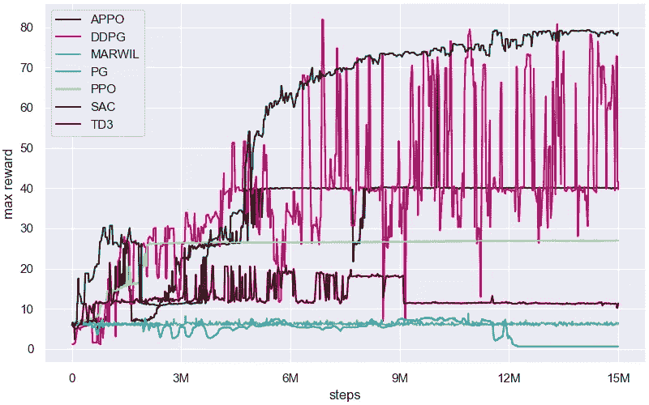

# 结论

还有其他一些因素使得很难在两种药物之间进行直接比较。在这个测试场景中，每个代理接受了总共 1500 万步的训练。请注意，并非所有代理的计算速度都一样快。如果我每次训练的时间相同，结果可能会不同。此外，对于大多数代理来说，培训可能不一致，因此更长时间的培训可以进一步改进策略。快速学习代理是伟大的，但有人可能会说，长期训练后的最终表现可能更重要。

另外请注意，SAC 并不像测试中显示的那样优越。SAC 代理的得分明显高于其他代理。然而，人们不得不相信，这些有争议的伟大成果是受制于过度拟合。这意味着，代理人实际上记住了轨道，而不是实际学习如何控制火箭。如果环境被改变，代理人被认为是失败的，因为没有在未知环境中机动的一般知识。为了防止过度拟合，训练应该在动态环境中进行，在每次迭代中都会发生变化。rocketmeister 环境有一个级别生成器，也许你想尝试一下！有关更多信息，请查看自述文件:

[](https://github.com/danuo/rocket-meister) [## 达诺/火箭-梅斯特

### RocketMeister 是一个广泛而复杂的健身房环境，用于开发和比较强化学习…

github.com](https://github.com/danuo/rocket-meister) 

**感谢阅读！**