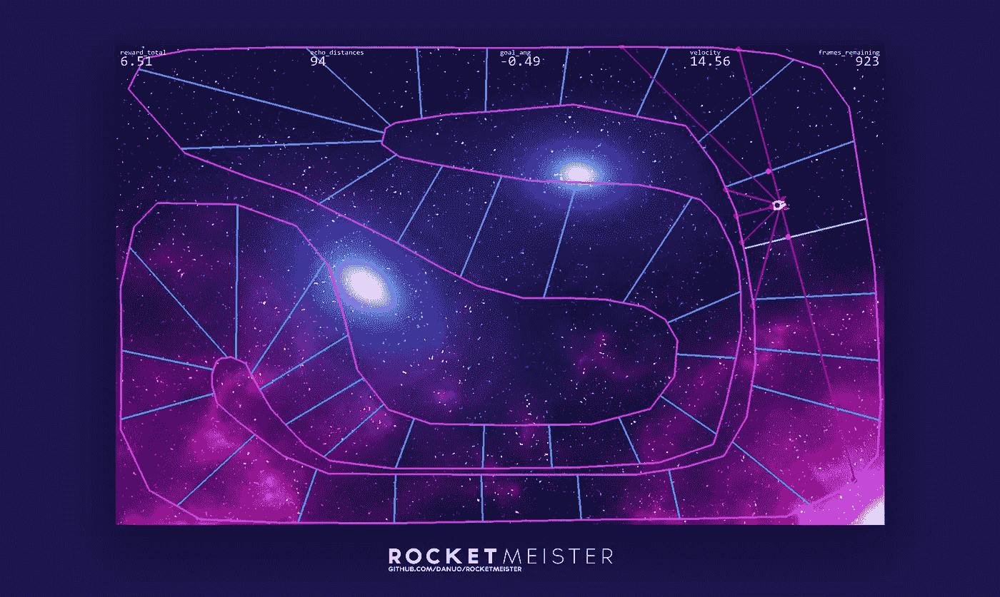
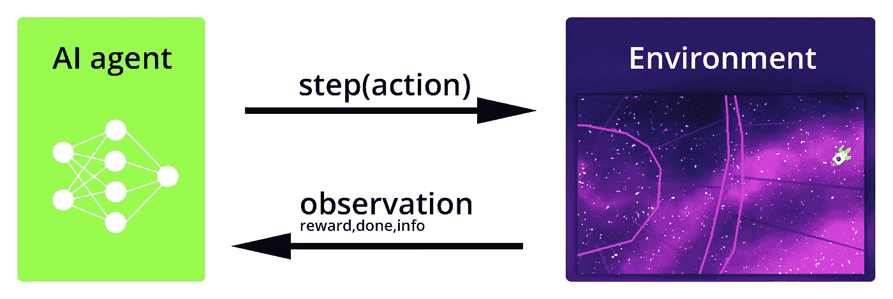

# 强化学习终极指南第 1 部分——创建游戏

> 原文：<https://towardsdatascience.com/ultimate-guide-for-reinforced-learning-part-1-creating-a-game-956f1f2b0a91?source=collection_archive---------5----------------------->

## [入门](https://towardsdatascience.com/tagged/getting-started)

## 在这个全面的文章系列中，我们将构建自己的环境。稍后，我们将使用强化学习来训练一个神经网络。最后，我们将创建一个视频，展示人工智能播放环境。



环境、培训和展示的完整代码可以在**GitHub**:[https://github.com/danuo/rocket-meister/](https://github.com/danuo/rocket-meister/)上找到

# 我们将涵盖的内容:

**第 1 部分——用 *Pygame*** 创建一个可玩的环境

*   创造一个环境作为**健身房。Env** 子类。
*   通过`step()`函数实现环境逻辑。
*   用 **Pygame** 获取用户输入，使环境适合人类玩。
*   用 **Pygame** 实现一个`render()`函数来可视化环境状态。
*   用 **Matplotlib** 实现交互级设计。

**第 2 部分——用强化学习训练神经网络**

[https://medium . com/@ d . brummer loh/ultimate-guide-for-ai-game-creation-part-2-training-e 252108 DFB D1](https://medium.com/@d.brummerloh/ultimate-guide-for-ai-game-creation-part-2-training-e252108dfbd1)

*   在理解可能性和挑战的同时，定义合适的观察。
*   定义合适的奖励。
*   用`gym`环境训练神经网络。
*   对结果的讨论

这是这个系列的第一部分。我们将实现游戏逻辑，为控件获取用户输入数据，并实现渲染，使人类有可能玩游戏。为此，我们将使用一个叫做 *Pygame* 的流行 python 包。

## 要求

由于我们要训练的模型相对较小，因此可以在合理的时间内(不到一天)在消费级桌面 CPU 上进行训练。你不需要一个强大的 GPU 或访问云计算网络。本指南中使用的 python 包如下所示:

```
**Python** 3.8.x
**ray 1.0**
**tensorflow** 2.3.1
**tensorflow-probability** 0.11
**gym 0.17.3
pygame 2.0.0**
```

# 环境

在强化学习的背景下，环境可以被看作是一个互动的问题，需要以最好的方式来解决。



代理与环境的相互作用。

为了量化成功，在环境中定义了一个奖励函数。代理可以看到所谓的观察，这些观察给出了关于环境当前状态的信息。然后，它可以采取特定的行动，返回观察结果和下一个环境状态的标量奖励。代理人的目标是在有限的步骤中获得最大的回报。

从技术角度来看，有许多不同的方式来构建环境。不过最好的方法是采用`gym`包中定义的结构。`gym`包是一个现成环境的集合，为强化学习提供了事实上的标准 API。所有的`gym`环境共享相同的函数和变量名称，这使得环境和代理很容易互换。为了采用`gym`结构，我们将使我们的环境成为**体育馆的子类。Env** 类。该类的基本和强制元素如下所示:

这些函数和变量中的大部分将在后面进行更深入的讨论。下面是一个简短的总结，首先列出了最重要的项目:

*   **动作(对象):**在`step()`功能中要执行的动作。在国际象棋比赛中，这个动作是由一个玩家执行的特定的、合法的移动。
*   **观察(对象):**这是可供代理选择下一个动作的所有信息。该观察仅基于环境的当前状态。
*   **奖励(浮动):**分别是上一次执行动作或上一步得到的奖励。人工智能将试图最大化总回报。回报也可能是负的。
*   **done (boolean):** 如果设置为 true，则环境到达终点。无法执行更多操作，需要重置环境。
*   **info (dict):** 允许提取环境数据用于调试目的。数据对代理不可见。
*   **env_config(dict):** 这个可选的字典可以用来配置环境。
*   **观察 _ 空间和行动 _ 空间:**正如你所想象的，对于特定的环境，只有某些行动和观察是有效的。为了定义格式，需要将`observation_space`和`action_space`变量分配给各自的 **gym.space** 类。空间可以有不同的维度和值范围。连续空间和离散空间都是可能的。有关健身房空间的更多信息，请查看[文档](http://gym.openai.com/docs/#spaces)和[健身房 GitHub](https://github.com/openai/gym/tree/master/gym/spaces) 。

```
self.observation_space = <gym.space>
self.action_space = <gym.space>
```

## 示例:动作空间的定义

正如在视频中看到的，我们想要控制一个可以向前/向后加速(动作 1)和向左/向右旋转(动作 2)的火箭。因此，我们将动作定义为大小为 2 的线性向量。


每个数组单元格的值都是连续的，并且必须在[-1，1]的范围内。相应的健身房空间在下面一行代码中定义:

```
gym.spaces.Box(low=-1., high=1., shape=(2,), dtype=np.float32)
```

# Pygame 实现

`Pygame`是一个为创建简单游戏而设计的 Python 库。主要特性是 2d 渲染能力、用户输入采集和音频输出选项。下一节将介绍一个非常基本的`Pygame`实现，只包含最少的功能。如果你更有野心，你可以考虑实现动态帧速率或动态分辨率等功能。

## 翻译

为了在 Pygame 中渲染，我们需要创建一个窗口(也称为表面)来绘制视觉输出。

```
window = pygame.display.set_mode((window_width, window_height))
```

接下来，我们可以为创建的窗口排队 draw 调用。你可以在 [Pygame 纪录片](https://www.pygame.org/docs/ref/draw.html)中找到可用抽奖呼叫的概述。我们将在添加到我们的 **CustomEnv** 类的新函数中实现几个示例性的绘制调用。该函数名为 **render()** ，如下所示:

在进行绘制调用后，需要用`pygame.display.update()`命令更新并实际呈现窗口。

## 基本渲染循环

现在是时候通过创建一个渲染循环例程来让我们的环境保持运行了。我们用`pygame.init()`初始化 Pygame，然后创建一个时钟对象，它可以与`tick(fps)`一起保持静态帧速率。我们为视觉输出创建一个大小为 1000*500 像素的窗口。然后我们开始一个 while 循环，在用`update()`生成一帧之前，执行一次`step()`和`render()`**。显然，这个渲染循环只有在`render()`实际上反映了`step()`引起的变化时才有意义。**

## **用户输入**

**Pygame 提供了两种从键盘获取用户输入数据的方法:**

*   **第一个名为 **pygame.event.get()** 和**将在按键状态从未按下变为按下**时生成一个事件，反之亦然。其他事情，比如关闭 Pygame 窗口，也会创建一个事件。后者(`event.type == pygame.QUIT`)使我们能够在不崩溃的情况下结束 while 循环和 Python 脚本。在 [Pygame 文档](https://www.pygame.org/docs/ref/key.html)中可以找到密钥常量列表。**

*   **第二个方法叫做**py game . key . get _ pressed()**和**将返回一个布尔类型的元组，每个条目代表键盘上的一个键。**未按下的键的值为 0，按下的键的值为 1。为了评估键状态，我们需要知道哪些键映射到元组的哪个索引。例如，向上箭头键位于索引 273 处。**

## **运动学**

**接下来，我们将实现火箭的运动学。当我们用一个简单的方法来处理旋转时，平移运动将有惯性。数学上，火箭的轨迹就是运动方程的解，是平滑的。位置不能跳，反而需要不断变化。**

****

**因为我们对近似解很满意，所以我们可以用欧拉向前法进行时间离散来计算轨迹。下面的代码显示了一个简单的二维实现:**

**现在我们将所有东西(游戏逻辑、输入和渲染)合并到我们之前定义的`CustomEnv`类中。我们还将把所有与 Pygame 相关的东西移到`render()`和一个单独的`init()`函数中。这样，我们可以用`step()`和`reset()`执行机器学习例程，而不用加载更重的 Pygame 包。如果为 AI 训练加载了环境，则不需要渲染，并且可以提高性能。**

**下面是上面运行的代码，带有一些键盘输入:**

## **水平设计**

**现在，我们将使用手动创建的静态级别。创建一个可能是一项单调乏味的任务。我们将使用 Matplotlib 让我们的生活变得更简单。使用 **plt.ginput()** 函数，可以通过在图形内部点击来获取坐标。**

**这些坐标将被打印到控制台中，您可以从那里将它们复制到您的代码中。稍微重新格式化应该可以将它们包含到我们的环境中，例如将它们存储在 numpy 数组中，如`rocket_gym.py`所示。**

****碰撞检测****

**假设我们将级别边界存储为大小为 n*4 的数组，每行保存一个段的点:**

**两条直线是否相交可以通过下面的函数来检查。如果线相交，则返回交点的坐标。如果没有交集，则不返回任何交集。**

**现在，我们可以将公式应用于我们的问题。我们通过检查是否有任何环境边界与运动向量相交来做到这一点**

## **继续第 2 部分**

**在第二部分中，我们将讨论并实现环境返回的观察和奖励。之后，进行实际训练。请在这里阅读:**

**[https://medium . com/@ d . brummer loh/ultimate-guide-for-ai-game-creation-part-2-training-e 252108 DFB D1](https://medium.com/@d.brummerloh/ultimate-guide-for-ai-game-creation-part-2-training-e252108dfbd1)**