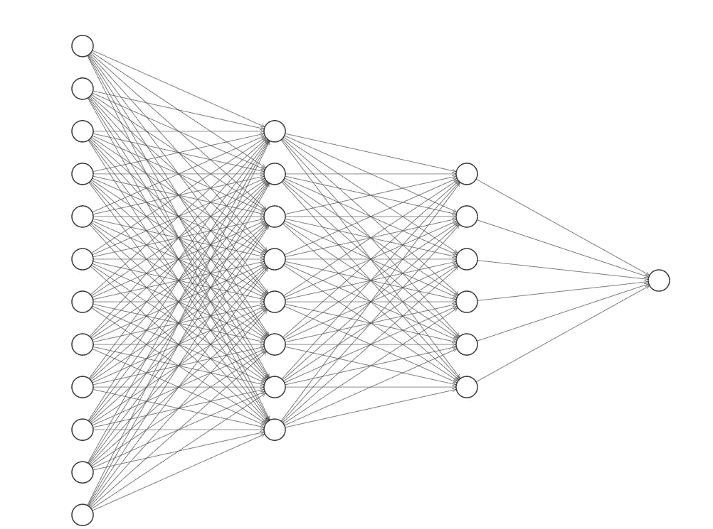
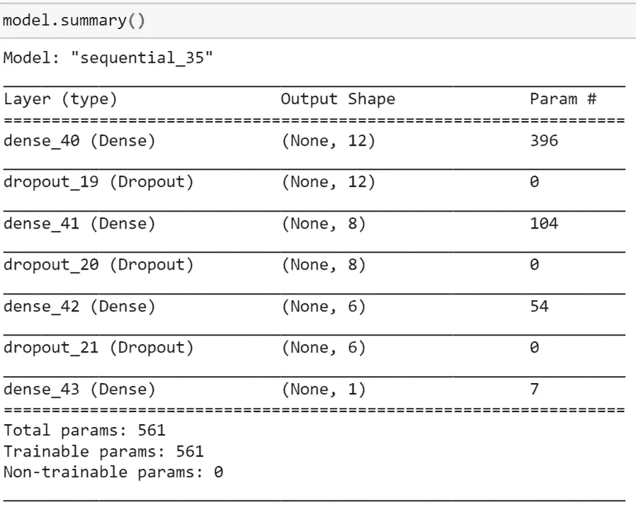
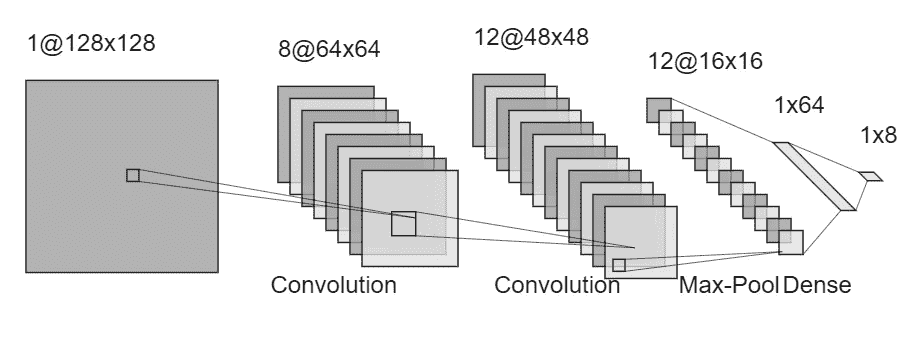
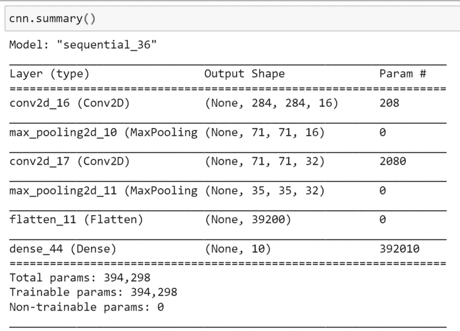
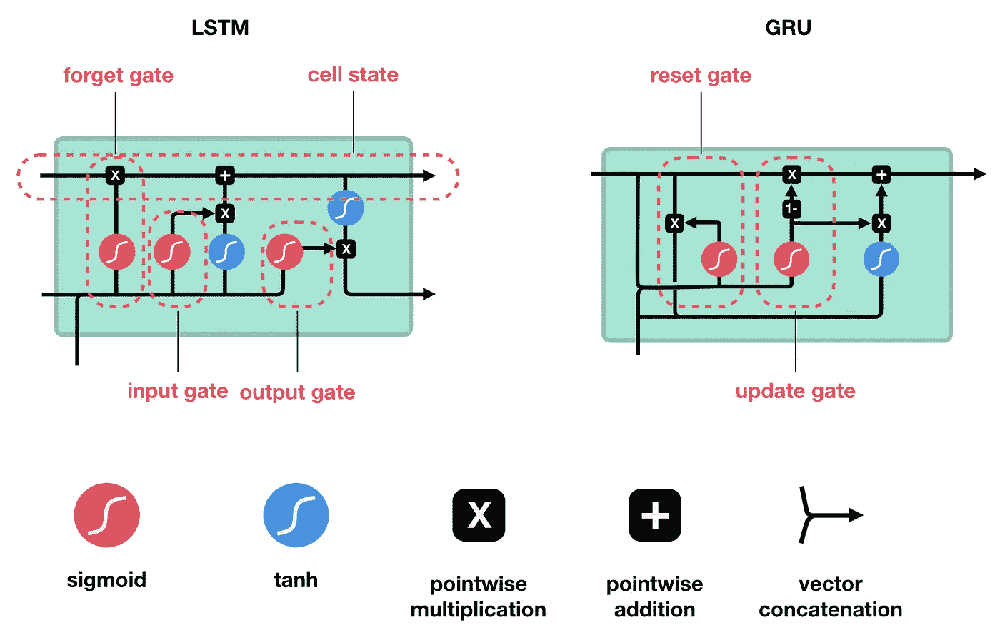
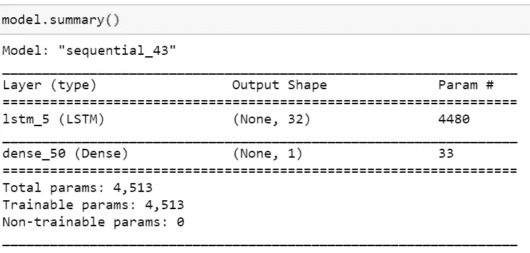

# 神经网络中输入形状和模型复杂性的最终指南

> 原文：<https://towardsdatascience.com/ultimate-guide-to-input-shape-and-model-complexity-in-neural-networks-ae665c728f4b?source=collection_archive---------3----------------------->

## 计算神经网络输入形状和复杂性的直观指南

在构建神经网络时，许多初学者和非初学者似乎都陷入了计算需要输入到神经网络中的输入形状的困境。

***但是我们为什么要知道输入的形状，又为什么要喂它呢？神经网络不能自己算出来吗？*** *这个问题的答案在于矩阵乘法的基础知识。*

假设我们有两个矩阵 A 和 B，设 B 的维数为 m 行 x n 列。现在，为了使两个矩阵在乘法上兼容，A 的列维度应该与 b 的行维度相同，这意味着 A 的维数应该是 k x m，其中 k 可以是任何数字。

现在，图片 A 作为输入张量(一组图像、一组输入特征样本、特定词汇大小的文本数据等)。)和 B 作为神经网络中的第一个隐藏层。k 是输入样本的数量，m 是每个输入样本的维数。m 的形状取决于输入的类型和隐藏层的类型。

## 让我们来看看最常用的神经网络类型，并弄清楚输入形状应该是什么:

1.  ***(DNN)深度神经网络:***



一个 4 层神经网络(承蒙:[http://alexlenail.me/NN-SVG/index.html](http://alexlenail.me/NN-SVG/index.html))

这些是用于分类和回归任务的完全连接的神经网络。这些有时也会附加到某些更高级架构的末端( [ResNet50](https://iq.opengenus.org/resnet50-architecture/) 、 [VGG16](https://neurohive.io/en/popular-networks/vgg16/) 、 [AlexNet](https://www.learnopencv.com/understanding-alexnet/#:~:text=AlexNet%20Architecture,two%20GTX%20580%203GB%20GPUs.&text=AlexNet%20consists%20of%205%20Convolutional%20Layers%20and%203%20Fully%20Connected%20Layers.) 等)。)

让我们看一个这样的神经网络:

```
model = Sequential()
model.add(Dense(units=12, activation='relu', input_shape=(32,)))
model.add(Dropout(0.5))
model.add(Dense(units=8, activation='relu'))
model.add(Dropout(0.5))
model.add(Dense(units=6, activation='relu'))
model.add(Dropout(0.5))
model.add(Dense(units=1, activation='softmax'))
```

该模型由三个隐藏层和一个输入层组成。在每对致密层之间添加脱落层，以实现规整化。Dropout 层采用参数“rate ”,该参数指定前一密集层中应取零值的神经元的比例。在这个模型中，比率设置为 0.5，这意味着隐藏层中 50%的神经元的权重为 0。

在 Keras 中，需要给出输入维度，不包括批量大小(样本数)。在这个神经网络中，输入形状被给定为(32，)。32 是指每个输入样本中的特征数量。不要提批量大小，甚至可以给出一个占位符。另一种给出上述模型中输入维度的方法是(None，32，)。

如果数据是多维的，比如图像数据，那么输入数据必须以(m，n)的形式给出，其中 m 是高度维度，n 是宽度维度。

因为 32 是特征大小，所以它是输入矩阵的列维数。这意味着隐藏层的行尺寸也是 32。现在我们已经对输入游戏进行了分类，让我们看看这个模型并理解它的复杂性。这里，复杂性是指可训练参数的数量(权重和偏差参数)。可训练参数的数量越多，模型越复杂。



深度神经网络模型综述

> 由于每个输入特征都连接到隐藏层中的每个神经元，因此连接总数是输入特征大小(m)和隐藏层大小(n)的乘积。由于每个连接与一个权重参数相关联，权重参数的数量为 m×n。每个输出神经元与一个偏置参数相关联，因此偏置参数的数量为 n。**可训练参数的总数= m×n+n**

第一密/隐层有 12 个神经元，这是它的输出维度。这在模型摘要中作为第二个输出参数出现，与第一个隐藏层相对。后续的脱落层不会改变输出的尺寸。它只是改变了神经元的重量。第二个隐层有 8 个输出神经元，下一层有 6 个。最终输出层有 1 个神经元。让我们验证这个模型的全部可训练参数。

> 第一隐藏层(m = 32，n = 12):32 x 12+12 =**396
> 396**第二隐藏层(m = 12，n = 8) : 12 x 8 + 8 = **104** 第三隐藏层(m = 8，n = 6) : 8 x 6 + 6 = **54** 输出层(m = 6，n = 1) : 6 x 1 + 1 = **7**
> 
> 总可训练参数= 396 + 104 + 54 + 7 = **561**

2. ***卷积神经网络(CNN):*** 这些大多用于处理各种计算机视觉应用的图像数据，如图像检测、图像分类、语义分割等。由于图像数据是多维数据，因此需要不同类型的处理层来检测图像的最重要特征。这就是卷积神经网络的作用。



一个示例性的 CNN 模型(承蒙:[http://alexlenail.me/NN-SVG/index.html](http://alexlenail.me/NN-SVG/index.html))

图像被表示为一个三维元组——水平维度(宽度)、垂直维度(高度)和通道数量。如果图像是灰度的，那么通道参数取值为 1，如果是彩色的，那么取值为 3，红色、绿色和蓝色通道各一个。

```
Input_shape=(None, 284, 284, 3)
cnn=Sequential()
cnn.add(Conv2D(16, kernel_size=(2,2), padding="same", activation='relu', input_shape=Input_shape[1:]))cnn.add(MaxPooling2D(4))
cnn.add(Conv2D(32, kernel_size=(2,2), padding="same", activation='relu', input_shape=Input_shape[1:]))cnn.add(MaxPooling2D(2))
cnn.add(Flatten())cnn.add(Dense(10, activation='softmax'))
```

卷积神经网络有两种特殊类型的层。卷积层(模型中的 Conv2D)和池层(MaxPooling2D)。维度为 k 的 2-D 卷积层由一个 k x k 过滤器组成，该过滤器通过图像中的每个像素。因为 k×k 滤波器覆盖 k×k 个像素，所以当它经过一个像素时，它的 k -1 个邻居也被覆盖。执行滤波器矩阵和覆盖图像矩阵的逐元素乘法。这些值相加并填充到相应的输出像素中。

例如，如果 2×2 维的卷积滤波器通过位置(1，1)处的图像像素，则它也覆盖(0，0)、(0，1)和(1，0)。滤镜的(0，0)值乘以图像的(0，0)值，依此类推。我们得到四个值，它们相加并填充到输出的(1，1)位置。

> 请注意，这会缩小图像的大小。如果滤波器要通过一个边界像素，比如(0，1)，那么就没有输出，因为这个像素没有相邻像素可供卷积通过。这将在宽度为 k/2 的图像周围显示为黑色边框。
> 
> 当大小为 k x k 的卷积滤波器通过大小为 n x n 的图像时，输出大小变为 n-k+1。

为了防止缩水，边框周围加了衬垫。参数 padding 设置为“same”，这意味着以不改变原始图像大小的方式在图像周围添加填充。

池层就是这样做的；它汇集图像中一定数量的像素，并捕获最显著的特征(最大汇集)或像素的集合(平均汇集)作为输出。该模型包含一个大小为 2 x 2 的最大池层，它捕获每个 4 像素聚类的最大像素值。这将输出的大小减少到其原始大小的 1/4(或者对于大小为 k x k 的池层，减少 1/k)。



让我们仔细看看这个模型。输入尺寸为 284 x 284 x 3。它通过 16 个 2×2 滤波器的第一卷积层，带有填充。因此，该层的输出尺寸为 284 x 284 x 16。随后的层是尺寸为 4 x 4 的最大池层，它将图像缩小 16 倍，高度方向缩小 4 倍，宽度方向缩小 4 倍。所以输出尺寸是 71 x 71 x 16。下一个卷积层也有填充和 32 个滤波器，输出为 71 x 71 x 32。维度为 2 x 2 的下一个池层将输入缩小到维度 35 x 35 x 32。

该输出被馈送到输出层(全连接/密集层)。但是，在将数据提供给密集层之前，需要将数据重新整形为一维。这是通过展平层实现的。

> 对于 m 个输入通道和 n 个滤波器/内核大小为 k×k 的滤波器(输出通道)的卷积层，内核单独检查图像的每个通道，并产生每个输出通道的输出。因此，对于输入-输出通道的每个组合，我们需要分配 k×k 个权重。因此，权重参数的数量为 m×k×k×n，偏差的数量等于通道的数量 n。参数的总数为**m×k×k×n+n**。
> 
> 池层只不过是聚合像素值。因此这里没有可训练的参数。

让我们验证卷积神经网络的模型参数的吻合。

> 第一 Conv 层(m = 3，k = 2，n = 16):3×2×2×16+16 =**208** 第二 Conv 层(m = 16，k = 2，n = 32):16×2×2×32+32 =**2080** 输出层(m = 39200，n = 10):39200×10+10 =**392010**
> 
> 总可训练参数= 208+2080+392010 =**394298**

***3。递归神经网络(RNN):*** 这些神经网络用于处理顺序数据，或者当前输出不仅取决于当前输入，还取决于先前输入的数据。它用于时间序列预测、自然语言处理等。
RNNs 的一个独特特征是它包含门，允许或省略来自先前隐藏状态的输入添加到当前输入，完全可由用户配置。

有三种主要的 RNN。最基本的是“香草”RNN，其中包含一个门。另外两个是长短期记忆单元(LSTM)和门控循环单元(GRU)。LSTM 有 4 个门，而 GRU 有 3 个，这使得它在计算上比 LSTM 单位更快。



由 Michael Phi 提供:[https://towardsdatascience . com/illustrated-guide-to-lstms-and-gru-s-a-step-by-step-a-step-explain-44e 9 EB 85 BF 21](/illustrated-guide-to-lstms-and-gru-s-a-step-by-step-explanation-44e9eb85bf21)

上面是一幅区分 LSTM 和 GRU 建筑的插图，由 Michael Phi 的博客提供，你可以在这里参考。

```
model=Sequential()
model.add(LSTM(32, input_shape=(100,2)))
model.add(Dense(1))
```

我们这里有一个简单的 LSTM 模型(4 门)，它馈入一个密集输出层。该模型接受三维输入:批量大小、时间戳和特征。与所有 Keras 层的情况一样，批量大小不是一个强制参数，但需要给出其他两个参数。在上述示例中，输入包含 100 个时间步长和 2 个要素。每一个时间步都是一个观察序列(例如一个单词序列)。特征类似于卷积神经网络中的通道。在该模型中，有 2 个输入通道。

> 在具有 g 个门、m 个输入特征和 n 个输出单元的递归神经网络中，每个门与当前输入以及前一个单元的隐藏状态(输出)有联系。因此，对于每个门，权重参数的数量为 n x n+ m x n。每个输出单元都有一个偏置参数，因此偏置参数的数量为 n。单个门的总参数为 n x n + n x m + n。对于 g 个门，总参数为 g x (n x n + n x m + n)。



LSTM 模式概述

对于上述模型，让我们验证参数吻合。

> LSTM 层(g = 3，m = 2，n = 32):3 x(32 x 32+32 x 2+32)=**4480** 输出层(m = 32，n = 1) : 32 x 1 + 1 = **33**
> 
> 总可训练参数= 4480 + 33 = **4513**

知道输入形状对于建立神经网络非常重要，因为所有的线性代数计算都是基于矩阵维数的。然而，这篇文章试图解决围绕它的谜团。此外，Keras 对每个模型和输入形状都有非常全面的文档，这使得处理这个挑战变得稍微容易一些。

## **参考:**

[](/illustrated-guide-to-lstms-and-gru-s-a-step-by-step-explanation-44e9eb85bf21) [## LSTM 和 GRU 的图解指南:一步一步的解释

### 嗨，欢迎来到长短期记忆(LSTM)和门控循环单位(GRU)的图解指南。我是迈克尔…

towardsdatascience.com](/illustrated-guide-to-lstms-and-gru-s-a-step-by-step-explanation-44e9eb85bf21) 

https://keras . io/API/Layers/#:~:text = Layers % 20 are % 20 basic % 20 building，variables%20(层的%20weights)。