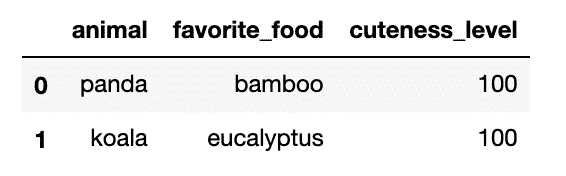
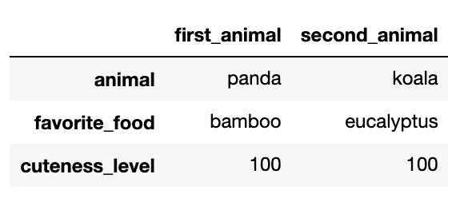

# 熊猫终极指南——创建数据框架

> 原文：<https://towardsdatascience.com/ultimate-pandas-guide-creating-a-dataframe-9f063e590e78?source=collection_archive---------43----------------------->


劳拉·伍德伯里摄于[佩克斯](https://www.pexels.com/photo/panda-bear-on-green-grass-3608263/?utm_content=attributionCopyText&utm_medium=referral&utm_source=pexels)

## 用 Python 从头开始构建数据

任何数据分析工作的第一步，或许也是最重要的一步，是获取你的原材料；你的数据。

根据项目的成熟度，这个阶段可能非常简单——向同事请求 csv，查询结构良好的数据库，等等。或者更复杂一些，比如构建一个定制的 web scraper。

但并不是所有项目所需的数据都来自外部来源。有时候你需要自己编造。

在这篇文章中，我将从头开始介绍创建数据帧的过程。

# 理解“数据框架”方法

创建新数据帧的最简单方法是使用“DataFrame”方法。如果你熟悉面向对象编程，你会注意到这实际上是一个[构造函数](https://www.geeksforgeeks.org/constructors-in-python/)调用，它实例化了一个新的 DataFrame 对象。

所有参数都是可选的，这意味着您可以通过传入… nothing 来创建一个空的数据帧:

```
import pandas as pd
empty_df = pd.DataFrame()
```

如果您希望稍后用数据填充一个空的数据帧，这可能会很有帮助。例如，您可以存储几个机器学习模型的汇总结果，方法是从一个空的数据帧开始，然后编写一个循环来填充每个模型的行。

然而，在大多数情况下，您会希望从一开始就用数据填充数据帧。幸运的是，Pandas 非常灵活，允许程序员将各种数据结构转换成数据帧。下面是一个综合指南:

## 从列表的列表中创建数据帧

将一个列表列表传递给 DataFrame 方法的第一个参数，其中每个内部列表都将是未来的一行。您通常还需要包含一个“columns”参数，它是您想要使用的列名的简单列表。

```
data = [[‘panda’, ‘bamboo’, 100], 
       [‘koala’, ‘eucalyptus’, 100]]pd.DataFrame(data, columns = [‘animal’, ‘favorite_food’, ‘cuteness_level’])
```



## 从字典创建数据帧—方法 1

传递一本字典作为第一个参数。字典中的键将成为数据帧中的列。字典中的值应该是将填充列的列表:

```
data = {‘animal’: [‘panda’, ‘koala’],
        ‘favorite_food’: [‘bamboo’, ‘eucalyptus’],
        ‘cuteness_level’: [100, 100]}pd.DataFrame(data)
```


## 从字典创建数据帧—方法 2

还可以使用 DataFrame 类的[类方法](https://www.programiz.com/python-programming/methods/built-in/classmethod#:~:text=A%20class%20method%20is%20a,and%20a%20class%20method%20is%3A&text=Class%20method%20works%20with%20the,is%20always%20the%20class%20itself.)中的 ***from_dict*** 方法从字典中创建 DataFrame。

这样做的好处是，您可以将“orient”参数设置为“index”，这将改变字典填充数据帧的方式。在这种情况下，字典的键将成为行索引，其值将成为行:

```
data = {‘animal’: [‘panda’, ‘koala’],
        ‘favorite_food’: [‘bamboo’, ‘eucalyptus’],
        ‘cuteness_level’: [100, 100]}pd.DataFrame.from_dict(data, orient = ‘index’, columns = [‘first_animal’, ‘second_animal’])
```



## 从字典列表创建数据帧

将字典列表传递给第一个参数。对于每个字典，键对应于列名，值对应于数据帧每一行中的值:

```
data = [{'animal': 'panda', 
         'favorite_food': 'bamboo', 
         'cuteness_level': 100}, {'animal': 'koala', 
          'favorite_food': 'eucalyptus', 
           'cuteness_level': 100}]pd.DataFrame(data)
```


## 从 numpy 数组创建数据帧

将 numpy 数组直接传递给 DataFrame 方法:

```
data = np.array([(‘panda’, ‘bamboo’, 100), 
                 (‘koala’, ‘eucalyptus’, 100)],
               dtype=[(‘animal’, ‘U6’), 
              (‘favorite_food’, ‘U6’), 
               (‘cuteness_level’, int)])pd.DataFrame(data)
```


# 我的建议

在这篇文章中，我们介绍了创建新数据框架的各种方法。

当我从头开始构建一个表时，我更喜欢使用列表列表方法，因为它有最直观的翻译。每个内部列表都是水平呈现的，实际上看起来就像它在数据帧中变成的行。编码快乐！