# 终极熊猫指南——像专家一样检查数据

> 原文：<https://towardsdatascience.com/ultimate-pandas-guide-inspecting-data-like-a-pro-9b4f13c39c94?source=collection_archive---------26----------------------->


劳拉·伍德伯里摄于[佩克斯](https://www.pexels.com/photo/panda-bear-on-green-grass-3608263/?utm_content=attributionCopyText&utm_medium=referral&utm_source=pexels)

无论您正在进行简单的分析还是复杂的机器学习模型，能够快速回答关于数据性质的探索性问题都有很大的价值。

幸运的是，熊猫让这变得容易了。在本文中，我将介绍几个 DataFrame 属性和方法，它们使数据检查变得轻松而高效。

# 头/尾

**用例:**快速浏览我们的数据框架。

默认情况下，head 方法返回数据的前 5 行:

```
#returns the first five rows
df.head()
```

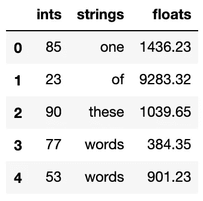

但是我们也可以指定不同的行数来返回:

```
#returns the first six rows 
df.head(6)
```

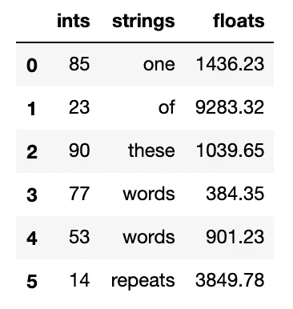

tail 方法以同样的方式工作，但是从数据帧的底部而不是顶部开始返回行:

```
df.tail(2)
```

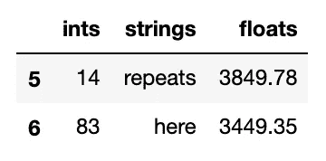

# 列

**用例:**从我们的数据框架中获取列名。

```
df.columns
```

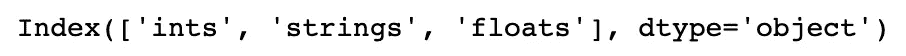

当我需要记住列名的确切拼写或者当我发现哪些数据点可用时，我发现这很有用。

如果这个对象更方便，我们也可以将索引转换为列表:

```
list(df.columns)
```

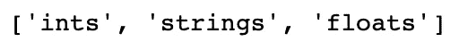

# 形状

**用例:**确定数据帧中的行数和列数。

此方法返回一个元组，其第一个值是行数，第二个值是列数:

```
df.shape
```


为了只获得行数，我们简单地索引元组以提取第一个元素:

```
df.shape[0]
```

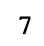

我喜欢使用这个属性来查找符合特定条件的数据的百分比。

例如，我们可以筛选数据帧，以获取一列中小于 70 的值和另一列中小于 1000 的值的百分比:

```
df[ (df.ints < 70) & (df.floats < 1000) ].shape[0] / df.shape[0]
```

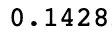

# 唯一/值计数

**用例:**获取 DataFrame 列中的不同值(即系列对象)。

```
df[‘strings’].unique()
```

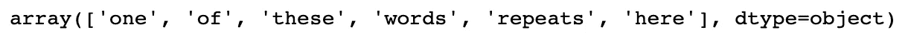

Value_counts 类似于 unique，但它不是返回唯一值的数组，而是返回每个值的频率序列:

```
df[‘strings’].value_counts()
```

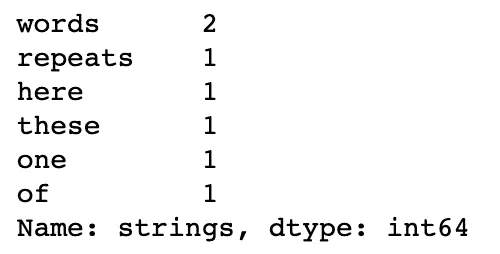

# 信息

**用例:**获取关于我们的索引、列和内存使用的汇总信息。

```
df.info(verbose = True)
```

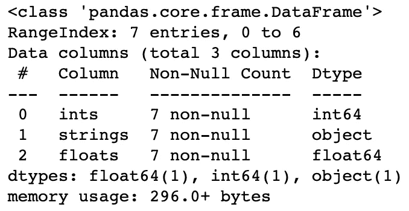

我们将“True”传递给“verbose”参数，以确保我们在处理更大的数据集时能够获得完整的列摘要。

# 形容

**用例:**获取数据中列的汇总统计信息。

默认情况下，describe 方法只包含数字列:

```
df.describe()
```

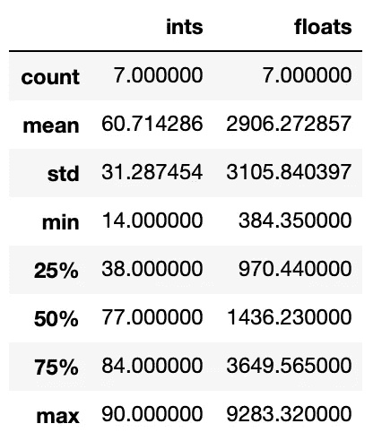

我们可以用几种方式定制我们的输出。

首先，我们可以通过向“percentiles”参数传递一组介于 0 和 1 之间的值来获得不同的百分点值:

```
df.describe(percentiles = [.1, .99])
```

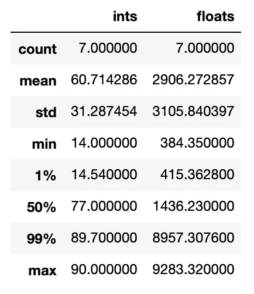

我们还可以使用“include”和“exclude”参数来指定我们希望在输出中包含哪些类型的列。

如果我们将“all”传递给“include”参数，那么除了数字列之外，我们还将获得非数字列的摘要。

对于非数字列，我们将获得计数、唯一计数、top(最常见值)和 freq(最常见值的频率):

```
df.describe(include = 'all')
```


最后，如果我们想在输出中进一步定制列，我们可以将数据类型列表传递给 include 或 exclude 参数。

# 奖金-最大行数和列数

默认情况下，pandas 将输出中的行数和列数分别限制在 60 和 20。

如果我们试图返回一个 70 行的数据帧，我们将得到如下结果:

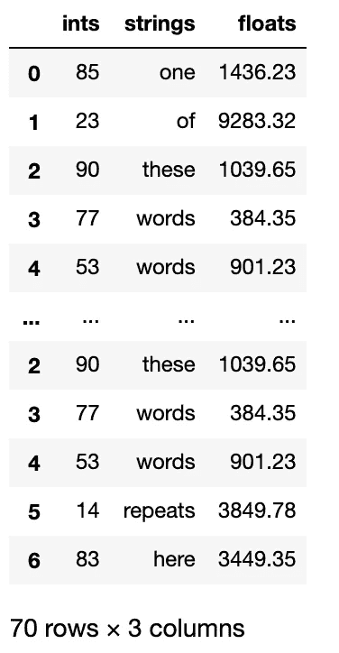

当我们想要查看所有数据时，这可能会很烦人。

我们可以通过将“max_rows”或“max_columns”传递给 pandas 的“set_option”方法并指定一个值来解决这个问题:

```
pd.set_option(‘max_rows’, 70)
```

当我想灵活地查看我的数据的一小部分时，我发现这个技巧非常有用。

# 结束语

Pandas 通过许多用户友好的方法和属性使数据检查变得相当简单。您还可以编写自己的检查和探索方法来扩展功能。这是使用 Python 这样的脚本语言进行数据分析的优势之一。

编码快乐！