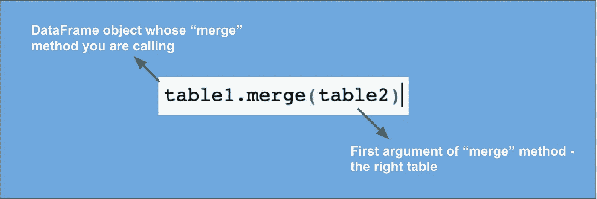
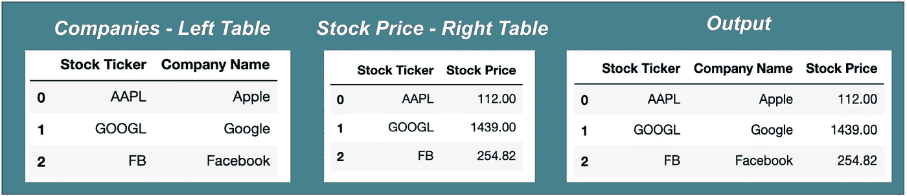
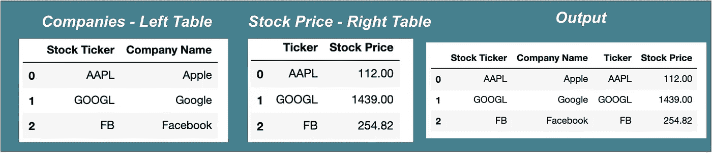
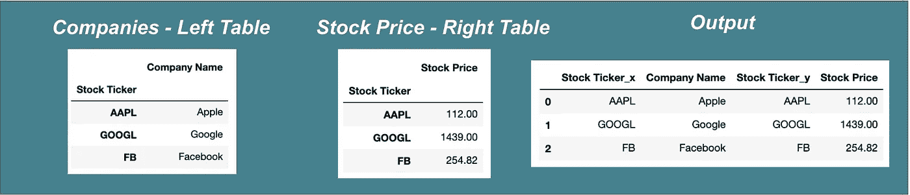
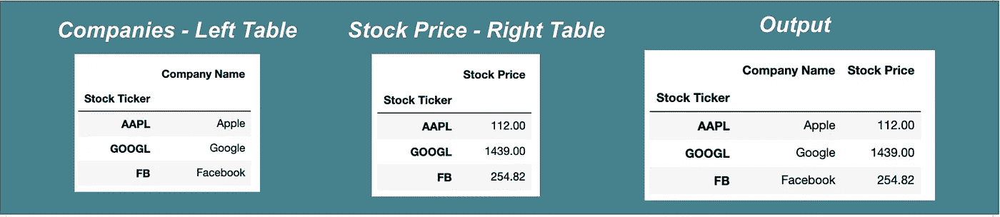

# 熊猫终极指南-使用 Python 连接数据

> 原文：<https://towardsdatascience.com/ultimate-pandas-guide-joining-data-with-python-48d9feff77ea?source=collection_archive---------31----------------------->


劳拉·伍德伯里摄于[佩克斯](https://www.pexels.com/photo/panda-bear-on-green-grass-3608263/?utm_content=attributionCopyText&utm_medium=referral&utm_source=pexels)

## 掌握“合并”和“加入”的区别

每个从事数据工作的人都知道这一点:在你建立机器学习模型或产生令人惊叹的可视化之前，你必须让你的手弄脏数据争论。

数据争论的核心技能之一是学习如何将不同的数据源连接在一起。

在这篇文章中，我将通过介绍两种核心连接方法——连接和合并，为 pandas 中的连接提供一个全面的指南

如果您需要复习加入数据的含义，我建议您在继续之前查看我的[加入数据初学者指南](/a-beginners-guide-to-joining-data-935c8e579fb7):

[](/a-beginners-guide-to-joining-data-935c8e579fb7) [## 连接数据的初学者指南

### 左接合。内部联接。外部联接。啊？

towardsdatascience.com](/a-beginners-guide-to-joining-data-935c8e579fb7) 

# “合并”方法

与连接的情况一样，进行 Pandas 合并需要三个基本要素:

1.你的两个数据集

2.要执行的联接类型

3.您的连接密钥

## 数据源

Merge 是 DataFrame 类的一个[方法](https://www.w3schools.com/python/gloss_python_object_methods.asp)。这意味着无论何时你调用一个合并，它实际上是被一个数据帧调用的。

“调用”数据帧是您的左侧**表。**

该方法的第一个参数是您的**右表。**



再次注意，table1 是您的左表，table2 是您的右表。

## 连接类型

你需要的第二个关键因素是你想要使用的连接类型。

在 merge 函数中，您可以通过“how”参数来实现这一点:

```
table1.merge(table2, **how = ‘left’**)
```

“How”可以取值为:left、right、inner 或 outer——类似于大多数版本的 SQL。

## 连接键

在选择连接键时，Pandas 提供了高度的灵活性。

下面是传递连接键的三种主要方法:

1.  **使用“on”参数** —这是最直观的解决方案，但是它要求您试图连接的列具有相同的**名称。**

```
companies.merge(stock_price, how = 'left', on = 'Stock Ticker')
```



2.**使用“left_on”和“right_on”参数** —对于此方法，您将“left_on”设置为您想要在左侧表格中使用的列，将“right on”设置为您想要在右侧表格中使用的列:

```
companies.merge(stock_price, how = ‘left’, left_on = ‘Stock Ticker’, right_on = ‘Ticker’)
```



3.**使用“left_index”和“right_index”参数:**这些是布尔参数——将它们设置为 True 以表明您想要使用**索引**作为您的连接键:

```
companies.merge(stock_price, how = ‘left’, left_index = True, right_index = True)
```



注意，如果您想要连接多个键，您可以简单地将列名列表传递给“on”、“left_on”或“right_on”参数。

另请注意，根据您的使用情况，您可以混合搭配“left_on”、“right_on”、“left_index”和“right_index”。

# “加入”方法

join 方法实际上非常类似于 merge 方法。关键的区别在于连接方法**强制**使用右连接键的索引，默认使用左连接键的索引:

```
companies.join(stock_price, how = ‘left’)
```



如果您总是喜欢索引连接，您可能会发现这更容易，因为它需要的参数更少。

另一个区别非常小 join 方法默认将“how”参数设置为“left ”,而 merge 方法默认为“inner”。

# 我的偏好

就个人而言，我更喜欢使用 merge 方法并用“on”参数连接列。如果我需要重命名列，就简单性和可读性而言，这是值得的。

但这只是我的看法。关于 pandas 的一个伟大的事情是，它为您提供了很大程度的灵活性来选择最适合您的语法。编码快乐！