# 熊猫终极指南——驾驭群体

> 原文：<https://towardsdatascience.com/ultimate-pandas-guide-mastering-the-groupby-104306251739?source=collection_archive---------17----------------------->


劳拉·伍德伯里摄于[佩克斯](https://www.pexels.com/photo/panda-bear-on-green-grass-3608263/?utm_content=attributionCopyText&utm_medium=referral&utm_source=pexels)

## 加深对“分组”和“聚集”的理解

数据分析中最常见的练习之一是将数据分组并执行聚合。

例如，假设您有几个不同维度的客户销售数据:

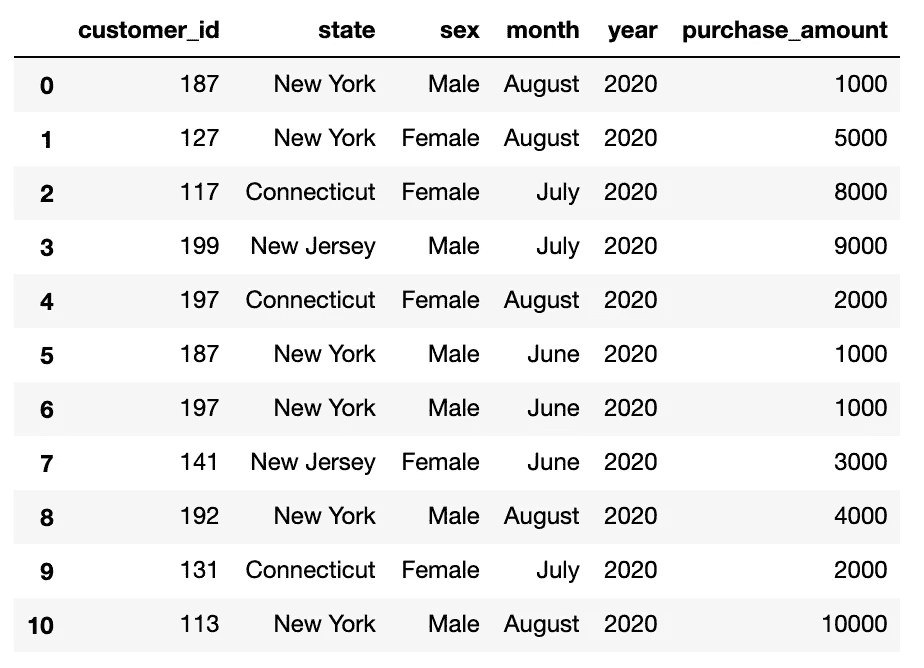

一个自然的问题可能是问——各州的总销售额是多少？还是按性别？还是按月？

在这篇文章中，我将介绍熊猫“groupby”的来龙去脉，帮助你自信地回答 Python 中的这类问题。

# “分组”数据的可视化表示

记住“分组”是做什么的最简单的方法是把它分成三个步骤:“分割”、“应用”和“组合”。

1. **Split:** 这意味着基于数据中的一列创建单独的组。例如，我们可以将销售数据分成**个月。**

2.**应用:**这意味着我们对每个组执行一个功能。例如，我们可以**合计**每个月的销售额。

3.**合并**:这意味着我们返回一个新的数据表，包含“应用”阶段的每个结果。

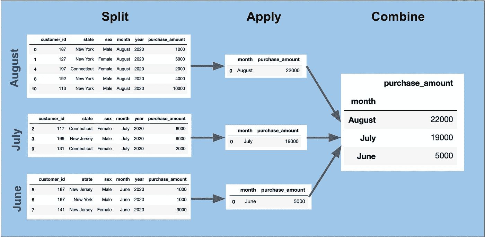

“groupby”的神奇之处在于它可以帮助你在非常紧凑的代码中完成所有这些步骤。

# 在熊猫中进行“分组”

为了获得每月的销售额，我们可以简单地运行以下命令:

```
sales_data.groupby('month').agg(sum)[['purchase_amount']]
```

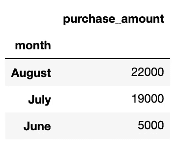

# 了解熊猫的“分裂”步骤

首先要指出的是，当我们运行上面的代码时，我们实际上是在运行两个不同的函数——groupby 和 agg——其中 group by 处理“拆分”阶段，agg 处理“应用”阶段。

例如，下面的代码实际上将我们的数据分成“月”组:

```
sales_data.groupby('month')
```

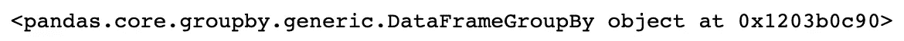

虽然这个输出并不特别有趣，但是在到达聚合阶段之前，我们还可以对这个对象做一些事情:

1.  **查看“组”属性:**

```
grouped = sales_data.groupby('month')
grouped.groups
```

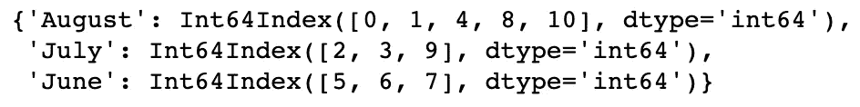

注意,“groups”属性返回一个字典，它的键是组，值是每个组的行索引。

**2。使用“获取组”方法检查单个组:**

```
grouped.get_group('August')
```

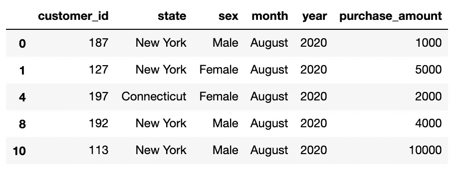

**3。遍历每个组:**

```
for name, group in grouped:
    print(name, group)
```

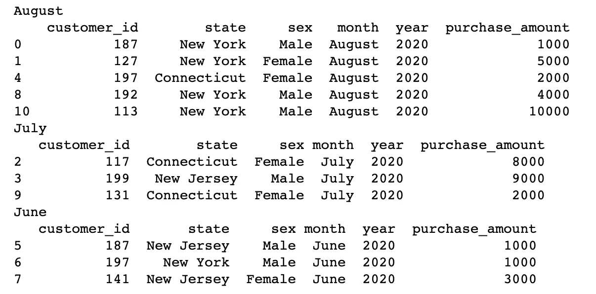

# 了解熊猫的“agg”步骤

现在我们来探讨一下“agg”函数。

我们可以传递给“agg”的最简单的东西是我们想要在每个组上执行的聚合的名称:

```
sales_data.groupby('month').agg(sum)
```

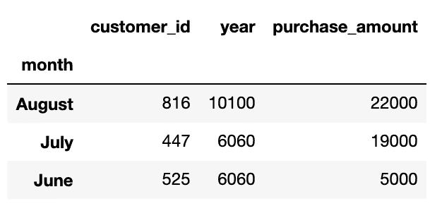

请注意，这种方法将返回数据帧中所有可用数字列的总和。

但是，在本例中，返回“year”或“customer_id”列的总和没有任何意义。我们可以通过使用我们希望在 agg 调用结束时看到的列列表进行索引来解决这个问题:

```
sales_data.groupby('month').agg(sum)[['purchase_amount']]
```


我们也可以用一个单独的列进行索引(与 list 相反):

```
sales_data.groupby('month').agg(sum)['purchase_amount']
```


在这种情况下，我们得到的是一个 Series 对象，而不是 DataFrame。我倾向于使用数据框架，所以我通常选择第一种方法。

# 高级“分组依据”概念

现在我们已经有了基本的东西，让我们来看看我们能做的一些更高级的事情。

## 多重聚合

首先，假设我们想要总销售额**和每月平均销售额**。为此，我们可以向“agg”传递一个函数列表:

```
sales_data.groupby(‘month’).agg(**[sum, np.mean]**)[‘purchase_amount’]
```

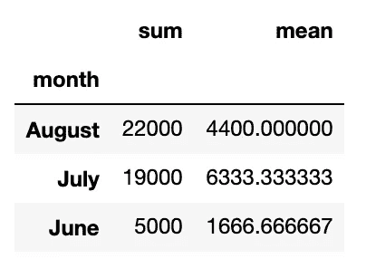

这是有帮助的，但是现在我们被以聚合函数命名的列(即总和及平均值)。

当我们想要为多个列返回多个聚合时，这就变得更加困难了:

```
sales_data.groupby(‘month’).agg(**[sum, np.mean]**)[[‘purchase_amount’, 'year']]
```

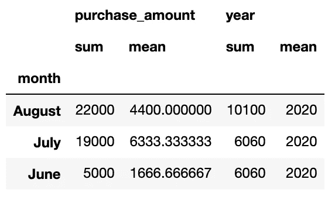

在这种情况下，我们坚持使用[多索引](https://pandas.pydata.org/pandas-docs/stable/user_guide/advanced.html)作为列名:

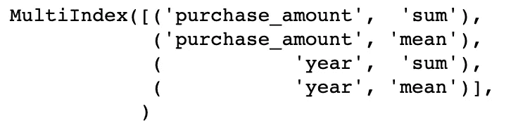

为了解决这个问题，我们可以利用 Pandas 提供的“NamedAgg”对象。这里的语法有点不同，但是我们的输出非常清楚地表明了这里发生的事情:

```
sales_data.groupby(“month”).agg(
   total_sales=pd.NamedAgg(column=’purchase_amount’, aggfunc=sum),
   avg_sales=pd.NamedAgg(column=’purchase_amount’, aggfunc=np.mean),
   max_year=pd.NamedAgg(column=’year’, aggfunc=max))
```


这是一种非常有用的机制，可以在不同的列上执行多种功能，同时保持对输出中列名的控制。

我们还可以向 agg 函数传递一个字典，但是这并没有给我们提供相同的灵活性来命名我们得到的列:

```
sales_data.groupby(“month”).agg(         {‘purchase_amount’: [sum, np.mean],
        ‘year’: [max]})
```

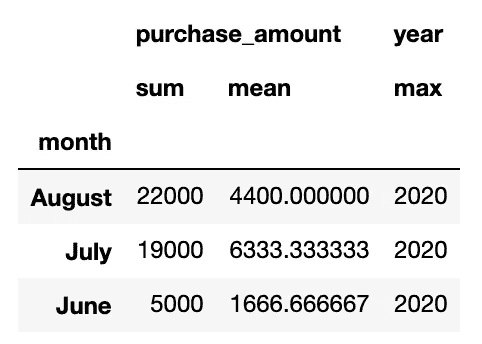

## 多列分组

我们可能想做的另一件事是按月份和州获取总销售额。

为了按多列分组，我们只需将一个列表传递给 group by 函数:

```
sales_data.groupby(["month", "state"]).agg(sum)[['purchase_amount']]
```

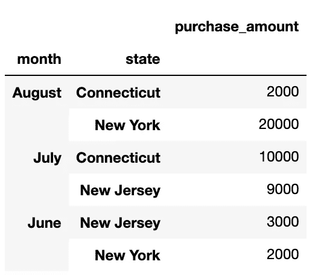

您还会注意到我们的“分组关键字”——月份和州——已经成为我们的索引。通过运行“reset_index”函数，我们可以很容易地将它们转换成列:

```
g = sales_data.groupby([“month”, “state”]).agg(sum) g[[‘purchase_amount’].reset_index()
```

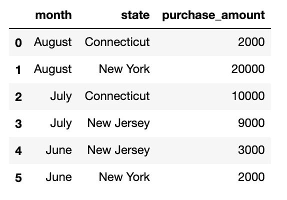

# 结束语

一旦你对“分割-应用-组合”方法有了坚实的直觉，在 Pandas 中运行“分组”就相当简单了。

尽管如此，当您第一次熟悉这些函数时，仍然可能会遇到语法问题。如果您面临错误，我建议您更仔细地查看您传递的数据类型。

例如，如果您正在运行类似于下面的代码，请确保您正在将一个函数列表的**传递给 agg，并且您正在将一个列列表**的**放置在另一组括号内以进行列索引:**

```
sales_data.groupby(‘month’).agg(**[sum, np.mean]**)[**[‘purchase_amount’, ‘year’]**]
```

关于熊猫索引的快速回顾，请查看我下面的直观指南。编码快乐！