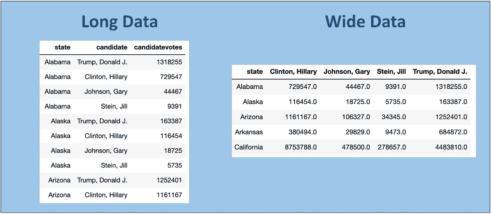
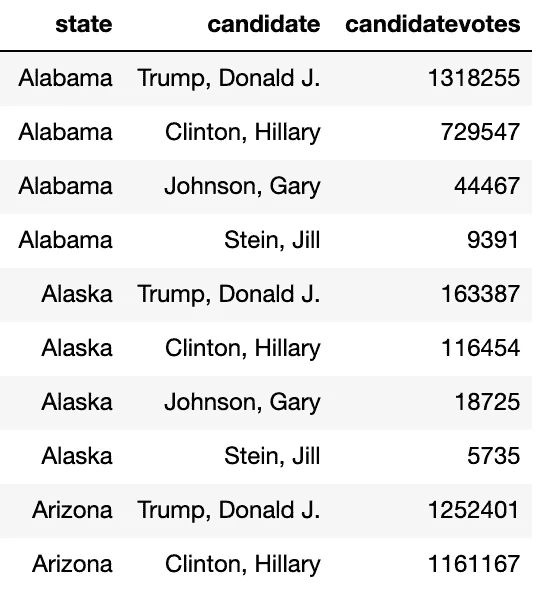
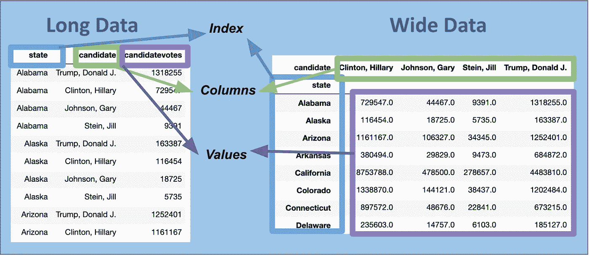
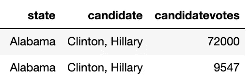
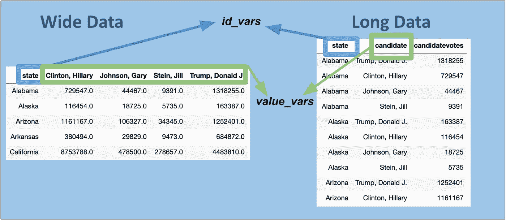
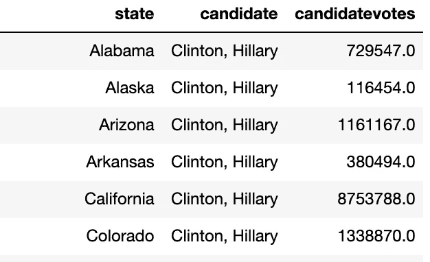
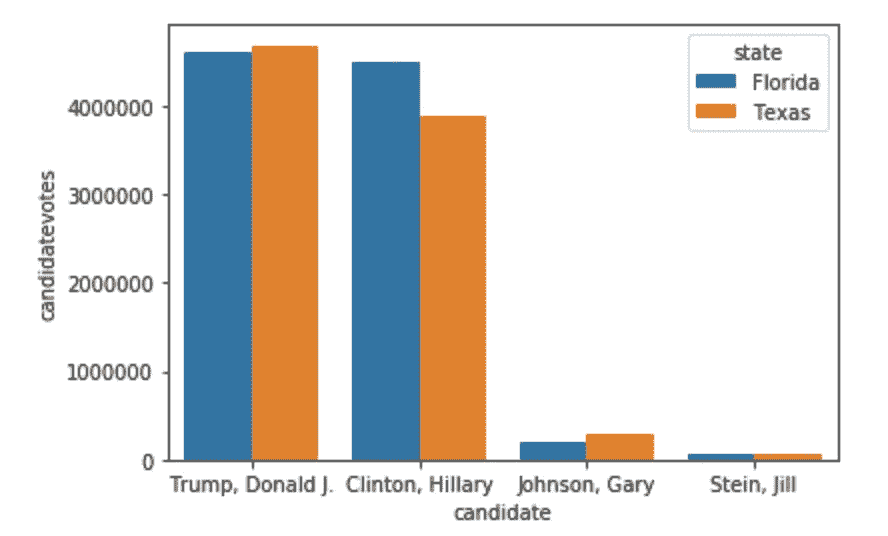

# 熊猫终极指南——重塑您的数据

> 原文：<https://towardsdatascience.com/ultimate-pandas-guide-reshaping-your-data-75bc40ab05c4?source=collection_archive---------41----------------------->


劳拉·伍德伯里摄于[佩克斯](https://www.pexels.com/photo/panda-bear-on-green-grass-3608263/?utm_content=attributionCopyText&utm_medium=referral&utm_source=pexels)

## 通过掌握“pivot_table”和“melt”来控制您的数据

概括地说，数据可以用两种形状来组织——长型或宽型。

例如，我们可以用两种方式表示总统选举结果:



当我们的数据很长时，这意味着每条记录代表我们测量的变量的一个实例。在上面的例子中，每个记录都有候选人、州和他们收到的票数。

当我们的数据很宽时，这意味着我们测量的变量是跨行和列分布的。在上面的例子中，每条记录是一个州，我们有为每个候选人投票的列。

Pandas 最有用的功能之一是能够快速轻松地重塑数据。

在这篇文章中，我将介绍如何毫不费力地在各种形状之间转换，以最好地满足您的分析需求。

# 为什么我们需要不同的形状？

最终，“正确”的形状将总是取决于用例。不同的场景需要不同的形状——这就是为什么我们需要在它们之间切换的功能。

比方说，我们的选举数据有一个“长”形:



如果我们想建立一个模型来预测希拉里·克林顿获得总票数的百分比，这种形状是行不通的。为了创建州级预测模型，我们需要州级数据。

另一方面，如果我们想使用 [seaborn](https://seaborn.pydata.org/generated/seaborn.barplot.html) 可视化软件包绘制一个条形图，我们将需要长格式。这并不是因为任何高度技术性的原因，只是因为 seaborn barplot 方法期望数据是这种格式。

# 长到宽—“数据透视表”

“pivot_table”方法是一种将数据形状从长变宽的简单方法。

这是一个 DataFrame 方法，因此它会被您想要整形的 DataFrame 调用:

```
data.pivot_table()
```

有四个主要参数要传递给此方法:

1.  **Index** :我们希望在输出表中用作索引的列的名称
2.  **列**:其唯一值将成为输出表中的列的列名
3.  **值**:我们想要聚合的列的名称
4.  **Aggfunc** :我们要使用的聚合函数的名称

为了让这一点变得生动，下面是一个使用“pivot_table”方法将数据从长变宽的例子:

```
long_data.pivot_table(index = ‘state’, columns= ‘candidate’,
 values = ‘candidatevotes’, aggfunc = ‘sum’)
```



注意，如果我们的索引/列对有重复的值，那么只需要传递“values”和“aggfunc”参数。

换句话说，如果我们有希拉里·克林顿在阿拉巴马州的两个计票记录，我们将希望传递“values”和“aggfunc ”,以便告诉该方法如何处理这些重复的记录(即将它们相加、平均等等。).



默认方法是使用 np.mean 函数。这可能导致**潜在的陷阱，**因为我们不总是*想要*在上面的例子中取平均值。为了避免问题，您应该确保知道您的数据中是否有重复项。

还有另一种方法——“pivot”——类似于 pivot_table。

但是，“pivot”不允许您拥有副本。如果我们尝试使用“pivot ”,并且我们有两个阿拉巴马州希拉里·克林顿的记录，此方法将返回 ValueError:


因为“pivot”限制性更强，所以我建议在需要从 long 转换到 wide 时，只需使用“pivot_table”即可。

# 从宽到长—“融化”

Melt 是我在 Pandas 中最喜欢的方法之一，因为它提供了“反透视”功能，这比它的 SQL 或 excel 等价物要简单得多。

与我们的“pivot_table”方法类似，我们将使用几个主要参数来取消数据透视:

1.  **id_vars** :您希望在输出中保持不变的列的名称
2.  **value_vars:** 要在输出中折叠成单个分类列的列名
3.  **var_name:** 输出表中 value_vars 的列名。
4.  **value_name** :输出表中值的列名。

下面是一个使用我们的选举数据的例子:

```
wide_data.melt(id_vars = 'state', 
            value_vars = ['Clinton, Hillary','Johnson, Gary','Stein, Jill','Trump, Donald J.'],
            var_name = 'candidate',
            value_name = 'candidatevotes')
```



请注意，默认情况下，该方法会将“value_vars”参数设置为表中不在“id_vars”中的列的完整列表。因此，如果我们确实想使用所有这些列，从技术上讲，我们不需要向“value_vars”传递任何东西。

另一方面，通过在“value_vars”参数中仅包含一个候选项，很容易获得该候选项的数据:

```
wide_data.melt(id_vars = 'state', 
            value_vars = ['Clinton, Hillary'],
            var_name = 'candidate',
            value_name = 'candidatevotes')
```



在帖子的开头，我提到了 seaborn 函数，barplot 要求我们的数据是长格式的。

如果你感到好奇，下面的代码可以比较佛罗里达州和德克萨斯州候选人的投票结果:

```
sns.barplot(x=”candidate”, y=”candidatevotes”, hue=”state”, data=long_data[long_data.state.isin([‘Texas’, ‘Florida’])])
```



同样，请注意，如果我们的数据是宽格式的，这是行不通的，因为我们没有一个单独的数字列传递给“y”参数。

# 结束语

与 SQL 或 Excel 等其他分析工具相比，Pandas 在重塑数据方面更胜一筹。

通过两个简单的函数 pivot _ table 和 melt 您可以有效地重塑您的数据，以帮助促进分析管道中接下来的连接、可视化或模型训练。编码快乐！