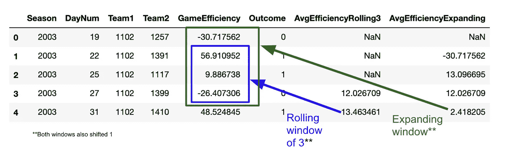

# 终极熊猫指南:时间序列窗口函数

> 原文：<https://towardsdatascience.com/ultimate-pandas-guide-time-series-window-functions-a5362b782f3e?source=collection_archive---------19----------------------->


劳拉·伍德伯里摄于[佩克斯](https://www.pexels.com/photo/panda-bear-on-green-grass-3608263/?utm_content=attributionCopyText&utm_medium=referral&utm_source=pexels)

## 掌握时间序列分析的“移位”、“滚动”和“扩展”

在我的[上一篇文章](/ultimate-pandas-guide-window-functions-f527f64fd550)中，我演示了如何基于列值在 Pandas 中运行窗口函数。

这种方法在我们想要知道关于单个记录 ***和它们所属的*** 组的信息时非常有用。

例如，如果我们有客户级别的交易数据，像这样的方法可以为我们提供关于每笔交易的信息，以及交易发生当月的总销售额:


在本文中，我将介绍另一种类型的窗口函数——我们根据行的位置而不是分类列的值来执行计算。

# 关于数据的注释

对于我下面的例子，我将使用来自 Kaggle 上的 [NCAA 大联盟比赛](https://www.kaggle.com/c/google-cloud-ncaa-march-madness-2020-division-1-mens-tournament)的一些游戏级别的篮球数据。

如果你不喜欢篮球，不要害怕。

这里有一个快速数据字典，告诉你所有你需要知道的变量:

1.  **DayNum:** 我们对时间的度量。它计算游戏进行到赛季的第几天。
2.  游戏发生的年份。
3.  **Team1/Team2:** 参赛队伍的 id。
4.  **效率:**衡量团队 1 在游戏中的表现。
5.  **结果:**团队 1 是否赢得比赛的标志(1 表示赢，0 表示输)。


最后，让我们假设我们的目标是预测谁赢得了每场比赛。我们不会在这里做任何机器学习，但这将有助于激发用例。

# 创建“移位”列

让我们从做一个简单的“转移”开始。

这个方法确实像它听起来那样。它将一列中的值向前或向后移动。

下面我们将游戏效率提高 1:

```
game_data[‘prior_game_outcome’] = game_data[‘Outcome’].shift(1)
```


现在，对于每场比赛，我们都知道团队 1 在前一场比赛中表现如何。也许这能帮助我们预测结果。

请注意，我们可以传递正整数或负整数来向前或向后移动:

```
game_data['NextEfficiency'] = game_data['GameEfficiency'].shift(-1)
```


还要记住，当我们对第一行进行正移位时，我们会得到一个空值，因为前一行中没有可用的数据。我们可以通过设置“fill_value”参数用我们选择的不同值替换空值来解决这个问题。

# 在滚动窗口上执行聚合

虽然 shift 方法很有用，但它不允许我们对之前或未来的行执行任何功能。

例如，我们可能想要找出团队 1 在前三场比赛中的平均效率。

这是我们可以利用滚动方法的地方。

基本语法非常简单——我们只需要传递我们想要查看的先前行数，然后执行聚合:

```
game_data[‘AvgEfficiency’] = game_data[‘GameEfficiency’].rolling(3).mean()
```


请注意，这里有两个技术步骤:“rolling”方法创建一个滚动对象，然后“mean”方法返回新列。

我们可能想在这里再做一次调整。默认情况下，每个记录都包含在自己的窗口平均值中。如果我们想预测每场比赛，这是不好的，因为这意味着我们有关于结果的信息编码在平均值中。

为了解决这个问题，我们可以添加一个移位函数，以便包含前 3 行的数据(而不是当前行和前 2 行):

```
game_data[‘AvgEfficiency’] = game_data[‘GameEfficiency’].shift(1).rolling(3).mean()
```


# 在扩展窗口上执行聚合

扩展方法与滚动方法非常相似，只是它会根据给定的数据创建尽可能大的窗口。

这里有一个例子:

```
game_data[‘AvgEfficiency’] = game_data[‘GameEfficiency’].shift(1).expanding().mean()
```


请注意，倒数第二行中的 AvgEfficiency 值与我们运行上面的滚动方法(12.02)时相同，但最后几行不同(2.41 对 13.46)。

这是因为当我们在倒数第二行时，我们只有 3 个先前的记录可用，但是当我们到达最后一行时，我们有 4 个先前的记录。同样，扩展方法使用尽可能多的数据。



最后，如果我们希望确保扩展窗口至少有一定数量的记录，以便应用聚合，我们可以使用“min_periods”参数:

```
game_data[‘AvgEfficiency’] = game_data[‘GameEfficiency’].shift(1) .expanding(min_periods = 4).mean()
```


# 将所有这些放在一起:一个高级用例

我们从区分基于列的窗口和基于位置的窗口开始这篇文章。

我们的最终用例利用了这两者。

以上所有工作的问题是:我们的数据集中实际上有多个球队和赛季，所以我们在分类数据的边缘遇到了问题:


为了解决这个问题，我们需要将我们的数据分成团队/赛季组 ***和*** 执行扩展窗口聚合:

```
game_data[‘AvgEfficiency’] = game_data.groupby([‘Season’, ‘Team1’])[[‘GameEfficiency’]].transform(lambda x: x.shift(1).expanding().mean())
```


现在我们的扩展平均计算开始为每个队的时间表新鲜！

上面的代码中有很多内容，但我是这样想的:

1.  首先，我们将数据分成季节组和团队组 1
2.  然后，我们将一个定制的匿名函数([λ](https://www.w3schools.com/python/python_lambda.asp))应用到每一组，该函数会移动数据并计算一个扩展平均值
3.  最后，我们将这些值返回到原始索引

# 结束语

在这篇文章中，我们浏览了熊猫的时间序列窗口函数。其中一些方法的语法可能有点复杂，但是当你把它分解成更小的步骤时，一切都会变得更加清晰。花些时间尝试每种方法，直到你掌握了窍门，这也没有坏处。编码快乐！