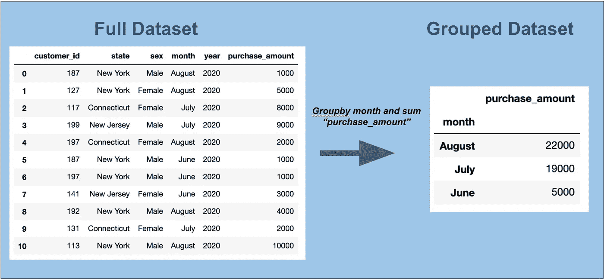
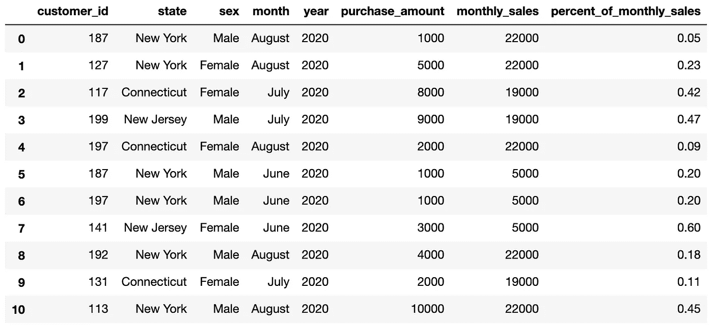
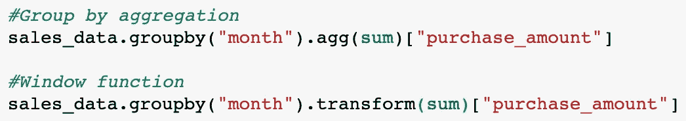
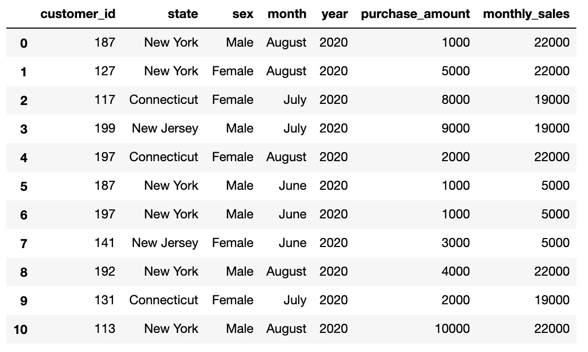
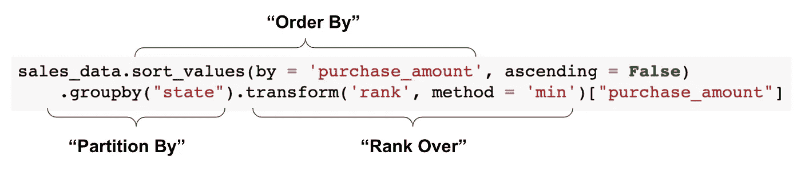

# 熊猫终极指南——窗口功能

> 原文：<https://towardsdatascience.com/ultimate-pandas-guide-window-functions-f527f64fd550?source=collection_archive---------25----------------------->


劳拉·伍德伯里摄于[佩克斯](https://www.pexels.com/photo/panda-bear-on-green-grass-3608263/?utm_content=attributionCopyText&utm_medium=referral&utm_source=pexels)

## 掌握您对数据中的组的理解

窗口函数是一种有效的方法，可以更好地了解数据中的每条记录与其所属的组之间的关系。

它们也是常见的数据科学面试问题，因此很好地理解它们是件好事。

在这篇文章中，我将对窗口函数以及如何在 Pandas 中实现它们进行直观的解释。

# 了解窗口功能

在标准的“分组”中，我们将数据分成组，应用聚合，然后将每个结果合并到一个新表中。

这有助于我们回答关于数据中群体特征的问题。

例如，如果我们有每月客户级别的销售数据，我们可以使用 groupby 来了解我们每月的总销售额:



如果你对这个功能有点生疏，我建议你看看我在 groupby 函数上的帖子:

[](/ultimate-pandas-guide-mastering-the-groupby-104306251739) [## 熊猫终极指南——驾驭群体

### 数据分析中最常见的练习之一是将数据分组并执行聚合。

towardsdatascience.com](/ultimate-pandas-guide-mastering-the-groupby-104306251739) 

如果我们只关心月销售额，上面的输出是有用的。

但是这个结果的缺点是，我们的信息现在分布在两个表中——第一个表给出销售明细，第二个表给出每个月的汇总信息。

窗口函数通过将组级别的聚合返回到初始表来帮助我们弥合这一差距:


如果不清楚这为什么有用，让我们在输出中添加一个百分比列:



现在我们可以看到每个记录占每月总销售额的百分比。

窗口函数很有用，因为它帮助我们运行这些类型的计算，而不必执行任何单独的连接。

# 使用变换方法的 pandas 中的窗口函数

Pandas 中窗口函数的语法非常简单，非常类似于我们在 groupby 聚合中使用的语法。

关键区别在于，要执行窗口功能，我们使用“transform”方法，而不是“agg”方法:



transform 方法返回一个序列而不是一个数据帧，所以如果我们希望它成为原始数据帧的一部分，我们需要将它作为一列添加:

```
sales_data[“monthly_sales”] = sales_data.groupby(“month”).transform(
sum)[“purchase_amount”]
```



就是这样！不算太坏。

让我们再举一个例子。下面我们**按州对每笔交易进行排名**:

```
sales_data['state_rank'] = sales_data.sort_values(by =                   'purchase_amount', ascending = False).groupby("state")
.transform('rank', method = 'min')["purchase_amount"]
```


请注意以下几点:

1.  我们使用“sort_values”函数来确保我们按照购买金额的顺序进行排序。
2.  我们将一个参数(“min”)传递给转换中的“method”参数。这是 rank 方法的一个参数，在执行时传递给它。
3.  当我们想要返回组内的“顶部”值时，这种类型的分析往往很有用。例如，我们可以筛选每个州内前 2 笔交易的结果，然后将这些结果传递给覆盖每个州的销售代表。

# Pandas 中的窗口函数与 SQL

对于那些有很强 SQL 背景的人来说，这个语法可能有点奇怪。

在 SQL 中，我们通过从聚合开始执行窗口函数，然后将它应用于可选的“partition by”和“order by”之上:

```
select rank() over (partition by state order by purchase_amount desc)
```

为了帮助协调这两种方法，我将上面的 Pandas 代码的元素转换成它们的 SQL 等价物:



# 结束语

在 Pandas 中，窗口函数功能强大、高效，并且实现起来相当简单。

但是，值得注意的是,“transform”方法并不是执行基于位置的聚合的正确方法，比如对前 5 条记录的列值求和。为了解决这个问题，我们将在以后的文章中更深入地研究熊猫的“转变”和“扩展”功能。

[](/ultimate-pandas-guide-time-series-window-functions-a5362b782f3e) [## 终极熊猫指南:时间序列窗口函数

### 掌握时间序列分析的“移位”、“滚动”和“扩展”

towardsdatascience.com](/ultimate-pandas-guide-time-series-window-functions-a5362b782f3e) 

编码快乐！