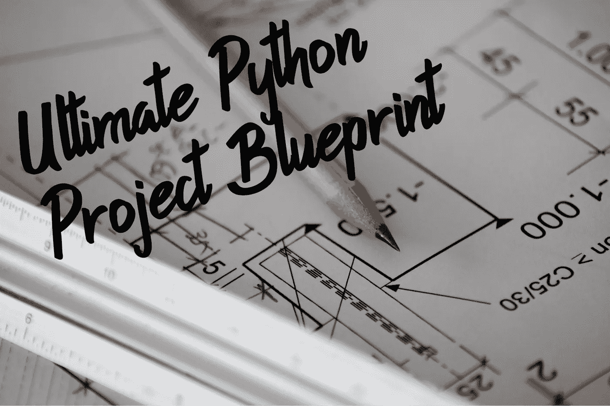

# 下一个 Python 项目的最终设置

> 原文：<https://towardsdatascience.com/ultimate-setup-for-your-next-python-project-179bda8a7c2c?source=collection_archive---------0----------------------->

## 从零开始任何项目都可能是一项艰巨的任务…但如果你有这个终极的 *Python* 项目蓝图就不会了！

Unsplash 上 [@sxoxm](http://twitter.com/sxoxm) 的原图

无论您是在从事一些机器学习/人工智能项目，在 Flask 中构建 web 应用程序，还是只是编写一些快速的 Python 脚本，为您的项目提供一些满足您所有需求的模板总是有用的，即:预定义的目录结构，所有必要的配置文件，如`pytest.ini`或`requirements.txt`，测试，林挺和静态代码分析设置，CI/CD 工具，应用程序的 dockering，以及在自动化之上使用 *Makefile* 。因此，在这里，我为您带来的正是这个*“终极”通用 Python 项目设置*。

*TL；博士:这是我的储存库，里面有完整的源代码和文档:*[【https://github.com/MartinHeinz/python-project-blueprint】T21](https://github.com/MartinHeinz/python-project-blueprint)

# 目录结构

当我为 *Golang* ( [此处为](/ultimate-setup-for-your-next-golang-project-1cc989ad2a96))写这类文章时，我很难用 *Python* 弄清楚*理想的*项目结构，不过，这很简单:

让我们从顶部开始，概述一下我们这里有什么:

*   `blueprint` -这是我们的源代码目录，应该根据你正在使用的应用程序或软件包来命名。在里面，我们有通常的`__init__.py`文件，表明它是一个 *Python* 包，接下来是`__main__.py`，当我们想用`python -m blueprint`直接运行我们的应用程序时会用到它。这里的最后一个源文件是`app.py`，这里只是为了演示。在真实的项目中，你会有更少的顶级源文件和更多的目录(内部包),而不是这个`app.py`。稍后我们将讨论这些文件的内容。最后，我们这里还有`resources`目录，用于您的应用程序可能需要的任何静态内容，例如图像、密钥库等。
*   这个目录中存放着我们的测试套件。我不会在这里讲太多的细节，因为我们将把整个部分用于测试，但只是简单地说:

1.  `test_app.py`是源目录中`app.py`对应的测试文件
2.  如果你曾经使用过 *Pytest* ，那么`conftest.py`可能对你来说很熟悉——这是一个用于指定 *Pytest fixtures* ，钩子或者加载外部插件的文件。
3.  `context.py`通过操纵类路径，帮助从`blueprint`目录导入源代码文件。我们将在稍后看到它是如何工作的。

*   这是我们在这个项目中的最后一个目录。它保存了我们用于 CI/CD 的 *GitHub 动作*的配置。我们有两个文件，第一个- `build-test.yml`负责构建、测试和林挺我们每次推送的源代码。第二个文件- `push.yml`在每次我们在 GitHub 上创建标签/发布时，将我们构建的应用程序推送到 *GitHub 包注册表*。在另一篇博客文章中有更多关于这方面的内容。
*   `Makefile` -除了目录之外，我们的项目中还有一些顶级文件，其中第一个——`Makefile`包含目标，帮助我们自动化通常执行的任务，如构建、测试、林挺或清理我们的项目
*   这是一个方便的脚本，为你建立一个项目。它实际上重命名并替换了这个项目模板中的虚拟值来代替真实值，比如项目名或包名。很方便，对吧？

这里的其余文件是我们将在这个项目中使用的所有工具的配置文件。让我们跳到下一部分，探索它们的功能和内容。

# 配置文件

在设置 *Python* 项目时，有一件事可能会变得相当混乱，那就是当你使用一堆工具时，你最终会得到的配置文件汤，比如 *pylint* 、 *coverage.py* 、 *flake8* 等等。这些工具中的每一个都希望有自己的文件，通常是像`.flake8`或`.coveragerc`这样的文件，这会在你的项目的根目录中产生许多不必要的混乱。为了避免这种情况，我将所有这些文件合并成一个文件- `setup.cfg`:

如果您不熟悉这里使用的所有工具，我将快速描述一下:

*   *flake 8*——是一个在你的项目中强制代码风格的工具——换句话说——它是类似于 *pylint* 的 linter，我们也将使用它。为什么两个都用？它们确实有重叠，但是它们都有一些规则，而另一个没有，所以以我的经验来看，它们都值得使用。
*   *Bandit* —是一个在 *Python* 代码中寻找常见安全问题的工具。它的工作原理是从你的代码中创建 AST(抽象语法树),并针对其节点运行插件。开发人员通常不是安全专家，而且我们所有人都会犯这样或那样的错误，所以有一个工具能够为我们发现至少一些安全错误总是很好的。
*   *Coverage.py* —是一个测量 *Python* 程序代码覆盖率的工具。当我们用 *Pytest* 运行测试套件并从测试运行中生成覆盖率报告时，它被触发。这些报告可以是终端输出的形式，也可以是 XML 格式，然后可以被 CI 工具使用。

说完这些，让我们来回顾一下`setup.cfg`中的内容。对于 *Flake8* 我们定义了排除模式，这样我们就不会忽略我们不关心的代码。下面是一个空的`ignore`部分，以防我们需要全局忽略一些规则。我们还将最大线长度设置为 120，因为在我看来，对于今天的屏幕尺寸来说，将线长度保持为 80 是不合理的。Final line 将 *McCabe* 复杂度阈值设置为 10，如果你不熟悉*圈复杂度*你可以在这里找到更多[。](https://en.wikipedia.org/wiki/Cyclomatic_complexity)

接下来是 *Bandit* ，我们在这里配置的只是目标目录，这是我们的包的名称。我们这样做是为了避免在命令行上指定目标。

之后是 *Coverage.py* 。首先，我们启用*分支覆盖*，这意味着在程序中的一行可能会跳转到多个下一行的地方， *Coverage.py* 会跟踪实际访问了那些目的行中的哪些。接下来，我们省略了一些不应该或者不能包含在覆盖率测量中的文件，比如测试本身或者虚拟环境文件。我们也排除特定的行，例如标有`pragma: no cover`注释的行。最后一个 *Coverage.py* 配置行告诉工具将生成的报告存储在`reports`目录中。如果该目录不存在，将自动创建。

我们需要配置的最后一个工具是 *Pylint* ，不过这个配置*非常*广泛，大概有 100 多行……所以，我就不写这个了，在这里给你指出源代码[以及在 *Pylint* 仓库](https://github.com/MartinHeinz/python-project-blueprint/blob/master/setup.cfg)[这里](https://github.com/PyCQA/pylint/blob/master/pylintrc)的注释和解释`pylintrc`。

我们检查了`setup.cfg`中的所有工具，但是还有一个工具不能添加到`setup.cfg`中，那就是*Pytest*——尽管 *Pytest* 医生告诉你可以使用`setup.cfg`，但这并不完全正确...根据[本期](https://github.com/pytest-dev/pytest/issues/3062#issuecomment-393523260)，使用`setup.cfg`的选项已被否决，并且存在一些错误，如插值错误，这些错误不会被修复，因此我们还需要`pytest.ini`文件来配置 *Pytest* :

我们在这里做的第一件事是设置一组命令行参数——我们在终端输出中启用颜色，然后我们为`blueprint`目录启用覆盖报告，之后我们启用 XML 和 stdout ( `term`)覆盖报告的生成。最后两个参数(`-ra`)告诉 *Pytest* 输出未通过测试的简短摘要。

在下一行，我们有`filterwarnings`选项，它允许我们禁用输出中一些烦人的警告，例如，来自我们无法控制的某个库的不赞成警告。

配置的其余部分设置日志记录。第一个只是打开它，其他 3 个配置级别，格式和日期时间格式。比解释格式配置更容易的是查看输出本身，这将在下一节中显示。

有了`pytest.ini`中的所有配置，我们运行测试套件所需要做的就是运行`pytest`，甚至不需要包参数！

我们拥有的最后一个实际配置文件是`requirement.txt`，它包含了我们的依赖项列表。在这个文件中你能找到的就是一个 *Python* 包的列表，每行一个*可选*版本的包。如上所述，包版本是可选的，但是我强烈建议您在`requirements.txt`中锁定版本，以避免在构建和部署期间下载更新的、*不兼容的*包，并最终破坏您的应用程序。

还有两个文件实际上不是配置文件——我们的*docker 文件*，即`dev.Dockerfile`和`prod.Dockerfile`，分别用于开发和生产映像。我将暂时不讨论这些内容，因为我们将在另一篇文章中探讨这些内容，在那篇文章中，我们将讨论 CI/CD 和部署。但是，您可以在这里的 *GitHub* 存储库中查看这些文件-[https://GitHub . com/Martin Heinz/python-project-blue print/blob/master/dev。文档文件](https://github.com/MartinHeinz/python-project-blueprint/blob/master/dev.Dockerfile)。

# 实际源代码

我们已经做了很多，甚至没有提到我们的应用程序的源代码，但是我认为是时候看看项目框架中的几行代码了:

这个蓝图中唯一实际的源代码就是这个带有静态方法的类。这真的是不需要的，这样我们就可以运行一些东西，得到一些输出并测试它。这也是整个应用程序的入口点。在实际项目中，您可以使用`run()`方法来初始化您的应用程序或 web 服务器。

那么，我们实际上如何运行这段代码呢？

在一个特别命名的文件`__main__.py`中的这一小段是我们在项目中需要的，这样我们就可以使用`python -m blueprint`运行整个包。这个文件和它的内容的好处是，它将只*用那个命令运行*，因此，如果我们想从这个包的源代码导入一些东西而不运行整个东西，那么我们可以这样做而不触发`Blueprint.run()`。

我们的包中还有一个特殊的文件，那就是`__init__.py`文件。通常，你会让它为空，只用来告诉 Python 这个目录是一个包。然而，在这里，我们将使用它从我们的包中导出类、变量和函数。

如果没有上面的这一行，你将无法从这个包的外部调用`Blueprint.run()`。这样我们可以避免人们使用我们代码中不应该公开的内部部分。

这就是我们软件包的全部代码，但是测试呢？首先，我们来看看`context.py`

通常当你使用某人的包时，你像`import blueprint`或`from blueprint import Blueprint`一样导入它，为了在我们的测试中模仿它，因此使它尽可能接近真实使用，我们使用`context.py`文件将包导入到我们的测试环境中。我们还将项目根目录插入到系统路径中。当用`pytest`运行测试时，这实际上是不必要的，但是如果你用`python ./tests/context.py`直接运行`context.py`，或者可能用`unittest`而不包括`sys.path.insert...`，那么你将得到`ModuleNotFoundError: No module named 'blueprint'`，所以这一行有点像*保险单*。

现在，让我们来看看测试示例:

我们这里有一个简单的测试，它使用内置的 *Pytest* 夹具`capsys`(捕获系统输出)来检查`Blueprint.run()`的标准输出。那么，当我们运行测试套件时会发生什么呢？

我从输出中删除了几行，这样您可以更好地看到相关的部分。这里有什么要注意的？嗯，我们的测试通过了！除此之外，我们还可以看到覆盖率报告，我们还可以看到该报告按照`pytest.ini`中的配置写入`coverage.xml`。输出中还有一件事是来自`conftest.py`的 2 条日志消息。这是怎么回事？

您可能已经注意到，除了`capsys`夹具，我们还在小测试的参数中使用了`example_fixture`。该夹具驻留在`conftest.py`中，我们制作的所有定制夹具也应如此:

顾名思义，这真的只是一个示例设备。它所做的只是记录一条消息，然后让测试运行，最后再记录一条消息。关于`conftest.py`文件的好处是它被 *Pytest* 自动发现，所以你甚至不需要将它导入到你的测试文件中。如果你想了解更多，那么你可以看看我以前关于*Pytest*这里或者 docs [这里](https://docs.pytest.org/en/latest/fixture.html#conftest-py-sharing-fixture-functions)的帖子。

# 一个命令搞定一切

如果我们分别运行我们的每个工具，并且必须记住它们的参数，即使它们总是相同的，这将是非常费力的。同样，如果后来我们决定将所有这些工具放入 CI/CD(下一篇文章！)，对吧？所以，让我们用`Makefile`来简化事情:

在这个`Makefile`中，我们有 4 个目标。首先，- `run`使用我们在源文件夹的根目录下创建的`__main__.py`运行我们的应用程序。接下来，`test`只是运行`pytest`。感谢`pytest.ini`中的所有配置，就是这么简单。这里最长的目标- `lint` -运行我们所有的林挺工具。首先，它对项目中的所有`.py`文件运行`pylint`，包括测试文件。之后，它运行`flake8`并最终运行`bandit`。对于这两个，它只针对`blueprint`目录中的源运行。如果这些工具中的任何一个发现我们的代码有问题，它会以非零代码退出，这意味着目标会失败，这在 CI/CD 中很有用。该文件中的最后一个目标是`clean`，哪口井...清理我们的项目——它删除所有由前面提到的工具生成的文件。

# 结论

在本文中，我们已经构建了 project skeleton，它可以用于您可能正在从事或正在考虑的任何类型的 *Python* 项目，因此，如果您想尝试或更深入地挖掘，请查看我的资源库中的源代码:【https://github.com/MartinHeinz/python-project-blueprint】。Repo 还包括关于如何使用方便的脚本设置您的项目的信息，以及一些更多的文档。如果你喜欢这种内容，请随时以问题的形式留下反馈/建议，或者直接开始。🙂

在未来，我们会考虑将 CI/CD 加入到 *GitHub 动作*和 *GitHub 包注册表*的组合中。我们还将对我们的项目进行 Docker 化，创建可调试和优化的生产就绪 Docker 映像，并使用 *CodeClimate* 和 *SonarCloud* 添加更多代码质量工具。

## 资源

*   [示例 Python 模块库](https://github.com/navdeep-G/samplemod)
*   [Pytest 文档](https://docs.pytest.org/en/latest/contents.html)
*   [Python 代码质量权威](https://github.com/PyCQA)

*本文最初发布于*[*martinheinz . dev*](https://martinheinz.dev/blog/14)