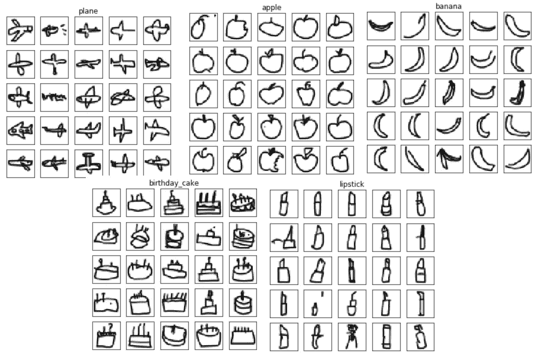
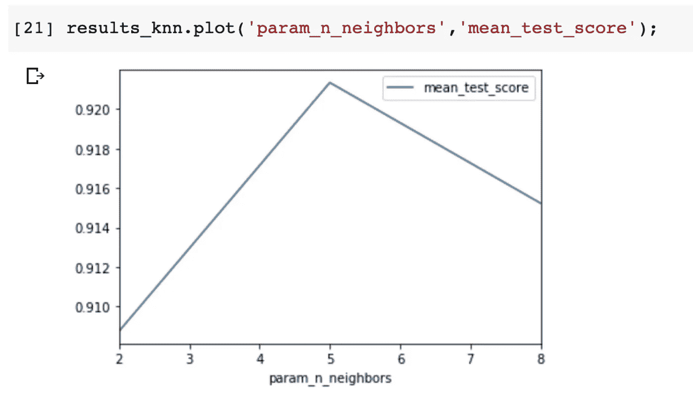
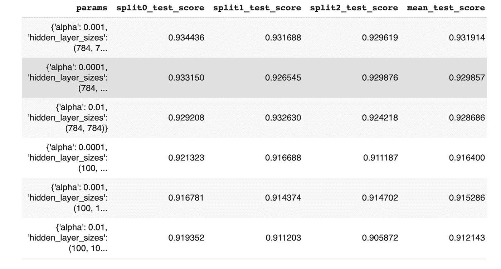

# 机器学习算法的最终对决

> 原文：<https://towardsdatascience.com/ultimate-showdown-of-machine-learning-algorithms-af68fbb90b06?source=collection_archive---------45----------------------->

## 有线电视新闻网、移动网络、KNN、兰登森林和 MLP。哪种算法最好？

Jaime Spaniol 在 [Unsplash](https://unsplash.com?utm_source=medium&utm_medium=referral) 上拍摄的照片

# 故事

gif 由 [Giphy](https://giphy.com/gifs/entourage-true-story-ari-gold-FotjY3LFxjFrW)

这一切都是从我年轻的表弟开始的，他迷失在自己的世界里，在他的画本上涂鸦。我问他在做什么。他回答说他正在做一只猫；它看起来一点也不像猫。他让我和他一起玩一个游戏，在这个游戏中，我可以认出他在画什么。有一段时间很有趣，但很快，我就厌倦了。我不想因为不和他玩而伤害他的感情，所以我用我的计算机视觉和 python 技巧做了一个涂鸦分类器。现在的问题是我将如何实现它；对涂鸦进行分类的方法有数百种，我必须选择最准确的一种，它需要最少的训练时间，占用更少的内存，需要更少的处理能力，并且不需要 TB 的数据来给出有意义的结果。

在网上冲浪后，我找到了能以最佳方式完成这项任务的前 5 种算法，但我访问的每个网站都讲述了不同的故事。有人说 CNN 是最好的，有人说移动网络是最好的。我想——好吧，让我们全部测试一下。我发现了一个很棒的数据集，其中包含了很多涂鸦，它们的标签都在一个 [Kaggle 竞赛](https://www.kaggle.com/c/quickdraw-doodle-recognition)中，可以免费下载。

图像分类是一个庞大的主题，因为有大量的算法可用于各种应用。图像分类是如此庞大和不断变化，以至于每天都有新的算法被创造出来，新的应用程序不断涌现。因此，对我来说，挑选几个算法是很困难的，因为它们有数百种变化。因此，这篇文章将专门研究哪种算法对涂鸦分类效果最好。

我还将测试这些算法在其他情况下的可靠性，如手写字符分类、车牌识别等。

# 涵盖哪些内容

1.  **研究中使用的 ML 技术简介**
2.  **评估指标**
3.  **为研究选择的参数详情**
4.  **结果**
5.  **局限性和结论**

# 让我们先简单介绍一下所使用的机器学习算法

gif by [Giphy](https://giphy.com/search/machine-learning)

涂鸦分类的算法有成千上万种，这里我列出了几个著名的算法，我将探索它们

## 1)随机森林

我们可以使用随机森林算法进行分类和回归。它就像决策树，只不过它使用数百棵决策树来得出一个结论。决策树根据相似的特征将数据分成不同的类别。对于每个数据点，它检查它是否具有某个特征，最常见的数据属于同一类。在随机森林算法中，我们采用许多决策树，并随机给它们较少的特征来检查，例如，如果我们有 100 个特征，我们可能给每棵树 10 个随机特征。一些树会分配不正确的类，但许多将是正确的！我们取大多数并创建我们的分类模型。

随机森林算法研究论文；

利奥·布雷曼

[饶彤彤](https://medium.com/u/840a3210fbe7?source=post_page-----af68fbb90b06--------------------------------)关于随机森林算法的一篇很棒的文章:

 [## 了解随机森林

### 该算法如何工作以及为什么如此有效

towardsdatascience.com](/understanding-random-forest-58381e0602d2) 

## 2) KNN

k-最近邻(KNN)既可用作分类算法，也可用作回归算法。在 KNN 中，数据点被分成几类以预测新样本点的分类。为了实现这一任务，它使用距离公式来计算各种数据点之间的距离，基于该距离，它然后为每个类定义区域边界。任何新的数据点都将落入这些区域中的一个，并将被分配到该类别。

关于 KNN 的研究论文:

[功德果](https://www.researchgate.net/profile/Gongde_Guo)

雷努·汉德尔瓦尔的一篇关于 KNN 的精彩文章:

 [## k-最近邻(KNN)

### 在这篇文章中，我们将了解什么是 K-最近邻，这个算法是如何工作的，有什么好处和…

medium.com](https://medium.com/datadriveninvestor/k-nearest-neighbors-knn-7b4bd0128da7) 

## 3) MLP

多层感知(MLP)是一种前馈人工神经网络。MLP 有许多层，但在其隐藏层只有一个逻辑函数，在输出层只有一个 softmax 函数。该算法将单个大向量作为输入，并在输入层和隐藏层上执行矩阵运算，然后结果通过逻辑函数，其输出通过另一个隐藏层。重复此过程，直到网络到达输出层，在输出层使用 softmax 函数产生单个输出。

关于 MLP 的研究论文:

[波佩斯库·马里乌斯](https://www.researchgate.net/profile/Popescu_Marius)

Jorge Leonel 的一篇关于 MLP 的精彩文章:

 [## 多层感知器

### 我们在这里已经看到感知器，这个神经网络的名字唤起了人们对未来的看法…

medium.com](https://medium.com/@jorgesleonel/multilayer-perceptron-6c5db6a8dfa3) 

## 4) CNN

卷积神经网络(CNN)是最容易实现深度学习的计算机视觉算法之一。首先，它采用给定大小的输入图像，并为其创建多个滤波器/特征检测器(最初是给定大小的随机生成的矩阵)，滤波器旨在识别图像中的某些模式，滤波器在图像上移动，矩阵和图像之间进行矩阵乘法。该滤波器在整个图像中滑动以收集更多特征，然后我们使用激活函数(通常是校正的线性单位函数)来增加非线性或仅保留重要特征，然后我们使用 max-pooling 函数将给定矩阵大小中的所有值相加(例如，如果我们选择 4 个矩阵，则它将所有 4 个值相加以创建 1 个值)，从而减小输出的大小以使其更快。最后一步是展平最终矩阵，该矩阵作为输入传递给基本 ANN(人工神经网络)并获得类别预测。

CNN 的研究论文:

[凯龙·泰洛·奥谢](https://www.researchgate.net/profile/Keiron_Oshea)

由[纳格什·辛格·肖汉](https://medium.com/u/61966d0f938f?source=post_page-----af68fbb90b06--------------------------------)在 CNN 上发表的一篇精彩文章:

 [## 卷积神经网络(CNN)简介

### 本文重点介绍与 CNN 相关的所有概念及其使用 Keras python 库的实现。

levelup.gitconnected.com](https://levelup.gitconnected.com/introduction-to-convolutional-neural-networks-cnn-1ee504bc20c3) 

## 5)移动网络

移动网络架构使用深度方向可分离卷积，其包括深度方向卷积和点方向卷积。深度方向卷积是通道方向 Dk * Dk 空间卷积，假设我们在图像中有 3 个通道(R，G，B ),那么我们将有 3*Dk*Dk 空间卷积。在逐点卷积中，我们的内核大小为 1*1*M，其中 M 是深度卷积中的通道数，在本例中为 3。因此，我们有一个大小为 1*1*3 的内核；我们通过我们的 3*Dk*Dk 输出迭代这个内核，得到 Dk*Dk*1 输出。我们可以创建 N 个 1*1*3 内核，每个内核输出一个 Dk*Dk*1 图像，以获得形状为 Dk*Dk*N 的最终图像。最后一步是将深度方向卷积添加到点方向卷积。这种类型的架构减少了训练时间，因为我们需要调整的参数较少，同时对准确性的影响较小。

关于移动网络的研究论文:

安德鲁·霍华德

Sik-Ho Tsang 的一篇关于移动网络的文章:

 [## 复习:MobileNetV1 —深度方向可分离卷积(轻型模型)

### 在这个故事中，来自 Google 的 MobileNetV1 被回顾。深度方向可分离卷积用于减少模型尺寸

towardsdatascience.com](/review-mobilenetv1-depthwise-separable-convolution-light-weight-model-a382df364b69) 

# 评估指标

用于研究的涂鸦样本

以上是用于这项研究的涂鸦样本。

我在[ka ggle quick draw 数据集](https://www.kaggle.com/c/quickdraw-doodle-recognition)上训练我的机器学习模型，该数据集包含 5000 万张不同类型涂鸦的图像。我把这个庞大的数据集分成两部分:35000 张图片用于训练，15000 张图片用于测试。然后，我在随机选择的 5 种不同类型的涂鸦上计算了每种算法的训练时间。在测试集上，我计算了每个算法的平均精度、准确度和召回率。

评估指标-

> 训练时间
> 
> 平均精度
> 
> 准确(性)
> 
> 回忆

由 [Shashwat Tiwari 16MCA0068](https://medium.com/u/75bc9075b8c4?source=post_page-----af68fbb90b06--------------------------------) 提供更多评估指标

 [## 机器学习评估指标完全指南

### 投入探索吧！

medium.com](https://medium.com/analytics-vidhya/complete-guide-to-machine-learning-evaluation-metrics-615c2864d916) 

此外，Shervin Minaee 的一篇好文章

 [## 20 个流行的机器学习指标。第 1 部分:分类和回归评估指标

### 介绍评估分类，回归，排名，视觉，自然语言处理和深度…

towardsdatascience.com](/20-popular-machine-learning-metrics-part-1-classification-regression-evaluation-metrics-1ca3e282a2ce) 

# 所选参数的详细信息

gif by [Giphy](https://giphy.com/gifs/doctor-strange-WPtzThAErhBG5oXLeS)

## 1)随机森林

**n_estimators** —一个森林中决策树的数量。[10,50,100]

**max_features** —分割时要考虑的特性['auto '，' sqrt']

**max_depth** —树中的最大层数[2，4，6，8，10]

**n_jobs** —并行运行的进程数，通常设置为-1，一次执行最多的进程。

**标准** —这是一种计算损失并因此更新模型以使损失越来越小的方法。['熵'，'交叉验证']

> 我用*‘auto’*作为**max _ feature**； *8* 为**max _ depth**； *-1* 作为 **n_jobs** 和 ***【熵】*** 作为我的**准则**因为它们通常给出最好的结果。

寻找最佳树数的图表

然而，为了找出最佳的树数，我使用了 GridSearchCV。它尝试所有给定的参数组合，并创建一个表来显示结果。从图中可以看出，80 棵树后的测试分数并没有明显的提高。因此，我决定在 80 棵树上训练我的分类器。

## 2)K-最近邻(KNN)

**n_neighbors** —要比较的最近数据点的数量[2，5，8]

**n_jobs** —并行运行的进程数，通常设置为-1，一次执行最多的进程

> 我没有改变这个模型的任何默认参数，因为它们会给出最好的结果。

然而，为了找到最佳数量的 **n_neighbors** ，我使用了 GridSearchCV，这是我得到的图表:

寻找最佳 N-邻居数量的图

根据图表，测试分数在*5*28】n _ neighbors 之后下降，这意味着 *5* 是最佳邻居数。

## 3)多层感知器(MLP)

**alpha**——俗称学习率，它告诉网络调整梯度的速度。[0.01, 0.0001, 0.00001]

**hidden_layer_sizes —** 它是一个值元组，由每层的隐藏节点数组成。[(50,50), (100,100,100), (750,750)]

**激活** —为图像中的重要特征赋予价值，删除无关信息的功能。['relu '，' tanh '，' logistic']。

**解算器—** 也称为优化器，该参数告诉网络使用哪种技术来训练网络中的权重。['sgd '，' adam']。

**batch_size —** 一次要处理的图像数量。[200,100,200].

> 我选择了**激活**为‘relu ’,选择**解算器**为‘Adam ’,因为这些参数给出了最好的结果。

然而，为了选择**隐藏层**和 **alpha** 的数量，我使用了 GridSearchCV。

查找最佳 N 邻居数量的表

从表中可以看出，当 **alpha** 为 *0.001、*和 **hidden_layer_size** 为 *(784，784)* 时，得到的结果最好。因此，我决定使用这些参数。

## 4)卷积神经网络(CNN)

l **earning_rate** -它告诉网络调整梯度的速度。[0.01, 0.0001, 0.00001]

**hidden_layer_sizes —** 它是一个值元组，由每层的隐藏节点数组成。[(50,50),(100,100,100),(750,750)]

**激活** —为图像中的重要特征赋予价值，删除无关信息的功能。['relu '，' tanh '，' logistic']。

**解算器—** 也称为优化器，该参数告诉网络使用哪种技术来训练网络中的权重。['sgd '，' adam']。

**batch_size —** 一次要处理的图像数量。[200,100,200]

**时期** —程序应该运行的次数或模型应该训练的次数。[10,20,200]

> 我选择了**激活函数**作为“relu ”,选择**解算器**作为“adam ”,因为这些参数通常会给出最佳结果。在网络中，我添加了 3 个**卷积层**，2 个 **maxpool 层**，3 个 **dropout 层**，最后还有一个 softmax **激活函数**。我在这里没有使用 GridSearchCV，因为可以尝试很多可能的组合，但是结果不会有太大的不同。

## 5)移动网络

**Input_shape-** 它是一个由图像的维度组成的元组。[(32,32,1),(128,128,3)].

**Alpha-** 是网络的宽度。[ < 1，> 1，1]

**激活** —为图像中的重要特征赋予价值，删除无关信息的功能。['relu '，' tanh '，' logistic']。

**优化器—** 也称为解算器，该参数告诉网络使用哪种技术来训练网络中的权重。['sgd '，' adam']。

**batch_size —** 一次要处理的图像数量。[200,100,200].**时期** —程序应该运行的次数或模型应该训练的次数。[10,20,200]

**类别-** 要分类的类别数量。[2,4,10]

**损耗-** 它告诉网络使用哪种方法计算损耗，即预测值和实际值之间的差异。['分类交叉熵'，' RMSE']

> 首先，我将 28*28 的图像调整为 140*140 的图像，因为移动网络要求最少 32*32 的图像，所以我使用的最终 input_shape 值是(140，140，1)，其中 1 是图像通道(在本例中是黑白的)。我将 ***alpha*** 设置为 *1* ，因为它通常会给出最好的结果。**激活功能**被设置为*默认*，即' *relu'* 。我使用了'*Adadelta*'**optimizer**，因为它给出了最好的结果。 **batch_size** 被设置为 *128* 以更快地训练模型。为了更准确，我使用了*20*历元。**类别**被设置为 *5* ，因为我们有 5 个类别要分类。

# 结果

gif by [Giphy](https://giphy.com/gifs/nervous-spongebob-sqaurepants-biting-nails-DUuyU3KyYGLNS)

最终结果(祈祷)

以上是使用的所有机器学习技术的性能。衡量标准包括准确度、召回率、精确度和训练时间。看到移动网络的训练时间是 46 分钟，这让我感到震惊，因为它被认为是一个轻型模型。我不确定为什么会这样，如果你知道为什么，请告诉我。

# 局限性和结论

1.  在这项研究中，只使用了 28*28 大小的黑白涂鸦，而在现实世界中，不同的颜色可以描绘或表示不同的事物，图像大小可能会有所不同。因此，在这些情况下，算法的行为可能会有所不同。
2.  在所有讨论的算法中，有许多可以改变和使用的超参数，它们可能给出不同的结果。
3.  训练这些算法的训练集仅限于 35000 幅图像，添加更多图像可以提高这些算法的性能。

结果表明，移动网络实现了最高的准确度、精确度和召回率，因此就这三个参数而言，它是最好的算法。然而，移动网络的培训时间也是最高的。如果我们将其与 CNN 进行比较，我们可以看到，CNN 花了更少的时间进行训练，给出了类似的准确性、精确度和召回率。因此，根据这项研究，我会得出结论，CNN 是最好的算法。

在做了这项研究后，我得出结论，像 mobile-net 和 CNN 这样的算法可以用于手写字符识别、车牌检测和世界各地的银行。像 mobile-net 和 CNN 这样的算法达到了超过 97%的准确率，这比人类 95%的平均表现要好。因此，这些算法可以在现实生活中使用，使困难或耗时的过程自动化。

您可以在此处找到代码:

 [## 谷歌联合实验室

### 编辑描述

colab.research.google.com](https://colab.research.google.com/drive/1aefccgDjDIPW6RVImtFG5fAlaI91ysbg?usp=sharing) 

# 参考

[手机网研究论文演练(YouTube)](https://www.youtube.com/watch?v=HD9FnjVwU8g)

[深度方向可分离卷积](https://www.youtube.com/watch?v=T7o3xvJLuHk) (YouTube)

 [## 20 个流行的机器学习指标。第 1 部分:分类和回归评估指标

### 介绍评估分类，回归，排名，视觉，自然语言处理和深度…

towardsdatascience.com](/20-popular-machine-learning-metrics-part-1-classification-regression-evaluation-metrics-1ca3e282a2ce)  [## 卷积神经网络(CNN)简介

### 本文重点介绍与 CNN 相关的所有概念及其使用 Keras python 库的实现。

levelup.gitconnected.com](https://levelup.gitconnected.com/introduction-to-convolutional-neural-networks-cnn-1ee504bc20c3)  [## 用深度学习涂鸦！

### 草图识别之旅

towardsdatascience.com](/doodling-with-deep-learning-1b0e11b858aa)  [## k-最近邻(KNN)

### 在这篇文章中，我们将了解什么是 K-最近邻，这个算法是如何工作的，有什么好处和…

medium.com](https://medium.com/datadriveninvestor/k-nearest-neighbors-knn-7b4bd0128da7)