# Unity3D 中 ML-agent 的终极演练

> 原文：<https://towardsdatascience.com/ultimate-walkthrough-for-ml-agents-in-unity3d-5603f76f68b?source=collection_archive---------18----------------------->

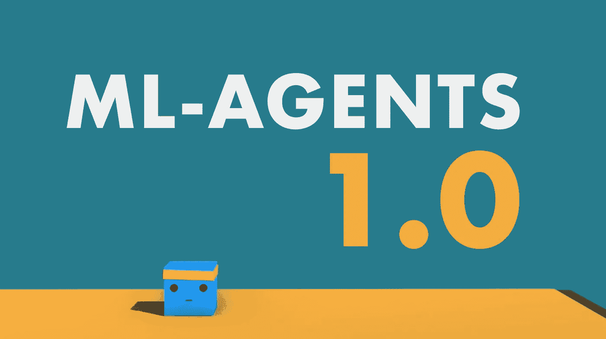

## 从头到尾通过机器学习训练人工智能

嘿！这将是一个快节奏的，完整的用 Unity 的 ML-agent 构建人工智能的演练。像一个优秀的电视厨师一样，我已经准备了一个简单的游戏，你可以从 [GitHub](https://github.com/Sebastian-Schuchmann/A.I.-from-Scratch---ML-Agents-Example) 中克隆。如果你想继续下去，一定要做到！🙂

**储存库** : [人工智能跳车](https://github.com/Sebastian-Schuchmann/A.I.-Jumping-Cars-ML-Agents-Example/tree/master)

目前，它只是一个人类控制的游戏，没有涉及机器学习，**还没有**！按下空格键，你可以让汽车跳跃，以躲避驶来的车辆。

我们将通过机器学习来训练人工智能做同样的事情，希望比我们— *或至少是我*能做得更好。如果你更喜欢看视频，这是给你的:

# 步骤 1:将我们的玩家转化为代理

这是一个简单的游戏，我们可以在以后增加复杂性。但是从简单开始会减少潜在的错误数量。我总是试图简单地开始，这几乎是无聊的。

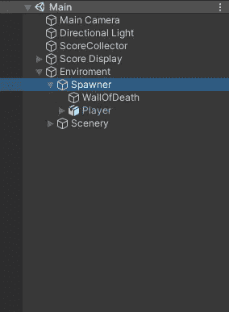

如果你打开主场景，你可以看到位于*环境*中的 *Spawner* 对象。在这里你可以决定被繁殖的敌人汽车以及它们被繁殖的间隔。但是我们可以让它保持原样。接下来，在我们的*产卵器*中，我们的*玩家*被一个叫做 *Jumper* 的简单脚本定位，它负责跳井。

Jumper.cs 剧本是我们真正关心的唯一剧本，因为这是我们的人工智能将控制的。顾名思义，我们的 ML-Agents 世界中的主角是**特工**——所以让我们把我们的 jumper 改造成一个。它应该从*代理*继承，而不是从*monobehavior*继承。

```
public class **Jumper** : Agent
```

哒哒🧙‍♂️，它现在是一个代理。接下来，我们向我们的玩家添加一个*行为参数***s**script，因为没有它，我们的代理是无脑的。姑且称之为“Jumper”之类的有用的东西吧。

现在，对于困难的部分，我们必须考虑我们的代理需要收集的观察结果——意味着它需要什么信息以及它可以采取什么行动。先从简单的开始，动作。

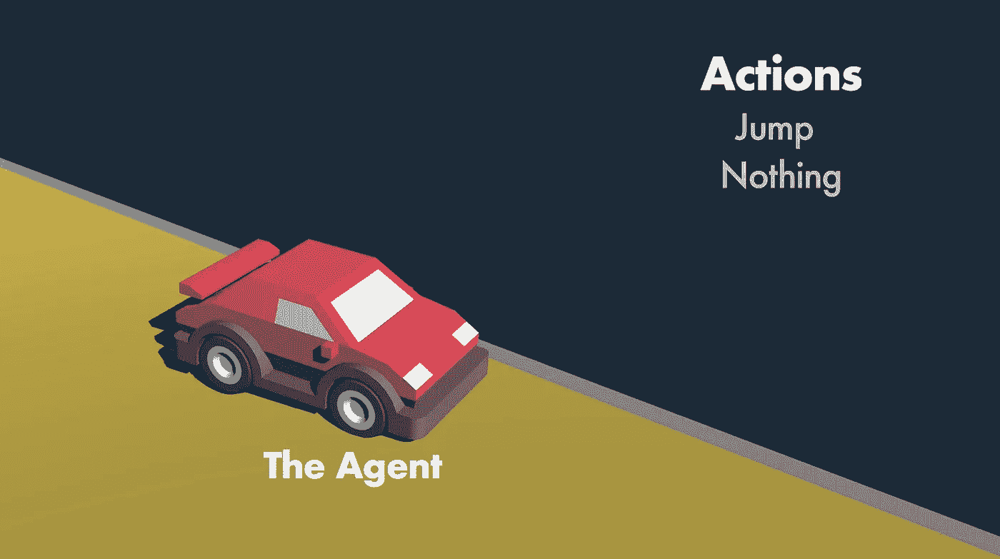

我们的代理可以**跳转**并且它可以**不做任何事情**。就是这样。所以我们有两个选项，这意味着我们有一个大小为 2 的*离散动作空间*，并且只有一个分支。

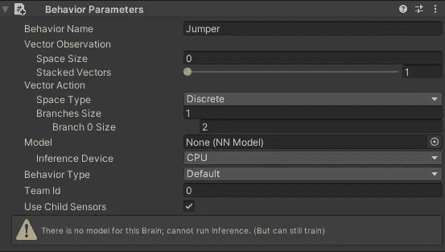

如果我们想把运动和跳跃结合起来，多分支是很有用的，例如:我们可以用一个分支运动，一个分支跳跃。一个单独的分支只能允许移动或跳跃，但不能同时允许两者。如果你想了解更多，可以看看 [*跳墙*](https://github.com/Unity-Technologies/ml-agents/blob/master/docs/Learning-Environment-Examples.md#wall-jump) 的例子。在我们的情况下，一个单独的分支就可以了。

接下来，观察。在这里，没有正确或错误的答案。试着想一想一个代理可以观察环境的几种可能的方法，每种方法需要多少数据，一个代理要做多少过滤，才能推断出有用的信息。真的，现在暂停阅读，好好想想…

…我的想法是非常简单地开始，我认为我们的代理人只需要到下一辆车的距离，就可以正确地选择跳跃时间。

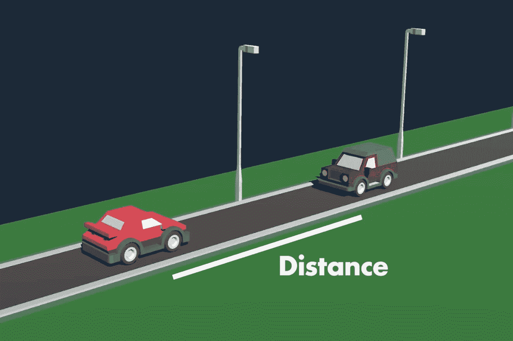

所以我会用一个*射线投射*，你可以想象它就像从代理射出的激光束，直到它击中某个东西。它可以记录是否有东西被击中，什么被击中，以及被击中的东西离它有多远。由于这是一种非常常见的观察方式，Unity 已经方便地准备了一个简单的脚本，我们可以使用它，**很好👌**。

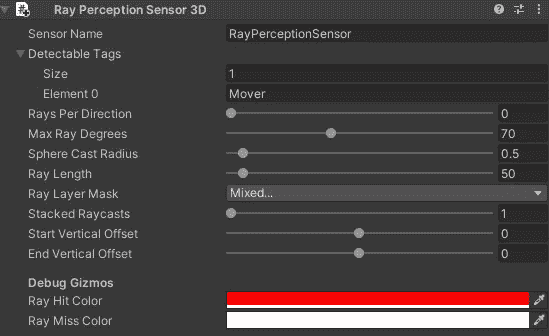

让我们将 *RayPerceptionSensor3D* 组件添加到我们的播放器中。我们已经可以在场景视图中看到光线的预览。首先，我们必须添加要检测的标签。在我们的例子中，产生的敌人有**移动者**标签，所以让我们添加它。接下来，*每个方向的光线*描述了中心左右的光线数量。因为我们只需要一条中心光线，所以可以将该值设置为 0。下一个相关值是*光线长度*。在我们的情况下，它至少应该走到路的尽头，为了安全起见，让我们在这里使用 50。为了确保光线不会碰到地面，让我们在起点和终点给它们一个 0.5 的垂直偏移量。

就是这样。我的建议是，只是玩玩滑块，看看会发生什么，以了解更多。光线投射真的很强大，是除了视觉信息之外观察环境最常见的方式。

如果我们现在开始游戏，如果前面有车，我们可以看到光线变成红色，太好了。起作用了。这个传感器的优点是它会自动将自己添加到观察中，因此不需要额外的代码，我们可以将观察大小设置为 0，因为它是为我们处理的。*这个框架是不是很奇妙？*

# 步骤 2:向我们的代理添加逻辑

好了，现在让我们进入 *Jumper.cs* 脚本。代理类中有一些基本的方法。让我们将它们添加到我们的代理中。*初始化*()，*on action received*()，以及 *OnEpisodeBegin* ()。这一次，我们实际上不需要 *CollectObservations()* ，因为我们只使用了传感器。但是我们应该添加*启发式*()方法，因为这是可以处理人类输入的地方。

**总是先手动测试你的代理**，这样你可以更快更容易地找到 bug。

```
public override void Initialize(){...}

public override void OnActionReceived(float[] vectorAction){...}

public override void OnEpisodeBegin(){...}

public override void Heuristic(float[] actionsOut){...}
```

首先，让我们把所有东西从*唤醒*()移到*初始化*()。简单。把 *Awake* ()方法删掉就行了，我们已经不需要了。

```
public override void Initialize()
{
    rBody = GetComponent<Rigidbody>();
    startingPosition = transform.position;
}
```

现在我们必须处理行动。 *OnActionReceived* ()方法有一个浮点数组参数。因为我们只有一个分支，所以我们只对第一个元素感兴趣。这个值要么是 0，要么是 1，所以也很简单。我们来确定 0 是什么都不做，1 是跳跃。不编码的好处是我们不需要编码任何东西，这意味着我们只需要检查 1 的情况。为了安全起见，在等式检查之前，我将把 float 底数设为 int。**嘭**，这是我们的动作功能:

```
public override void OnActionReceived(float[] vectorAction)
{
    if (Mathf.FloorToInt(vectorAction[0]) == 1)
        Jump();
}
```

现在，我们将在*启发式*()函数中检查输入，而不是在*更新*()中检查输入。现在只需将*更新*()中的所有内容移动到*启发式*()中，并删除*更新*()。由于调用这个函数的*学院*运行在 Unity 的固定更新循环中，如果我们试图使用 *KeyDown* 或 *MouseDown* ，输入检查可能会有点问题，所以使用 *GetKey* ()或 *GetAxis* ()来确保没有输入丢失。

现在，我们不调用*跳转*()函数，而是必须修改 a*actions out[]*，因为动作处理是由*on actions received()*函数管理的。无论我们放入*actions out[]*中的是什么，都会被*on actions received()*方法接收到。首先，我们将 a*actions out[0]*设置为零，如果某个键被按下则为 1。

```
public override void Heuristic(float[] actionsOut)
{
    actionsOut[0] = 0;

    if (Input.GetKey(jumpKey))
        actionsOut[0] = 1;
}
```

现在如果我们开始游戏…我们可以看到...什么都没发生😢。

这是因为现在不需要做出任何决定。改变这种情况的一个方法是给我们的播放器添加一个**决策请求器**组件。它与学院相关联，要求对学院的每一步做出决定。如果该值设置为默认的 5，则每隔 5 步。如果我们添加这个组件并将其设置为 1，它就可以工作了。但是我不会用。

为什么？因为我们可以优化它。当汽车在空中时，没有什么可做的，因为只有在路上才允许跳跃。简单来说，当汽车还在空中时，我们甚至不要请求做出决定。想象一下大脑在这段时间里是关闭的。让我们添加 *FixedUpdate* ()方法和 *Request a Decision* 如果*jump ready*。

```
private void **FixedUpdate**()
{
    if(jumpIsReady)
        RequestDecision();
}
```

同样，这只是做这件事的一种方式。如果你想到别的，试试看。

我们几乎准备好训练了，但是最重要的部分仍然缺失。**奖励⭐️** ！每个人都喜欢奖励，尤其是 A.Is。这一部分又很简单，但如果你做得不好，你真的会把一切都搞砸。不过不要担心😄。大多数情况下，简单直接的方法就可以了。一个基本的经验法则是输的时候惩罚-1，赢的时候奖励+1。由于这是一个高分游戏，没有输赢，所以我只是决定每辆车加 0.1 奖励。

这绝不是设计得最好的奖励系统，但它确实有效。如果您不确定—通过多次运行和预定义的步骤数进行测试，然后比较结果可能是您的最佳选择。但是稍后会有更多的测试。

在 *OnTriggerEnter* ()方法内部的脚本中，我们将调用 *AddReward* ()方法。

```
private void **OnTriggerEnter**(Collider collidedObj)
{
    if (collidedObj.gameObject.CompareTag("score"))
    {
        AddReward(0.1f); //New
        score++;
        ScoreCollector.Instance.AddScore(score);
    }
}
```

这个游戏中的计分方式是这样的:每辆车后面都有一个隐藏的立方体，在碰撞时触发 *OnTriggerEnter()* 方法。

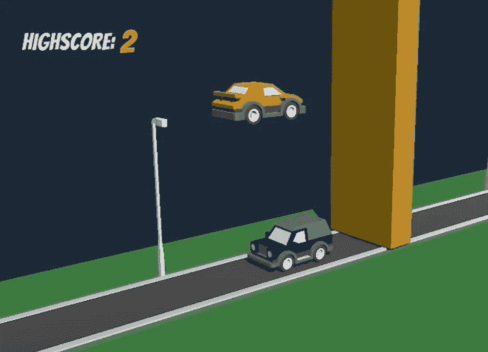

接下来，在 *OnCollisionEnter* ()方法中，我们发现玩家被传入的流量击中的情况。首先，我们用*结束模式*()方法替换*复位*()方法。接下来，我们将在这里添加一个负奖励。

```
private void **OnCollisionEnter**(Collision collidedObj)
{
    if (collidedObj.gameObject.CompareTag("Street"))
        jumpIsReady = true;

    else if (collidedObj.gameObject.CompareTag("Mover") || collidedObj.gameObject.CompareTag("DoubleMover"))
    {
        AddReward(-1.0f);
        EndEpisode();
    }
}
```

# 步骤 3:培训代理

我们现在终于可以开始训练了！为了优化训练，我们应该添加多个代理并构建一个独立的应用程序，**但是**我总是先用一个代理在编辑器中测试，以发现任何错误。现在，这个游戏有希望没有 bug，但是正如你所想象的，情况并不总是这样。

我假设你的系统上已经安装了带 ML-Agents 的 Python，如果没有，请点击查看安装指南[。](https://github.com/Unity-Technologies/ml-agents/blob/master/docs/Installation.md)

我们只需打开终端，将 *cd* 放入存储库，然后放入 *TrainerConfig* 文件夹。现在我们开始培训，输入:

```
mlagents-learn trainer_config.yaml --run-id="JumperAI_1"
```

您可以将 *run-id* 更改为您最喜欢的。第二个参数引用位于存储库内部的 *trainer_config* 文件。**只有当您在下载的库**的 *TrainerConfig* 文件夹中时，这个命令才有效！

如果你看到团结标志，一切都很好。现在我们切换到编辑器，按下播放，让人工智能训练足足 10 分钟。现在是观察训练过程的时候了，看看你是否能发现任何明显的错误。

通过放入

```
tensorboard --logdir=summaries
```

进入另一个终端选项卡，我们可以进一步检查它。左边的图表显示了一段时间内累积的奖励。

大约 10 分钟后。

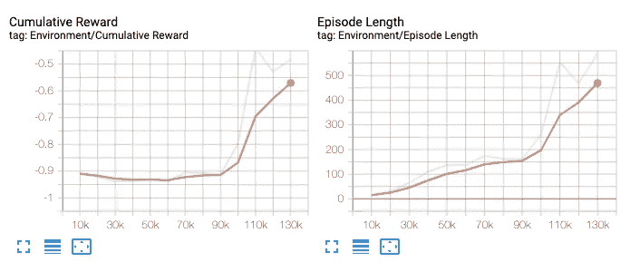

对我来说，在 8 分钟左右，第一次真正的改善开始出现，然后很快就变好了。这很好，它证实了我们的环境正在起作用。

下一步是用多个代理进行训练，以加快和稳定训练。在我们的例子中，这就像多次复制环境游戏对象一样简单。

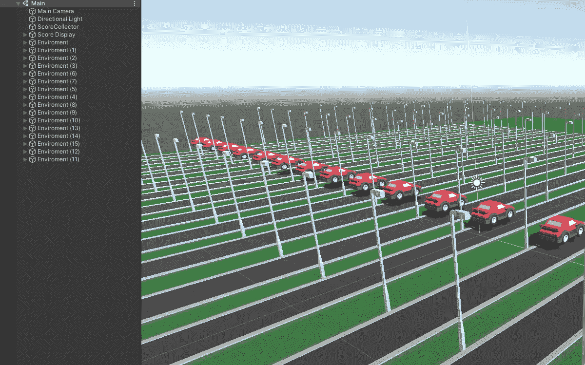

同样，我们首先按 play 并测试是否一切正常。如果是的话，那太好了。现在，让我们再次在编辑器中开始第二个培训过程，以确保多个代理按预期工作。我们将使用相同的命令，但改变 ID，以便我们可以比较运行。

```
mlagents-learn trainer_config.yaml --run-id="JumperAI_2"
```

*10 分钟后。*

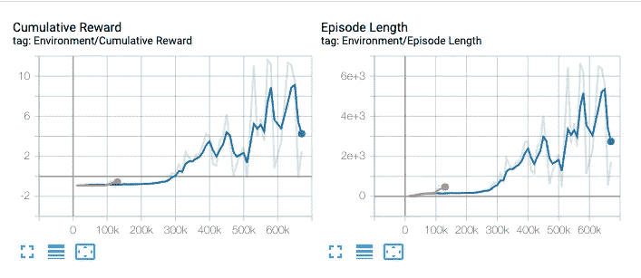

在我的情况下，它工作得非常好。我们可以看到第二张图要大得多。这是因为由于我们拥有的代理数量，我们在相同的时间内处理了更多的步骤。这也是我们从简单开始的原因—我们能够在几分钟的培训时间内验证我们的环境正在工作，而不是几个小时。

现在，为了正确和完整的培训，我们可以构建应用程序。再次执行 *mlagents-learn* 命令，这一次引用我们的构建文件，将时间刻度设置为 10，意思是 10 倍的速度，这在我的系统上运行良好，将图形质量级别设置为 0，将窗口宽度和高度设置为 512 或您喜欢的任何值。

```
mlagents-learn trainer_config.yaml --run-id=JumperAI_3 --env=../Build/build.app --time-scale=10 --quality-level=0 --width=512 --height=512
```

*60 分钟后。*

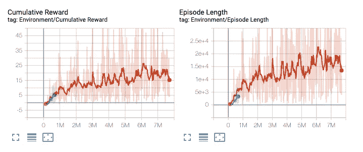

如果我们对结果满意，我们按 control+c，然后一个模型就生成了。我们可以拖动它。 *nn* 文件到我们的项目中，通过在层级中搜索*玩家*选择所有代理，并将其放入*模型*槽中。如果我们现在按 play，我们可以看到它正在执行我们的模型。自豪吧，你培养了一个人工智能，有多少人这么做过？

如果你在途中的某个地方迷路了，你可以随时查看库 中的[**【tutorial completed】分支，在那里你可以找到带有训练好的模型和完成的脚本的项目。**](https://github.com/Sebastian-Schuchmann/A.I.-from-Scratch---ML-Agents-Example/tree/TutorialCompleted)

我鼓励你尝试这个项目，创造你自己的风格。

和平！查看我的 Youtube 频道的人工智能相关内容。✌️