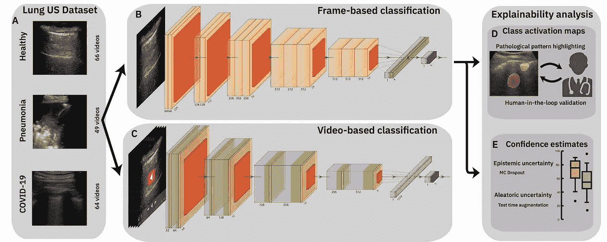
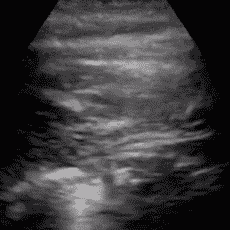
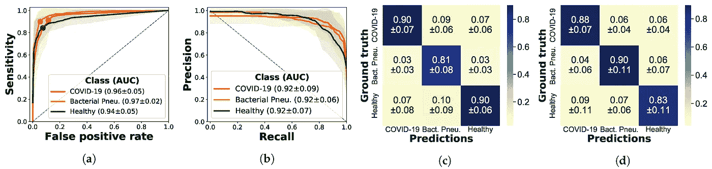
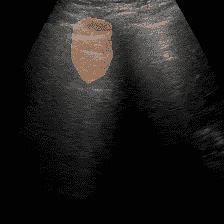
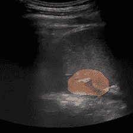

# 新冠肺炎的超声波——深度学习方法

> 原文：<https://towardsdatascience.com/ultrasound-for-covid-19-a-deep-learning-approach-f7906002892a?source=collection_archive---------44----------------------->

## 关于一个利用超声波自动检测新冠肺炎的开放倡议

## 您将从本文中学到什么:

*   CT 和 X 射线是新冠肺炎诊断过程中常用的评估方法，但医学界也提倡超声成像
*   超声波是优选的，因为它便宜、便携、易于消毒、无辐射且随处可得
*   我们的深度学习方法首次证明了在超声上自动检测新冠肺炎可能是可行的
*   有了可解释的机器学习方法，我们向医生的决策支持工具迈进了一步
*   在 GitHub 上开始了一项开放存取数据的倡议——贡献吧！
    [https://github.com/jannisborn/covid19_ultrasound](https://github.com/jannisborn/covid19_pocus_ultrasound)

迄今为止，已有超过 1 . 4 亿人感染了新冠肺炎病毒，300 多万人已经死亡。这种疾病仍在全球蔓延，几乎所有国家都受到影响。努力控制病毒的一个关键因素是快速可靠的检测。检测病毒 RNA 的新冠肺炎 RT-聚合酶链式反应测试(逆转录聚合酶链反应)被认为是最可靠的，但它的灵敏度在各国之间差异很大，有时假阴性高达 30%[1]，在发展中国家几乎没有。此外，PCR 测试需要几个小时，这是有问题的，例如在分诊的情况下，医生必须立即决定是否隔离病人。

这就是医学成像的用武之地。迄今为止最突出的是 CT，它已经在疫情早期用于新冠肺炎的快速诊断。研究表明，在 CT 上可以看到明显的不同模式，例如，空气间隙实变和所谓的(多灶性)毛玻璃阴影[2]。从报告来看，CT 似乎是一个非常有前途的工具，有时甚至在聚合酶链式反应测试失败时也很敏感[3]。但是它有很大的缺陷:CT 辐射大，价格昂贵，难以消毒。显然，这些缺点阻碍了 CT 在诊断中的广泛应用。作为一种替代方法，研究人员考虑了 X 射线，但预测能力较差。但是还有另一种医学成像工具，尽管它很受欢迎，但在新冠肺炎的环境中却没有得到太多的关注。我们在谈论超声波。

## 护理点超声波(POCUS)是

*   便宜:虽然一次 x 光检查估计要花费 370 美元左右，CT 从 500 美元到 3000 美元不等，但超声波(US)很便宜，只需大约 140 美元。此外，该设备本身很便宜，因此易于销售，便携式设备的起价为 2000 美元。
*   易于使用:几乎所有的医生都知道如何进行超声波检查。没有辐射那样的安全措施，而且设备很方便。
*   快速:使用一台设备，每小时可以进行 4 到 5 次肺部筛查
*   便携式:“护理点”说明了一切。病人不必移动，这节省了大量的时间和精力。
*   安全:我们不使用任何辐照元素。句号。任何 X 射线或 CT 检查都会略微增加患癌症的终生风险，尤其是对年轻患者而言。

尽管有这些优点，但超声仅在过去几年中被整合到肺部疾病的诊断过程中。可以分析某些特征病理模式，例如所谓的 B 线、A 线和条形码标记，以诊断所谓的胸腔积液、肺泡实变、间质综合征和气胸。由于新冠肺炎以类似的方式改变肺部超声模式，超声对新冠肺炎的适用性现在在几个出版物中进行了研究，其敏感性与 CT 进行了比较[4]。结果很清楚:根据[5，6，7]，[8](发表在权威杂志*《柳叶刀呼吸医学】* **上)的作者主张 us** 在新冠肺炎诊断中发挥更突出的作用，并提供证据表明 US 检测新冠肺炎的灵敏度与 ct 非常相似。

那么这是否意味着超声将很快取代 CT 作为诊断工具呢？不幸的是，事情没那么简单。一个值得注意的缺点是，在美国，医生必须经过培训才能识别 COVID，并且观察 COVID 特定的模式不是一项容易的任务，而是需要一些经验。在目前的情况下，进行广泛培训的时间有限。

我们相信，一个用于医生的辅助系统给出了一个解决方案，该系统利用计算机视觉技术对超声记录进行自动分类。这种系统可以支持医生的决策，并对病人被感染的可能性进行初步评估。在我们的研究中，我们朝着这个系统迈出了第一步，从各种在线来源收集了一组美国记录，对它们进行预处理，并训练一个神经网络对图像进行分类。我们在 arXiv[“poco vid-Net:从新的肺部超声成像数据集(POCUS)中自动检测新冠肺炎”的预印本](https://arxiv.org/abs/2004.12084)实际上是 COVID 在超声方面的第一项工作。在我们发表在应用科学杂志[“使用可解释的超声图像分析加速肺部病理检测”](https://www.mdpi.com/2076-3417/11/2/672/htm)的文章中，我们随后提供了一项对用于对肺部 US 数据进行分类的(可解释的)深度学习方法的综合研究。

让我们开始更详细地讨论我们的工作:

## 一个新的 POCUS 数据集

一个主要的贡献是收集了目前********(92 个新冠肺炎，73 个细菌性肺炎和 90 个健康对照)**的 250 多个[数据集](https://github.com/jannisborn/covid19_ultrasound/tree/master/data)。该数据集包含来自各种来源的数据，包括我们的合作者在诺森比亚(英国)的一家医院收集的未发表的临床数据，以及在 Neuruppin(德国)扫描的健康志愿者的记录，以及来自其他出版物和教育网站的数据。请注意，预处理数据需要做更多的工作——简而言之，在从视频中选择帧来创建图像数据集之前，我们手动裁剪了视频并移除了伪影。我们甚至在团队中一名医生的帮助下检查了数据的质量，他可以对每个视频中的可见模式提供宝贵的意见。最后，这产生了一个超过 3000 张图像的**干净数据集。**当然，这绝不是详尽无遗的，还有许多数据需要发现和处理。然而，我们认为在我们的 [GitHub 页面](https://github.com/jannisborn/covid19_ultrasound/tree/master/data)上提供数据和预处理管道是我们工作的主要部分，在这里您可以为我们的开放访问计划贡献数据。******

********

****一名新冠肺炎患者的肺部超声波检查(取自 http://www.thepocusatlas.com/covid19(第 4 天)，根据许可归属-非商业性 4.0 国际版提供)****

## ****深度学习方法****

****但是这些数据有用吗，神经网络可以学习从 US 图像中检测新冠肺炎吗？为了回答这个问题，我们训练了各种神经网络来区分新冠肺炎、肺炎和健康患者。我们的最佳性能模型利用预训练的 VGG-16 模型作为主干，后面是一个完全连接的层。诸如旋转、移动和翻转之类的增强有助于防止数据集上的过度拟合，对于具有两百万可训练参数的模型来说，数据集仍然相当小。****

****结果非常有希望——我们的模型实现了 88%的准确率来分类为新冠肺炎、肺炎和健康患者。下面你可以看到混淆矩阵，分别沿每个轴标准化。这些结果是在分层的 5 折叠交叉验证中获得的，确保来自同一视频的帧不在不同的折叠中。如下图所示，不同类别之间的性能是平衡的，这意味着对新冠肺炎和细菌性肺炎的敏感性和特异性都很高。这也表明，深度学习方法不仅对新冠肺炎来说，而且对一般的肺部病理学来说，都可能是一项值得努力的工作。****

********

****结果:新冠肺炎的特异性为 0.9，敏感性为 0.88****

## ****可解释人工智能——一个决策支持系统****

****当我们提出这些结果时，我们经常被问及我们是否试图用这些方法取代医生。明确的答案是否定的！相反，我们希望提供第二种意见，一种可以在诊断过程中帮助医生的系统。例如，如果一个软件可以在你可以在超声波上看到有趣的东西的特定时间点停止视频，然后在图像上突出显示异常，这不是很好吗？****

****************

****这样做的一种方法称为类激活映射(CAM)[9]，它突出显示图像中对神经网络预测最有决定性的部分。我们为我们的分类网络实现了 CAM，并观察到有趣的结果:通常，热图集中在超声上可见的所谓实变，这表明肺部有液体。此外，如示例所示，通常健康肺部的超声水平“A 线”也经常被摄像头拾取。****

****现在，为了找出这些激活图是否真的对临床实践有用，我们请两位医学博士对覆盖在一段视频上的 50 个激活图例子进行评价。这些凸轮总的来说是有用的。因此，我们认为这可能是一个非常有趣的研究方向，以改善特定病理模式的检测，并利用医生可以使用的实际软件的实施。****

# ****下一步是什么？****

****那么如何将这项初步但有前景的工作转化为实际应用呢？还有很长的路要走，但是为此，我们需要你的帮助。作为第一步，我们需要更多的数据来验证我们的模型——如果你有任何对我们有用的数据:通过[我们的 GitHub 页面](https://github.com/jannisborn/covid19_pocus_ultrasound)贡献给我们的数据集。我们也渴望支持任何旨在用我们的数据集改进机器学习模型的工作。
有了这些初步结果，重要的一步是在真实的临床数据上评估该方法。为此，我们目前正与一家医院合作进行一项临床研究，以验证我们的方法。进一步的研究可以在临床研究中系统地比较 CT、X 射线和超声波以及它们各自的自动检测方法。这将是一个巨大的飞跃。****

****但是，如果你不知道任何数据来源，也不是机器学习专家，仍然有许多可能性可以做出贡献。一件非常简单的事情就是提高对使用 POCUS 作为诊断工具的可能性的认识。分享我们的出版物，观看[我们的宣传视频](https://www.youtube.com/watch?v=qOayWwYTPOs)或查看[我们的开发帖子](https://devpost.com/software/automatic-detection-of-covid-19-from-pocus-ultrasound-data)，并访问我们的 [GitHub 登录页面](https://github.com/jannisborn/covid19_ultrasound)，其中提供了所有代码。如果您想投稿或有问题，请联系我们，欢迎任何反馈。感谢您阅读我们的工作！****

# ****参考****

****[1]杨，杨，等，“2019-nCoV 感染的病毒脱落的实验室诊断和监测。”(2020) *MedRxiv* 。
[2]杰弗里·P·凯恩。中国武汉 2019 年新型冠状病毒(2019-ncov)感染的胸部 ct 发现(2020 年)放射科医师的要点。
[3]艾，陶，等.“冠状病毒病 2019(新冠肺炎)胸部 CT 与 RT-PCR 检测相关性:1014 例报告”(2020) *放射学* : 200642。
[4]菲亚拉，M. J .“超声在新冠肺炎:与 CT 相关的超声发现时间表。”(2020) *临床放射学*。
[5] Smith，M. J .等人，“COVID‐19 患者的床旁肺部超声检查-叙述性综述。”(2020) *麻醉*。
[6]Sofia，Soccorsa 等，“胸部超声和 SARS-新冠肺炎:一篇图片论文。”(2020) *超声杂志*:1–5。
[7] Soldati，Gino 等人，“肺部超声在 COVID‐19 疫情期间有作用吗？."(2020) *医学超声杂志*。
[8]布昂森索、达尼洛、达维德·帕塔和安东尼奥·基亚雷蒂。"新冠肺炎爆发:少用听诊器，多用超声波."(2020) *柳叶刀呼吸内科*。
[9]周，，等.“学习深层特征用于鉴别性定位”*IEEE 计算机视觉和模式识别会议论文集*。2016.****