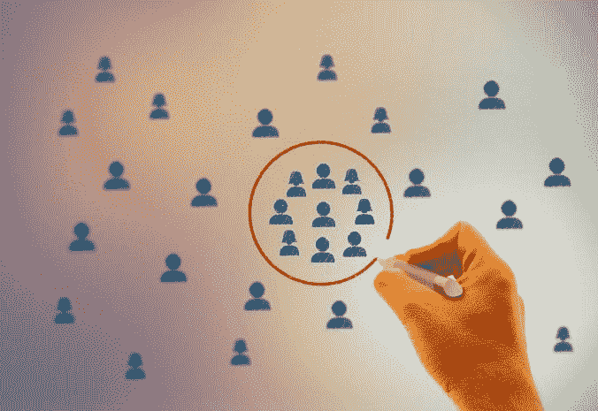
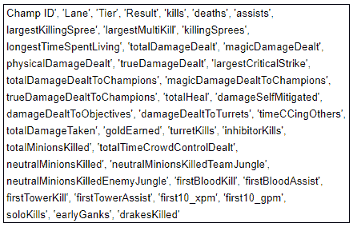
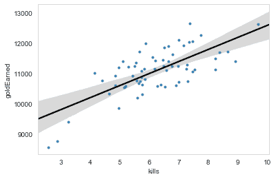
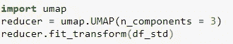
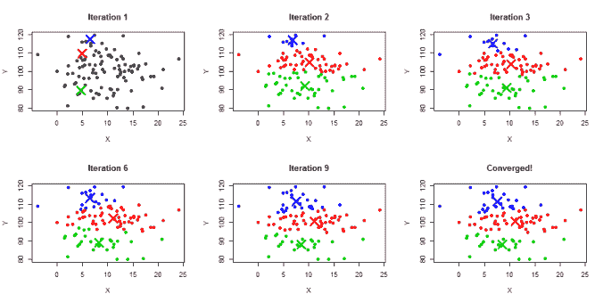
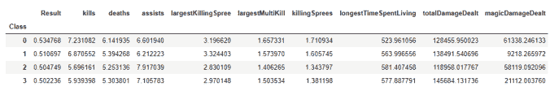

# UMAP 和 K-意味着对角色进行分类——以及它为什么有用(英雄联盟)

> 原文：<https://towardsdatascience.com/umap-and-k-means-to-classify-characters-league-of-legends-668a788cb3c1?source=collection_archive---------42----------------------->

利用降维和聚类算法将英雄联盟“冠军”进行分类。

[来源](https://www.stockvault.net/photo/178079/businessman-drawing-a-circle-around-people-icons)

[以下文章的 GitHub 可以在这里找到](https://github.com/JackWillz/Projects/tree/master/Champion%20Classes%20-%20UMAP%20and%20KMeans)

截至今天(2020 年 10 月)的，在线游戏《英雄联盟》中有 151 个“冠军”(可玩角色)，每个人都提供独特的个人游戏风格，这使其成为世界上最受欢迎的电子竞技。尽管这种多样性提供了一个引人入胜的竞争环境，但同时也给新玩家和分析师带来了复杂性。如果每个冠军都是独一无二的，一个新手怎么可能理解每场比赛的复杂性，或者一个分析师怎么可能总结一个球员的表现？

2016 年 4 月，Riot(游戏背后的公司)试图通过引入“冠军课程”来帮助解决这个问题。这由 12 个子类组成，分属 6 个类。这些是 Riot 的开发团队手工制作的，为新玩家习惯游戏提供了一个很好的起点。你开始玩几个游戏，看到一个叫“Thresh”的角色，快速检查会发现他的职业是“Catcher”，另一个角色也是:“Blitzcrank”，你以前和他交过手。虽然你错过了一些细节，但你明白总体思路是避免被它们抓住。

[关于类的原始文章的副本](https://lol.garena.com/news/general%E2%80%94dev-blog-classes-subclasses)

[更新班级名单](https://leagueoflegends.fandom.com/wiki/Champion_classes)

然而，这些课程很快就被搁置了，现在很少在任何内容中提到它们。这促使我回答了一个问题:**AI 会如何班每个冠军？这与暴乱的解释一致吗？如果是这样，我们还能了解到什么？为此，我们将该方法分为四个阶段。**

1.  数据收集、清理和特征创建。
2.  通过提取关键信号来降低数据的维数。
3.  使用聚类算法将冠军分成几类。
4.  分析课程以确定趋势和主题。

**关于游戏背景的预先说明(如果您熟悉游戏，请忽略):**

如果你不熟悉《英雄联盟》,你会漏掉一些内容。如果你想变得更熟悉，那么你可以阅读这个游戏的 [*介绍*](https://www.riftherald.com/2016/9/29/13027318/lol-guide-how-to-watch-play-intro) *。否则，最起码要知道这是一场 5v5 游戏，每个队都有一名球员扮演以下角色之一:顶级球员、中层球员、Jungler、ADC、支援。*

*如果你希望在文章中加入商业元素，那么将“冠军”转化为“顾客”，将“死亡”等数据转化为“购买”和“网站反弹”可能会有所帮助。你可以跳到文章的底部，获得一些在“真实世界”中使用的例子。*

## 数据收集、清理和特征创建

通常，第一种方法是启动一个 Riot API 会话，并开始查询他们庞大的数据湖。 ***注意:*** *我打算创建一个完整的指南来说明如何做到这一点，但同时请查看 GitHub 以了解详细信息。*我们首先决定将结果限制在钻石(接近顶级)玩家，因为它提供了大量被认为质量相对较高的游戏。总的来说，我们拉了 68，000 多场比赛，其中每一行都包含关于冠军的信息和一系列关键统计数据，从杀戮，死亡和助攻到最大的致命一击，抑制剂和龙的安全。

除了“标准”数据点，我们还可以考虑从可用数据中提取的替代特征。例如，可以查看一个名为“时间线事件”的数据集，并查看每次杀戮的详细信息。这包括地点、时间、凶手和被杀者。从这里，我们可以创建两个新功能:**单杀**:在一场游戏中有多少次玩家在没有帮助的情况下获得了一次杀戮& **早期漫游**:在一场游戏的前 10 分钟里有多少次玩家在不是自己的车道上获得了一次杀戮或帮助。

在没有过多阐述单调的情况下，数据被清理、转换，然后聚合到每一行都包含每个角色中冠军的平均统计数据(如果有的话)。这意味着 Ekko 在中间车道和丛林中有单独的一行，两者都包含每个统计数据的相关平均值。最终特征如下:

*分析的每场比赛的所有统计列表。*

## 通过提取关键信号降低数据的维度

我们现在的问题是，有太多的数据，很容易对每个冠军进行分类。重要的是，数据中存在大量的多重共线性*，其中许多列高度相关。例如，一个冠军平均杀死的数量和玩家连续杀死的次数，或者他们减少的伤害和他们受到的伤害之间有明显的关系。*

*幸运的是，降维提供了一个可靠的解决方案。无需在这一部分花费太多精力，这种技术采用所有已知的变量，并试图将数据“缩小”成更少的特征。为了帮助描绘一幅心理图画，想象你只有两个变量:杀死和获得的黄金。如果你把这些标绘成二维空间，你会得到类似如下的东西:*

**

**用回归线绘制的获得的黄金和杀死的总数的二维相关图。**

*现在，注意贯穿数据的最佳拟合线。如果你把它分离出来，并把它翻转过来，你会得到一条单一的一维线！实质上，1D 线是两个变量综合结果。左边是“穷不杀人”，右边是“富不杀人”。尽管您丢失了粒度数据，但您保留了它们在单一维度中的本质。虽然这是对幕后发生的事情的一种过于简单化的描述，但这可能有助于你的直觉。*

*至于降维工具包，有三个标准选项:*

*   *[主成分分析](/a-one-stop-shop-for-principal-component-analysis-5582fb7e0a9c)*
*   *[一致流形逼近和投影(UMAP)](https://arxiv.org/abs/1802.03426)*
*   *[t 分布随机邻居嵌入(t-SNE)](/an-introduction-to-t-sne-with-python-example-5a3a293108d1)*

*为了这个项目，我决定和 UMAP 一起去。我有两个原因:当试验各种技术和参数的组合时，我发现 UMAP 提供的类与我的直觉一致(是的，这使它有偏见！);在我以前的项目中，使用有正确或错误答案的标记数据(想想:癌症检测或数字识别)，UMAP 提供了比 t-SNE 和 PCA 更好的准确性结果。*

*应用这项技术非常简单，只用三行代码就可以完成。唯一值得一试的属性是数据将被简化成多少个部分。*

**

*UMAP 包的 Python 实现。*

*但是，请注意，在应用 UMAP 变换之前，数据应该标准化，为此，请在数据帧上使用 SKLearn 函数 StandardScaler。GitHub 可以看到更多关于这方面的信息。*

*作为总结，本节将 39 个原始特性转化为 5 个核心组件。每个组件都“包含”来自原始数据集的信息，但是已经根据它们的底层关系进行了分组。如果这有助于你的理解，想象一下一个组件被称为“杀死”，虽然包含了所有特征的一部分，但它与和杀死相关的变量关系最大(想想:黄金，杀死条纹，高伤害，等等..).**你可能会问，5 从何而来？**实验和测试！它似乎提供了最可行的结果(再次，偏见警告)。*

## *使用聚类算法将冠军分成几类*

*我们现在有了每个角色中每个冠军的 5 维数据集，是时候尝试将他们分为四类了。4 也是相对任意的，实际上可以使用任意数量的类。然而，从实验中我发现，当分成四个类时，简单性和多样性得到了很好的平衡。尽管这再次在过程中产生了偏差，但鉴于我们正在处理无监督学习，没有“正确”的答案或基于结果的方法来优化。在实践中，这些决定最终留给了那些具有领域知识的人(或者更常见的是，基于需求)。*

*为了创建这四个类，我们可以使用一种叫做 [**k 均值聚类**](/k-means-a-complete-introduction-1702af9cd8c) 的技术。该技术着眼于将数据放入围绕中心点的聚类中，其中每个数据点将根据它们与这些中心中的哪一个最近而被分类。为了做到这一点，该算法首先随机选择四个质心，并根据最接近的质心对每个冠军进行分类。一旦它们都被分类，它就找到这些新分配的簇的中心，然后使用它们作为更新的质心。这样一直持续下去，直到这些中心点稳定下来。*

*这里有一个可视化的算法来帮助你:*

**

**k-means 算法的可视化示例，从随机的三个点开始，然后慢慢向每个类的最终质心移动。**

## *分析课程以确定趋势和主题*

*一旦 k-means 在减少的数据上运行，我们现在将所有冠军分成四个单独的集群。由于我们是在一个 5 维空间中操作的，所以不可能可视化输出来帮助我们理解这些类，所以我们可以基于这四个类聚集所有的原始统计数据。因此，我们将有一个表，其中包含四个类以及我们从 Riot 数据湖中获取的每个要素的平均值。以下是摘录:*

**

**显示 ADC 角色中四个类的平均聚合统计信息的表。**

*现在是研究这些的时候了，以便更好地感受它们之间的不同。为此，我运行了一个脚本，将每个统计数据的类平均值与车道平均值进行比较，然后根据百分比差异对它们进行排序。*

*例如，在《丛林》中，我发现一个职业使得**在他们的游戏中有 18.23%的**第一次杀人，而**的角色**平均只有 12.77%。同样的职业也比平均水平少清理了 6%的丛林营地。被归类到这个集群的冠军？沙可，李辛，伊莉斯，赵信。这帮助我描绘了一个团队，我后来将它命名为*“3 营地 Gankers”*，参考这些冠军采取的共同丛林路径，他们在那里做红 Buff，蓝 Buff，Gromp，然后立即攻击一条车道或入侵敌人的丛林营地(感谢 [jung.gg](http://jung.gg) 提供的数据)。*

*您可以在这里找到每条赛道所有级别的列表、简短描述、哪些 meta Champions 适合它们，以及超过平均水平的 3 个关键统计数据和表现不佳的 3 个关键统计数据:*

*[**AI 生成 LoL 类**](https://docs.google.com/spreadsheets/d/16J-05GRSIePLRqmpvZGETGVoNJxZGUQAy_ZCxUiZTlw/edit?usp=sharing)*

***关键点:**我在这里强调的一点很关键，提供这些优点和缺点是为了给每个职业一个快速的直觉。对于个人冠军**而不是**来说，拥有和我选择的人一样的**实力是很常见的。他们仍然属于这个班级的原因是，平均而言，在所有的统计数据中，他们比任何其他人都更接近于那个，但他们不一定是这个班级的完美孩子！***

***例如，中间车道的冠军 Kassadin 被归类为*漫游者*他们的优势在于他们经常在游戏早期攻击敌人的车道。卡萨丁本人并没有分享这种特殊的品质，但是他和这个职业分享了比其他职业更多的其他属性。***

## ***那又怎样？***

***正如我经常说的，为人工智能而人工智能是浪费时间。**将**冠军分段成班有什么**好处**？这是一个非常有效的问题，也是在研究任何技术、方法或项目时都应该提出的问题。这里有几个例子(虽然有些夸张和虚构)可能有助于回答这个问题(**警告:**除非你熟悉这个游戏，否则你可能很难理解，如果不熟悉——第三个例子适用于商业问题):***

> ***你是一家领先的欧洲职业电子竞技团队的分析师。在一次前所未有的事件转折中，对方球队的首发中场球员在走上舞台时戏剧性地摔倒受伤，并被一名第一次上场的新秀取代。离冠军评选还有 10 秒钟，你的主管蔻驰跑过来对你说“我需要了解他什么？!"。根本就没有时间开始列出他的共同冠军和独奏队列性能统计数据。你需要一句俏皮话来给教练提供足够的信息，让他有优势。幸运的是，你已经有了早期人工智能生成的冠军职业，所以你对玩家最近 50 场单人队列游戏进行了快速分析，并说:“他最常见和表现最好的冠军职业是安全定标员！”。你已经向教练简单介绍过了，他知道你的意思。他的目标是 bans Azir 和 Corki，然后首先选择 Orianna。这个家伙窒息了，因为他要么被迫玩一个较低层次的安全定标器，要么被迫离开他的舒适区，在那里他不断被抓到并喂食。***

***这是一个过于感性化的例子，但却传达了一个重要的信息:**现在的总结有时比以后的细节更好。*****

> ***一个更快且(稍微)不太引人注目的例子是，如果你在第 10 季中以毛凯的身份统治第一车道，却在 10.22 补丁中读到他将被遗忘，他的所有基础数据都减少到-40。你喜欢他的踢球风格，想找个人来代替他。你会发现毛凯被认为是一个推动者和参与者，就像马尔菲特和奥恩一样。Ornn 目前有 98%的胜率，所以你决定他将是你最后几周攀登的合适人选。***

***寄语:**知道如何宽泛地描述你喜欢的东西有助于你找到你可能喜欢的其他东西**。事实上，我写了一篇文章[使用类似的技术来推荐冠军。](/pca-and-content-based-modelling-for-champion-recommendation-league-of-legends-80e909e56672)***

***我还将提供一个业务示例，因为我认为欣赏这些技术的“真实世界”使用是很重要的:***

> ***假设您是一家小配件公司的营销主管，最近您获得了一笔预算，要创建五个营销活动发送给当前的客户。如果你执行上述相同的步骤，但使用人口统计、购买和网站互动等数据，你可以将你的客户分为五个“类别”。通过研究这些，您将能够针对特定类型的客户量身定制您的活动，从而提高其有效性。例如，您可能会发现一组客户是“重度研究人员”,他们不定期购物，在做出决定之前会在网站上花很长时间，通常会将物品放在篮子里几个星期。另一方面，有些“自发”顾客点击了 Instagram 链接，并在 30 秒内结账。第一类中的所有客户都会收到一封电子邮件，其中包含关于您最新产品的详细报告、优点、缺点和更详细的信息。二班收到一段 Instagram 视频，视频中有一只可爱的狗狗在玩你的产品。***

***信息？个体层次的分析是强大的，但是对于用例来说通常是不可行的。在这种情况下，为了完成工作，可以“扔掉”一些更精细的细节。***

***你已经看到文章的结尾了！我叫 Jack J，是一名将人工智能应用于竞技游戏和电子竞技的专业数据科学家。我是[iTero**的创始人。GG**T5【和](https://itero.gg/)[jung . GG。你可以在](https://www.jung.gg/) [**Twitter**](https://twitter.com/JackJGaming) 上关注我，加入 [**iTero Discord**](https://discord.gg/hZmk3z6adP) 或者给我发邮件到 **jack@itero.gg** 。下一场见。***

****原文发表于:【https://itero.gg/blog】****