# 结合 Knime 和 Python 的嵌入和聚类

> 原文：<https://towardsdatascience.com/umap-dimension-reduction-and-dbscan-for-clustering-mnist-database-within-knime-421f471fcbd?source=collection_archive---------28----------------------->

## [实践教程](https://towardsdatascience.com/tagged/hands-on-tutorials)

## KNIME 中聚类 MNIST 数据库的 UMAP 降维和 DBSCAN


聚类。橄榄和树叶。形状和颜色。(图片由作者提供)

[Knime](http://www.knime.com) 是一个免费的开源数据分析、报告和整合平台。KNIME 通过其模块化的数据流水线概念，集成了用于[机器学习](https://en.wikipedia.org/wiki/Machine_learning)和[数据挖掘](https://en.wikipedia.org/wiki/Data_mining)的各种组件。对于像我这样没有很强编码背景的人来说，Knime 是端到端数据科学体验的大门。在过去两年与 Knime 的合作中，我已经能够理解数据科学的全球图景，我将我的恐惧抛在身后，现在我在充满挑战和令人惊叹的数据科学世界中越走越深。

几天前，我在《走向数据科学》上读到了一篇文章，作者是[罗莎丽亚·西里波](https://medium.com/u/fb562cc4a1e2?source=post_page-----421f471fcbd--------------------------------)和[米莎·利索夫伊](https://www.linkedin.com/in/misha-lisovyi/)，展示了一个非常好的 [Knime 工作流，其中涉及应用于 MNIST 数据集的 t-SNE](/is-zero-closer-to-eight-or-to-one-c6392242b696) 。我曾经和 UMAP 一起做过类似的工作流程，效果不错。

受到 Linkedin 上的 Rosaria Silipo 的鼓励，我决定发表我的第一个故事。

# 这个故事的提议是什么？

本文的原始资料是闫乐存的从 0 到 9 的手写数字的 OpenML 的 [MNIST 数据集。该数据集包含 70000 个 28x28 像素的手写数字，灰度等级为 0-255。也就是说，我们有 70000 个向量，维数是 784。](https://www.openml.org/d/554)

该数据在 Knime 内的 Python 脚本中读取，并在该 Python 脚本上应用 UMAP 降维算法，因此我们可以将数据集的每个图像映射到低维空间的一个点上。出于表现结果的目的，逻辑上，我使用 2D 和 3D 作为目标尺寸。

之后，为了更有趣，由于生成的 UMAP 嵌入数据忽略了标签，我在 Knime 中应用了一个 DBSCAN 节点来对结果进行聚类。我们稍后将检查结果。

# UMAP:降维的一致流形逼近和投影

> [均匀流形近似和投影(UMAP)](https://umap-learn.readthedocs.io/en/latest/index.html) 是一种降维技术，可用于类似于 t-SNE 的可视化，也可用于一般的非线性降维。该算法基于对数据的三个假设
> 
> -数据在黎曼流形上均匀分布；
> 
> -黎曼度量是局部常数(或者可以近似为常数)；
> 
> -歧管是局部连接的。

什么是黎曼流形？等等！！什么是流形？流形是 n 维的拓扑对象，在一个点的邻域上，它的局部行为类似于 n 维欧几里得空间。一个好的外行例子是地球。Rieamannian 流形是光滑的可微流形，其中可以定义函数的长度、曲线、角度、体积、梯度等概念。更多关于流形或黎曼流形的信息，试试这里的和这里的。

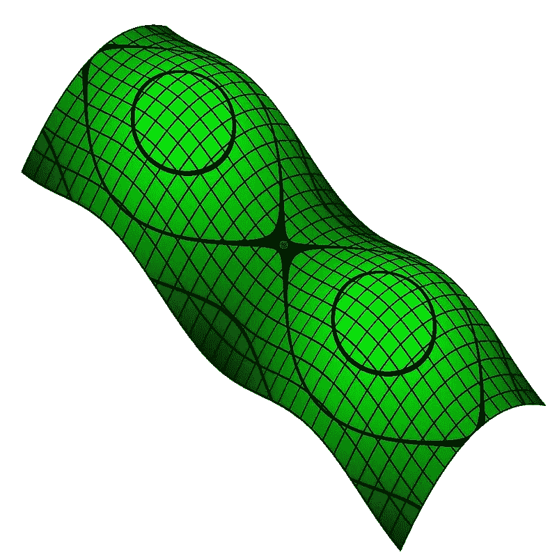

维基百科中的一个黎曼流形。(斯特拉特，公共领域，通过[维基共享](http://StuRat, Public domain, via Wikimedia Commons))

UMAP 有一些参数来控制其性能。

***n _ neighbors****:n _ neighbors 越大，算法寻找的邻域越大，并且趋向于全局整体结构。n_neighbors 越低，UMAP 将关注的细节结构越多。*

***最小距离*** *:定义算法将考虑在最终缩减空间中将点打包在一起的最小距离。这意味着较小的最小距离值将导致较小的聚类嵌入。另一方面，最小距离的高值将导致 UMAP 算法指向全局结构。*

***度量*** *:我们可以定义算法在原始空间中计算距离的度量。*

难以消化！我知道。对工程师来说近乎神奇。从黑暗中走出来，明确地(简单地！！)，UMAP 通过 n 维点(n 低至 2)对每个高维对象进行建模，使得相似的对象通过附近的点进行建模，而不相似的对象通过远处的点进行建模的概率很高。

# 基于密度的噪声应用空间聚类

DBSCAN， [**基于密度的具有噪声的应用的空间聚类**](https://www.dbs.ifi.lmu.de/Publikationen/Papers/KDD-96.final.frame.pdf) ，是在无监督的 lerning 方法中考虑的一种聚类算法。基于三个输入参数，该算法能够通过将紧密地打包在一起的点(具有一定数量的附近邻居的点)分组在一起，将单独且远离地位于低密度区域(其最近的邻居太远)中的那些点标记为噪声，来将一组数据群集化。

可以想象，支配 DBSCAN 算法的性能的参数与决定一个点是否彼此靠近的距离 *epsilon* 有关，并且还与认为一个点是“邻域”或核心点所必需的附近点的最小数目*最小点*。集群是所有核心点及其邻居的总和。最后，在 Knime 扩展 [KNIME 距离矩阵](https://kni.me/e/He68zjghsrLBqltN)中包含的 DBSCAN 的 KNIME 节点中，我们可以看到需要一个度量输入，因此算法具有必要的距离模型来计算数据集上点之间的 de 距离。

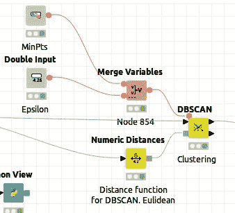

正在配置 DBSCAN 节点。(作者图片)

总结一下:

***epsilon*** *:指定点之间的距离，因此它们可以被认为是集群的一部分。如果两个点之间的距离小于 epsilon，则这两个点将被视为属于同一集群的邻居。*

***最小点数*** *:从点 p 可达的最小点数，使得点 p 可被视为核心点。*

***距离模型*** *如前所述，需要用距离模型通知 DBSCAN 节点对数据集中的点间距离进行评估。为此，我们使用 Mumeric Distance 节点。*

DBSCAN 算法的显著优点是:

*   DBSCAN 不需要用户指定群集的数量。
*   DBSCAN 管理噪声概念，并丢弃和标记噪声点

# Knime 工作流

这两个 Knime 工作流均在 Knime Hub 中发布和提供:

[UMAP DBSCAN MNIST 2D 巨蟒](https://kni.me/w/wNDZj8xqFkJgbgzz)。UMAP 2D 维嵌入

[UMAP DBSCAN MNIST 3D 巨蟒](https://kni.me/w/NCrq2LknJF3fUtui)。UMAP 三维嵌入

我将只关注 2D 解释，因为两个工作流实际上是相同的。不过，我会在最后展示两者的比较结果。

遵循你可以看到整个工作流程，稍后我会解释它逐块。

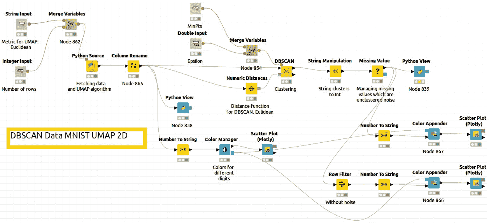

2D UMAP 嵌入的工作流程。(图片由作者提供)

## Python 脚本

接下来，您可以找到第一个数据块的详细图片，使用该数据块从 [Knime Python 扩展的 Python 源节点中提取数据并计算 UMAP。](https://kni.me/e/9Z2SYIHDiATP4xQK)

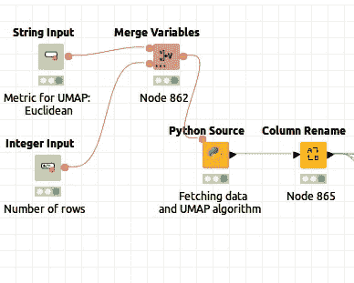

Python 抓取和 UMAP。(图片由作者提供)

中间的橙色块是 Python 源节点，包括用于从 OpenML 获取数据和执行 UMAP 技术的脚本。两个变量节点“Metric”和“Number of rows”被合并并像 UMAP 算法的输入一样被传递。对于最终的结果，我使用了欧几里德度量，关于“行数”整数输入节点，我只是在测试时用它来改变低数值。只是时间问题。在右边，我使用列重命名节点在工作流中用可理解的名称命名列。

在这里，您可以找到 Python 源节点中的代码:

```
from pandas import DataFrame
from sklearn.datasets import fetch_openml
import numpy as np
import matplotlib.pyplot as plt
import seaborn as sns# Dimension reduction and clustering libraries
import umapin_batch = flow_variables[‘input_batch’]
umap_metric = flow_variables[‘metric’]#Varias metricas posibles
 # mnist_784
 # Fashion-MNIST
mnist = fetch_openml(‘mnist_784’, version=1, as_frame=False)
mnist.target = mnist.target.astype(int)standard_embedding = umap.UMAP(
 n_neighbors=30,
 min_dist=0.0,
 n_components=2,
 metric=umap_metric,
 random_state=42
 ).fit_transform(mnist.data[:in_batch, 1:])#Añadimos los target
array2D_1=standard_embedding
array2D_2=mnist.target[:in_batch]
array2D_2=np.reshape(array2D_2,(in_batch,1))
array_to_save=np.concatenate((array2D_1,array2D_2),axis=1)# Output table for the node
output_table = DataFrame(array_to_save)
```

## 第一次绘图

在执行了 UMAP 算法之后，我们有了 MNIST 数字的 2D 映射。为了比较结果，我使用了两种不同的绘图方法。

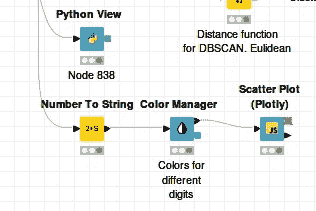

策划 UMAP。(图片由作者提供)

*UMAP 输出散点图(Plotly)结合色彩管理器*

来自[的散点图 Plotly Knime 扩展](https://kni.me/e/NXfbxRi-JV1Tt7yC)是一个非常好的节点。结果是交互式的，输出颜色可通过颜色管理器节点进行配置，因此缩减的 2D 空间中的数据集点可根据其在嵌入前在原始空间中的位数进行标注。

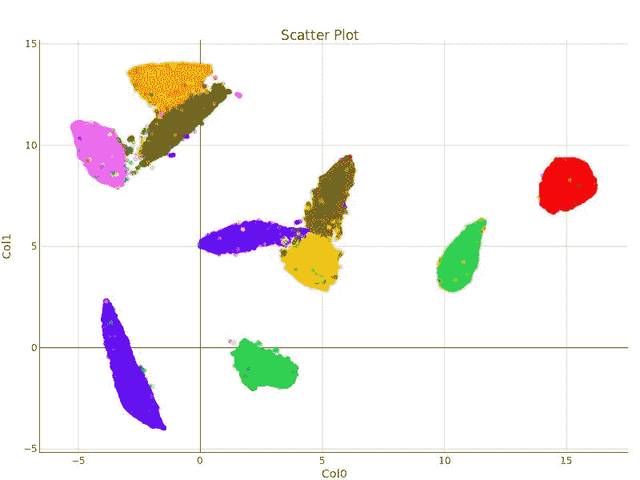

用散点图绘制的 UMAP 算法定义的 2D 簇。(图片由作者提供)

或者，在 3D 中，我们可以使用散点图节点，而不是散点图节点，结果如下。

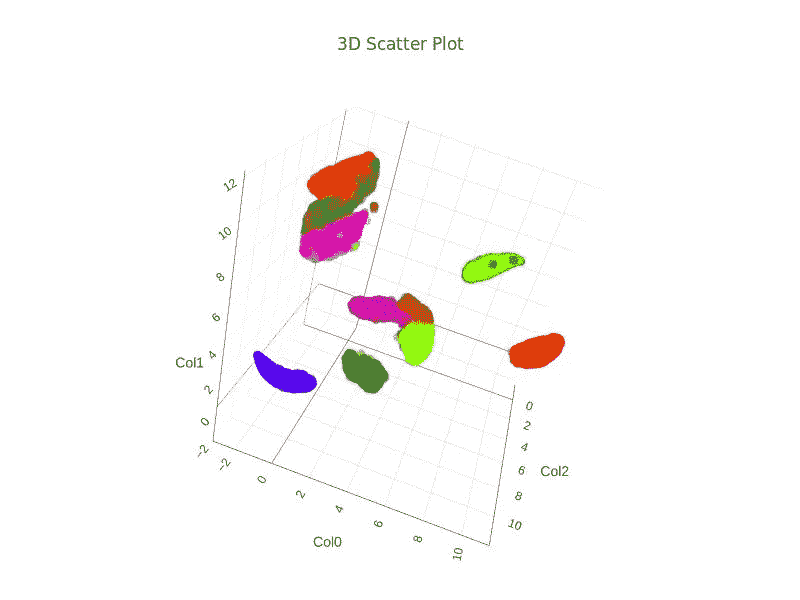

用散点图 3D 绘制的 UMAP 算法定义的 3D 聚类。(图片由作者提供)

请注意，UMAP 算法已经在 2D 和 3D 中检测和绘制了相同的 10 个清楚区分的簇。

*用 Python 视图输出 UMAP*

使用 Python 源节点和一段代码，也可以找到类似的结果。

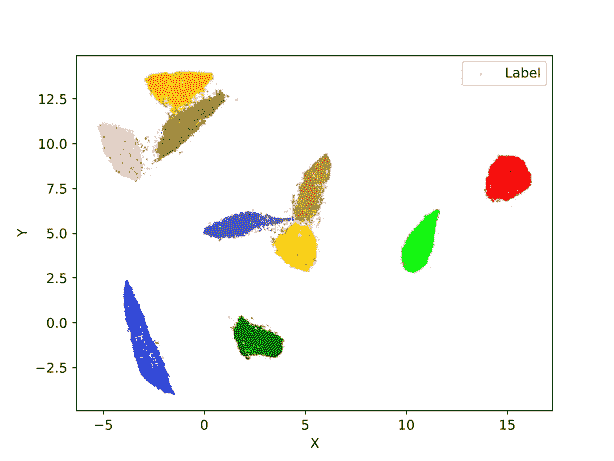

用 Python 绘制的 UMAP 算法定义的 2D 聚类。(图片由作者提供)

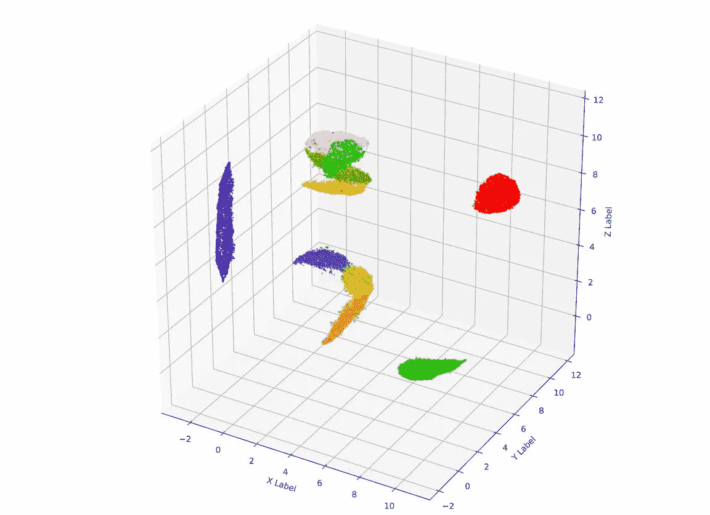

用 Python 绘制的 UMAP 算法定义的三维聚类。(图片由作者提供)

接下来，您可以在 Knime 的 Python 视图节点中找到执行这两个绘图的代码片段。

为了 2D

```
from io import BytesIO
import matplotlib as mplt
import matplotlib.pyplot as plt
import numpy as nplabel_array=input_table['Col2']
colors = ['red', 'blue', 'green', 'yellow', 'orange', 'peru', 'lime', 'pink', 'steelblue', 'olive']plt.scatter(input_table['Col0'], input_table['Col1'],
   c=label_array, alpha=0.5, marker='o',
   cmap=mplt.colors.ListedColormap(colors),
   s=0.1,
            label="Label")
plt.xlabel("X")
plt.ylabel("Y")
plt.legend(loc='best')buffer=BytesIO()
plt.savefig(buffer,format="svg")
output_image = buffer.getvalue()
```

对于 3D:

```
from io import BytesIO
import matplotlib as mplt
import matplotlib.pyplot as plt
import numpy as np
from mpl_toolkits.mplot3d import Axes3Dlabel=input_table['Col3']colors = ['red', 'blue', 'green', 'yellow', 'orange', 'peru', 'lime', 'pink', 'steelblue', 'olive']fig = plt.figure(figsize=(12,12))
ax = fig.add_subplot(111, projection='3d')ax.scatter(input_table['Col0'],input_table['Col1'] ,input_table['Col2'],
           c=input_table['Col3'],
           cmap=mplt.colors.ListedColormap(colors),
           marker='o',
           s=1)ax.set_xlabel('X Label')
ax.set_ylabel('Y Label')
ax.set_zlabel('Z Label')buffer=BytesIO()
plt.savefig(buffer,format="svg")
output_image = buffer.getvalue()
```

## DBSCAN 节点和 sorroundings

因此，到目前为止，我们有一组 2D(或 3D)点，代表一组 700000 个书面图像。我们知道哪个原始数字对应于缩减空间的每个点，因为原始标签已经添加到 UMAP 输出中，正如您在此处看到的:


第 0 列:X，第 1 列:Y，第 2 列:对应于原始数字的标签。(图片由作者提供)

但是想象一下我们没有原始标签。我们会有大量没有进一步信息的点，如下所示:

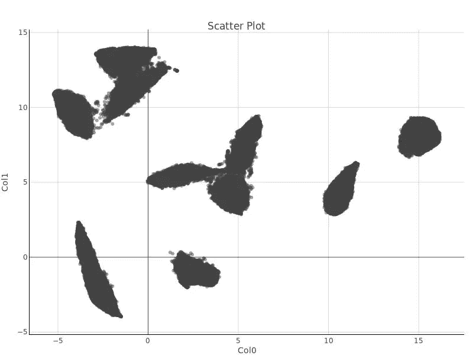

未标记的点，在灰色物质下面有什么结构吗？。(图片由作者提供)

现在是时候使用 DBSCAN 并尝试找到在这个分散的无意义的图下面是什么结构了。


DBSCAN 节点。(图片由作者提供)

我们将 UMAP 的输出驱动到 DBSCAN 节点。此外，我们为其余的 DBSCAN 输入提供变量，尽管它们可以在节点内部配置。

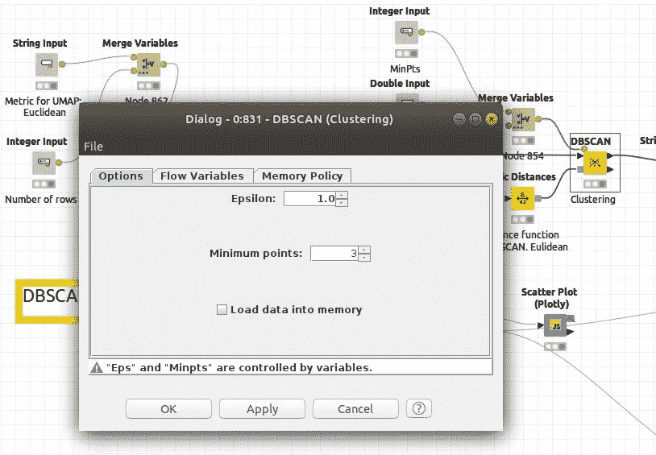

DBSCAN 的配置屏幕。参见注释“Eps 和 Minpts”由变量控制。(图片由作者提供)

对于 2D DBSCAN，我使用了*ε= 0.15*和*最小点数=50* 。数值距离节点中的公制被配置为欧几里得。

经过一些字符串操作后，输出是一个包含聚集数据的表。

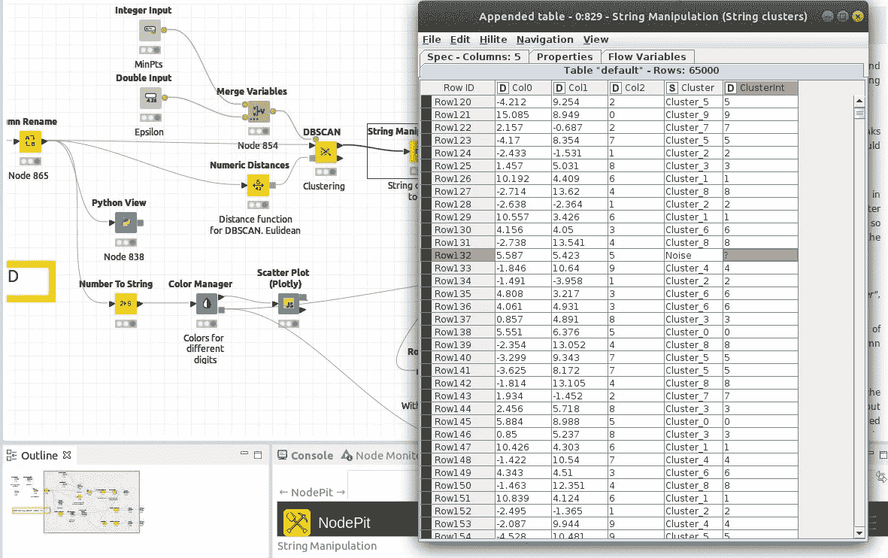

请参见包含集群数据的最后一列。请参阅高亮显示的行，其中一个点被认为是噪点。(图片由作者提供)

如果我们在 2D 或 3D 的缩减空间内绘制点，并用 DBSCAN 产生的聚类进行标记，我们会发现什么？

让我们看看。

# 总体结果

在下图中，您可以看到 DBSCAN 识别的群集与 UMAP 根据原始映像交付的群集相同。这是非常令人满意和美好的。


2D 数据库扫描聚类。(图片由作者提供)

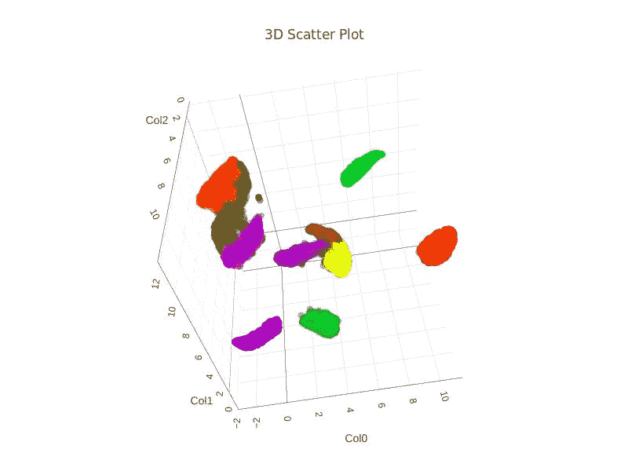

3D DBSCAN 聚类。(图片由作者提供)

DBSCAN 的结果是否足够好与原始标签有关？

与原始标签相关的 DBSCAN 聚类的准确率为 95.9%。

所有这些工作都是在 Knime 中完成的，结合了原生 Knime 节点，并在其工作流中嵌入了 Python 代码，从而展示了 Knime environement 的功能。

我正在思考的下一个故事，将是关于如何执行一个类似的分析，但用一个神经自动编码器达到嵌入状态。会随时通知你。