# 数据集成 UMAP

> 原文：<https://towardsdatascience.com/umap-for-data-integration-50b5cfa4cdcd?source=collection_archive---------24----------------------->

## [生命科学的数理统计和机器学习](https://towardsdatascience.com/tagged/stats-ml-life-sciences)

## 基于图形的单细胞组学与 UMAP 的集成

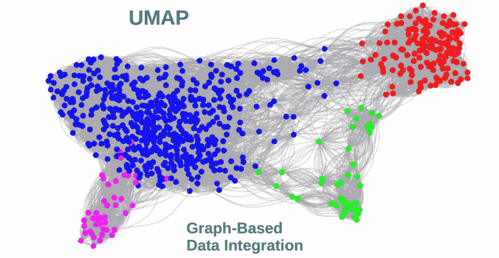

作者图片

这是来自 [**生命科学的数理统计和机器学习**](https://towardsdatascience.com/tagged/stats-ml-life-sciences?source=post_page---------------------------) 专栏的**第二十篇**文章，我试图以简单的方式解释生物信息学和计算生物学中使用的一些神秘的分析技术。数据整合是下一个重要的步骤，通过结合多种信息来源，利用协同效应来提高分析准确性。在计算生物学和生物医学中，数据集成在单细胞研究领域取得了特别的进展。去年， [**自然**](https://www.nature.com/) 认定**单细胞多模态组学集成**为 2019 年度 [**方法。在本文中，我将展示如何通过使用**图交集**方法和**图**和 **UMAP** 来执行单细胞组学( **scOmics** )数据的基于图的跨模态集成。**](https://www.nature.com/articles/s41592-019-0703-5)

# 数据集成背后的理念

当组合来自不同统计分布的数据时，简单地将它们连接在一起而不考虑它们各自的分布可能不是一个好主意，因为它们中的一些可能是二元的、分类的或连续的。使用 scOmics 数据，人们经常处理连续的 [scRNAseq](https://en.wikipedia.org/wiki/Single-cell_transcriptomics) (转录组)/ [scProteomics](https://en.wikipedia.org/wiki/CITE-Seq) (蛋白质组)和二元的 [scBSseq](https://en.wikipedia.org/wiki/Bisulfite_sequencing) (甲基化)/ [scATAseq](https://en.wikipedia.org/wiki/ATAC-seq) (开放染色质区域)数据。假设个体数据类型能够以 78%、83%和 75%的准确率(数字是编造的)区分细胞与患病个体和健康个体。然后，将多个 scOmics 组合在一起的一个期望将是预测精度的**提升**(例如高达 96%)，这是由于特定技术噪声的降低和 scOmics 信号一致性的增强。

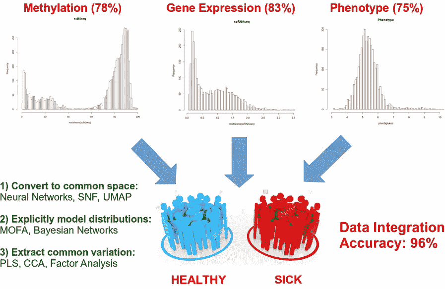

作者图片

组合单个 scOmics 可以有不同的方法。一种可能的方法是将 scOmics 转换到一个公共的非参数空间，在那里它们失去了关于其原始技术的记忆。这就是人工神经网络(ANN)如何能够压缩多个信息源，我在之前的一篇文章中详细描述了这一点。[**【SNF】**](https://www.nature.com/articles/nmeth.2810)相似度网络融合也属于这一类方法。另一种方法是明确地对单个数据分布建模，并使用贝叶斯规则将它们组合成一个 [**联合概率**。最后，人们可以尝试提取共同的变化(即理清数据中特定技术和共享的变化)并将其分解(分解成正交分量)以便更好地解释，这是](/unsupervised-omics-integration-688bf8fa49bf) [PLS](https://en.wikipedia.org/wiki/Partial_least_squares_regression) 、 [CCA](https://en.wikipedia.org/wiki/Canonical_correlation) 和因子分析使用的方法。

# 基于图形的数据集成

基于图表的数据整合属于上一节中的第一种方法，即当转换为图表时，单个数据集表示数据点之间的**成对连接**，而不需要任何关于生成单个数据集的统计过程的“记忆”。在图形空间中，通过**保持各个数据集**的图形上的数据点之间的边缘一致，可以直接找到各个数据集的各个图形之间的**交点**。这种方法的优势在于，当将原始数据转换为图形时，可以应用**适当的** **距离度量**，即，在处理二进制数据时，可能希望使用**汉明**距离来计算数据点之间的成对连接，而在处理连续数据时，应用**欧几里德**距离可能就足够了。

为了展示基于图的数据整合的思想，我们将把它应用于 [**scNMT**](https://www.nature.com/articles/s41467-018-03149-4) **单细胞组学数据集**，该数据集包含:1)基因表达(scRNAseq)，2) DNA 甲基化(scBSseq)，以及 3)来自**相同生物细胞**的开放染色质区域(scATACseq)信息。我们将从读取 scNMTseq 数据开始，即 scRNAseq、scATACseq 和 scBSseq，过滤数据，例如通过去除 scRNAseq 中低表达的基因，应用对数变换以使数据看起来更正态分布，并检查数据分布。

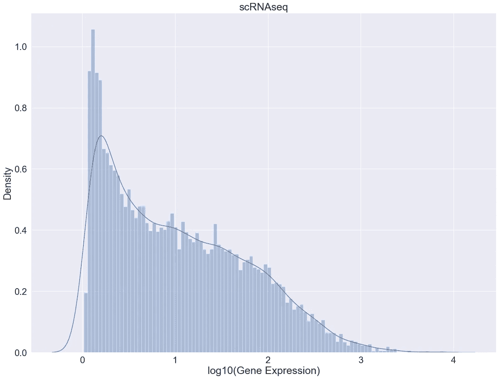

作者图片

单细胞基因表达(scRNAseq)数据在某种程度上是零膨胀的，并且明显是连续的，因此使用欧几里得距离计算细胞之间的成对相似性可能是合适的。然而，当我们绘制 scBSseq 和 scATACseq 数据分布时，很明显它们遵循双峰分布，因此使用欧几里得距离来测量使用这种类型的二进制数据的细胞之间的相似性是不合适的。因此，我们将对 scBSseq 和 scATACseq 使用汉明距离，而[骰子](https://en.wikipedia.org/wiki/S%C3%B8rensen%E2%80%93Dice_coefficient)和 [Jaccard](https://en.wikipedia.org/wiki/Jaccard_index) 相似度也是一个可能的选择。

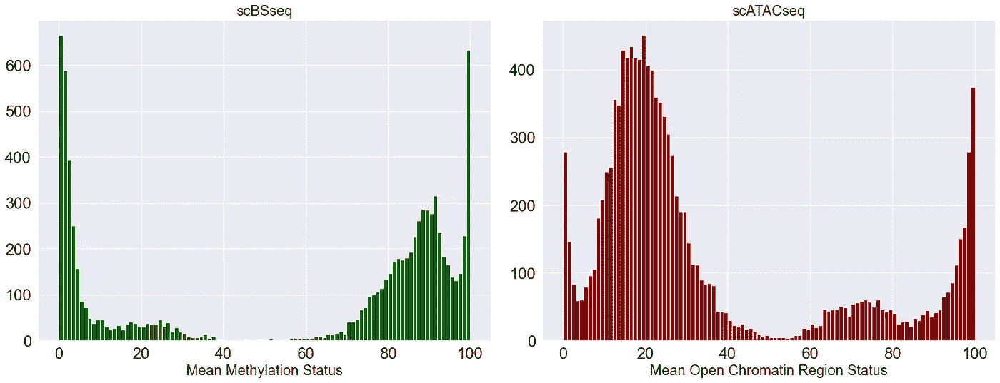

作者图片

如果我们查看 scBSseq 数据矩阵，元素似乎在 0%和 100%之间变化，这意味着某个 [CpG 位点](https://en.wikipedia.org/wiki/CpG_site)可以是甲基化的(100%)或未甲基化的(0%)。实际上，并非矩阵的所有元素都是严格的 0%或 100%，这可能是由于技术采样和排序的原因。但是，我们可以将 scBSseq 数据(同样适用于 scATACseq 数据)视为二进制数据。为了使数据显式为二进制，我们将把所有低于 50%的计数编码为 0，高于 50%的计数编码为 1。然后对 scATACseq 数据应用类似的二值化过程。您不一定要这样做，但为了解释方法，使用图相交方法演示连续数据 scRNAseq 如何与完全二进制数据 scBSseq 和 scATACseq 集成是很有趣的。

现在，我们将使用来自 scRNaseq 数据集的原始基因表达数据构建一个 [KNN 图](https://en.wikipedia.org/wiki/Nearest_neighbor_graph)。我们将在单元之间应用欧几里得相似性度量，并为每个单元保留 30 个最近的邻居。事实上，当从全连通图开始时，scikit-learn 中的 KNN 方法将检查每一对数据点的边的权重，并为每个数据点选择 30 个权重最大的邻居。结果我们会得到一个 [**KNN 邻接矩阵**](https://en.wikipedia.org/wiki/Adjacency_matrix) ，其中 1 表示单元格连通，0 表示不连通。要了解图形构造的其他技巧，请查看来自[瑞本菲塔斯](https://nbis.se/about/staff/rui-benfeitas/)的本[精彩笔记本](https://nbisweden.github.io/workshop_omics_integration/session_topology/lab.html)。

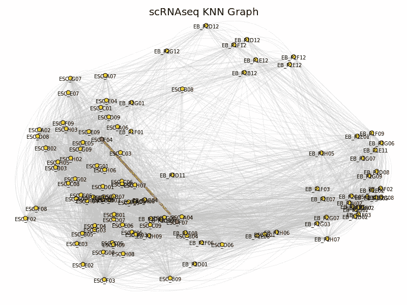

作者图片

这里，我们选择了一对随机的点，例如 **ESC_F04 和 ESC_F07** ，它们似乎在 scRNAseq 数据集中是相连的。我们将在 scBSseq 和 scATACseq 数据集中跟踪这种联系。下面我们将使用 [MDS](https://en.wikipedia.org/wiki/Multidimensional_scaling) 布局可视化 KNN 图，并通过**红边**突出显示 ESC_F04 和 ESC_F07 单元格之间的连接。我们现在已经可以观察到 ESC 细胞和 EB 细胞彼此分开的某种聚集。现在，我们将对 scBSseq 数据进行相同的图形构建，详情请查看完整的 [jupyter 笔记本](https://github.com/NikolayOskolkov/UMAPDataIntegration)。在这种情况下，由于 scBSseq 是一个二进制数据，因此像我们对 scRNAseq 数据所做的那样，用欧几里德距离来度量细胞之间的相似性不是最佳的。这里我们选择汉明距离，尽管 Dice 和 Jaccard 距离可能也适用于分类/二进制数据。

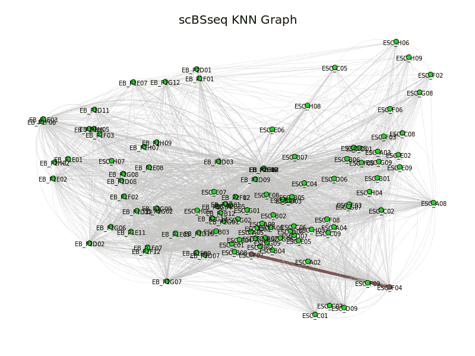

作者图片

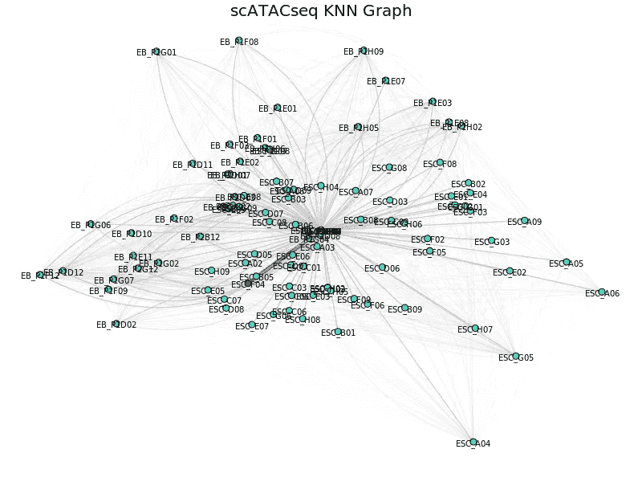

作者图片

太好了！现在，我们已经从 scRNAseq、scBSseq 和 scATACseq 构建了 3 个 KNN 图，并准备相交这些图。正如在[Wolfram Math World](https://mathworld.wolfram.com)public resource 中完美展示的那样，图交集的思想是保持多个 scOmics 数据集之间的边一致。我们将使用在 [**igraph**](https://igraph.org/) 库中实现的**交集**函数。在我们执行了图形交集之后，一些节点将被隔离。这里，为了简单起见，我们将忽略/删除这些节点，并且在稍后运行基于 Leiden 图的集群时不将它们视为单独的集群。

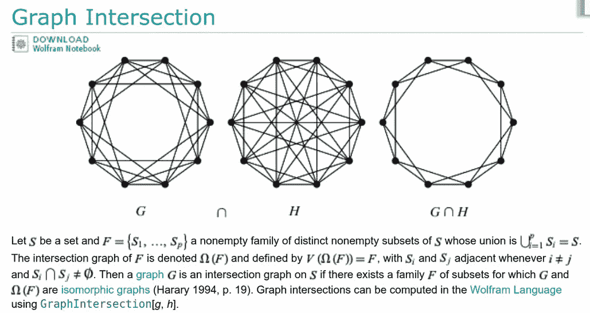

来自[Wolfram Math World Public Domain](https://mathworld.wolfram.com/GraphIntersection.html)的图形交集插图

让我们将通过**与**相交获得的**共有图**可视化，这 3 个图来自单独的 scOmics，并证明 ESC_F04 和 ESC_F07 细胞之间的连接/边缘仍然存在，我们将用红色突出显示该边缘。现在我们可以运行 [Leiden](https://www.nature.com/articles/s41598-019-41695-z) 基于图的聚类算法(对 [Louvain](https://en.wikipedia.org/wiki/Louvain_method) 算法的修改)，该算法在共识图上找到 4 个聚类。

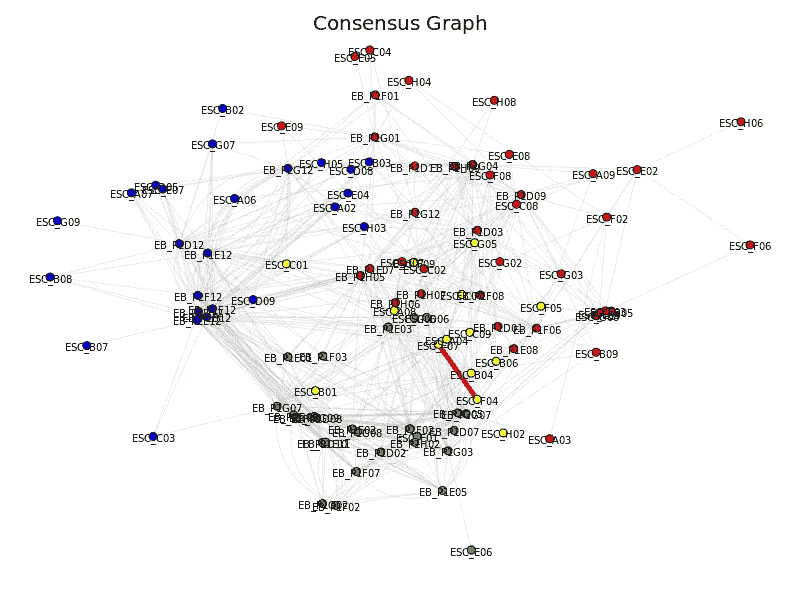

作者图片

我们可以看到，EB 细胞似乎形成了一个单独的(绿色)簇，而 ESC 细胞现在分裂成至少两个(蓝色和红色)簇。有一小组黄色细胞被 Leiden 发现为第四个群，但是这可能应该用 Leiden 算法的分辨率参数来调整，因为黄色细胞在视觉上似乎不是一个单独的群。另一方面，这也可能是布局的问题。尝试[另一种图形布局](https://igraph.org/r/doc/layout_.html)可能会证明黄色细胞确实形成了一个独特的集群。

# 单细胞组学整合的 UMAP

事实证明，手动构建 KNN 图，然后按照我们在上一节中所做的方式对各个 scOmics 的图进行交集，并不是真正必要的，因为这个选项似乎基本上包含在 [UMAP](https://umap-learn.readthedocs.io/en/latest/) 降维算法中。的确，正如[原 UMAP 文章](https://arxiv.org/pdf/1802.03426.pdf)中所说:

> 利用数据 UMAP 的模糊单纯集表示可以潜在地扩展到支持具有不同数据类型的数据集的降维。每种数据类型都可以被视为底层结构的另一种视图，每种数据类型都有不同的关联度量，例如，分类数据可能使用 Jaccard 或 Dice 距离，而顺序数据可能使用哈曼距离。每个视图和度量都可以用来独立地生成模糊单纯集，然后可以将这些模糊单纯集相交在一起，以创建单个模糊单纯集用于嵌入。

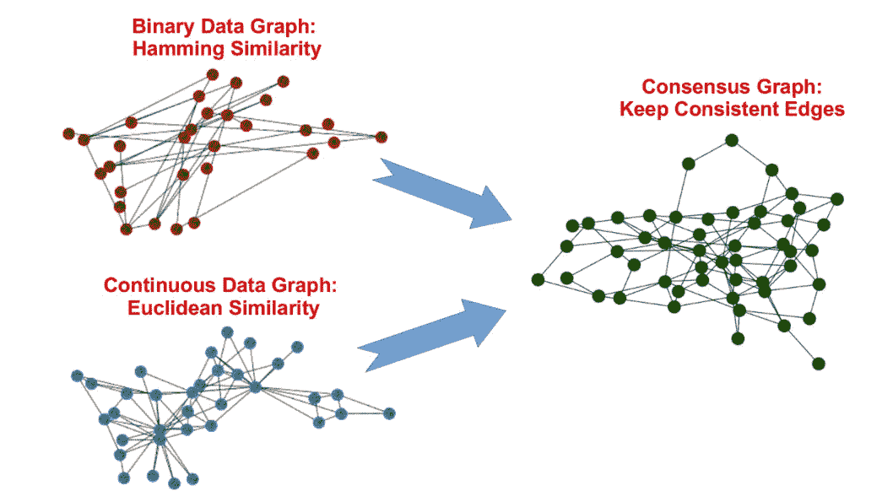

作者图片

因此，UMAP 允许快速构建单个 scOmics 数据集的模糊单纯集(类似于构建 KNN 图)及其交集，只需几行代码，参见关于使用 UMAP 混合不同数据类型的有趣讨论[此处](https://github.com/lmcinnes/umap/issues/58)。

为了演示 UMAP 如何用于整合 scOmics 数据，我们将交叉来自单细胞 RNAseq 和来自 8617 个血液单核细胞(CBMCs)的蛋白质水平数据集的图，这些数据是通过[**CITE-seq**](https://en.wikipedia.org/wiki/CITE-Seq) 技术测序的，我们将制作一个**一致性 scOmics** UMAP 图。同样，想法是将两个 scOmics 数据集转换到非参数图形空间(模糊单纯集),其中它们忘记它们的技术差异，并在该非参数空间中相交图形。产生的共识/整合图将用于构建 UMAP 嵌入。

然而，我们将从显示两个单独的 scOmics 数据集的 UMAP 嵌入开始。作为最近邻的最佳数量，我们将选择 sqrt(N) = sqrt(8617) = 93，这一选择背后的动机在这里[中已经涉及](/how-to-tune-hyperparameters-of-tsne-7c0596a18868)，并且与格子上的[随机漫步的最佳大小有关，超过这个大小，随机漫步的“记忆”就会丢失。](https://en.wikipedia.org/wiki/Random_coil)

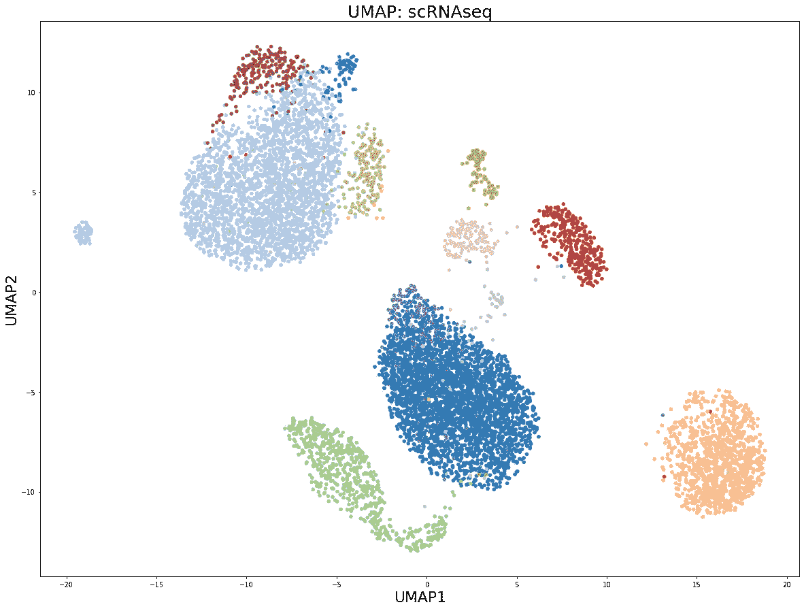

作者图片

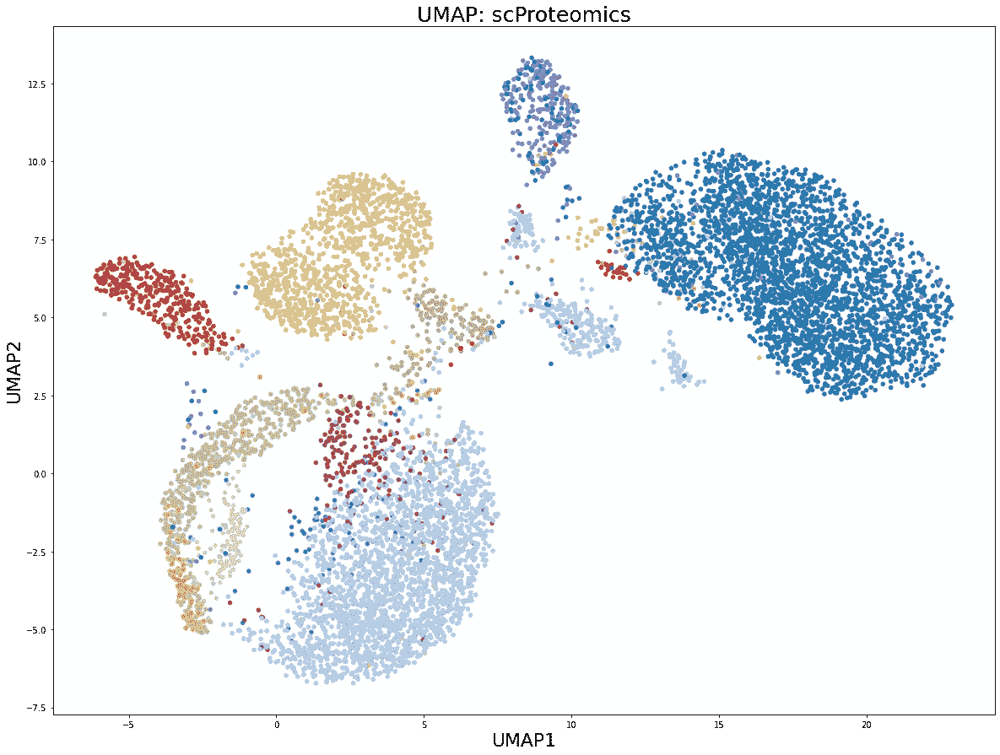

作者图片

UMAP 维数缩减图上的颜色对应于血液单核细胞(CBMCs)的 12 个细胞群。现在我们将构建**两个图/** **模糊单纯集**的交集，并可视化由此产生的嵌入。

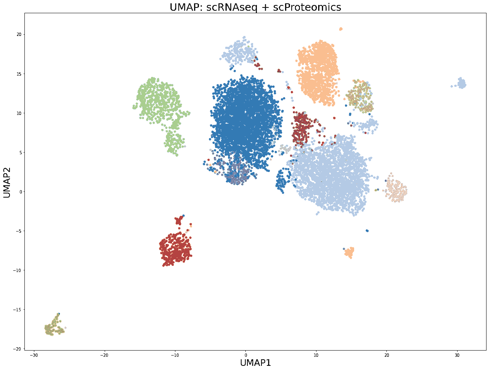

作者图片

在生成的嵌入图中，从两个 scOmics 的相交中，可以得到一些有趣的观察结果。例如，先前在 scRNAseq UMAP 图上同质的灰色聚类分裂成三个子聚类。另一方面，以前在 scRNAseq UMAP 图上不可区分的紫色细胞群现在形成了与蓝色细胞分开的明显的簇。这两个结果似乎都是通过将蛋白质水平的信息纳入到所得的共有 UMAP 嵌入中来驱动的。

# 摘要

在本文中，我们了解到基于图形的数据集成是一种有趣的方式，它可以将多个信息源结合起来，以提高分析的准确性。将原始数据转换到具有适当的个体相似性度量的非参数图形空间中，允许仅保留成对连接信息，同时忽略数据中的特定于技术的噪声。以下图形的交集(或 UMAP 术语中的模糊单纯集)提供了数据集成的直观可视化和评估。UMAP 似乎是数据集成的理想之选，因为它只需几行代码就可以指定各个距离度量和图形的交集，即混合不同种类的数据。

在下面的评论中，让我知道哪些来自生命科学的分析技术对你来说似乎是 T2 特别神秘的，我会在以后的文章中介绍它们。在我的 [Github](https://github.com/NikolayOskolkov/UMAPDataIntegration) 上查看帖子中的代码。在 Medium [关注我，在 Twitter @NikolayOskolkov 关注我，在 Linkedin](https://medium.com/u/8570b484f56c?source=post_page-----50b5cfa4cdcd--------------------------------) 关注我。在下一篇文章中，我们将讨论**如何在 UMAP 空间**聚集，敬请关注。