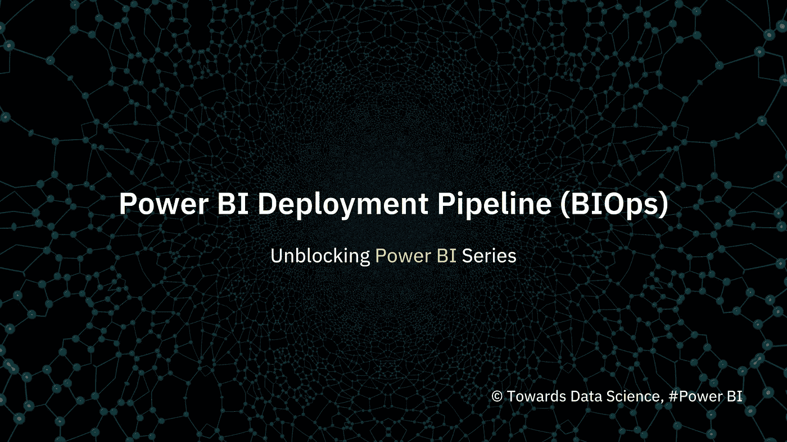
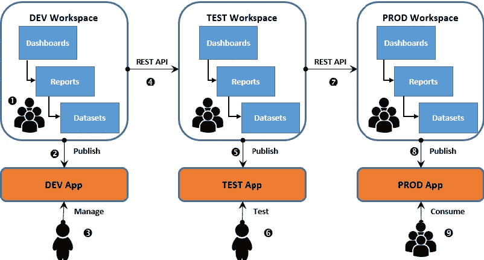
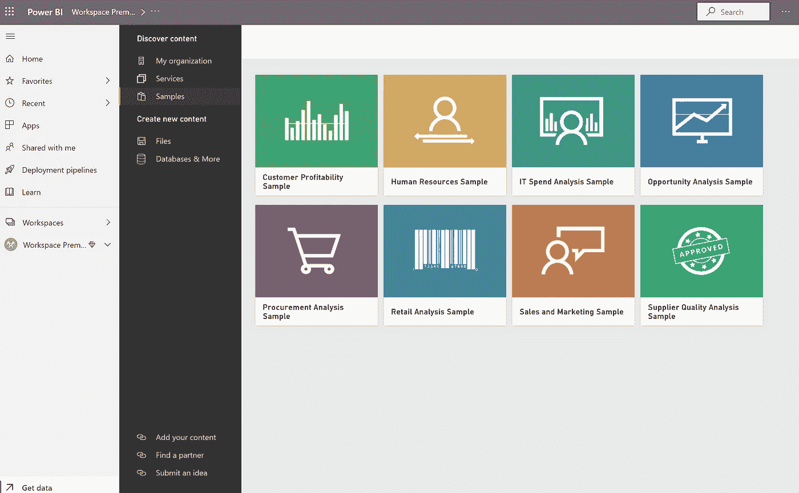
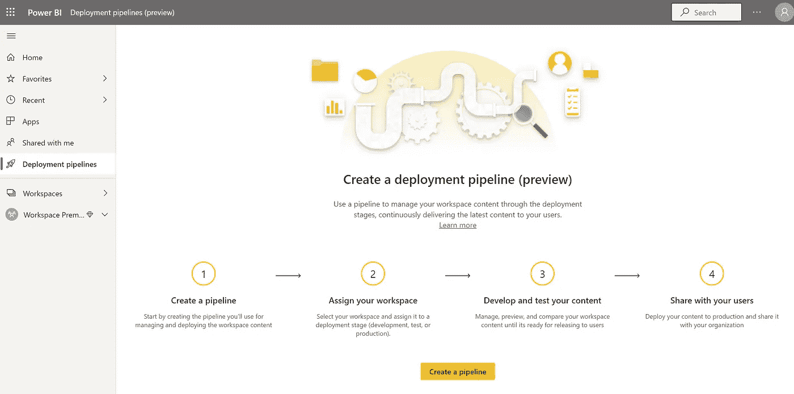
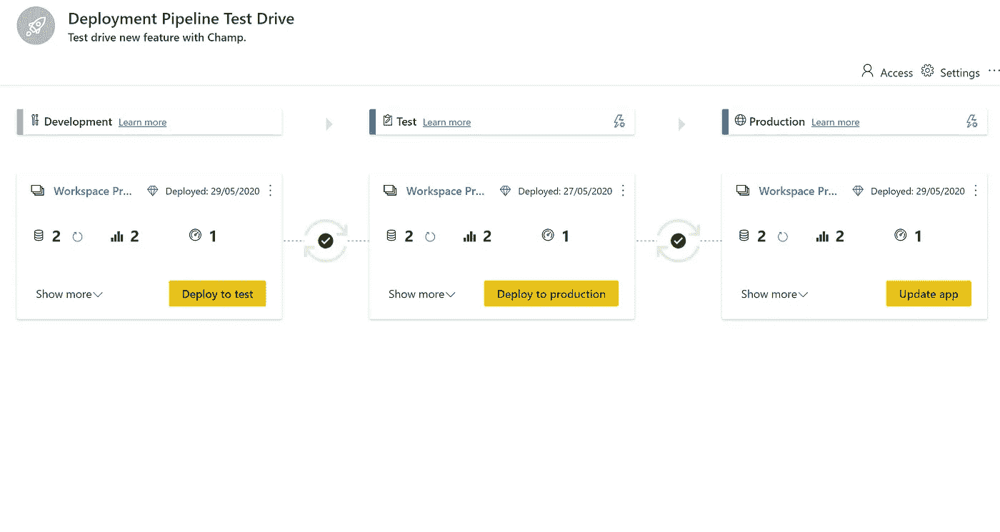
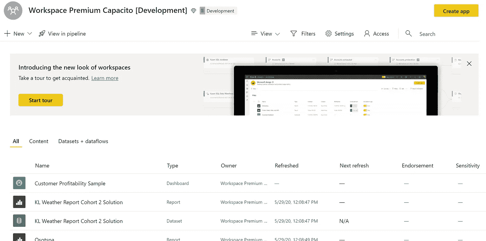
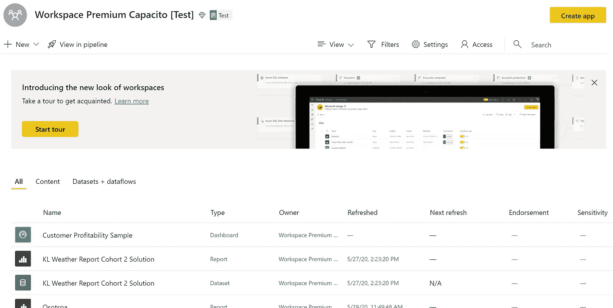
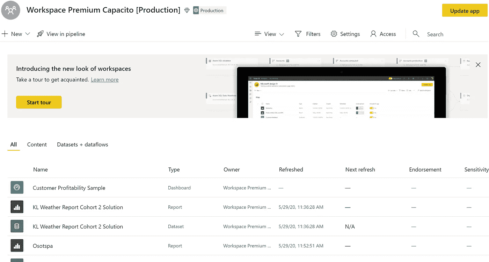

# 疏通 Power BI——向 Power BI 部署渠道(BIOps)的飞跃(Ep。6)

> 原文：<https://towardsdatascience.com/unblocking-power-bi-a-leap-into-power-bi-deployment-pipeline-biops-ep-6-344d6bf8472f?source=collection_archive---------46----------------------->

## 使用 Power BI 自动化报告生命周期(BIOps)

## Power BI 最近在 preview 中推出了一项名为部署管道的新功能，以自动化 Power BI 报告和内容创建(Ft。Narisorn Limpaswadpaisarn

**上一集**

*   [解除 Power BI 封锁—Power BI 报告服务器(内部部署)可以导出 CSV 和 Excel 格式的数据吗？(Ep。1)](https://medium.com/dev-dream-team/unblocking-power-bi-can-power-bi-report-server-on-premise-export-data-in-csv-and-excel-ep-1-5a6bf122852b)
*   [一天内解除电力 BI-仪表板阻塞(Ep。2)](https://medium.com/dev-dream-team/unlocking-power-bi-dashboard-in-a-day-ep-2-ca1a5e4581c)
*   [疏通 Power BI —如何获得 Power BI 桌面本地与云？(Ep。3)](https://medium.com/dev-dream-team/unblocking-power-bi-how-to-acquire-power-bi-desktop-on-premise-vs-cloud-ep-3-38a2e08a70d1)
*   [疏通 Power BI —让我们明确 Power BI 产品组合！(Ep。4)](https://medium.com/dev-dream-team/unblocking-power-bi-lets-be-clear-about-power-bi-product-portfolio-ep-4-33812be0be66)
*   [解除 Power BI-Power BI Premium 作为分析服务的超集(Ep。5)](https://medium.com/dev-dream-team/unblocking-power-bi-power-bi-premium-as-a-superset-of-analysis-services-ep-5-3978e38188ff)

Power BI Service 有一个[工作区](https://docs.microsoft.com/en-us/power-bi/collaborate-share/service-create-the-new-workspaces)的概念，您可以在其中创建仪表板、报告和分页报告的集合，并与工作区内的任何人进行协作。点击了解有关 Power BI 工作区[的更多详情。在过去，我听说过客户需要为 BI 项目生命周期管理分离出开发、测试和生产工作空间的需求。我们将这个概念称为“**分阶段部署**”，这是一个“隔离适合流程每个阶段的数据、用户和内容”的框架。根据](http://Create the new workspaces in Power BI)[【掌握权力毕】](https://www.amazon.com/Mastering-Microsoft-Power-techniques-intelligence/dp/1788297237)，分阶段部署的步骤包括:

1.  创建开发应用工作区，并将 Power BI 内容构建到工作区中。
2.  一个应用程序被发布或更新，并提供给少数用户审阅。
3.  BI 经理或项目负责人审查正在开发的内容的状态，并向开发人员提供反馈。
4.  Power BI REST API 用于将完整的内容从开发工作区迁移到测试工作区。
5.  发布或更新测试应用程序，并提供给少量用户进行审查。
6.  用户验收测试(UAT)用户或团队审查与需求相关的内容，并提供反馈。
7.  Power BI REST API 用于将批准的内容从测试工作区迁移到生产工作区。
8.  发布或更新生产应用程序，并提供给用户组使用。
9.  业务用户组通过生产应用程序从任何设备访问和使用仪表盘和报告。

下图和九步流程描述了分阶段部署生命周期的主要元素。来源:[掌握权力 BI(布雷特鲍威尔)](https://www.amazon.com/Mastering-Microsoft-Power-techniques-intelligence/dp/1788297237)

然而，我对 Powell 方法的经验是，高级 BI 管理员需要创建*个人工作区来定义开发、测试和生产*，这在技术上是可能的，但还不够直观。我很高兴看到“ **Power BI 部署管道**的公开预览版，这是 BI 团队在 Power BI Premium 中管理内容生命周期的一种新的改进方法。”简而言之，我将这一特性称为“ **BIOps** ”，因为 Power BI 可以自动化商业智能报告生命周期，并以前所未有的速度提供更新。

## 先决条件

您必须:

1.  使用 **Power BI Premium 许可证**。
2.  成为**新工作空间体验的**管理员。简单来说就是不支持经典工作空间。

要开始使用，请前往[https://app.powerbi.com/](https://app.powerbi.com/)并使用您的 Power BI 帐户登录。创建一个工作空间并获取一些 Power BI 样本。许多样品都很容易获得:

*   [电力 BI 的客户盈利能力示例](https://docs.microsoft.com/en-us/power-bi/create-reports/sample-customer-profitability)
*   [用于功率 BI 的分析样本](https://docs.microsoft.com/en-us/power-bi/create-reports/sample-it-spend)
*   [Power BI](https://docs.microsoft.com/en-us/power-bi/create-reports/sample-human-resources)人力资源样本
*   [Power BI 的机会分析样本](https://docs.microsoft.com/en-us/power-bi/create-reports/sample-opportunity-analysis)
*   [电力 BI 采购分析样本](https://docs.microsoft.com/en-us/power-bi/create-reports/sample-procurement)
*   [Power BI](https://docs.microsoft.com/en-us/power-bi/create-reports/sample-sales-and-marketing)销售和营销样本

选择一些样本到选定的工作区。

## 创建部署管道(在预览中)

1.  创建管道
2.  分配您的工作空间
3.  开发和测试你的内容
4.  与您的用户分享

这是“创建部署管道(预览)”的登录页面

对于部署管道，不需要为开发、测试和生产分别创建 3 个工作区。相反，Power BI 将为您自动完成这一过程。只需单击“部署到测试”和“部署到生产”。单元测试相应地运行。

我只需要为 1 个管道附加 1 个工作空间。当您确认部署到测试或部署到生产时，将自动创建后面的阶段。您的新工作区将保持相同的命名约定，除了末尾的标签指定它是开发工作区、测试工作区还是生产工作区。

## 观察

*   工作空间 ***必须*** 是新的工作空间体验。经典的工作经验是行不通的，没有例外。
*   仅为 1 个部署管道**分配 1 个工作空间**。
*   只有在您愿意的情况下，您才能部署**数据集**。如果存在依赖关系，报告可能无法部署。我建议部署一组数据集和报告。
*   在撰写和发布本文时， **Power BI 数据流**尚不**支持**部署管道。
*   此功能仍在公开预览中；因此，还不建议将其用于生产。我会密切关注这个空间，因为它绝对很棒。

## 参考

1.  [部署管道介绍(预览)](https://docs.microsoft.com/en-us/power-bi/create-reports/deployment-pipelines-overview)

**免责声明**:以下内容并非本人雇主官方背书。本文表达的观点和意见仅代表作者的观点和意见，不一定反映当前或以前的雇主、组织、委员会、其他团体或个人的官方政策或立场。本文中进行的分析是基于有限日期的开源信息。分析中所做的假设并不反映任何前任或现任雇主的立场。