# 用近似梯度法解套索正则化

> 原文：<https://towardsdatascience.com/unboxing-lasso-regularization-with-proximal-gradient-method-ista-iterative-soft-thresholding-b0797f05f8ea?source=collection_archive---------19----------------------->

## 迭代软阈值算法

*我首先告诉你，我不是数学家，因为这个话题需要一些***数学知识(振作起来！)我想说明的是，它不会完全严谨。**

**本文旨在总结应用* ISTA(迭代软阈值算法)*解决梯度下降优化套索正则化问题的整个过程。**

*当然，我假设如果你正在阅读，至少你对我们将要谈论的内容有所暗示，我希望我的帖子会有所帮助。*

**让我们首先构建一个数学难题，它将引导我们理解如何使用梯度下降计算 lasso 正则化，即使成本函数不是完全可微的，如 Lasso 的情况。**

## **子梯度**

**首先要掌握的概念是*凸函数*的定义。**

**一个完全可微的函数* ***f*** *被说成是凸的如果:**

**

**换句话说，其局部* [*线性逼近*](https://www.khanacademy.org/math/ap-calculus-bc/bc-series-new/bc-10-11/v/maclaurin-and-taylor-series-intuition) *(泰勒展开)总是低估* ***f*** *。这种凸函数的一个例子是我们钟爱的均方误差。**

**让我们更进一步，从凸函数直接得出*次梯度*，当我们处理一个在每一点都不可微的函数时，这个工具是必要的，而且由于套索使用了我们变量(绝对值)的* [*L1 范数*](https://mathworld.wolfram.com/L1-Norm.html) *我们知道这个函数在零点* ***不可微*** *。**

**次梯度* *是一种概括凸函数在不可微点处梯度的方法。凸函数* ***f*** *在 x 点的次梯度是任意的* ***g*** *这样:**

*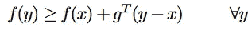*

**该表达式也是对* ***f*** *的线性近似，其中我们使用次梯度来代替梯度，次梯度在满足上述条件的值的* ***集合*** *内。**

*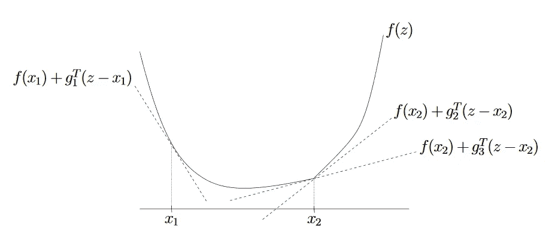*

*凸函数 f(x)的次梯度。点 x1 是可微的，我们有一个唯一的梯度，而在点 x2(不可微的)我们有一组符合上述条件的可能的子梯度值*

**g* 1 *，g* 2 *，g*3**是* ***f*** *在***x*1*，x* 2 *的子渐变。****

***在函数可微的点(x* 1 *)上，次梯度是* ***唯一的*** *确切地说是:g=∇f(x)、* *相反，在 x* 2 *上，我们可能有无限数量的次梯度(在上图中，我们只能看到其中的几个)***

***在 f(x)=|x|的情况下，x = 0 处的子梯度 g 如下图所示，它们的范围在***[-1，1]中包含的所有可能值之间。任何一条斜率在此范围* ***内穿过 x = 0 的直线，都会对函数*** *进行下界。****

**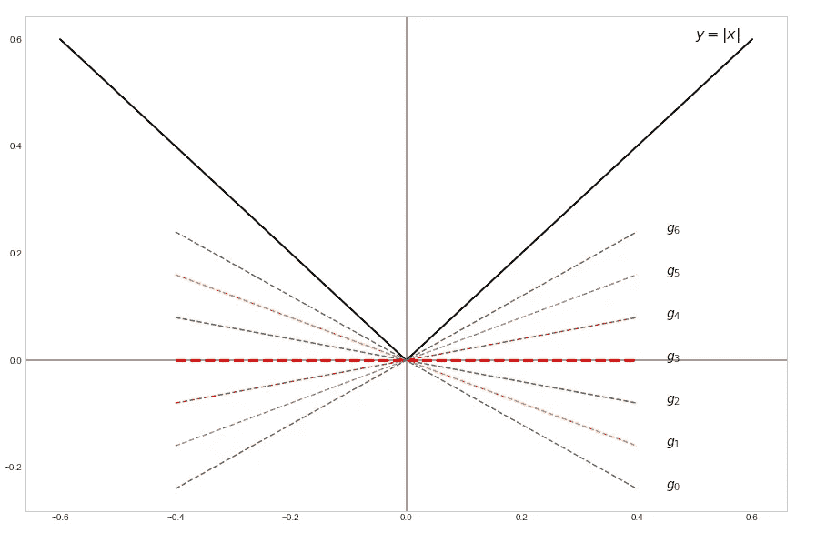**

**x=0 时 f(x)=|x|的一些次梯度**

***凸 f 的所有次梯度的集合称为次微分:***

**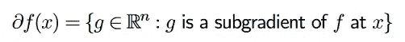**

***次微分定义可以推广到各种凸函数，无论可微与否。主要的一点是，当一个函数在它的定义域中的每一点都是完全可微的，那么次微分是由整个梯度集合(分别是唯一的值)组成的，相反，当一个函数不是处处可微时，次梯度就来了。***

***再次考虑单变量 x 的 L1 范数:***

**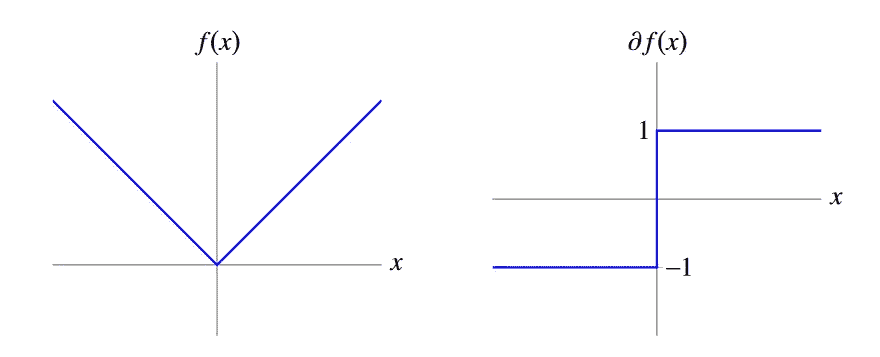**

**绝对值函数(左)及其次微分∂f(x)作为 x 的函数(右)**

****

**f(x) = |x|的次微分；这种情况下 k=1，2，3**

***给定次微分，则任意* ***f*** *(可微或不可微)的最优性条件为:***

**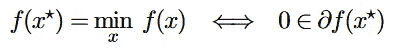**

*****x**** *是极小元当且仅当* ***0*** *是****f****at****x *****的次梯度。这叫做* ***次梯度最优性条件*** *。***

***为什么？简单，g= 0 是次梯度意味着对于所有 y:***

**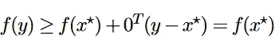**

***注意一个凸且可微的函数 f 的含义:***

**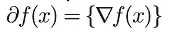**

## ***近端标测***

**现在我们已经熟悉了次梯度，我们需要了解的其他工具有:近似算子和软阈值算子。**

*****近端操作符*** *定义:***

**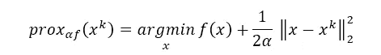**

***这里我们搜索的是点****【x *】****，它最小化了一个通用凸函数 f*****但是* *同时保持接近一个参考点* **我们通过***α****选择接近多少作为这些术语*之间的相对权重或权衡参数*******

*****软阈值算子*** *定义:***

**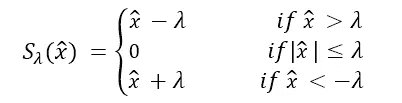**

***或者更简洁的形式:***

**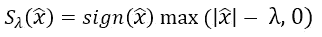**

**例如给定λ= 1，如果 x = 3，sign(3) = 1，max((| 3 |–1)，0) = max(2，0)= 2->**1 * 2 = 2**；如果 x = -0.5，sign(-0.5) = -1，max((|-0.5 |–1)，0) = max(-0.5，0)= 0->**-1 * 0 = 0**；如果 x = -3，sign(-3) = -1，max((|-3 |–1)，0) = max(2，0) = 2 - > **-1 * 2 = -2****

***好吧，我知道，你在想:* ***为什么是他们？？？*******我要啤酒不要操作员！******

**我理解你的兄弟姐妹。但是在你喝啤酒之前，你需要经历最艰难的部分。继续战斗！**

***那么，让我试着解释一下所有这些，并开始应用近似运算符。***

***定义* ***f*** *为局部线性逼近在***x*k*对于一个通用函数，我们假设* *凸且可微，我们把它代入最接近的算子:****

**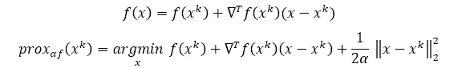**

***已知，点* ***x**** *是局部极小点如果:***

**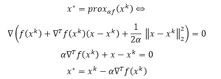**

***我敢打赌这提醒了你一些事情……等等，我用一种更熟悉的符号来写:***

**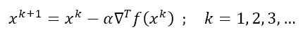**

***现在好些了吗？是的，这是一个梯度下降步骤，仅用线性近似的近似映射来计算。事实上，梯度下降和近似算子是非常亲密的朋友。***

***下一轮我们将使用不同的函数:***

**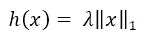**

***同样，我们可以将它插入到 prox 操作符中，我们得到:***

**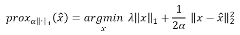**

***从 L1 和 L2 范数的定义我们得到:***

**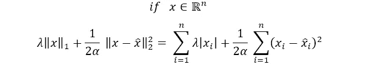**

***这些是可分离的函数，因此我们可以将它们作为组件式标量问题来解决:***

**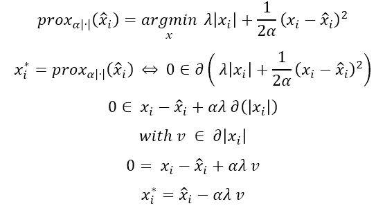**

***由于 h 是凸的，但在 x = 0 处不可微，我们用它的次微分来工作并回忆:***

**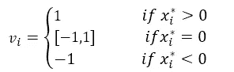**

***于是我们得到了最后的结果:***

**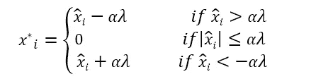**

***或者用上面介绍的软阈值运算符重新排列:***

**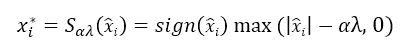**

***最后这个结果可能有点棘手，让我解释一下是怎么回事。根据绝对值的次微分和上面获得的最优性条件，我们有 3 种可能的情况:***

**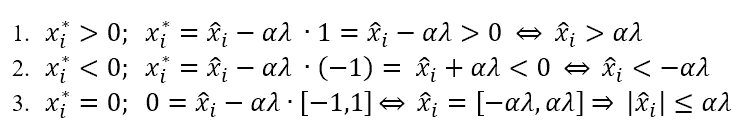**

***所以最后我们可以概括为:***

**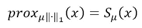****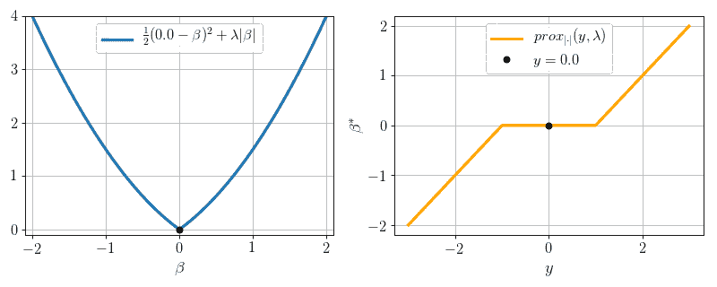**

**图片来源[皮埃尔·阿布林](https://pierreablin.com/)**

**开始吧，最后一轮…阿德里亚娜！**

***现在考虑:***

**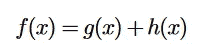**

***作为一个一般的凸可微函数 g(即最小二乘)加上一个凸不可微函数 h 的和，在我们的情况下是 L1 范数，我们想最小化它。为此，我们首先将一个* [*局部二次近似*](https://www.khanacademy.org/math/multivariable-calculus/applications-of-multivariable-derivatives/quadratic-approximations/v/what-do-quadratic-approximations-look-like) *应用于 g，并保留* *h 不变。***

**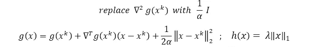****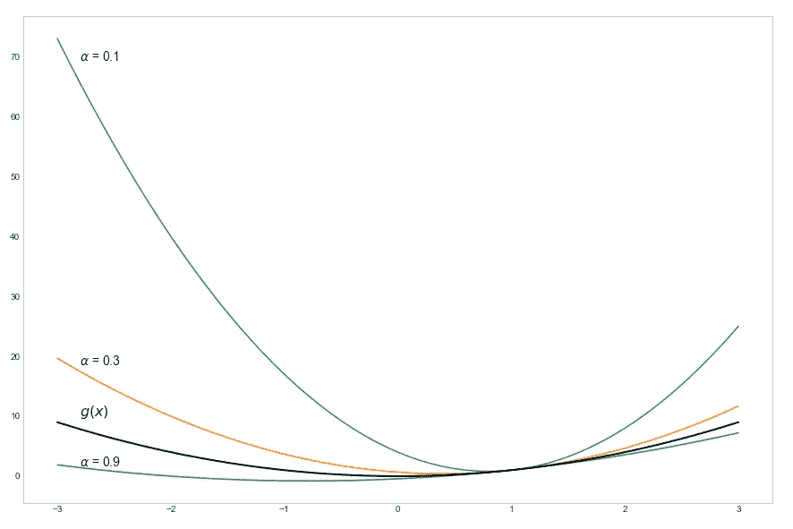**

***在 x=1 时，具有不同 alphas 的一般 g(x)的局部二次近似***

***注意，我们在没有 Hessian 的情况下获得的局部二次近似只是我们之前计算出的线性近似的近似算子。***

**为了我们的目的，我们还需要重新排列 g:**

**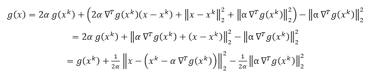**

**在去掉不依赖于 x 的常数项并加上 h 后，我们可以最小化整个 f:**

**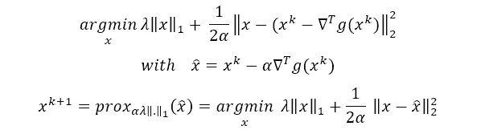**

**经过大量的数学计算，最终我们可以将 **ISTA** (迭代收缩阈值算法)*定义为:***

**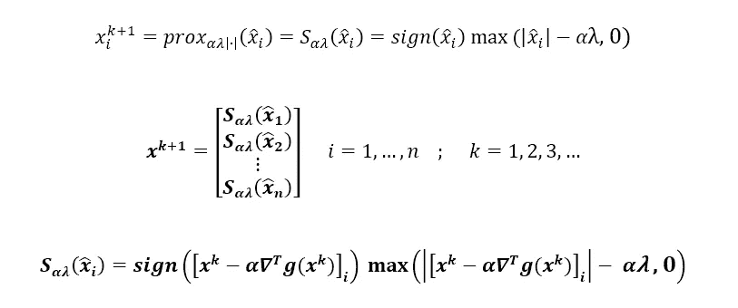**

***对于我们的 n 变量可分函数的每个分量。***

**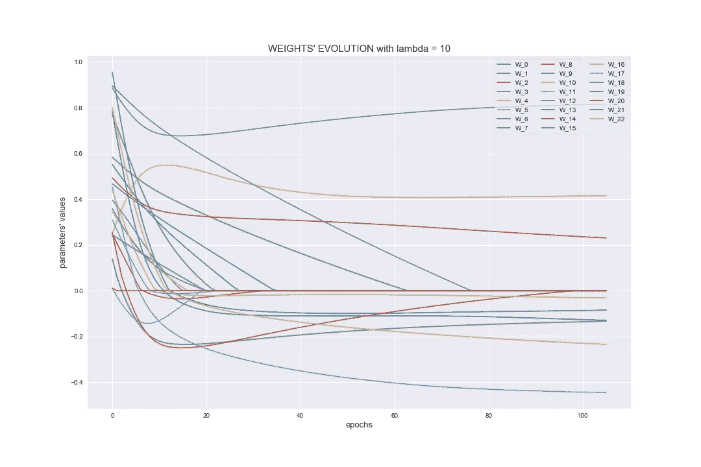**

**是的，看起来很糟糕，但并不像看起来那么糟糕。您只需像往常一样计算梯度下降，唯一的区别是在将值传递给下一次迭代之前，使用软阈值操作符应用进一步的变换。**

**然后，对于梯度下降，你可以定义一个规则来停止迭代并非常接近函数的最小值。**

***值得一提的是，这个结果不依赖于 g，它可以像我们想要的那样复杂，我们只需要能够计算它的梯度。***

*****搞定！从现在开始，不再有数学，只有啤酒。我们应得的。*****