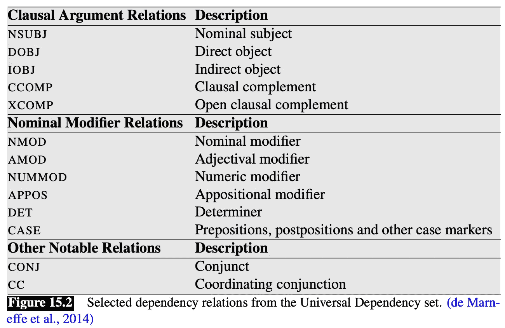
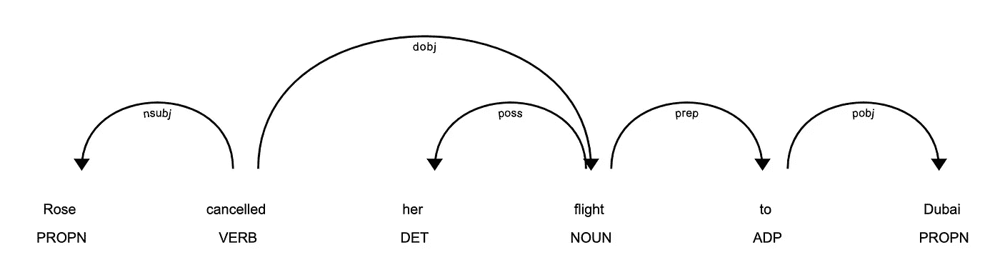
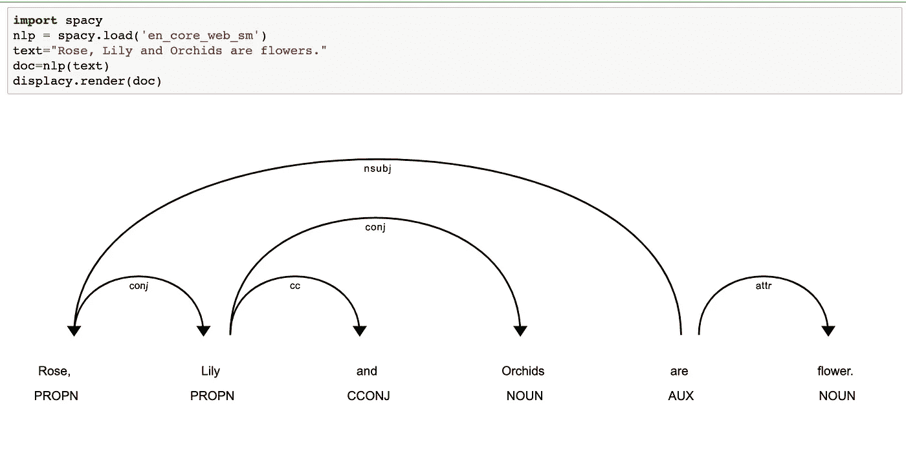
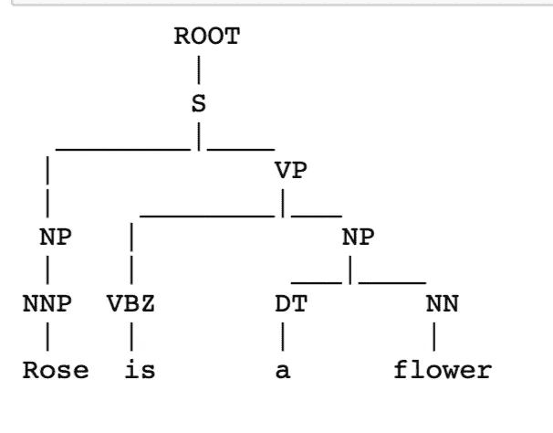
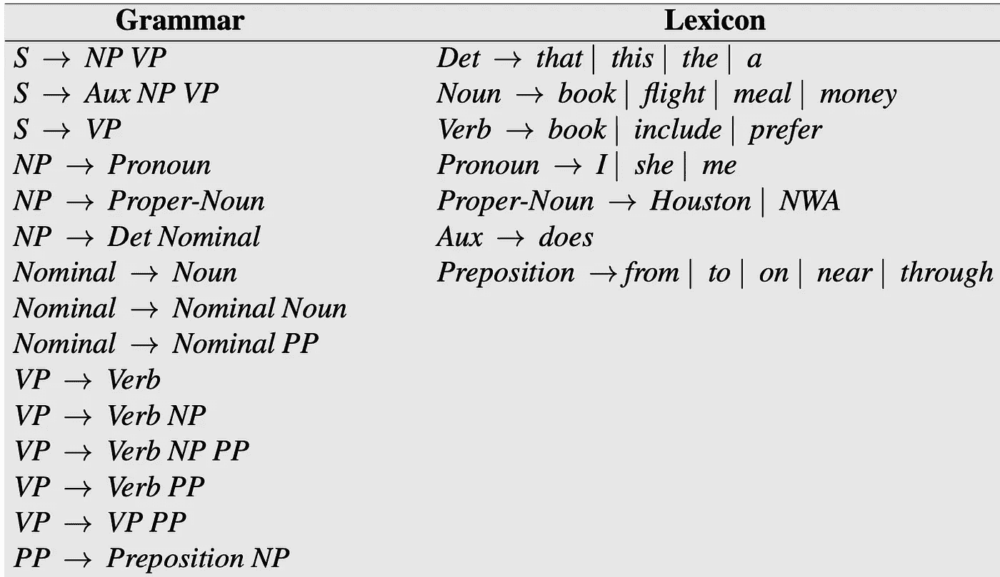
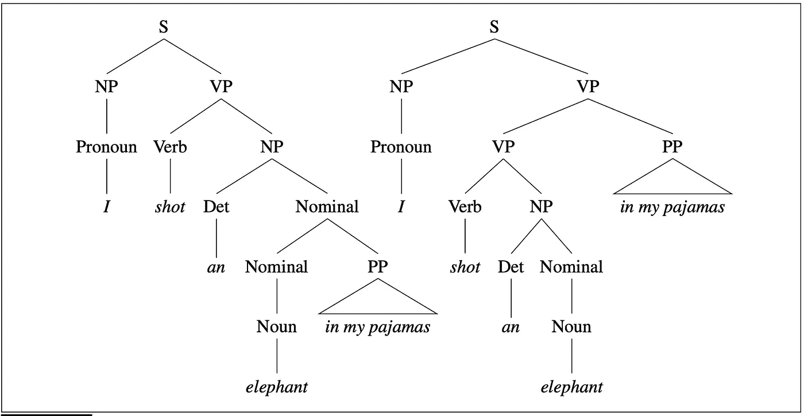
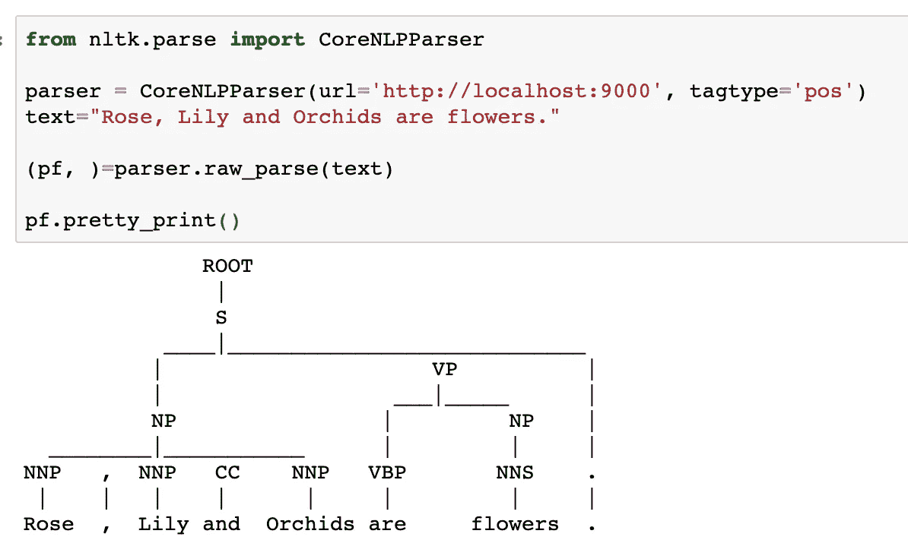

# 打开解析的盒子！

> 原文：<https://towardsdatascience.com/unboxing-the-world-of-parsing-5951866515c5?source=collection_archive---------41----------------------->

图片来源:Pixabay

句法分析是分析句子中所有单词并确定它们的句法和/或语义角色的过程。就像潜意识里我们用母语中的语法来组成和理解一个句子。类似地，我们在 NLP 中使用语法来破译一个句子是如何构造的，并理解它的句法和语义角色。主要有两种解析: ***选区解析*** 和 ***依存解析*** 。

***依存解析*** 顾名思义就是侧重于将一个句子分解成单词或记号或短语，然后分析它们之间的二元依存关系，了解它们的语法作用。它有助于解释句子中的语义关系。

依赖关系分析能够识别的一些二进制关系如下所示:

[来源](https://web.stanford.edu/~jurafsky/slp3/15.pdf)

依存分析通常使用有向弧来产生这种关系，其中弧的一端是中心词，弧指向的一端是词本身。短语(一组词)中的中心词**仅仅是一个词，如果去掉这个词，短语就失去了意义。**

> 一个短语(一组词)中的中心词**就是一个词，一旦这个词被去掉，这个短语就失去了意义。**
> 
> **例如:**
> 
> ***短语:*** 《好邻居》
> 
> 在这里，如果你去掉“邻居”这个词，你就失去了这个短语的任何可能的逻辑意义，因为“好”本身没有任何意义。因此，这个短语的标题是“邻居”。

现在，有向弧和节点不会让你想起有向图吗？如果是的话，那么你是绝对正确的！我们在执行依存解析之后获得的依存树只不过是一个有向图，其中所有的单词都是顶点，并且除了根顶点之外，每个顶点或单词都只有一条引入弧。这是因为，只有依存关系树的根顶点(根单词)是没有引入弧的节点。此外，从根到图中的任何其他节点总是有唯一的路径。

现在，让我给你看一个依赖解析的例子。

> 罗斯取消了去迪拜的航班
> 
> 现在，看看这个句子的依存解析。

这里的小句关系如 *nsubj* 和 *dobj* 把主语标识为“Rose”，把谓语“cancelled”的直接宾语标识为“flight”。请注意，“cancelled”是这两个短语中的中心词，它是图中唯一没有引入弧的节点，因此它是根。像 *prep* 这样的关系表明介词关系“到”的中心是“飞行”。关系 poss 是一个所有格修饰语，表明“her”是中心词“flight”的所有格修饰语，而 *pobj* 表明介词“Dubai”的宾语与其中心词“to”相连。

简而言之，我们现在可以看到给定句子中的每个单词是如何在语义上构造的，并且我们对给定句子中所有可能的语义上可推导的二元关系的信息是有限的。因此，依赖解析的一个巨大优势是它提供了谓词和它们的参数之间的语义关系的近似[1]。依存句法分析的另一个优势在于分析语序更灵活的语言的句子。换句话说，在语言中，人们可以更自由地放置某些词类，依存句法分析帮助我们获得关于文本的重要语义信息。

请注意，这只是一个包含少量依赖项的简短示例。如果你想了解更多关于这种关系的知识，请看看斯坦福大学的类型依赖手册。

现在，我们理解了依赖解析的作用，下一个重要的问题是理解它可以用在哪里。这种句法分析技术对于理解句子中的语义关系至关重要的应用，如共指消解、问题回答、信息抽取等，具有重要意义。

下面给出了一个使用 spacy 查找句子依存解析的例子。

依存性分析说明

***选区解析*** 另一方面涉及到考虑关于句子的句法信息。它将一个句子分解成短语，并根据预先确定的语法和词典(或词汇)组合短语以形成一棵树，称为解析树。这些短语可以是名词短语(NP)、动词短语(VP)、状语短语、形容词短语和/或介词短语(PP)。因此，选区分析具有作为语法分析器的角色。

在我们继续之前，让我快速地告诉你什么是 NLP 中的语法。自然语言处理中的 ***语法*** 是任何语言中所有规则的正式规范。在本文中，我们将使用英语作为我们的主要语言，以帮助简化解释！

> 例如:
> 
> **名词短语(NP):** “牛逼的车”
> 
> 但是这个短语不也是由其他词类构成的吗？
> 
> # "the": **冠词/限定词**；“牛逼”:**形容词**；【汽车】:**名词**
> 
> 我们如何用语法规则来表达这一点呢？
> 
> 我们说， **NP → Det Adj 名词**
> 
> 在这里，名词、形容词和名词被称为词尾，因为它们直接表示词典或词汇中的单词。在词典中可能是这样的:
> 
> **Det → the**
> 
> **Adj →牛逼**
> 
> **名词→汽车**

因此，我们英语语法中的所有规则都可以用类似的方式来表示。那么，语法类型是只有一种还是有多种呢？答案是肯定的！乔姆斯基的分类主要给了我们 4 种语法。

> **乔姆斯基的分类**
> 
> **-类型 0:无限制语法**
> 
> 格式:x → y，其中 x 和 y 可以是非终结符和/或终结符。完全没有限制。
> 
> **-类型 1:上下文敏感语法**
> 
> 格式:xAy → xzy，其中 x，y，z 可以是任意值，A 在上下文 xAy 中是非终结符。
> 
> **-类型 2:上下文无关语法**
> 
> 格式:A→ x，其中 A 是非终结符，x 可以是终结符或非终结符的序列。
> 
> **-类型 3:常规语法**
> 
> 格式 1 : A→ bt，其中 A 和 b 为非终结点，t 为终结点。
> 
> 或者
> 
> 格式 2 : A→ t，其中 A 为非终结符，t 为终结符。

因此，我们可以根据需要创建属于任何类型的语法，并使用它来解析句子。为了方便起见，让我们假设在本文中使用常规语法，除非另有说明。

现在，让我们回到理解选区解析上来！

选区分析器为每个句子创建一个分析树。让我们看一个例子。

> ***句子*** *:* “玫瑰是一种花”
> 
> **语法**:

*   S → NP VP
*   NP → NNP
*   副总裁→ VBZ NP
*   NP → DT NN

> **词汇:**

*   NNP →玫瑰，百合，兰花
*   VBZ →是，是
*   DT → a，the，an
*   NN →花

> 这个句子的解析树如下所示。

您可以在上面的图片中看到，解析树包含所有单词作为叶或终端，S 作为根。现在，主要有两种解析方式: ***自下而上和*** 。在 ***自下而上解析*** 中，解析器首先在内部执行词性标注，开始确定每个单词的句法角色。然后，它使用预先确定的语法来建立两个单词之间的语法关系，并递归地组合短语，直到到达词根:S。然而，在 ***自上而下解析*** 中，解析器从 S 开始，并使用语法规则来解开每个短语，直到到达句子中的所有单词。

请记住，我们在这里讨论的是一棵 ***有效解析树*** 和一棵 ***有效解析树*** 总是包含 S 作为根，并且只包含给定句子的单词作为叶。例如，如果你的解析树包含的单词比你的句子中出现的单词多，那么它就是一个无效的解析树。

> 一个 ***有效解析树*** 总是包含 S 作为根，并且只包含给定句子的单词作为叶。

另一个需要记住的重要事情是，一个句子可以有多个解析树，但是其中只有一个在语法和语义上都有效。让我们看一个例子:

> **句子:**我拍了一头穿着睡衣的大象。
> 
> 你的**预定语法和词汇**或词汇如下:

L1 微型英语语法和词汇

> 现在，您的句子可以有两个可能的解析树，如下所示。

[来源](https://web.stanford.edu/~jurafsky/slp3/13.pdf)

这两棵树看起来在语法上是有效的，但在语义上并不都是有效的。评估语义有效性时要记住的重要事情是看短语是如何组合的。在左边的树上，由于名词短语“穿着睡衣的大象”与“shot”相连，听起来作者想说他或她射杀了一头穿着睡衣的大象。然而，如果你仔细观察右边的解析树，动词短语(VP)“射杀一头大象”与介词短语(PP)“穿着我的睡衣”组合在一起，这传达了作者穿着他或她的睡衣射杀一头大象的意思。因此，句子的正确含义仅由右边的解析树传达，并且只有该解析树才是正确的解析树。

在 NLP 文献中，这个问题被称为**结构歧义**问题，其中一个句子可以有多个解析树，但其中只有一个是准确的。

现在，让我们看看如何使用 python 来实现这一点。我使用 nltk 的 CoreNLP 解析器，它的后端有斯坦福解析器。请注意，为了让这段代码工作，你必须在你的本地计算机上下载并启动斯坦福 NLP 服务器。

选区分析说明

您一定已经注意到，我只讨论了单独利用语法和词典来形成解析树的解析技术。使用其他可能给我们带来更好结果的方法怎么样？使用自底向上或自顶向下解析的动态编程的选区解析的两个例子是 CKY 解析和厄尔利解析。

> **CKY 语法分析器**使用上下文无关语法和自下而上的动态编程方法为任何给定的句子构建一个语法分析树。
> 
> 而 **Earley Parser** 使用任意上下文无关语法和动态编程自顶向下的方法为任何给定的句子构建解析树。

现在，你一定想知道为什么不把概率的概念引入我们的方法中。我们都知道，一些语法规则比其他规则出现的频率更高，因此，与它们的对应规则相比，我们可以给它们更高的概率，从而形成一个概率语法，然后可以用来执行解析。现在，我们可以简单地通过乘以用于构建所述树的所有规则的概率来计算最终解析树的概率，并且可以选择具有最高概率的解析树作为给定句子的精确解析结构。

> ***概率解析*** 使用出现概率较高的语法规则进行解析，找到最可能的解析树。

这个想法仍然有它的缺陷。这种解析对它展开的词的种类不敏感。

> 例如:
> 
> **第一句**:我吃了健怡可乐炸鸡。
> 
> **第二句:**和朋友吃了炸鸡。
> 
> 在第一句中，“用健怡可乐”是 NP(名词短语)，由另一个 NP:“健怡可乐”和 PP(介词短语):“用”。换句话说:
> 
> **规则 1** : NP → NP PP
> 
> **规则 1 的概率:** 0.5。(让我们假设)
> 
> 在第二句中，“with friends”是 VP(动词短语)，由另一个 NP:“friends”和 PP(介词短语):“with”。换句话说:
> 
> **规则二:** VP → VP PP (0.5)
> 
> **规则 2 的概率:** 0.5(假设)

现在，想象你是一台计算机，你正试图找到哪条规则来解析你的句子。因为两个规则的概率是相等的，所以您可以选择其中任何一个并得到一个语法上有效的解析树。但是，第一句和第二句的意思不一样。第一句暗示你吃了炸鸡和健怡可乐，而第二句暗示你和你的朋友吃了炸鸡。因此，概率分析器仍然缺乏区分两个规则的概率是否相等的能力，从而使它对单词的词汇信息不敏感。

因此，下一步是使用一个考虑了概率解析器忽略的词汇信息的解析器。答案是使用词汇化的概率分析器。

> **词汇化概率解析器**使用关于单词的词汇信息(例如，使用关于每个短语的头部的信息)以及规则出现的概率来解析句子。

还有其他种类的解析器，它们利用自然语言的不同方面来解析一个句子，但是在本文中，我只关注最流行的几种。本文中使用的 python 代码可以在[这里](https://github.com/AnanyaBanerjee/Medium-Article-Code/blob/master/Parsing.ipynb)找到。

我希望这篇文章能帮助您更好地理解解析！

感谢您的阅读！

附言:如果你想让我写一些特定的话题，请在下面评论！谢谢大家！:)

**参考文献:**

1.  语音和语言处理，第三版，作者[丹·茹拉夫斯基](http://web.stanford.edu/people/jurafsky/)和[詹姆斯·h·马丁](http://www.cs.colorado.edu/~martin/)