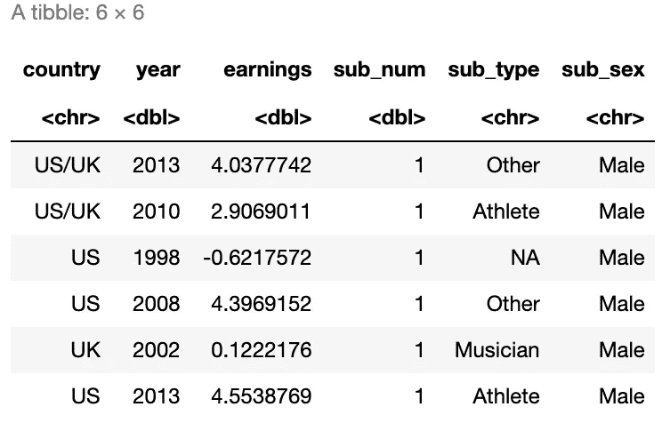
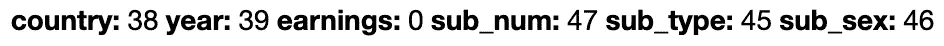
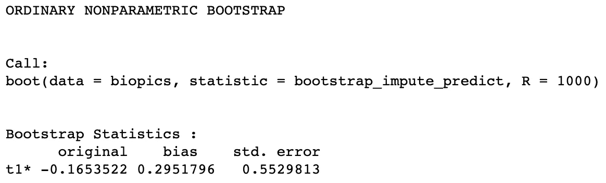
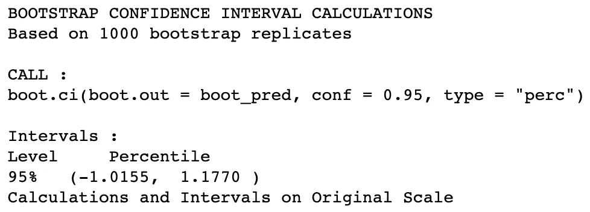
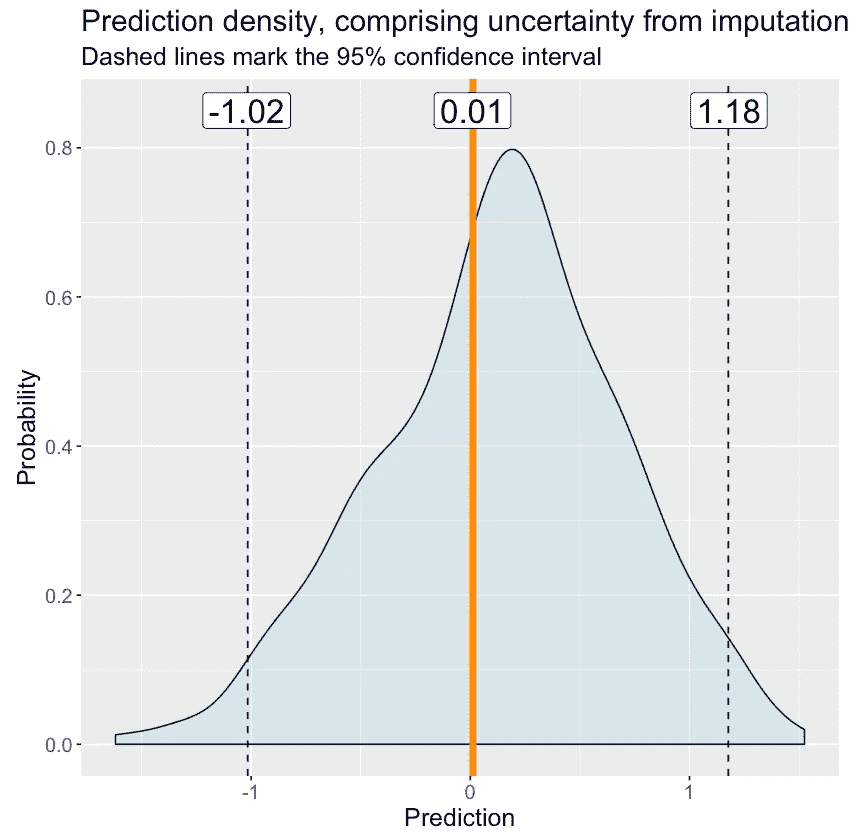

# 插补的不确定性

> 原文：<https://towardsdatascience.com/uncertainty-from-imputation-8dbb34a19612?source=collection_archive---------56----------------------->

## 你在预测中考虑到它了吗？


图片来自 [Pixabay](https://pixabay.com/?utm_source=link-attribution&utm_medium=referral&utm_campaign=image&utm_content=3774152) 的[耶日·戈雷基](https://pixabay.com/users/JerzyGorecki-2233926/?utm_source=link-attribution&utm_medium=referral&utm_campaign=image&utm_content=3774152)

几周前，我用 DataCamp 开发的处理 R 中缺失数据的[课程上线了。从目前为止我从学生那里得到的反馈来看，他们从课程中受益最大的部分是关于如何将插补的不确定性整合到建模中。在本文中，我将在使用机器学习模型进行预测的背景下简要讨论它。](https://datacamp.com/courses/handling-missing-data-with-imputations-in-r)


为了演示这个主题，我们将分析来自`fivethirtyeight` R 包的*活检*数据集。我们将使用原始数据的一个小的经过处理的版本。让我们来看看吧。



*传记片*数据包含一些传记电影的信息。这些特征包括电影的生产国、发行年份、票房收入记录、电影中出现的主题数量、主题类型或认可原因以及它们的性别。这里的任务是根据剩余的特征预测对数收益。我们正在考虑拍摄我们自己的电影。这部电影将于明年在美国上映，讲述一个单一角色的故事:一名女运动员。我们想知道我们可能挣多少钱。

不幸的是，数据集并不完整:在每个特性列中都有一些缺失值。



一种方法是以某种方式估算(即填充)缺失的数据，一旦数据完整，就将其输入模型。这其实是大部分人都会做的，那我们也来做吧。我们将使用`VIM`包中的热卡插补对数据进行插补，并使用`ranger`包训练一个随机森林。如果你对 hot-deck 的工作原理、其他可用的插补方法以及如何调整这些方法使其更好地工作感兴趣，请随时查看本文底部链接的课程。

```
0.01210784
```

我们得到了 0.01210784 的单一预测。一旦我们反转对数变换，我们将会看到我们的电影有望获得 exp(0.01210784)≈100 万美元。我们是百万富翁！但是我们能有多确定呢？

上述预测完全忽略了随机森林模型适合估算数据的事实。

> **值得注意的是，估算值并不是一成不变的。它们只是估计值，而估计值带有不确定性。**

用统计学术语来表达就是:估算值是根据观测值估算出来的，后者是从某个人群中抽取出来的；因此，存在双重不确定性:与数据采样相关的不确定性和来自插补方法的不确定性。根据这样一个不确定的预测采取行动是不明智的！

> **虽然没有任何方法可以神奇地将统计学中的不确定性转化为确定性，但有一些方法可以捕捉这种不确定性，并在根据模型的预测采取行动时将其考虑在内。**

在我们的例子中，一种方法是自举。我们需要做的是从原始的、不完整的数据中抽取一个 bootstrap 样本。这意味着我们正在对替换的数据行进行采样。然后，我们对 bootstrap 样本进行估算，对估算的数据建立模型，最后进行预测。我们重复这个过程很多次，比如说 1000 次，随机抽取不同的样本。因此，我们获得了我们计划的电影的预测收入分布，这种分布捕捉了插补的不确定性。

由于有了`boot`包，这在 R 中很容易实现。我们只需要定义一个接收原始数据和要采样的行的索引作为输入的函数。然后，该函数应该选择这些行，估算 bootstrap 样本，训练模型，并返回预测值。剩下要做的就是将这个自定义函数传递给`boot`函数。



该输出告诉我们，与自举分布的平均值相比，我们最初的单个预测值 0.01210784 有些偏差，并且该分布具有相当大的标准误差，这意味着相当大的不确定性。

现在让我们来计算我们预测的 95%置信区间。



因此，我们有 95%的把握我们的电影将获得-1.02 到 1.18 之间的收入。把它转换回美元，我们就有了$362𝑘和$3.2𝑚.的范围相当大的差距。让我们将预测的分布、单个预测和置信区间都绘制在一个图表中。



0.01 处的橙色线表示我们根据仅估算一次的数据训练单个模型得到的预测。这一枪连最有可能的结果都没给我们！这是由于从可视化中变得清晰的偏差:最有可能的收益位于分布的峰值，比我们最初的预测稍微偏右。然后:你看分布多广！

拍摄这部电影可能仍然是值得的，但取决于你的风险厌恶，你可能会想采取预防措施，以防它没有回报，这不是不可能的。


感谢阅读！我希望你已经学到了对你的项目有益的东西🚀

你可以找到这篇文章的数据集和所有代码，包括绘图，[在这里](https://github.com/MichalOleszak/KnowledgeBank/blob/master/blog_posts/imputation_uncertainty/imputation_uncertainty.ipynb)。如果您有兴趣了解更多关于缺失数据、各种插补方法以及其他将插补不确定性纳入建模的方法，请查看[我的课程](https://datacamp.com/courses/handling-missing-data-with-imputations-in-r)。

如果你喜欢这篇文章，试试[我的其他文章](https://michaloleszak.github.io/blog/)。不能选择？从这些中选择一个:

[](/boost-your-grasp-on-boosting-acf239694b1) [## 增强你对助推的把握

### 揭秘著名的竞赛获奖算法。

towardsdatascience.com](/boost-your-grasp-on-boosting-acf239694b1) [](/linear-classifiers-an-overview-e121135bd3bb) [## 线性分类器:综述

### 本文讨论了四个流行的线性函数的数学性质和 Python 的实际应用

towardsdatascience.com](/linear-classifiers-an-overview-e121135bd3bb) [](/estimating-the-state-of-the-economy-with-finite-mixture-models-and-the-em-algorithm-d975d280dbc6) [## 用有限混合模型和 EM 算法估计经济状态

towardsdatascience.com](/estimating-the-state-of-the-economy-with-finite-mixture-models-and-the-em-algorithm-d975d280dbc6)