# 用贝叶斯推理评估预测的不确定性

> 原文：<https://towardsdatascience.com/uncertainty-quantification-of-predictions-with-bayesian-inference-6192e31a9fa9?source=collection_archive---------22----------------------->

## 计算贝叶斯统计导论。

Maksym Kaharlytskyi 在 [Unsplash](https://unsplash.com?utm_source=medium&utm_medium=referral) 上的照片

# 介绍

[**频数统计**](https://en.wikipedia.org/wiki/Frequentist_probability) 有几个局限性，比如在预测中缺少**(我们通常只对期望建模)，没有内置的 [**正则化**](https://en.wikipedia.org/wiki/Regularization_%28mathematics%29) ，或者没有包含先验知识。一个**可以从过去的信息中获得，例如以前的实验，但是也可以从一个训练有素的 [**主题专家**](https://en.wikipedia.org/wiki/Subject-matter_expert) 的纯粹主观的评估中产生。****

****[**贝叶斯统计**](https://en.wikipedia.org/wiki/Bayesian_probability) 是统计学领域的一种替代理论，基于概率的贝叶斯解释，其中概率表示关于事件的信念或信息(知识)的程度。这与频率主义者的解释不同，后者认为概率是经过多次试验后某一事件相对频率的极限。许多贝叶斯方法需要大量的计算来完成，这就是为什么在上个世纪广泛使用的大多数方法都是基于频率主义者的解释。然而，随着功能强大的计算机和新算法的出现，贝叶斯方法在 21 世纪的统计中得到了越来越多的应用。****

# ****贝叶斯定理****

****贝叶斯统计围绕着 [**贝叶斯定理**](https://en.wikipedia.org/wiki/Bayes%27_theorem) 的用法，以[【托马斯·贝叶斯】](https://en.wikipedia.org/wiki/Thomas_Bayes)命名，以及 [**和**](https://en.wikipedia.org/wiki/Probability_axioms#Further_consequences) 概率的乘积规则 *p(y)* 在获得更多证据 *p(x|y* )后，产生一个 [**后验概率分布**](https://en.wikipedia.org/wiki/Posterior_probability) *p(y|x* )。****

****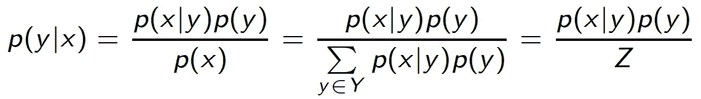****

******方程式 1。******

****等式 1 中分布 *p(x，y) = p(x|y)p(y)* 的变量 *Y* 的所有可能配置的总和导致 *X* 的 [**边际分布**](https://en.wikipedia.org/wiki/Marginal_distribution) ，即*p(X)*；这种计算叫做边缘化。在连续变量的情况下，等式 1 的分母中的和变成了通常难以处理的积分。此外， *p(x)* 是归一化常数，其缩放后验分布，使得其在整个空间上的积分再次变为 1——这是 [**概率分布**](https://en.wikipedia.org/wiki/Probability_distribution) 的属性之一。(但是，如果省略归一化，等式 1 就变成了 [**比例**](https://en.wikipedia.org/wiki/Proportionality_(mathematics)) 。)****

****原则上，任何参数模型(**线性回归**、**逻辑回归**，甚至是**神经网络)**都可以通过陈述参数 *β* 的先验来公式化为相应的贝叶斯版本。使用训练数据( *X* ， *y* )和贝叶斯定理，参数的后验概率分布计算如下****

****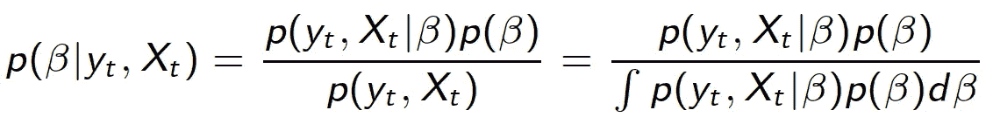****

******方程式 2。******

****一般来说，通过分析得出后验分布是不可能/不切实际的。但是，通过使用专用算法可以获得数值结果，这将在下面的章节中解释。****

# ****蒙特卡罗方法****

****首先需要介绍几个关键概念，一个是 [**伪随机数生成**](https://en.wikipedia.org/wiki/Pseudo-random_number_sampling) 。随机数通过**采样** **算法**产生，例如[拒绝采样](https://en.wikipedia.org/wiki/Rejection_sampling)。这些算法的目的是生成作为一个集合遵循某种特定分布(例如高斯分布)的数。然而，拒绝采样依赖于一个更简单的构建模块，该模块在 0 和 1(U(0，1))之间的区间内生成均匀分布的随机数，例如 [**线性同余生成器**](https://en.wikipedia.org/wiki/Linear_congruential_generator) 。拒绝抽样适用于维数很少的非常简单的分布；在高维中，概率质量集中在很小的体积内，导致大量样本被拒绝(效率低下)。对于这样的场景，已经开发了更先进的算法；然而，它们仍然利用更简单的采样算法，例如上面提到的那些。****

****另一个重要概念是 [**随机数值积分**](https://en.wikipedia.org/wiki/Monte_Carlo_integration) 利用 [**蒙特卡罗方法**](https://en.wikipedia.org/wiki/Monte_Carlo_method) (或称蒙特卡罗实验)。蒙特卡罗方法是一种广泛的计算算法，它依靠随机数的生成来获得数值结果。例如，通过从期望的分布中生成随机样本，等式 2 的分母中的积分变成了正则期望(平均值的最大似然估计)，其精度与抽取的样本数成比例。****

****一类被称为 [**马尔可夫链蒙特卡罗**](https://en.wikipedia.org/wiki/Markov_chain_Monte_Carlo) 的采样算法已经被开发出来，用于从复杂的概率分布中抽取样本。一个 [**马尔可夫链**](https://en.wikipedia.org/wiki/Markov_chain) 是一个可能事件(结果)的序列，其中每个事件的概率只取决于前一个事件达到的状态。它是满足 [**马尔可夫性质**](https://en.wikipedia.org/wiki/Markov_property) (马尔可夫过程)的[随机过程](https://en.wikipedia.org/wiki/Stochastic_process)的结果，即过程未来状态的条件概率分布仅取决于最当前的状态，而不取决于之前的事件序列。在马尔可夫链蒙特卡罗算法类中，有几种变体，例如，[**【Gibbs 采样】**](https://en.wikipedia.org/wiki/Gibbs_sampling) 或[**Metropolis-Hastings**](https://en.wikipedia.org/wiki/Metropolis%E2%80%93Hastings_algorithm)；早期的变体之一，Metropolis 算法，将在下一节简要描述，因为它非常容易理解。****

****贝叶斯计算的目标是从后验分布中获得一组独立的绘图，以合理的精度估计感兴趣的量。更准确地说，这种随机抽取用于总结模型参数的后验分布，例如，通过报告抽样分布的 2.5%、25%、50%、75%和 97.5%的点。然而，绘图也可以用散点图或直方图来可视化。****

****最后，一旦模拟了模型参数的后验分布，就可以通过忽略条件后验分布中的参数来进行新样本的预测。等式 3 本质上是另一个积分，可以使用数值方法通过随机采样来计算。****

****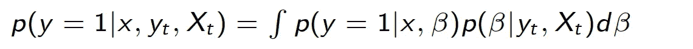****

******方程式 3。******

# ****大都会算法****

****如上所述，从多维(可能不是归一化的)概率分布 *p(z)* 中抽取样本具有挑战性。采样算法的思想是从更简单的**建议分布**中反复抽取样本，例如，一维高斯分布的乘积。一种这样的蒙特卡罗方法被称为 [**Metropolis 算法**](https://en.wikipedia.org/wiki/Metropolis%E2%80%93Hastings_algorithm) ，其生成马尔可夫链并最终收敛到期望的分布 *p(z)* 。更精确地说，随机数是使用建议分布生成的，新样本是被接受还是被丢弃，取决于它们是比前一个样本更有可能还是更不可能——并且仅仅是前一个样本(因此具有马尔可夫特性)。在实践中，由于计算能力增加，并行模拟几个链以检查 [**收敛**](https://en.wikipedia.org/wiki/Convergence_(logic)) 和 [**混合**](https://en.wikipedia.org/wiki/Mixing_(mathematics)) 。****

****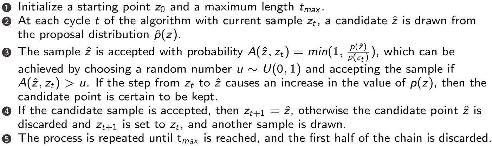****

******图 1:** Metropolis 算法。(来源:作者)****

****具有低方差的建议分布导致小的步长和高度相关的样本；相反，高方差导致较大的步长，但接受率较低，因此许多样本将被拒绝，从而减慢算法。由于这个原因，已经开发了解决这个问题的更高级的算法。关于这个话题的更多理论，可以推荐 Andrew Gelman 的书《贝叶斯数据分析》,这本书有免费的 PDF 文件。****

**** [## “贝叶斯数据分析”这本书的主页

### 这是本书的 pdf 格式，可以下载用于非商业目的。

www.stat.columbia.edu](http://www.stat.columbia.edu/~gelman/book/) 

# 贝叶斯逻辑回归

让我们看一个使用[葡萄酒数据集](http://archive.ics.uci.edu/ml/datasets/wine)的具体例子。[逻辑回归](https://en.wikipedia.org/wiki/Logistic_regression)是一种对变量对二元类标签( *y* =0， *y* =1)的影响进行建模的算法，即解决[监督](https://en.wikipedia.org/wiki/Supervised_learning)分类问题。后验概率分布给出了模型的每个权重或输出的区间估计。在数据分析中，不仅要提供一个好的模型，还要提供结论的**不确定性估计**，这一点至关重要。

我们收集了一批酒瓶；我们希望为一种特定类型的葡萄酒开发一个分类模型，这种葡萄酒由于价格高而经常被模仿。此外，只有当我们(不)足够确信这是(不是)模仿时，我们才会采取行动。为了表征一款酒，我们用它的化学成分(由 [**高效液相色谱**](https://en.wikipedia.org/wiki/High-performance_liquid_chromatography) 测定)相对于 [**黄酮类**](https://en.wikipedia.org/wiki/Flavonoid)[**脯氨酸**](https://en.wikipedia.org/wiki/Proline) 。

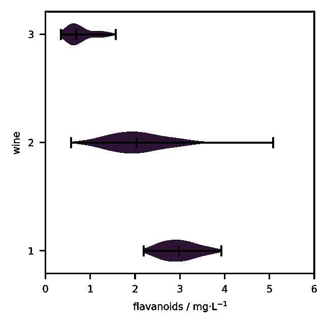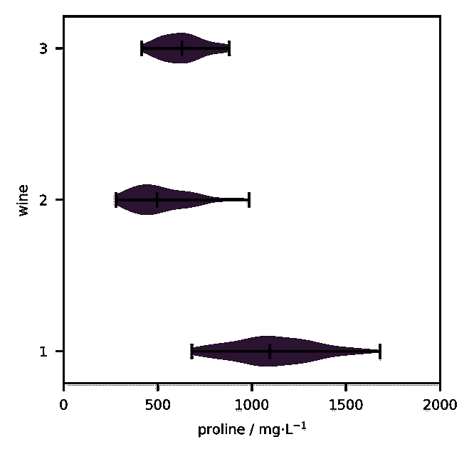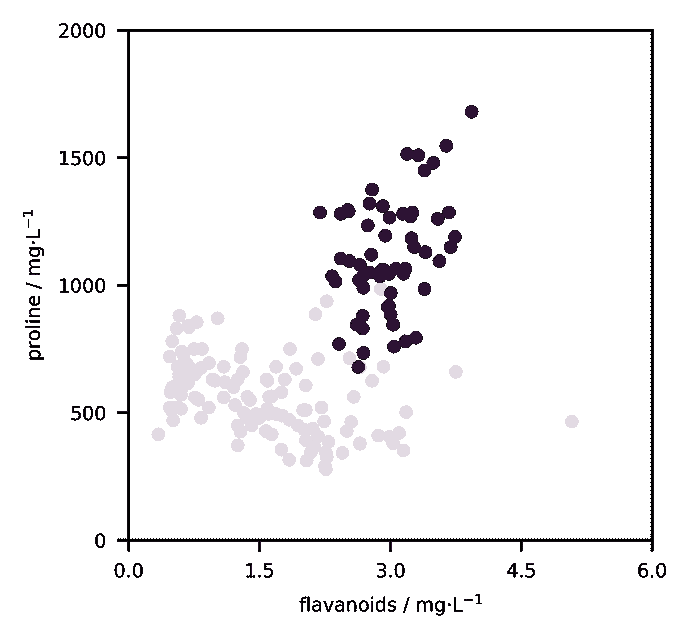

**图 2:** 不同葡萄酒的小提琴图和散点图(深色部分)。(来源:作者)

使用 Python 库 [**PyMC**](https://docs.pymc.io/) 通过采样开发和推断后验概率分布 *p(y=1|x，β)* 的**线性模型**。从上图可以看出，线性决策边界可能就足够了。此外，由于还没有任何先验知识，我们必须设置 [**无信息先验**](https://en.wikipedia.org/wiki/Prior_probability#Uninformative_priors) ，这相当于逻辑回归的一个 [**集合**](https://en.wikipedia.org/wiki/Bootstrap_aggregating) 。请注意，变量在分析前没有标准化，因此参数的大小没有任何意义。

使用葡萄酒数据集的 PyMC 示例。

下面的图中给出了产生的链，显示了收敛和混合，但应评估相关的统计数据。请注意，每条链的样本总量(通常总共四个)是 3000，但是每条链的前三分之一被丢弃。

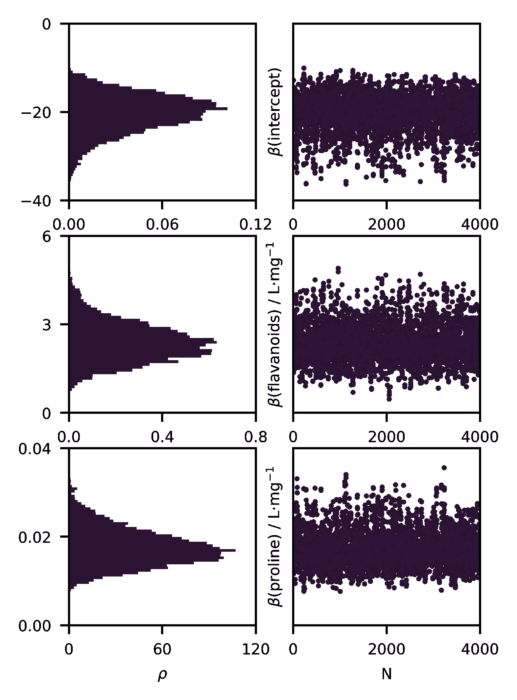

**图 3:** 马尔可夫链的推理程序；trace 显示了良好的混合和收敛(至少在视觉上)。(来源:作者)

为了评估采样算法的成功，开发了几个统计数据。下表是推理过程的总结。

最重要的统计数据是 *R-hat* ，它是一种诊断方法，通过比较多个链之间的方差和每个链内的方差来测试缺乏收敛。如果收敛已经实现，链间和链内的差异应该是相同的。为了最有效地检测不收敛的证据，每个链应该已经被初始化为相对于目标分布分散的起始值。在这种情况下， *R-hat* 为 1，因此实现了收敛和混合。

另一个统计是*有效样本大小*，它基本上是由序列内的**的量校正的样本总量(样本乘以链数)，即总量除以校正因子。如果这个指标(太)低，可能需要更多的样本。**

**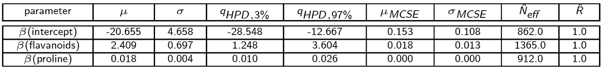**

****表 1:** 模型和推理总结。如指标所示，链已经收敛。**

**让我们来看看我们的估计参数。94%贝叶斯可信区间不包括零，因此我们似乎有信心两个变量都与模型相关。**

**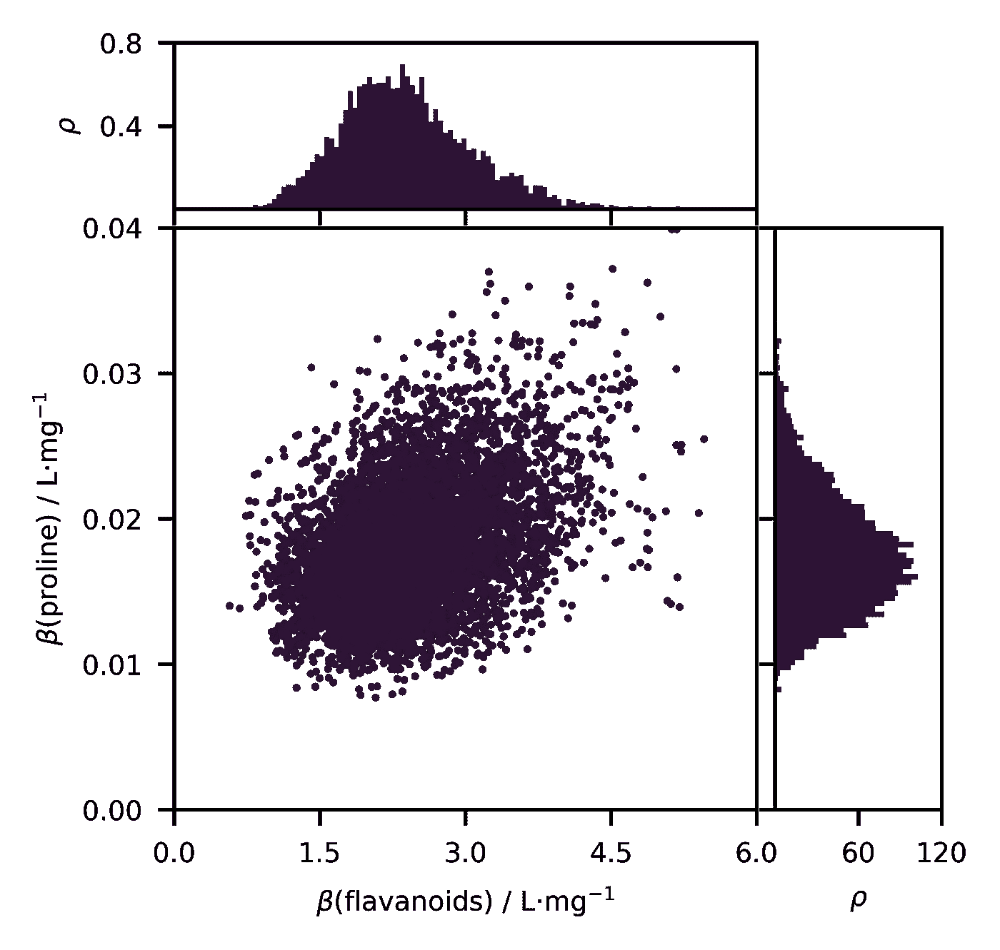**

****图 4:** 估计参数的联合分布。(来源:作者)**

**让我们看看变量的部分相关性。两者都是随着值的增加而增加概率。然而，由于线的分散性较大，黄酮类化合物的含量有更多的不确定性。**

**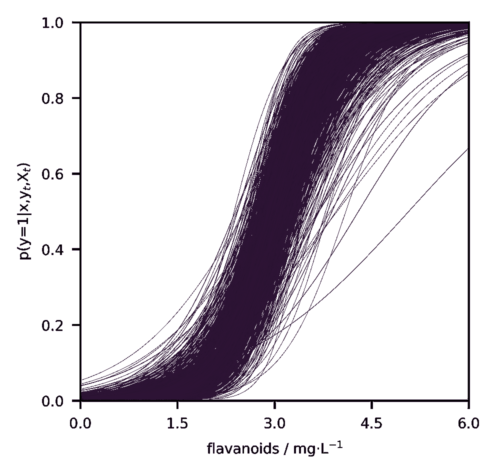****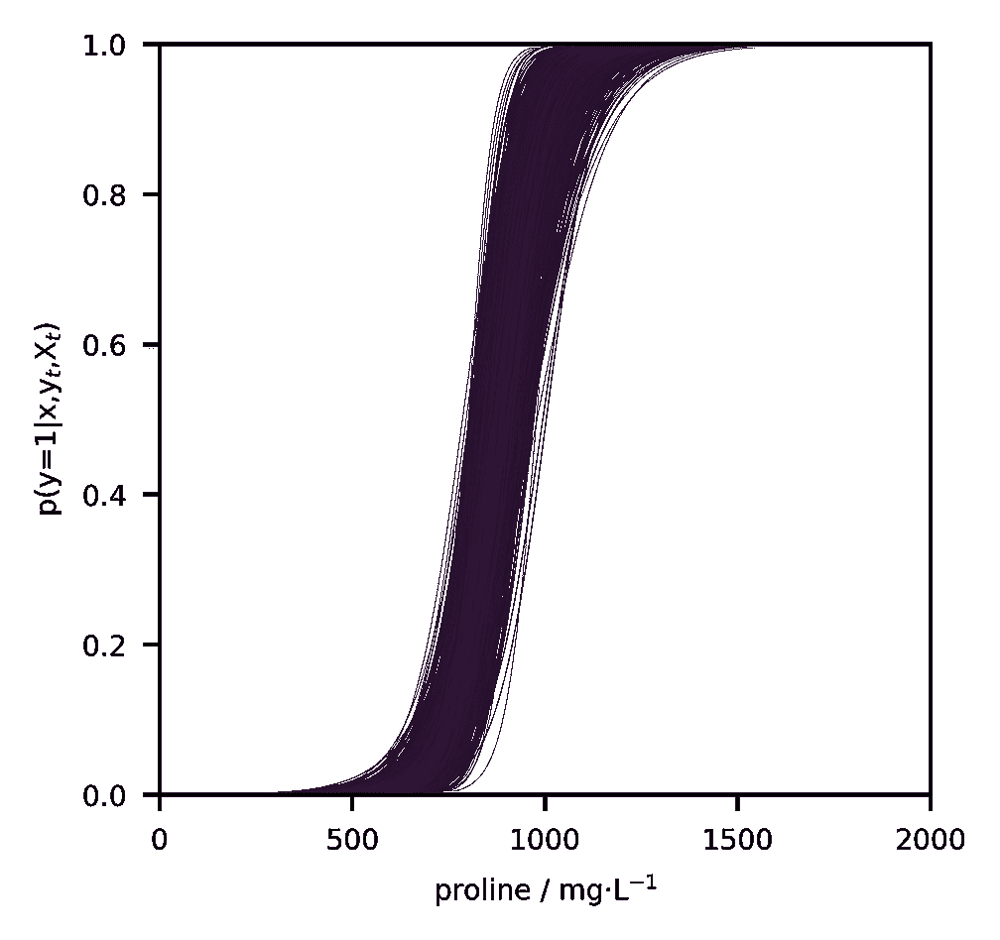**

****图 5:** 通过不透明度和带宽可视化预测的不确定性。与脯氨酸相比，黄酮类化合物的分类包含更多的不确定性。(来源:作者)**

**现在，我们有两瓶新酒。我们有多确定这是(或者不是)我们要找的酒？让我们做一个预测，评估后验分布。**

**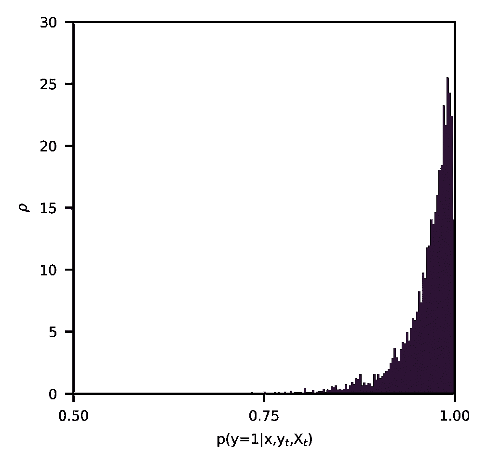****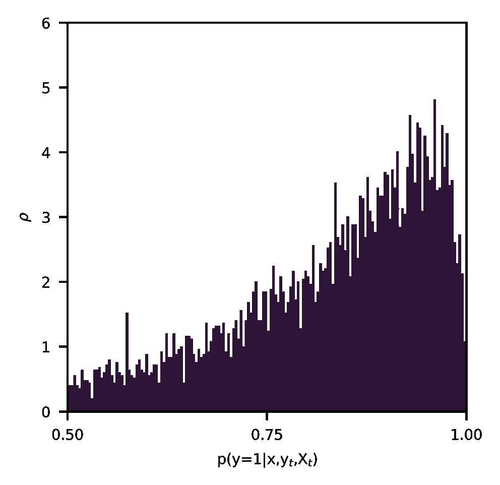**

****图 6:** 两个新样本后验概率的带宽预测不确定性。(来源:作者)**

**第一瓶 94%可信区间[0.90，1.00]，第二瓶[0.50，1.00]。对于第二个，我们不太有信心，事实上，模型在推断过程中从未见过这样的瓶子。**

# ****变分贝叶斯****

**值得一提的是，还有另一种解决整个问题的方法，称为 [**变分贝叶斯**](https://en.wikipedia.org/wiki/Variational_Bayesian_methods) ，其中后验概率用一些更简单的参数分布来近似，即所谓的变分分布，由此可以直接计算积分。该分布通常被公式化为单个单变量概率分布([平均场近似](https://en.wikipedia.org/wiki/Variational_Bayesian_methods#Mean_field_approximation))的乘积，并且其参数通过最小化真实后验分布和变分分布之间的 [**Kullback-Leibler 散度**](https://en.wikipedia.org/wiki/Kullback%E2%80%93Leibler_divergence) 来找到。变分法精度较低，但速度更快，可以作为基于模拟的方法的起点。**

# **摘要**

**贝叶斯统计是一个强大的框架，它解决了频繁主义方法不能解决的问题，如预测中的不确定性。这种不确定性是由于训练数据不足或测试数据中的异常样本造成的。此外，它还是质量控制的一种形式，通过 PyMC3 和 TensorFlow Probability 等库，这些方法已经变得人人都可以使用。**

** [## 具有张量流概率的贝叶斯神经网络

### 概率模型不确定性预测的逐步指南。

towardsdatascience.com](/bayesian-neural-networks-with-tensorflow-probability-fbce27d6ef6)******