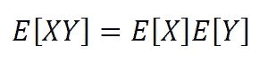
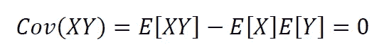
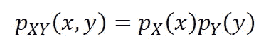
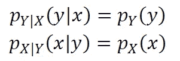
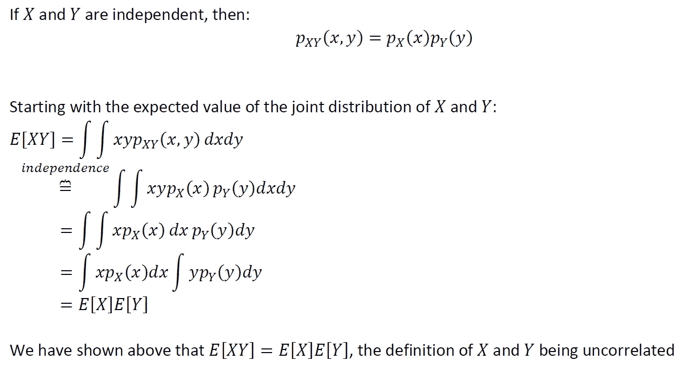
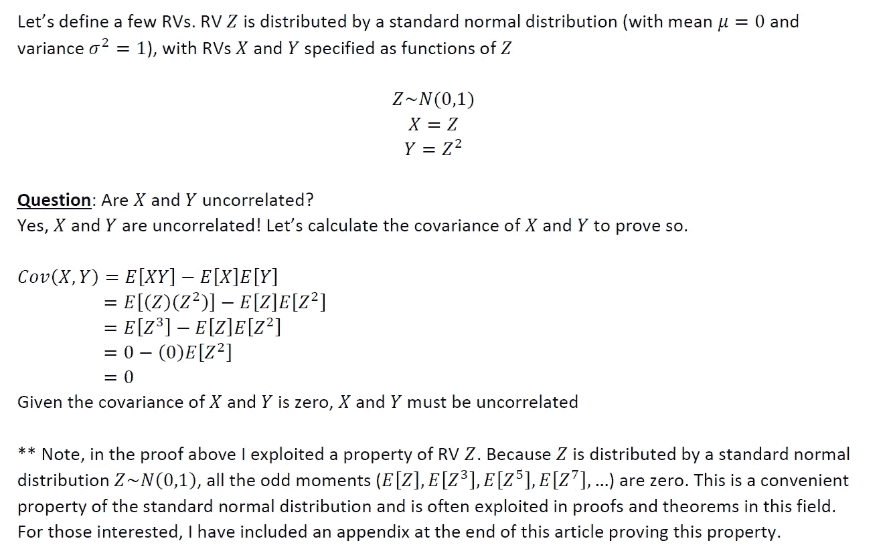
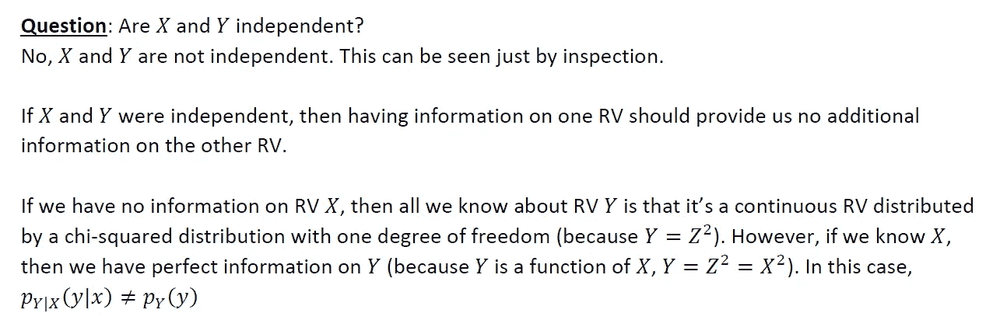
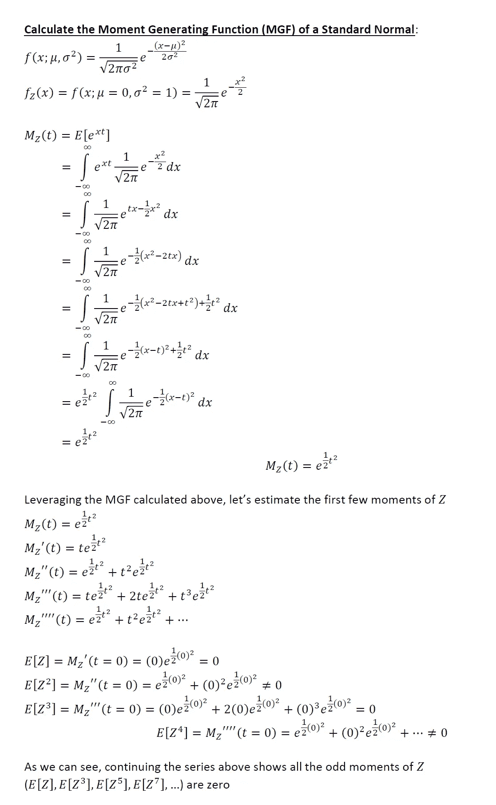

# 不相关与独立随机变量——定义、证明和例子

> 原文：<https://towardsdatascience.com/uncorrelated-vs-independent-random-variables-definitions-proofs-examples-26422589a5d6?source=collection_archive---------11----------------------->

## 它们不是一回事…

莎伦·麦卡琴在 [Unsplash](https://unsplash.com?utm_source=medium&utm_medium=referral) 上的照片

关于技术知识，我通常支持对正在使用的方法有基础的理解。我通常不喜欢记忆任何东西，并尽可能避免这样做。相反，我专注于发展强有力的概念基础，从这些基础中我可以用数学方法推导出我可能需要的任何东西。

在概率论和数理统计领域，利用方法/定理通常依赖于通用的数学假设和约束条件。两个这样的数学概念是随机变量(RVs)是“**不相关的**”，以及 RVs 是“**独立的**”。我已经看到了很多关于这些概念的混乱(包括在媒体平台上)。这些是数学上明确规定的术语，它们并不意味着同一件事。对于任何对统计学、数据科学或机器学习感兴趣的人来说，这些概念绝对值得理解。

本文旨在:

*   从数学上规定 RVs 不相关和 RVs 独立的定义
*   证明独立的 RVs 根据定义也是不相关的
*   证明 RVs 可以不相关但不独立(举例)

# 1.数学定义:

出于演示的目的，让我们假设我们有连续的 RVs **X** 和 **Y** ，它们都是在一些实值支持上定义的。

***不相关的 RVs:***

两个 RVs **X** 和 **Y** 是不相关的，如果它们的联合分布的期望值等于它们各自的边际分布的期望值的乘积。从数学上来说，这是:

这相当于说明 **X** 和 **Y** 之间的协方差为零:

***独立的房车*** *:*

两个 RVs **X** 和 **Y** 是独立的，如果它们的联合分布值等于它们各自的边际分布值的乘积，对于沿着它们各自的支撑的 **X** 和 **Y** 的任何可能范围。从数学上来说，这是:

这相当于陈述了 **X** 和 **Y** (互为条件)的条件分布等价于它们各自的边际分布。换句话说，拥有关于 **X** 的信息不会提供关于 **Y** 的额外信息，反之亦然:

# 2.根据定义，独立的 RVs 是不相关的:

如上所述，根据定义，独立的 RVs 也是不相关的。让我们使用我们的示例 RVs **X** 和 **Y** 以及上面的数学定义来证明这一点:

# 3.RVs 可以是不相关的，但不是独立的:

如上所述，RVs 可以是不相关的，但不是独立的。下面是一个经典的玩具例子来说明:

# 附录:标准正态分布 RV 的奇矩为零的证明

在第 3 节展示 RVs 不相关的例子时，我利用了标准正态分布的一个特殊属性(奇数阶矩都为零)。对于那些感兴趣的人来说，这个属性的证明如下所示:

# 最后的想法

希望以上推导和举例有见地。我认为没有足够的人花时间去做这些类型的练习。上述概念的知识对于理解[高斯-马尔可夫定理](/ols-linear-regression-gauss-markov-blue-and-understanding-the-math-453d7cc630a5)、恢复有效方差估计量的条件以及该领域的更多概念至关重要。

希望以上有见地。正如我在以前的一些文章中提到的，我认为没有足够的人花时间去做这些类型的练习。对我来说，这种基于理论的洞察力让我在实践中更容易使用方法。我个人的目标是鼓励该领域的其他人采取类似的方法。我打算在未来写一些基础作品，所以请随时在 [**LinkedIn**](http://www.linkedin.com/in/andrew-rothman-49739630) 上与我联系，并在 [**上关注我在**](https://anr248.medium.com/) 上的更新！