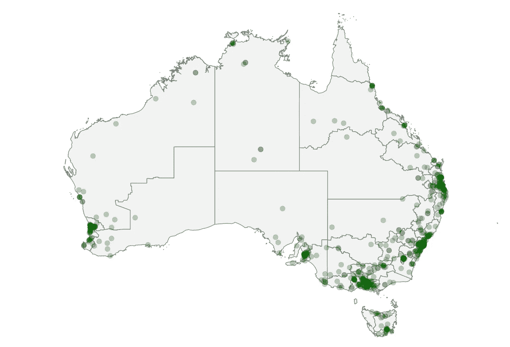
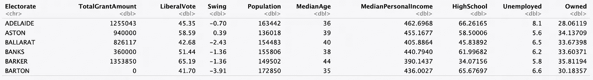
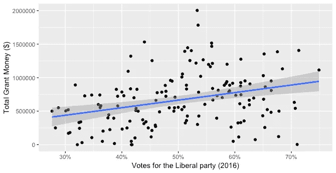
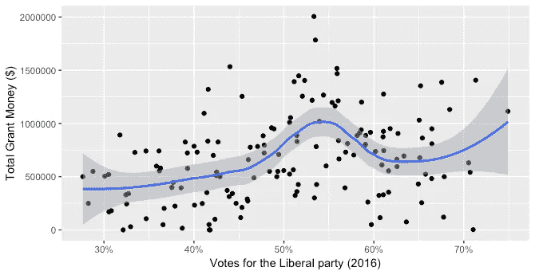
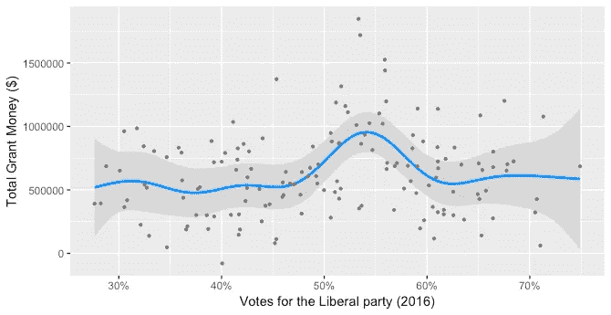

# 用统计模型揭示政府偏见

> 原文：<https://towardsdatascience.com/uncovering-government-bias-with-statistical-modelling-fcbd3d08c9e6?source=collection_archive---------26----------------------->

照片由 [Unsplash](https://unsplash.com?utm_source=medium&utm_medium=referral) 上的 [Aditya Joshi](https://unsplash.com/@adijoshi11?utm_source=medium&utm_medium=referral) 拍摄

## **对澳大利亚“体育丑闻”的数据驱动分析**

你可以跑，但你躲不了(从统计数据上)。澳大利亚自由党很快就会发现这一点。

最近几周，自由党被指控在 2019 年大选前使用 1 亿美元的体育拨款来赢得选票。作为一名数据科学家，我决定通过分析数据来验证这一指控。因此，我着手研究我们能从公开的数据中了解到什么，这些数据与现在众所周知的“体育流氓”丑闻有关。

我的想法是，如果自由党根据选民的投票行为来分配补助金，那么我们应该能够使用统计模型来揭示他们的策略。

在我继续讲下去之前，这里有一些背景资料，以防你还没有看新闻…

# **背景**

澳大利亚自由党自 2013 年联邦选举以来一直执政。在去年选举之前，政府宣布了一项社区体育基础设施计划，为当地体育组织提供高达 50 万美元的拨款。作为促进全国体育参与的一项举措，各组织必须提交一份申请，由澳大利亚体育局进行独立评估和评分。体育部长应该用这些分数来决定批准哪些拨款。

今年，澳大利亚国家审计署发布了一份审计报告，该报告暗示，但没有断言，自由党优先考虑“边缘”和“目标”选民的申请，而不是遵循澳大利亚体育局的建议。本质上，自由党被指控为目标地区提供更多拨款，以赢得 2019 年选举的选票。

澳大利亚选区地图内 684 个体育资助的位置。

# **回到行动**

我分析的最终目的是看是否有证据表明拨款是根据上次选举中选民的投票行为分配的。本质上，有没有一个潜在的策略？如果是的话，自由党针对的是什么样的投票模式？

为了进行这一分析，我需要结合三个关键的数据源，所有这些数据源都是公开的:

1.  关于批准的每项资助的信息(地点和金额)
2.  上一次选举(2016 年)中每个选民的选举结果，以及
3.  控制其他可能起作用的社会人口因素的人口普查数据。

有了这些信息，我将能够生成一个数据集，其中包含分配给每个选民的拨款总额，以及上一次选举的相应投票结果和人口普查的其他控制。

*(注意所有的数据收集、争论和分析都是使用* `*R*` *)*

# 获取数据

澳大利亚体育局在他们的[网站](https://www.sportaus.gov.au/grants_and_funding/community_sport_infrastructure_grant_program/successful_grant_recipient_list)上发布了一份 684 项批准拨款的列表，所以我用`rvest`抓取了这份列表。接下来，这个列表被提供给一个 Google Maps API，以便获得每笔赠款的经度坐标(使用来自 dkahle 的 GitHub 的 T2)。这适用于几乎所有的资助。一些快速的谷歌搜索有助于找到这些组织的其余部分的位置。

为了将每个体育组织分配给其相应的选民，我需要 2016 年联邦选举的选民地图。方便的是，这可以在`eechidna`包中获得，还有选举投票数据。使用来自`sp`和`rgeos`的一些漂亮的函数来遍历选举人，每笔拨款都被成功分配。

现在，补助金已经汇总，因此得到的数据集包含 150 个联邦选区中每个选区的补助金总额。然后，这将与 2016 年选举中的两党优先投票和摇摆投票以及 2016 年人口普查中的社会人口变量集合结合起来，这些变量也是从`eechidna`中获得的。两党首选投票是倾向于自由党而不是工党的投票百分比，摇摆投票是 2013 年至 2016 年两党首选投票的百分点变化。

这是结果数据集的快照。

**LiberalVote** 为 2016 年两党优先投票百分比， **TotalGrantAmount** 为给予选民的拨款总额， **Swing** 为 2013 年至 2016 年的百分点摇摆投票。其他变量是 2016 年人口普查的社会人口特征。

# 现在是分析的时候了

我真正想揭示的是选民在 2016 年大选中对自由党的两党偏好投票与获得的拨款金额之间的关系。首先，让我们看看拟合了线性回归线的散点图是什么样子(使用`ggplot2`)。

赠款总额(TotalGrantAmount)和两党优先投票(LiberalVote)散点图，有回归线和 95%置信区间。观察到正相关。

这里有一些证据表明，更支持自由党的选民更有可能获得体育拨款。但实际上，如果自由党真的实施了有针对性的策略，这两个变量之间的关系可能不是线性的。向最安全的地区提供最多资金的策略不会是一个非常好的策略——因为在 2019 年的选举中，安全的自由派选民不太可能容易易手。

因此，我没有拟合线性回归线，而是绘制了一条黄土曲线——一条平滑的非参数回归曲线，为局部数据点赋予更高的权重。这有助于更好地了解 2016 年投票和拨款金额之间的关系。

拟合黄土曲线而不是线性回归线。在两党的优先投票中，拨款明显飙升，略高于 50%。

哇！黄土曲线揭示了一种重要的关系，这种关系在最初的散点图中并不明显。

在 2016 年，自由党赢得的选民获得的拨款金额明显增加，但没有以巨大优势获胜。这些人被称为“边缘”自由党选民。这一阴谋本身就是资助计划中自由主义偏见的令人信服的证据。

为了更进一步，我决定拟合一个广义加性模型(GAM ),以拨款额作为响应，两党偏好投票(从 2016 年开始)、摇摆投票(从 2013 年到 2016 年两党投票的百分点变化)和人口普查特征作为协变量。每个协变量都作为平滑项包含在模型中。在这种情况下，我使用了惩罚回归样条——一种类似黄土的灵活的非参数回归。

GAM 与`mcgv`拟合，造型效果的剧情由`visreg`产生。

两党优先投票如何影响每个选民的总拨款的拟合效果。高于 50%的峰值显然是显著的。

可以清楚地看到，即使在考虑了摇摆投票和人口普查变量后，边缘自由党选民的拨款金额仍有巨大的飙升！

**在其他条件相同的情况下，一个获得 54%自由党支持的选民和一个获得 54%工党支持的选民所获得的资金差异是惊人的 50 万美元。**

GAM 回归输出证实了这是我着手发现的决定性证据。在 p 值< 0.001 的情况下，数据证明两党优先投票对分配给每个选民的总拨款具有统计上的显著影响。

为了检验我的发现对异常值的稳健性，我在去除了两个拥有巨额赠款(180 万美元和 200 万美元——给布斯比和道森的选民)的选民后，重新估计了模型，发现观察到了同样的自由主义偏差。此外，模型假设似乎是有效的，因为残差是近似正态的(使用分位数-分位数图观察)。对于那些想知道的人来说，完全指定的 GAM 解释了 46.3%的偏差——在这种情况下这是一个很好的解释。

# 最后

我的统计模型提供了经验证据，证明自由党利用体育拨款试图巩固对 2019 年大选的支持。数据清楚地表明，边缘自由选民是政府的目标，因此获得了更多的拨款。

虽然这一分析从政治角度来看非常有趣，但它也展示了如何利用公开数据产生强有力的见解。

对于任何对探索澳大利亚选举和人口普查数据感兴趣的人，我强烈推荐查看`eechidna` `R`包(我是该包的作者和维护者)。该软件包可以轻松访问 2001 年至 2019 年的澳大利亚选举和人口普查数据(包括地图)，可在 CRAN 上获得。

所有用于分析的代码都可以在这个 GitHub [repo](https://github.com/jforbes14/sportsrorts) 中找到。如果你有任何想法，想要联系，这是我的 [LinkedIn](https://www.linkedin.com/in/jeremy-e-forbes/) 。