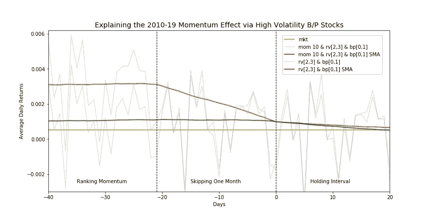
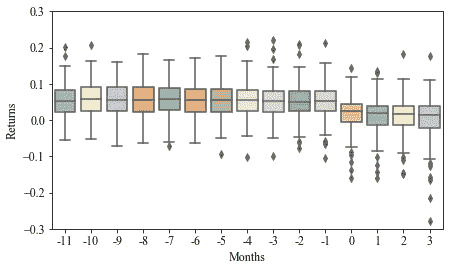
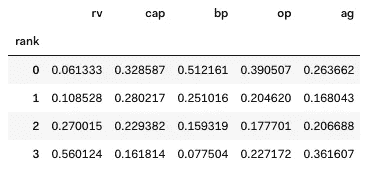
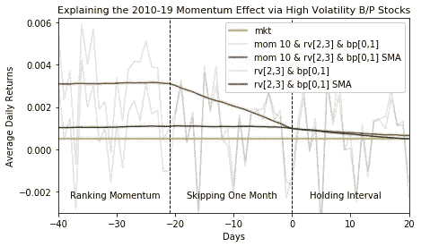

# 滚动跨期分析揭示动量效应

> 原文：<https://towardsdatascience.com/uncovering-momentum-effect-with-rolling-intertemporal-analysis-36eedc1d8a96?source=collection_archive---------49----------------------->



作者图片

## 扩展滚动窗口预测以发现经验策略的洞察力

这篇文章展示了跨期方法，该方法扩展和概括了滚动时间序列技术的范围，用于导出过渡过程和经验策略的模型。该方法是在解释动量溢价的背景下说明的，动量溢价是一个长期的持续挑战。

Jegadeesh 和 Titman [1]在 1993 年对动量效应进行了记录，表明动量效应从 1965 年到 1989 年为美国普通股带来了异常的正回报。自那以后，传统的横截面动量策略被概括为根据过去一年的回报滞后一个月对资产进行排序，并做多过去赢家资产的子集，同时做空过去输家资产的子集。多篇论文指出，在广泛的资产类别、市场和时间范围内存在动量，这种观点认为动量因素几乎无所不在。然而，动量溢价的来源仍然是一个悬而未决的问题，没有一个单一的模型来主导叙事。为了解释这一现象，人们提出了许多基于风险的行为模型，其中 Clifford Asness 和 Eugene Fama 对这一主题进行了一次值得注意的讨论[2]。

最近，动量效应被揭示动量论文[3]中提出的滚动跨期分析所解决。在这种方法中，选定的十分位数在时间范围内向前滚动，同时在组合的 11 个月排名、1 个月滞后和相对于组合形成日期的持有间隔期间收集每个月的组合回报。类似于滚动窗口预测，排名周期可以与样本内区间相关联，而持有周期构成样本外区间。下面是揭示动量文件的图表，展示了对 2006 年 8 月至 2017 年 8 月牛市状态的顶部动量十分位数运行滚动跨期方法的结果。



图:样本内和样本外动量最高的 10%月度回报的箱线图。

箱线图突出显示了样本内和样本外间隔之间的凸起。先前的研究主要致力于分析保持期。这些图把我们的注意力转移到了转变过程上。这个凸起的左侧可以用随机抽样模型来解释。根据这一模型，动量效应(样本外)应该为零，因此定义了评估基本动量理论和模型的标准。本文扩展了跨期方法，将动量效应解释为表现强劲的股票组合。该实现基于 Quantopian 平台，包括三个步骤:运行 Quantopian pipeline、选择特性和实施跨期方法。

## 量子管道

Quantopian 提供了一个数据科学平台，用于在交互式 Python 研究环境中开发和测试量化金融投资策略。这个框架的主要组件之一是一个充当不同异构数据集的公共接口的因子，因此可以在复合管道中统一处理这些数据集。特色应用需要技术和基本特征。

如下面的代码片段所示，技术因素，如动量和已实现的波动性，可以通过 CustomFactor 类使用股票价格来实现。

```
import numpy as np
from quantopian.pipeline.factors import CustomFactor, DailyReturns
from quantopian.pipeline.data.builtin import USEquityPricingclass Momentum(CustomFactor):
    inputs = [USEquityPricing.close]
    window_length = 252

    def compute(self, today, assets, out, prices):
        out[:] = (prices[-21] - prices[-252])/prices[-252]

class RealizedVolatility(CustomFactor):
    inputs = [DailyReturns()]
    window_length = 126

    def compute(self, today, assets, out, returns):
        ret_r2 = returns**2        
        out[:] = np.sqrt(np.nansum(ret_r2, axis=0))
```

基本面因素是通过晨星和 FactSet 数据集的 Quantopian 内置包装器定义的。

```
from quantopian.pipeline.factors import MarketCap, Latest
import quantopian.pipeline.data.factset as fset
import quantopian.pipeline.data.morningstar as mstarcap = MarketCap()
bp = 1/Latest([mstar.Fundamentals.pb_ratio]) # book-to-price ratio
ebit = fset.Fundamentals.ebit_oper_af.latest
shldrs_eq = fset.Fundamentals.shldrs_eq.latest
op = ebit/shldrs_eq # operating profitability
ag = fset.Fundamentals.assets_gr_af.latest # asset growth
```

此外，Quantopian 平台提供了一种机制，用于根据一组约束条件(如市值、美元交易量等)定义不同的股票领域。具体来说，QTradableStocksUS 宇宙包含大约 1600-2100 只股票，其市值大于 5 亿美元，在过去 200 天内的日均美元交易量中值大于或等于 250 万美元，收盘价高于每股 5 美元，以及过去 200 天的可用数据。然后，宇宙用于选择股票，以计算管道内的系数。

```
from quantopian.pipeline.filters import QTradableStocksUS
universe = QTradableStocksUS()
```

一旦定义了因素和领域，所有因素都可以合并到一个管道中，并在 Quantopian 引擎中运行。对于这种应用，这些因素被额外扩展用于生成四分位数等级。

```
from quantopian.pipeline import Pipeline
from quantopian.research import run_pipelinedef make_pipeline():
    pipe = Pipeline()
    pipe.add(Momentum(mask=universe), "mom") 
    pipe.add(RealizedVolatility(mask=universe).quartiles(), "rv")
    pipe.add(cap.quartiles(mask=universe), "cap")
    pipe.add(bp.quartiles(mask=universe), "bp")  
    pipe.add(op.quartiles(mask=universe), "op")    
    pipe.add(ag.quartiles(mask=universe), "ag")  
    pipe.set_screen(universe)
    return pipestart, end = '2010-01-01', '2019-06-30' 
pipe_data = run_pipeline(make_pipeline(), start, end)pipe_data.replace(-1, np.nan, inplace=True)
pipe_data.dropna(inplace=True)
```

最后，使用 Alphalens 模块将远期收益和因子合并到一个多指数数据框架中，该框架具有两个指数级别:日期和资产。

```
import pandas as pd
from alphalens.utils \
    import get_clean_factor_and_forward_returns as add_returnsassets = pipe_data.index.levels[1]
prices = get_pricing(assets, start, end, fields='open_price')ad = add_returns(pipe_data['mom'], prices, quantiles=10)
ad.rename(columns={'factor_quantile': 'mom_decile'}, inplace=True)factor_names = ['rv', 'cap', 'bp', 'op', 'ag']
asset_data = pd.merge(ad, pipe_data[factor_names], \
    left_index=True, right_index=True)
```

## 筛选功能

本文假设动量效应是表现强劲的公司的副产品，而不是投资者的行为。因此，作为下一步，我们需要筛选不同的公司特征(由晨星和 FactSet 数据集提供)，以捕捉动量十分位数内的分布异常。由于可用特征的数量很大，本文将范围缩小到 Fama-French 五因素模型[4]中使用的特征:规模、市净率、营业利润率和总资产增长率。根据之前的动量研究，这个基本面列表进一步增加了一个技术特征，即已实现波动性。

```
asset_flat = asset_data.reset_index()df_ranks = pd.DataFrame(index=range(0,4))
df_ranks.index.name = 'rank'm10 = asset_flat.query('mom_decile == 10')
m10_count = len(m10)
for n in ['rv', 'cap', 'bp', 'op', 'ag']:
    q_counts = \
       [len(m10.query('{}=={}'.format(n, q))) for q in range(0,4)]
    df_ranks[n] = [q_count/m10_count for q_count in q_counts]

df_ranks
```



表:动量上十分位数中每个因素四分位数的分数。

上表显示了动量前十分位数中每个因素的概率分布。基于输出，筛选发现了两个主要异常:已实现波动率(rv)和市净率(bp)。对于全面的研究，特征重要性分析可以通过机器学习方法(例如，分类树的平均减少杂质)进行扩展，López de Prado 在“资产管理器的机器学习”[5]中对此进行了概述。交互影响可以通过“HHP 多维模型的交互分析”[6]中介绍的技术进一步增加。

## 滚动跨期分析方法

根据上述特征筛选分析，动量上十分位数的 83%和 76%分别由已实现波动率的上半部分和市净率四分位数的下半部分组成。然后，这些结果促使我们对从动量前十分之一和整个股票宇宙中选择的相应样本所表现出的跨期行为进行比较。

下面的代码片段实现了每 21 天运行一次的函数，并在投资组合形成日之前和之后收集样本内和样本外窗口(wdw1 和 wdw2)的每日等权重投资组合回报。

```
def rolling_inout_rtns(df_input, # factors and returns
                       wdw1, wdw2, # in- and out-of-sample windows
                       query): # query of selected factor deciles

    days = []; dfs = [] 

    ds = df_input.index.levels[0].unique() for t in range(wdw1*21, len(ds) - wdw2*21, 21):

        df_t = []

        # select assets in the formation date t
        xs_t = df_input.xs(ds[t])
        assets = xs_t.query(query).index
        df_t.append(len(assets))

        # calculate means of selected assets for [-wdw1, wdw2]     
        for dt in range(-wdw1*21, wdw2*21+1):
            xs_dt = df_input.xs(ds[t+dt]).loc[assets.values]
            df_t.append(xs_dt['1D'].mean())

        days.append(ds[t])
        dfs.append(df_t)

    columns = []
    columns.append('count')
    for dt in range(-wdw1*21, wdw2*21+1):
        columns.append(str(dt))

    df_output = pd.DataFrame(dfs, index=days, columns=columns)
    df_output.index.rename('date', inplace=True)

    return df_output
```

在定义了样本内和样本外窗口之后，该过程可以随后应用于具有高波动性账面价格比股票的样本。

```
wdw1 = 3 # in-sample months
wdw2 = 1 # out-of-sample monthsquery = '2 <= rv <= 3 and 0 <= bp <= 1'
asset_rtns = rolling_inout_rtns(asset_data, wdw1, wdw2, query)query += ' and mom_decile == 10'
mom10_rtns = rolling_inout_rtns(asset_data, wdw1, wdw2, query)
```

最后，绘制结果。

```
import datetime
from pandas.tseries.offsets import BDay
import matplotlib.pyplot as pltmkt_start = datetime.datetime.strptime(start, '%Y-%m-%d') - BDay(1)
mkt_prices = get_pricing('SPY', mkt_start, end, fields='open_price')
mkt_rtns = mkt_prices.pct_change(periods=1)[1:]t0 = -wdw1*21
t1 = wdw2*21 + 1mkt_means = [mkt_rtns.mean() for dt in range(t0, t1)]mom10_means = [mom10_rtns[str(dt)].mean() for dt in range(t0, t1)]
asset_means = [asset_rtns[str(dt)].mean() for dt in range(t0, t1)]mom10_sma = pd.Series(mom10_means).rolling(window=21).mean()
asset_sma = pd.Series(asset_means).rolling(window=21).mean()x = range(t0, t1)plt.figure(figsize=(9,4))plt.plot(x, mkt_means, label='mkt', color='y')asset_label = 'rv[2,3] & bp[0,1]'
plt.plot(x, asset_means, label=asset_label, color='grey')
plt.plot(x, asset_sma, label=asset_label+' SMA', color='green')mom10_label = 'mom 10 & ' + asset_label
plt.plot(x, mom10_means, label=mom10_label, color='grey')
plt.plot(x, mom10_sma, label=mom10_label+' SMA', color='red')plt.xlim(-40,20)
plt.ylim(-0.003,0.006)
plt.xlabel('Days')
plt.ylabel('Average Daily Returns')
plt.legend(loc='upper right')
```



图:动量赢家和高波动性成长股的样本内和样本外结果。

如图所示，样本内和样本外区间由三个时期组成:排名、一个月跳票、持有。动量赢家(红色)和高波动性增长四分位数(绿色)之间的排名周期差异是由动量过程采样的高特质回报决定的。在跳跃区间，当排名周期在图上的第 21 天结束时，动量赢家接近高波动成长股的平均水平。在形成日期之后，它们都经历了类似的短期反转。

有趣的是，虽然滞后一个月之前被记录为经历短期反转，但图中的结果显示，跳过最近一个月并因此将其从常规排名区间中排除不再是必要的。然而，在这项研究中，将月份排除在排名之外，有助于通过捕捉动量赢家和高波动性成长股之间的一致性，深入了解动量效应的主要驱动因素。

76%的动量赢家是成长股，因此价值股的贡献并不大。尽管如此，同样的过程也可以应用于相应的高波动性值子集，并解释这种影响。

## 摘要

本文提供了基于滚动跨期方法的应用程序的分步演示，以解释动量策略的优势。该方法通过连接用于导出过渡过程模型的样本内和样本外区间，扩展了滚动窗口预测技术。具体来说，对于 2010 年至 2019 年，文章揭示了动量策略作为对高波动性成长股进行采样的程序，并通过排名、跳跃和持有区间来跟踪它们的转变。这个应用补充了两篇基于量子理论的关于动量的论文，包括波动时机和揭示动量。如果感兴趣，可以在 Quantopian 论坛的以下主题中找到更多信息和笔记本:

*   [基于量子理论的关于波动时机动量的论文](https://www.quantopian.com/posts/quantopian-based-paper-on-momentum-with-volatility-timing)
*   [下一篇基于量子理论的关于揭示动量的论文](https://www.quantopian.com/posts/the-next-quantopian-based-paper-on-uncovering-momentum)

## 参考

[1] N. Jegadeesh 和 S. Titman，[回报买入赢家和卖出输家:对股票市场效率的影响](https://onlinelibrary.wiley.com/doi/abs/10.1111/j.1540-6261.1993.tb04702.x) (1993)，金融杂志

[2] C .阿斯内斯，[法玛论动量](https://www.aqr.com/Insights/Perspectives/Fama-on-Momentum) (2016)，AQR 见解

[3] Y. Malitskaia，[揭开势头](http://ssrn.com/abstract=3502301) (2019)，SSRN 工作文件

[4] E. Fama 和 K. French，[一个五因素资产定价模型](https://www.sciencedirect.com/science/article/abs/pii/S0304405X14002323) (2015)，金融经济学杂志

[5] M.M. López de Prado，[资产管理者的机器学习](https://www.cambridge.org/core/elements/machine-learning-for-asset-managers/6D9211305EA2E425D33A9F38D0AE3545) (2020)，剑桥量化金融要素

[6] Y. Malitskaia、W.H. Greene 和 Y. Malitsky，[HHP 多维模型的相互作用分析](https://air.unimi.it/retrieve/handle/2434/212942/255730/BoA.pdf) (2012)，ERCIM 2012

## 网站

[](https://www.quantopian.com) [## 量子金融:学习量子金融的地方

### Quantopian 是一个免费的在线平台和社区，用于教育和投资算法的创建。量子乌托邦…

www.quantopian.com](https://www.quantopian.com) [](https://www.morningstar.com) [## 晨星|让投资者成功

### 我们的独立研究、评级和工具正在帮助整个投资生态系统的人们撰写他们自己的…

www.morningstar.com](https://www.morningstar.com) [](https://www.factset.com) [## FactSet |面向投资专业人士的集成金融数据和软件解决方案

### 了解 FactSet 与众不同的最佳方式是自己去看。我们与投资部门合作过…

www.factset.com](https://www.factset.com)