# 揭开宇宙:寻找系外行星候选者和其他异常的机器学习方法

> 原文：<https://towardsdatascience.com/uncovering-the-cosmos-machine-learning-approach-to-finding-exoplanet-candidates-and-other-a3ab8e180b14?source=collection_archive---------28----------------------->

## 演示如何使用机器学习快速准确地搜索大量天文数据

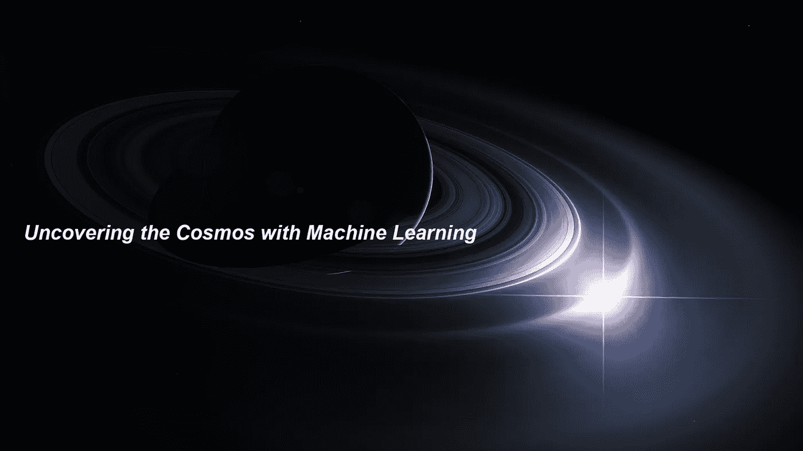

图片来源:[spaceengine.org](http://www.spaceengine.org)

> 灯塔的目的是在黑暗中给别人指路。当我们观察浩瀚的夜之海洋而没有人点燃它时，会有一些令人不安的暗示。—伊萨克·阿瑟

# **简介**

T 天文学领域正日益成为一个大数据问题，随着更大的调查和更精确的仪器，数据进入了万亿字节的范围并呈上升趋势。在更广阔的物理领域更是如此。大型强子对撞机每小时获得的数据比脸书一整年获得的数据还多。因此，反馈可能会很慢，在发现之前，发现可能会在数据集中存在多年。

我概述了一种基于机器学习的方法，它允许我们:

*   天文时间序列数据的快速**目标**搜索
*   自动检测最异常的**测量值**
*   这样做有合理的计算要求

然后，我将这种方法应用于从最近的卫星观测中获得的真实天文数据。

## 光曲线

我们目前的分辨率还不足以从视觉上分辨邻近太阳系的细节。然而，我们对物理学有很好的理解，可以通过间接测量来理解正在发生的事情。其中之一是恒星的亮度。

如果一种现象(自然的或其他的)正在恒星周围发生，我们可以预期它的间接影响会随着时间的推移出现在恒星的亮度中。如果一个物体挡住了恒星的去路，那么恒星就会变暗，变暗的程度与该物体相对于恒星的表观尺寸成正比。根据亮度曲线的轮廓，我们可以推断出物体的属性，例如它的大小和它离恒星有多近。这是用来寻找系外行星的主要方法，被称为**凌日法**。

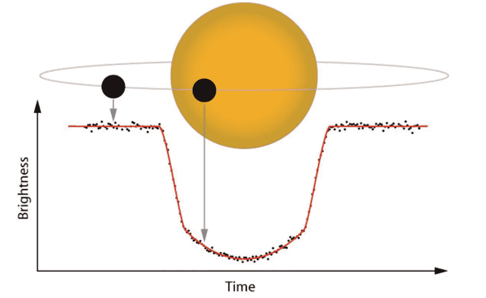

中转方法。图片来源:NASA

在分析这类数据时，有几件事要记住。尤其是寻找像行星这样的自然现象。

1.  你需要观察恒星**足够长的时间**才能看到变暗的重复。例如，如果一个外星文明正在使用这种方法观察太阳，他们将不得不观察它一年，以观察地球重复造成的变暗。理想情况下，你会希望它发生三次。
2.  你需要恒星轨道平面向我们倾斜。人们倾向于认为所有的行星都以与银道面相同的角度运行，但事实并非如此。例如，我们自己的太阳系与银道面呈 60 度倾斜，这就是为什么我们在南半球能更好地看到银河系中心的原因。不幸的是，如果一颗恒星的两极直接指向我们，我们将不会因为它的行星的运动而观察到亮度的任何变化。
3.  1)和 2)的组合以及多年来光度计灵敏度的变化导致了**测量偏差**。如果你只是在短时间内观察恒星，并让现象在这段时间内重复出现，那么你多半是在识别恒星周围的短年天体。现在，我们可以敏感地注意到地球大小的物体造成的亮度变化，但很长一段时间以来，我们所知道的唯一行星是木星大小的物体，其轨道比水星更近(因为内轨道的年数更短)。

最终目标是分析来自 transit 方法测量的时间序列信息，以找到感兴趣的对象。

## 挑战

尽管受限于与太阳系处于同一平面的物体，银河系中恒星的数量是如此之多，以至于仅从一次观测中仍会产生数十万或数百万条光变曲线。每个测量还会有数千个数据点和附加信息。仪表板是为*公民科学家*开发的，以帮助天文学家处理数据。现在著名的 [KIC 8462852(虎斑星)](https://www.youtube.com/watch?v=gypAjPp6eps)就是这样被发现的。这种方法确实意味着数据可以存储在后端，将计算需求缩小到一个地方。但是仍然存在以下问题:

1.  这仍然是一种蛮力方法
2.  寻找特定的现象仍然是耗时的，并且可能仍然需要不能通过前端完成的编程方法
3.  如果影响微弱，现象可能会被忽略
4.  很难快速获得对数据的整体理解

给我们快速反馈的方法非常有用，尤其是当我们想用其他仪器进行后续测量时。如果调查中的数据量呈上升趋势，上述问题的解决方案需要廉价、快速且可扩展。

这里可以引入几个有用的机器学习概念。

# 相关机器学习概念

大多数非该领域的人都理解机器学习模型的概念，即进行分类预测，无论是二元(是或否)还是多分类。不幸的是，在许多实际情况下，这些标签可能不可用或不可靠。即使您有时间和资源，数据的正确标记可能也没有那么有用，并且不是每个对数据感兴趣的从业者都会对相同的标记感兴趣。我们想要的是利用深度学习架构的潜力来理解复杂的结构，并以一种*无人监管的*方式返回见解。

## 时间序列编码

请考虑以下情况。如果我问一个人两幅画是否相似，通常不会(只是)有一些不同的特征使它们如此。我们的语言有时不足以*描述为什么*它们是相似的，但你知道它们是一种*手动波浪形*的方式，这与风格等有关。这是因为我们对我们所看到的东西有一种复杂的更高层次的理解(或感觉),而不是我们必须写下来或交流的。

深度学习模型通过理解数字阵列或*向量表示*形式的输入来工作。即使我们做一个分类问题，我们所做的只是将网络的最后一层从这个向量表示转换成一个显式输出。由于网络中的所有非线性，这些表示通常不是人类可以解释的。

对于我们的光曲线，我们不想做预测，而是让模型*将光曲线变成这些矢量表示*中的一个，捕捉它的所有结构。当我们需要洞察力或进行搜索时，我们最终将只是与这种表征一起工作。

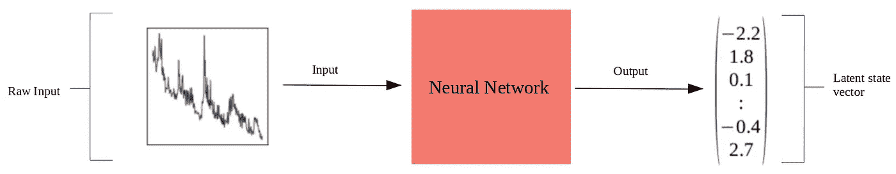

既然我们有了一种以相同方式表示所有光线曲线复杂性的方法，我们可以执行**聚类**并评估**相似度**。我们还可以决定我们希望这个表示有多大，从而使它有利于压缩。

## 类似

如果我们将每个向量想象成空间中的一个点，其中每个数字对应一个坐标*，如纬度或经度*，我们可以通过其位置以及相对于其他点的**距离和方向**来提取信息。这本质上是相似的基础。

**余弦相似度**

通常，两个数据点相对于彼此的方向比它们的欧几里德(L2)距离更能说明问题。如果我们有数据的矢量表示，两个矢量的方向就是它们的归一化(按大小)点积。

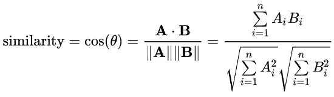

余弦相似度。图片来源:维基百科

由于操作简单，即使在高级语言中计算也非常快，因为它们经常在 C 中运行算术运算。

对于纯软件思维的人来说，有一种诱惑，即逻辑上认为是一组 For 循环的总和。但处理器实际上在非常低的级别上有特殊的算术运算，称为*融合乘加*，它将运算结合在一起，比单独做乘法和加法更快。因此，对于相似性搜索，如果我们想最大化速度，我们希望利用这种算法。这样做比用高级语言手工实现要快几个数量级。这是我们想要将数据转换成潜在向量表示的另一个原因。理解这一点是用合理的硬件进行数十亿规模的相似性搜索的关键。

然而，这一指标有一些**警告需要讨论，因为时间序列中相似性的概念不像其他数据类型那样简单明了。有相似性度量可以证明更适合时间序列相似性，包括:**

1.  复杂性不变相似性
2.  基于相关性的相似性
3.  基于自相关的相似度

在以后的工作中记住这一点，我稍后证明余弦相似性对于我们试图解决的问题仍然是足够的。

## 建筑与培训

为了获得一个给我们矢量表示的模型，我们需要训练一个神经网络。即使我们是在无人监督的情况下做这件事，我们仍然需要给模型一个任务来解决。

一个**自动编码器**是一种由两部分组成的架构——编码器*和解码器*。编码器将数据还原为我们选择的矢量表示，解码器尝试从该表示中*重建*信号。因为它们被一起训练，所以编码器将试图找到最有意义的表示，使得解码器可以创建最准确的重建。

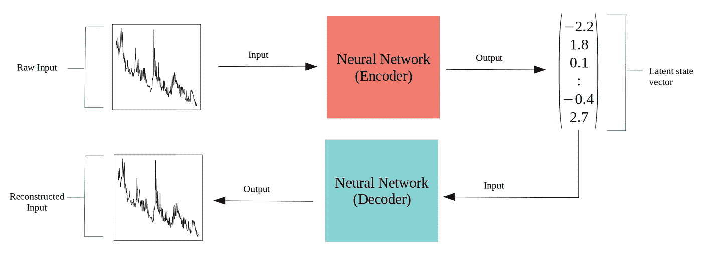

由于我们处理的是时间序列，因此有两种类型的输入重构可用于训练:

**插值** —给定一个值在区间【t₀，tₙ】内的时间序列，我们以概率为 10–50%的点子集为条件，然后尝试在相同范围内重建完整信号。

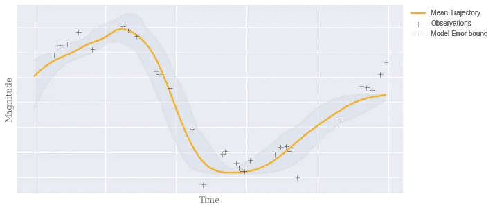

**外推** —给定一个值在区间[t₀，t₂ₙ]we]的时间序列，编码信号的前半部分[t₀，tₙ]并尝试重建信号的后半部分[tₙ，t₂ₙ].]像插值一样，我们可以以第一个区间上的点的子集为条件。

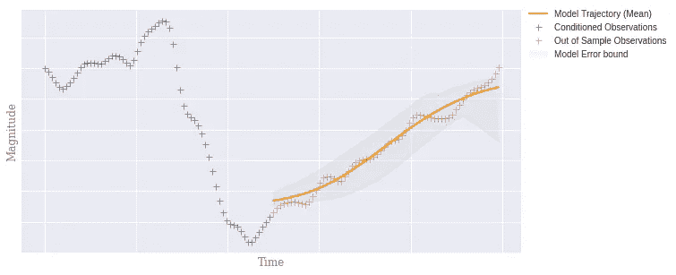

为了获得光曲线的编码，我选择了**插值**方法，因为我们的目标是比较信号，而不一定是预测。

**ODE-RNNs**

递归神经网络(RNNs)是时间序列的主要结构类型，因为它们具有捕捉长期相关性的能力。但如果时间序列是*不规则采样*，一般会采用各种变通方法。直到最近，处理该问题的一种常用方法是将时间步长信息作为输入要素与信号一起传递，在缺失点处估算值，或者以大于最大间隙的分辨率进行固定时间离散化并聚合值。

神经常微分方程领域的最新发展使我们能够通过将 RNNs 转化为连续时间模型来更好地拟合缺失时间点。这在论文*中探讨了不规则采样时间序列的潜在常微分方程*，并被称为常微分方程-RNN。

奥德-RNN 插值缺失数据。图片来源:[潜颂](https://github.com/YuliaRubanova/latent_ode)

处理不规则采样时间序列的能力对于我们的编码器来说是非常有用的能力，因为我们的向量表示将更能指示光曲线的真实动态。如果有几个间隔时间的后续测量，这是特别有用的。我们可以用它作为我们的网络编码器。

# **凌日系外行星调查卫星**

TESS 于 2018 年发射，是首个在整个天空中搜寻系外行星的太空任务。它通过将天空划分为每个半球的 13 个观测扇区来实现这一点。每个扇区观察 27 天，在重新定向以对下一个扇区重复该过程之前，每 2 分钟记录一次测量。重点是附近的恒星，每个扇区观测大约 200，000 颗恒星。在编写本报告时，主要任务的 26 个预定部门中的 17 个已经完成，并向公众提供了数据。每个扇区的时间序列数据大约为 40GB，因此我将分析重点放在最近的两个扇区(16 和 17)。

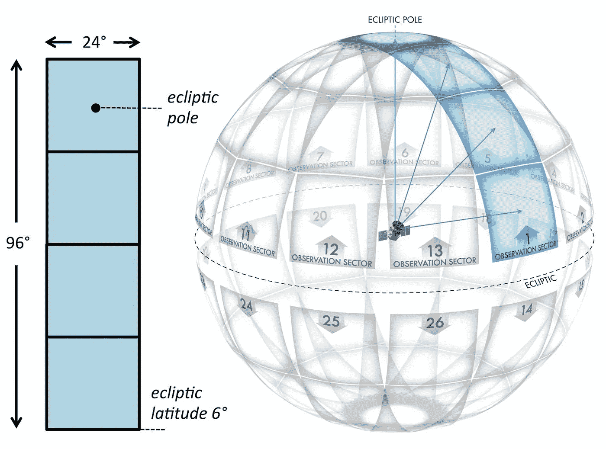

TESS 相机的视野和半球分区。图片来源:TESS 天文台指南。

## 方法

TESS 数据包含对象 id 和各种带有相关时间戳的测量值。我将时间戳和流量(亮度)按对象 id 分组。然后实施以下预处理步骤:

*   **离散化**——尽管每两分钟测量一次，但飞船上的时钟分辨率很高。为了批量求解常微分方程，我们必须将所有时间步长的并集输入到模型中。如果时钟分辨率很高，这会产生许多独特的时间点，即使实际上它们非常接近。因为我们希望减少所有时间步长的并集大小，所以我将时间步长四舍五入到两位小数。从检查来看，这对于光变曲线没有明显的差异，并且聚集没有显著改变每个样本的观察数量。
*   **归一化方案** —乍一看，通过每次测量最大值进行归一化似乎是合适的，因为这是人们通常描述亮度下降的方式，例如 0.99 相当于亮度下降 1%。然而，该模型很难同时适用于亮和暗的物体，因为亮和暗物体的量值变化可能要低几个数量级。为了使样本比例不变，I **使用每个样本的平均值和标准偏差对每个样本进行 z 归一化**(非全局)。本文后面的所有结果都显示了标准化的光线曲线。

我训练了一个多层 ODE-RNN，但是对潜在 ODE 库做了以下修改，因为我发现它们为我的任务提供了更好的结果:

*   **损失函数** —我把标准的 L2 损失换成了 L1 损失。我发现它总体上更好地捕捉了局部动态，而不是试图适应大峰和大谷。
*   **微分方程解算器** —默认使用欧拉法。尽管这种方法训练速度更快，但随着步数的增加，误差会累积。我把它改成了自适应龙格-库塔解算器，这是 [torchdiffeq](https://github.com/rtqichen/torchdiffeq) 包中的标准配置。
*   **禁用偏置** —对于所有层，我禁用了偏置参数，因为我发现它给出了更好的结果，并且训练更快。

使用 10 的批量大小对来自总数据集的 5000 个随机子集进行训练。Adamax 优化器以 1e-3 的固定学习速率使用。选择的潜在维度为 40。在具有 12GB GDDR5 RAM 的 NVIDIA GTX 1070 上进行训练。

**推论**

训练之后，目标是将我们所有的光线曲线转换成我们的潜在表现形式。

虽然一起训练编码器和解码器，但我们在推断时只使用编码器计算每条光曲线的潜在表示。*这只需要做一次*，并且在评估结果时比训练时快得多，因为我们不需要更新任何梯度，也不需要将所有梯度保存在内存中。尽管如此，评估的速度将是编码器有多少参数的函数。

在将结果保存到磁盘之前，我们只需一次将一批数据加载到内存中。在我的情况下，我能够在笔记本电脑 CPU 上每秒评估大约 2500 个潜在表示。完成后，我们就可以进行主要的分析了。

## 可视化结果

尽管将每条光变曲线简化为 40 个数字比成千上万个数据点需要处理的信息要少得多，但乍看之下，给定值的含义肯定不明显。能够一次看到*所有的数据*给了我们一个大概的概念，我们可以期望看到不同类型的测量。

t-分布式随机邻居嵌入(t-SNE)是一种有用的算法，可以将数据的维数降低到我们选择的大小。这个算法是*而不仅仅是高维空间到低维空间的投影*。简而言之，通过估计一个点选择另一个点作为其邻居的条件概率来赋值。通过这样做，你基本上保存了尽可能多的来自更高维度的信息。

选择二维输出意味着我们现在可以将完整的光变曲线测量*视为 x-y 平面上的单点*。彼此靠近的点是彼此相似的测量值。出现的是可以研究的集群。

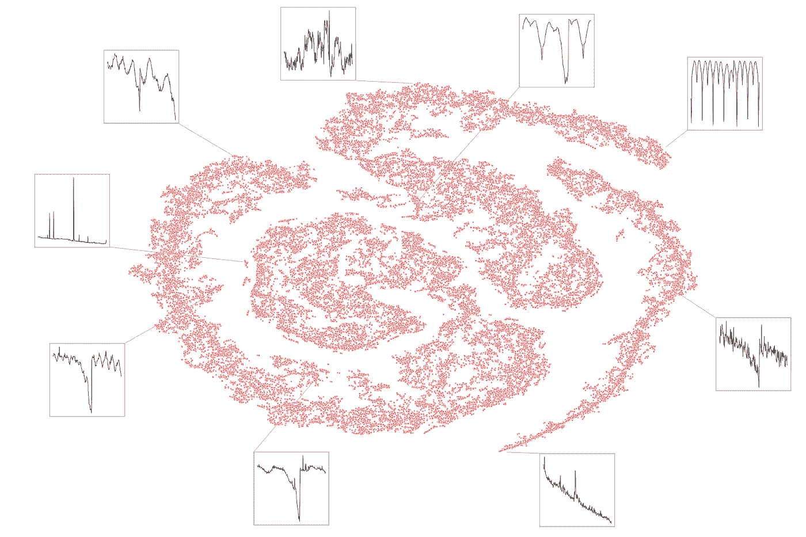

苔丝 16 和 17 区的每颗恒星编码的 t-SNE 可视化。每个点都是一条光曲线。灯光曲线是 z 规格化的。

从我们的 t-SNE 图中我们可以看到，有清晰的星团，你可以自己在它们周围画一个圈。有些似乎包含常见的测量值，而另一些则比较罕见。在小岛上磨砺显然有利于快速识别更独特的观测类型。然而，从计算的角度来看，我们可能希望完全跳过可视化，直接从潜在表示进入集群标签。

## 使聚集

尽管 t-SNE 在将测量值组合在一起方面做得很好(以及提供可视化的明显好处)，但我们有时确实必须小心它的解释。减少到二维可能仍然隐藏测量的真实变化。通常，直接在 40 维潜在空间向量上聚类是有意义的。

有几种不同类型的聚类算法，每种算法处理问题的方式都非常不同。不幸的是，大多数类型的聚类算法**对相似性度量、聚类大小或数据集的几何形状做出假设**。令人烦恼的是，只有少数算法不需要指定集群的总数。

如果我们不得不做出任何妥协，那么这几乎就违背了我们一开始就试图做这件事的目的。这是因为我们不一定知道我们期望看到什么。由于数据集很大，我们希望尽快获得有用的反馈。

考虑到这些挑战，我们对天文观测的有用聚类算法的标准应该是能够:

*   自动检测簇的总数
*   创建具有不同大小和分布的集群
*   识别无关的数据点，并且不强制它们进入聚类
*   提供一致的结果，对超参数调节不敏感

尽管有几十种聚类算法，但基于*层次密度的带噪声应用空间聚类* (HDBSCAN)算法几乎没有做出妥协，并且达到了上述所有标准。

在 TESS 数据集上应用该算法返回了 300 个聚类。有些似乎与微妙的差异密切相关，但总的来说是非常明显的。每次的计数从几个到几百个不等。下面是来自三个不同集群的三条光变曲线的示例。

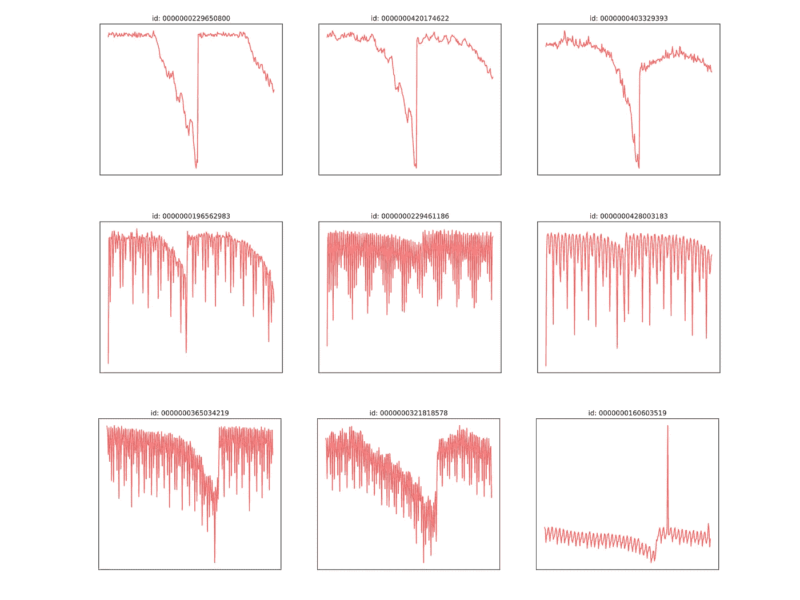

不同聚类中的光变曲线样本。每行是一个簇。

如果我们想对一个候选名单进行后续测量，从聚类水平开始可以使这一决定更容易，因为我们现在可以量化一种类型的观察因其聚类的大小而有多常见。

## 使用快速人工智能相似性搜索(Faiss)进行快速搜索

如果我们利用前面讨论的相似性度量，可以实现快速搜索相似亮度曲线的能力。Faiss 是一个有用的库。

[Faiss](https://github.com/facebookresearch/faiss/) 是一个为快速高效的相似性搜索而优化的库。它是用 C++和 python 包装器编写的，因此使它易于访问和使用。它假设相似性可以通过 L2 距离或点积来评估，并且具有 GPU 支持。

Faiss 提供多种索引选择，以满足内存消耗、速度和精度要求。在这种情况下，我可以将所有向量放入内存中，并希望得到精确的结果，因此我选择了一个称为“扁平内积”的索引。平面索引不会简化计算，也不会对数据库的结构做任何假设。后者不是必需的，因为搜索是彻底的。

内存消耗是每个向量 4 x *d* 字节，其中 *d* 是我们潜在表示的维度(在我的例子中是 40)。这种方法的一个附带好处是，通过选择正确的 *d* 并进行适当的权衡，可以设计一个在任何硬件上工作的完整流水线。Faiss 文档中有一个关于索引选择的有用指南[这里是](https://github.com/facebookresearch/faiss/wiki/Guidelines-to-choose-an-index)。但是作为补充说明，如果我们要在此分析中包括整个 TESS 数据集，它可能不适合内存，并且可能需要(但不一定)使用 GPU 来提高速度，并选择一个索引来优化内存。

Faiss 只会做两个向量的点积。为了获得余弦相似性，我们需要在将样本添加到数据库时对每个样本进行 L2 归一化。然后，我们也对输入向量执行此操作，这将导致两个 L2 归一化向量的点积，从而给出它们的余弦相似性。

```
# Obtain a vector representation of our curve and normalize
input_vec = input_vec/np.linalg.norm(input_vec) # L2 normalization
input_vec = input_vec.reshape(1,-1)# Search our faiss db with the vectors from all TESS observations
probs, ixs = db.search(input_vec, k=5) # return top 5 results 
```

因为目标是快速获得结果，所以注意这一过程的时间复杂性是很重要的。在整个数据库中找到前 5 个最相似的光变曲线用了 ***不到 1 毫秒*** 。此外，无论我们想要多少结果，这都可以很好地扩展。切换到前 1000 个结果不会对查询时间产生很大影响。

```
%timeit db.search(input_vec, k=5)
**762 µs** ± 32.1 µs per loop (mean ± std. dev. of 7 runs, 1000 loops each)%timeit db.search(input_vec, k=1000)
**1.41 ms** ± 264 µs per loop (mean ± std. dev. of 7 runs, 1000 loops each)
```

**基本用法和结果**

获得查询结果后，可以通过查找对象 id 或使用模型的解码器组件从潜在表示中重建原始光曲线来绘制结果。我手动选择了一些表面上看起来有点独特的曲线，并进行了搜索。我在下面显示了输入曲线和前 3 个结果。尽管我上面提到了余弦相似性的警告，但我们可以看到，潜在的表示捕捉了许多我们用来将两个时间序列视为相似的属性。

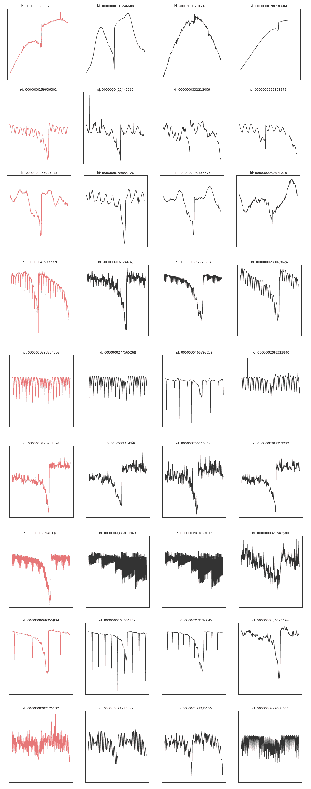

输入光曲线(红色)和查询结果(黑色)。结果是 z 归一化的。

**定向搜索**

值得注意的是，我们的输入向量不一定来自数据库内部。例如，我们可能已经有了一个特定现象的理论模型，但是无法在数据库中找到一个现有的向量来找到类似的对象。如果我们知道如何用数学方法表达**预期的**光变曲线*或者从模拟*中得到一个结果，我们只需将时间序列输入到编码器中就可以得到表示。这成为我们查询数据库的输入向量。

顺便提一下，提到这如何能帮助寻找外星智慧是很有用的。通常搜索寻找不寻常的无线电或光学激光脉冲发射。然而，考虑到太阳帆、遮阳篷、轨道栖息地或任何故意设计来宣布它们存在的结构的潜在大小，这开辟了凌日方法作为这种搜索的有效方法。关于这些**不自然的**光变曲线看起来会是什么样子，已经有了研究和建议。

吕克的论文。F. A. Arnold 题为*人造物体的凌日光变信号*研究了我们期望从不期望自然存在的物体中看到的东西，包括 1)等边三角形 2)两个屏幕和 3)类似百叶窗的六个屏幕。它提醒我们，模拟存在单个对象、多个对象以及它们是否旋转的情况也很重要。值得注意的是，如果测量值低于一定的分辨率，仍然有可能将一些物体与环形行星等事物混淆。因此，给出的结果是与同等大小的球形物体相比的幅度差，而不是原始光曲线。

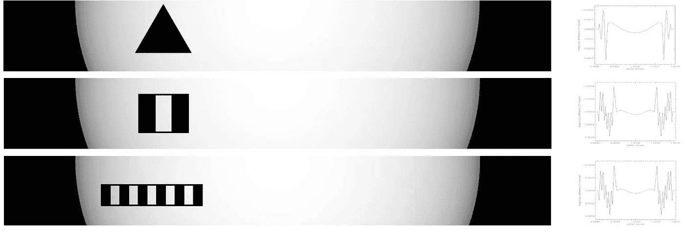

人造物体的例子(左)和亮度大小差异(右)。图像来源:人造物体的过境光变特征(2005)

外星文明可能有意制造一个明显是人造的重复信标。这种信号的候选者有很多，但一个例子是二进制中圆周率的前几个*数字。然而，这可能不太可能在可见光谱中实现，因为这不是能量有效的。但有争议的是，一个试图吸引注意力的文明可能会通过在其他人的常规天文观测中试图被他们看到来做到这一点。如果是这种情况，那么在凌日法观测过程中，一系列产生明显不自然光变曲线的物体就值得寻找。*

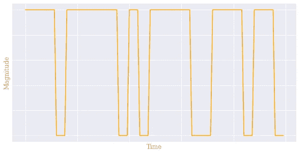

用二进制信号表示的圆周率的前几个数字。

要点是，给定一个理论化的光变曲线(自然的或人工的)，我们可以使用这种方法在可接受的时间内快速找到候选者。

**最不相似的物体**

除了将一个向量与整个数据库进行比较，还可以有一批*输入向量。可以预见，这比一次做一个要快，并且伸缩性好。*

发现奇怪光曲线的一种方法是在整个数据库中进行完全的成对相似性搜索，这是可能的，因为我们可以进行批量输入。由于 Faiss 返回顶部结果的相似性分数，我们可以推断最奇怪的光曲线是那些顶部相似性分数仍然很低的(找到最小的最大值)。这可以通过 thresh-holding 来完成，或者简单地根据数据库批处理查询的得分从最低到最高排序，返回 *k* =1 个最相似的结果。

下面是 TESS 扇区 16 和 17 的前 20 个最不相似的光变曲线。该操作耗时 **1.1 秒**:

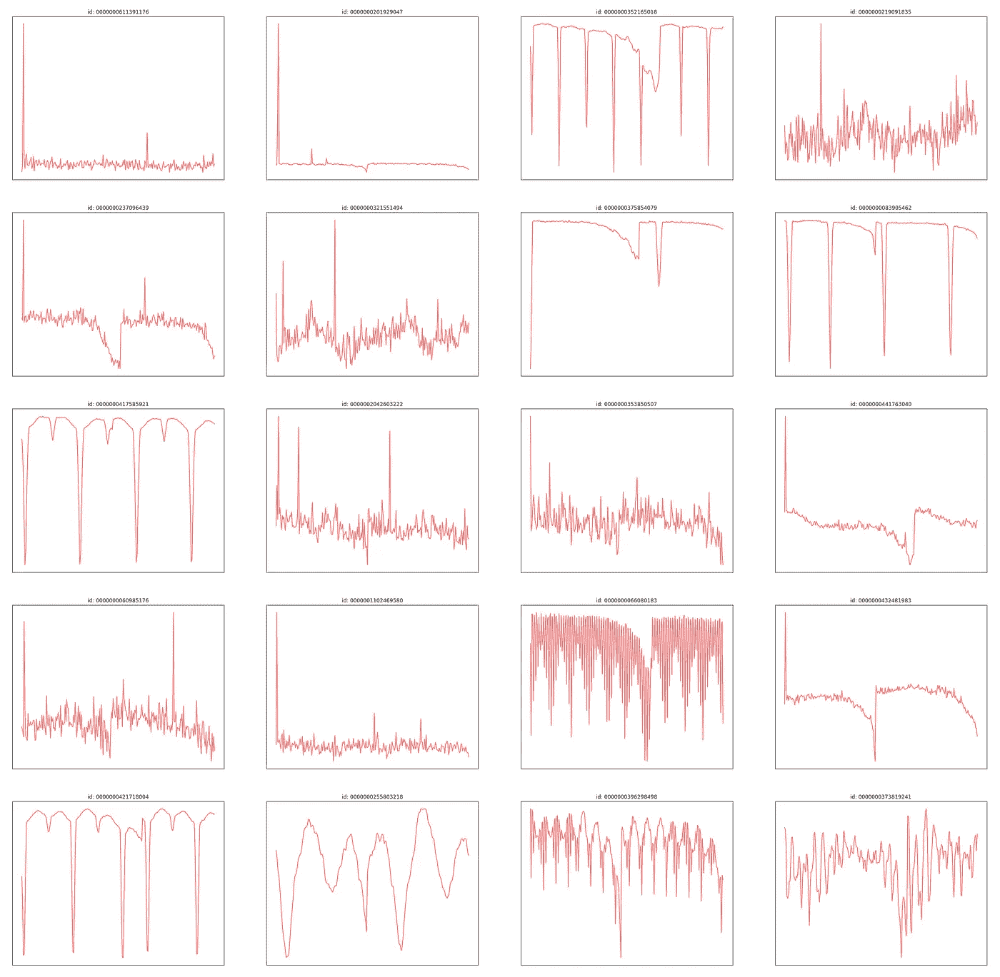

Tess 部门 16 和 17 中最不相似的 20 个结果

关于这个结果的一些观察结果——有 4 或 5 个观察结果可能是在测量开始时具有大尖峰的小故障。除此之外，我们还有各种短周期和高变化曲线的组合。

# 更广阔的电磁频谱和未来的工作

对于那些不熟悉物理的人来说，我们用眼睛看到的只是更广泛的电磁(EM)光谱的一小部分。本质上，我们看到的是不同波长(或能级)的光子，每个波长有不同的颜色。在长波长，我们有无线电频谱，而可见光，红外线，X 射线和伽马射线组成了较短的波长。用专用的硬件来观察不可见的波长是可能的，这在天文学中是很常见的。这是因为电磁辐射揭示了许多物理过程，有些物体只有在这些波长下才可见。下面是对猎户座的可见光和红外观测的比较。

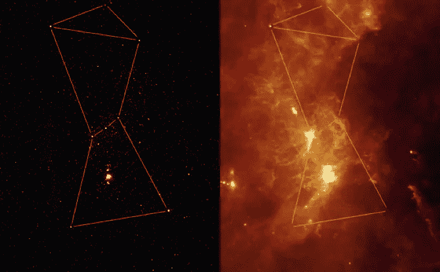

可见光(左)和红外(右)中的同一个星座。图片来源:NASA

TESS 卫星在可见光和近红外范围(600 纳米-1000 纳米)进行观测，因为这被认为是寻找类地系外行星的良好范围。上述方法的真正潜力在于更广泛的电磁频谱。

机器学习方法的一个优点是，我们可以训练编码器接受许多输入，并为每个对象提供一个组合的矢量表示。使用这种编码器的矢量数据库可以按照相同的过程建立。如上所述，我们可以根据我们对整个电磁光谱的预期来查询预期的光变曲线。例如，一颗红外辐射很强但没有可见光的恒星可能被尘埃包围，或者被一个结构包围。

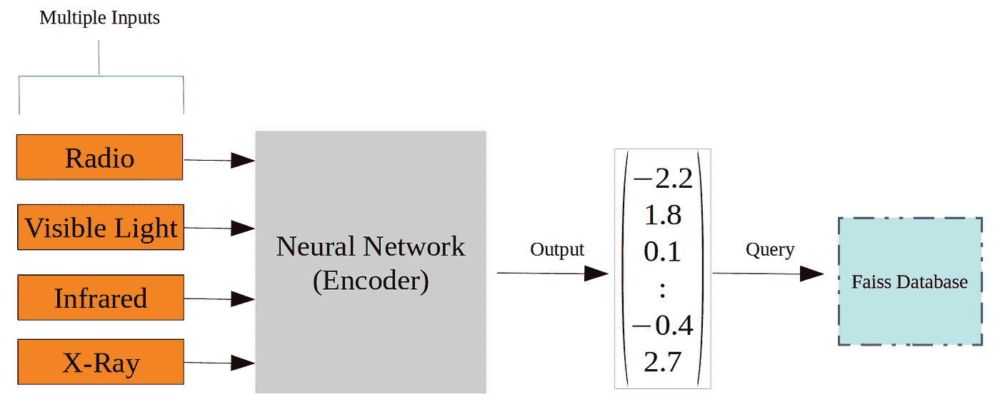

我们可以将多个输入组合成相同的表示，并遵循相同的流程

另一个好处是，如果某个源的观测测量值不可用，还可以处理某些输入中的缺失数据。如果输入来自不同的观测站，而这些观测站的访问受到限制，或者观测是在不同时间协调的，就可能出现这种情况。尽管输入的不同部分存在差异，但网络可以概括为具有足够的表达能力，ODE-RNNs 有可能很好地处理这一点。

虽然可能需要更长的训练时间，但这不应该降低推理时间的性能或增加内存消耗，因为我们在可视化、聚类和搜索过程中仍然使用相同大小的向量。

# 摘要

我已经证明，如果我们使用自动编码器将凌日光变曲线测量结果编码成潜在空间表示，就有可能以合理的硬件要求对大型数据集进行快速有效的分析。神经常微分方程的最新发展使我们能够以精确的方式处理不规则采样的时间序列和可变长度的测量。

即使我们的硬件有所改进，我们开始精确地积累数十亿(或数万亿)的对象，我们肯定有能力快速查询数据。在编码器和解码器架构以及聚类算法方面可以继续进行大量的改进。

此外，在时间序列分析是关键的更广泛的物理学和宇宙学领域，有很大的机会应用这样的方法。

如果你想联系我，请随时在 glenn.kroegel@gmail.com 联系我，或者在 LinkedIn 上给我发消息。