# 揭开魔法:解读机器学习黑盒模型

> 原文：<https://towardsdatascience.com/uncovering-the-magic-interpreting-machine-learning-black-box-models-3154fb8ed01a?source=collection_archive---------26----------------------->

## *你是否曾经开发出一个机器学习模型，它具有很高的准确性和惊人的 AUC，但却不知道如何解释这些预测？*

**在预测能力和可解释性之间进行权衡**是使用黑盒模型时面临的一个常见问题，尤其是在必须向非技术受众解释结果的业务环境中。可解释性对于质疑、理解和信任人工智能和人工智能系统至关重要。它还为数据科学家和工程师提供了更好的方法来调试模型，并确保它们按预期工作。


来自[派克斯](https://www.pexels.com/photo/person-using-a-laptop-3183131/?utm_content=attributionCopyText&utm_medium=referral&utm_source=pexels)的[派克斯](https://www.pexels.com/@fauxels?utm_content=attributionCopyText&utm_medium=referral&utm_source=pexels)的照片

# 动机

本教程旨在介绍在黑盒模型中处理模型解释的不同技术。

> **免责声明:**本文旨在向普通数据科学家介绍可解释机器学习领域的一些有用技术，并推动其采用。他们中的大多数已经从 Christoph Molnar 的这本非常值得推荐的书中总结出来:[可解释的机器学习](https://christophm.github.io/interpretable-ml-book/)。

本文中使用的完整代码可以在我的 [**GitHub**](https://github.com/fpretto/interpretable_and_fair_ml) 中找到

# 内容

1.  可解释性方法的分类
2.  数据集和模型培训
3.  全球重要性
4.  本地重要性

# 1.可解释性方法的分类

*   **内在还是事后？**该标准区分可解释性是通过限制机器学习模型的复杂性(内在)还是通过在训练后应用分析模型的方法(事后)来实现。
*   **特定于模型还是与模型无关？**线性模型有特定于模型的解释，因为回归权重的解释特定于该类模型。同样，决策树拆分也有其特定的解释。另一方面，模型不可知的工具可以用在任何机器学习模型上，并且在模型已经被训练(后期)之后被应用。
*   **本地还是全球？**局部可解释性是指解释单个预测，而全局可解释性与解释预测任务中的模型一般行为相关。这两种类型的解释都很重要，并且有不同的工具来处理它们。

# 2.数据集和模型培训

本文使用的数据集是来自 UCI 机器学习知识库的 [*成人普查收入*](https://www.kaggle.com/uciml/adult-census-income) 。预测任务是确定一个人的年收入是否超过 5 万美元。

由于本文的重点不在 ML 管道的建模阶段，所以执行了最小特征工程，以便用 XGBoost 对数据进行建模。

为该模型获得的性能指标如下:

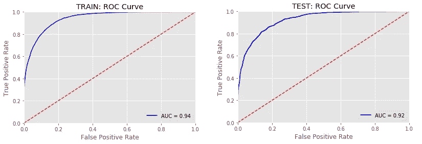

图 1:训练和测试装置的接收操作特性(ROC)曲线。

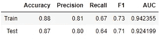

图 2: XGBoost 性能指标

这个模型的性能似乎还可以接受。

# 3.全球重要性

用于评估模型整体行为的技术包括:

3.1 -特征重要性(由 XGBoost 模型和 SHAP 评估)
3.2 -汇总图(SHAP)
3.3 -排列重要性(ELI5)
3.4 -部分相关图(PDPBox 和 SHAP)
3.5 -全局代理模型(决策树和逻辑回归)

## 3.1 -功能重要性

*   **XGBoost(特定型号)**

```
feat_importances = pd.Series(clf_xgb_df.feature_importances_, index=X_train.columns).sort_values(ascending=True)
feat_importances.tail(20).plot(kind='barh')
```

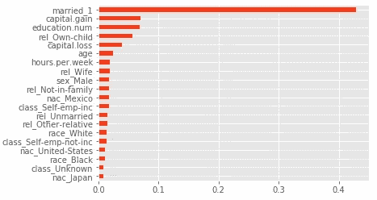

图 3: XGBoost 特性的重要性

使用 XGBoost 时，在解释特性的重要性时必须小心，因为结果可能会产生误导。这是因为该模型计算了几个具有不同解释的重要性指标。它创建了一个重要性矩阵，这是一个表，第一列包括提升树中实际使用的所有特征的名称，另一列是用不同的度量标准计算的结果“重要性”值*(增益、覆盖、频率)*。在这里可以找到更全面的解释。

**增益**是解释每个特征的相对重要性(即准确性的提高)的最相关属性。

*   **SHAP**

总的来说，SHAP 库被认为是一个解决可解释性的模型不可知的工具(*我们将在本地重要性章节*中讨论 SHAP 的直觉)。但是，对于基于树的机器学习模型，如决策树、随机森林和梯度提升树，该库有一种特定于模型的方法。

```
explainer = shap.TreeExplainer(clf_xgb_df)
shap_values = explainer.shap_values(X_test)shap.summary_plot(shap_values, X_test, plot_type = 'bar')
```

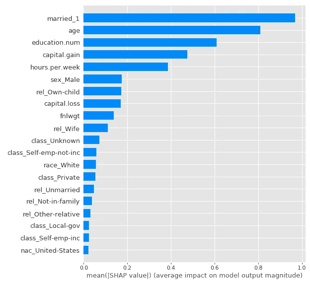

图 4: SHAP 特征重要性

XGBoost 特征重要性用于评估训练数据集模型输出中预测值的相关性，SHAP 特征重要性用于评估测试数据集模型输出中预测值的相关性，以评估最重要的特征在两种方法和集合中是否相似。

据观察，模型中最重要的变量得到了保留，尽管其重要性顺序不同(*年龄*似乎在 SHAP 方法的测试集中具有更大的相关性)。

## **3.2 剧情概要(SHAP)**

SHAP 汇总图是评估模型特性的一个非常有趣的图，因为它提供了比传统的*特性重要性*更多的信息:

*   **特征重要性**:变量按重要性降序排列。
*   **对预测的影响**:横轴上的位置表示每个特征的数据集实例的值对模型输出的影响是多还是少。
*   **原始值**:颜色表示每个特性的高值或低值(在每个特性的范围内)。
*   **相关性**:特征与模型输出的相关性可以通过评估其颜色(其取值范围)和对水平轴的影响来分析。例如，观察到*年龄*与目标正相关，因为对输出的影响随着特征值的增加而增加。

```
shap.summary_plot(shap_values, X_test)
```

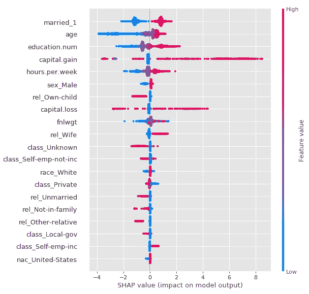

图 5: SHAP 汇总图

## 3.3 -排列重要性(ELI5)

评估预测值全局重要性的另一种方法是随机排列数据集中每个要素的实例顺序，并使用训练好的模型进行预测。如果通过在顺序中进行这种干扰，评估度量没有实质上改变，则该特征不那么相关。相反，如果评估度量受到影响，那么该特征在模型中被认为是重要的。这个过程是为每个特征单独完成的。

为了评估训练的 XGBoost 模型，ROC 曲线的曲线下面积(AUC)将被用作性能度量。将在训练和测试中分析排列重要性:

```
# Train
perm = PermutationImportance(clf_xgb_df, scoring = 'roc_auc', random_state=1984).fit(X_train, y_train)
eli5.show_weights(perm, feature_names = X_train.columns.tolist())# Test
perm = PermutationImportance(clf_xgb_df, scoring = 'roc_auc', random_state=1984).fit(X_test, y_test)
eli5.show_weights(perm, feature_names = X_test.columns.tolist())
```

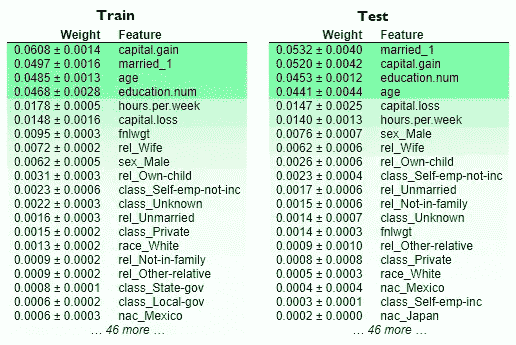

图 6:训练集和测试集排列重要性。

尽管最重要的功能的顺序发生了变化，但看起来最相关的功能保持不变。有趣的是，与 XGBoost 特征重要性不同，训练集中的年龄变量具有相当强的影响(如测试集中的 SHAP 特征重要性所示)。此外，根据排列重要性的 6 个最重要的变量被保持在训练和测试中(顺序的差异可能是由于每个样本的分布)。

估算全球重要性的不同方法之间的一致性使模型输出的解释更加可信。

## 3.4 -部分相关图(PDPBox 和 SHAP)

*部分相关图(PDP)* 表示某一特性对预测输出的边际影响。为此，在其他条件不变的情况下，修改特征，并观察平均预测的变化。进行的过程如下:

1)选择特征
2)定义网格值
3)为每个网格值:
3.1)用网格值替换特征
3.2)平均预测值
4)绘制曲线

PDP 可以指示特性和输出之间的关系是线性的、单调的还是更复杂的。值得注意的是**观察到的关系是与预测的关系，而不是与目标变量**的关系。然而，根据模型的性能，可以产生目标对所评估特征的依赖性的直觉。

PDP 的**优势**是非常 ***容易实现*** 并且 ***非常直观*** :如果所有数据点都被强制采用每个特定值，那么特定特征中的函数代表平均预测。

我们将使用 PDPBox 和 SHAP 分析部分相关图。

*   **PDPBox**

例如，将分析两个最相关的观察特征的 PDP:

```
# Create the data that we will plot
pdp_education = pdp.pdp_isolate(model=clf_xgb_df, dataset=X_test, model_features=X_test.columns, feature='education.num')
pdp_age = pdp.pdp_isolate(model=clf_xgb_df, dataset=X_test, model_features=X_test.columns, feature='age')# Plot it
pdp.pdp_plot(pdp_education, 'education.num',figsize=(12, 6))
pdp.pdp_plot(pdp_age, 'age', figsize=(12, 6))
plt.show()
```

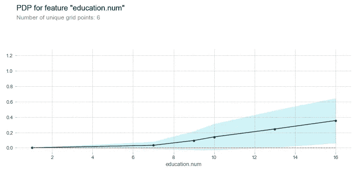

图 7:教育的部分相关图

看起来受教育年限(从 7 年开始)和收入超过 5 万美元的概率之间存在线性关系。这一特征在模型输出中的影响被证明高达 0.6(满分 1)。

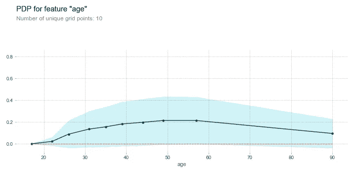

图 8:年龄的部分相关性图

人们似乎更有可能在 50 多岁的时候赚到超过 5 万美元。

*   **SHAP 依赖情节**

将使用 SHAP 方法生成相同的 PDP。该库除了指示特征对模型输出的边际影响之外，还通过颜色指示与最常交互的特征的关系。

```
shap.dependence_plot('education.num', shap_values, X_test)
shap.dependence_plot('age', shap_values, X_test)
```

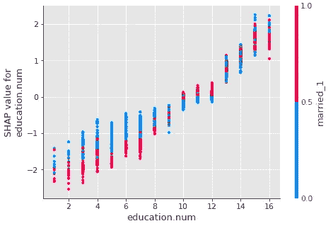

图 9:教育的部分相关图

尽管 y 轴刻度不同于 PDPBox 图*(我们将在本地可解释性部分中了解原因)*，但“education.num”的趋势似乎与之前的方法相同。此外，SHAP 已经识别出特征【已婚 _1】是与它交互最多的特征(这意味着，对于该模型来说，具有高教育年限的已婚人士更有可能收入超过 5 万美元)。

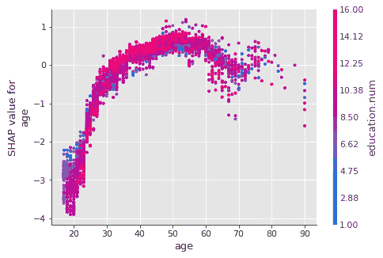

图 10:年龄的部分相关性图

该方法中的年龄趋势与 PDPBox 方法一致。和它互动最多的功能是“education.num”。

在陈述了 PDP 对可解释性领域的**优势**后，也值得(也公平地)陈述一下**劣势**:

*   ***它没有考虑特征*** 的分布:它可能会产生误导，因为它可能会错误地解释数据非常少的区域(通过给所有数据点分配这些值，特征值被过度表示，这可能会导致错误的结论)。
*   ***特性独立性假设*** :这是 PDP 最大的弊端之一。假设为其计算部分相关性的特征与其余预测值不相关。
*   ***异质效应可能被隐藏*** :这是因为只计算平均边际效应。在极限情况下，PDP 可能是一条水平线，值均匀分布在上下，表明该特征对预测没有影响。

为了克服 PDP 的一些缺点，可以使用*个体条件期望(ICE)* 和*累积局部效应(ALE)* 图。尽管这些方法的实现没有包含在本文中，但是我们将简要地解释它们，以展示它们如何改进 PDP 方法。

**个人条件期望(ICE)**

ICE 图是单个数据点的 PDP 等效图。该图为数据集的每个实例显示一条线，指示该实例的预测如何随着要素值的变化而变化。PDP 是 ICE 图中所有线条的平均值。ICE 图允许可视化边际效应的变化，*能够检测异质效应*。

**累积局部效应(ALE)图**

当一个特征与其他预测因子高度相关时，PDP 会出现严重的问题，因为实际上不太可能发生的合成实例预测会被平均化(例如，*年龄*为 16 而*教育程度*同时为 10 是不太可能的)。这可能会在估计该特征的效果时产生显著的偏差。ALE 图除了计算速度更快之外，还是计算特征对模型预测的影响的无偏解决方案，因为它们评估的是其*条件分布*。也就是说，对于网格的值 x1，他们仅使用值与 x1 相似的实例的预测进行估计，从而避免使用现实中不可能的实例。

此外，为了估计特征对预测的影响，他们不使用平均值(将特征的影响与所有相关预测因子的影响相混合)，而是计算预测之间的差异。

**冰和啤酒的区别**

ICE 图解决了 PDP 可能呈现的异质效应的问题，但是没有解决由于相关特征引起的偏差。相反，ALE 图解决了偏倚问题，考虑了特征的条件分布及其与其余预测因子的相关性。

## 3.5 -全球代理模型

全局代理模型是一种可解释的模型，它被训练成近似黑盒模型的预测。我们可以通过解释代理模型得出关于黑箱模型的结论。用 Christoph Molnar 的话说:*“通过使用更多的机器学习来解决机器学习的可解释性！”*

我们将尝试使用逻辑回归和决策树作为全局代理模型来近似 XGBoost。

*   **逻辑回归**

```
# Train
log_clf = LogisticRegression().fit(X_train, y_train)# Predictions
y_pred_train_log = log_clf.predict(X_train)
y_proba_train_log = log_clf.predict_proba(X_train)[:, 1]
y_pred_test_log = log_clf.predict(X_test)
y_proba_test_log = log_clf.predict_proba(X_test)[:, 1]# R-squared
print('R-squared Train RL-XGB: ', r2_score(y_proba_train_log, y_proba_train))
print('R-squared Test RL-XGB: ', r2_score(y_proba_test_log, y_proba_test))
```

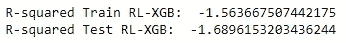

图 11:逻辑回归和 XGBoost 预测之间的 R 平方。

训练集和测试集的 R 平方都是负的。当拟合比简单地使用平均值更差时，就会发生这种情况。所以得出结论 **Logistic 回归不是一个好的替代模型**。

*   **决策树**

```
# Train
tree_clf = tree.DecisionTreeClassifier(random_state=0, max_depth=4).fit(X_train, y_train)# Predictions
y_pred_train_tr = tree_clf.predict(X_train)
y_proba_train_tr = tree_clf.predict_proba(X_train)[:, 1]
y_pred_test_tr = tree_clf.predict(X_test)
y_proba_test_tr = tree_clf.predict_proba(X_test)[:, 1]# R-squared
print('R-squared Train DT-XGB: ', r2_score(y_proba_train_tr, y_proba_train))
print('R-squared Test DT-XGB: ', r2_score(y_proba_test_tr, y_proba_test))# Metrics
clf_metrics(y_pred_train_tr, y_proba_train_tr, y_train, y_pred_test_tr, y_proba_test_tr, y_test)
```

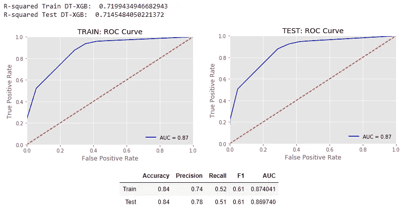

图 12:决策树和 XGBoost 预测之间的 R 平方，以及前者的性能度量。

**XGBoost 模型预测中的方差与决策树非常接近，因此它可以作为解释主模型的代理模型**。事实上，性能指标也非常接近原始模型。

值得注意的是，虽然 XGBoost 预测的方差可以由决策树 ***很好地解释，但不能保证*** 后者会以与前者相同的方式使用这些特性。可能发生的情况是，树在输入空间的某些区域中正确地逼近 XGBoost，但是在其他区域中表现得完全不同。

将对结果树进行分析，以便评估所使用的特征是否对应于迄今为止已经检测到的最重要的特征:

```
# Plot tree
fig, ax = plt.subplots(figsize=(30, 10)) 
tree.plot_tree(tree_clf, feature_names= X_train.columns.to_list(), ax=ax, filled=True)
plt.show()
```

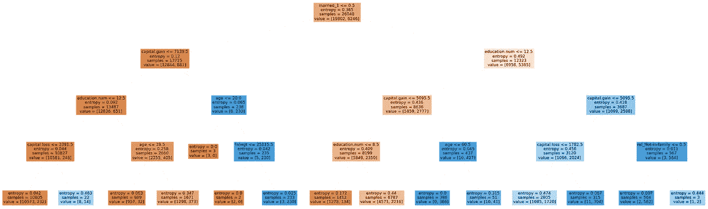

图 13:经过训练的决策树

该树用于估算**收入**的 5 个特征，按重要性排序为:

1.已婚 _1
2。教育编号
3。资本收益。资本损失
5。年龄

这些特征对应于其他方法检测到的最重要的特征。

# 4.本地重要性

局部代理模型是用于解释黑盒机器学习模型的个体预测的可解释模型。

## **4.1 -局部可解释的模型不可知解释(LIME)**

LIME 分析当输入数据发生变化时，模型预测中会发生什么。它生成一个新的数据集，其中包含置换样本及其来自原始模型的相应预测。在这个合成集上，训练可解释的模型(逻辑回归、决策树、套索回归等)。)，然后通过采样实例与感兴趣实例的接近度对其进行加权。

对实例 X 的解释将是最小化损失函数(代理模型的预测和原始模型的预测之间的性能测量，例如 MSE)的代理模型的解释，保持模型的复杂度低。

```
# Generate explainer
explainer = lime.lime_tabular.LimeTabularExplainer(X_train.values, mode='classification',feature_names=X_train.columns.tolist(), discretize_continuous=False, random_state=1984)# Generate explanation for instance i
i = 546
exp = explainer.explain_instance(X_test.values[i], clf_xgb_array.predict_proba)# Plot
fig = exp.as_pyplot_figure();
```

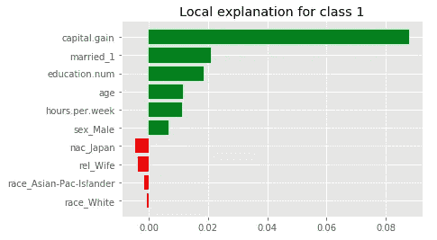

图 14:每个特征在个体预测中的相对重要性。

```
# Generate explanation for sample
sp_obj = submodular_pick.SubmodularPick(explainer, X_test.values, clf_xgb_array.predict_proba, sample_size=3, num_exps_desired=3)[exp.show_in_notebook() for exp in sp_obj.sp_explanations]
```

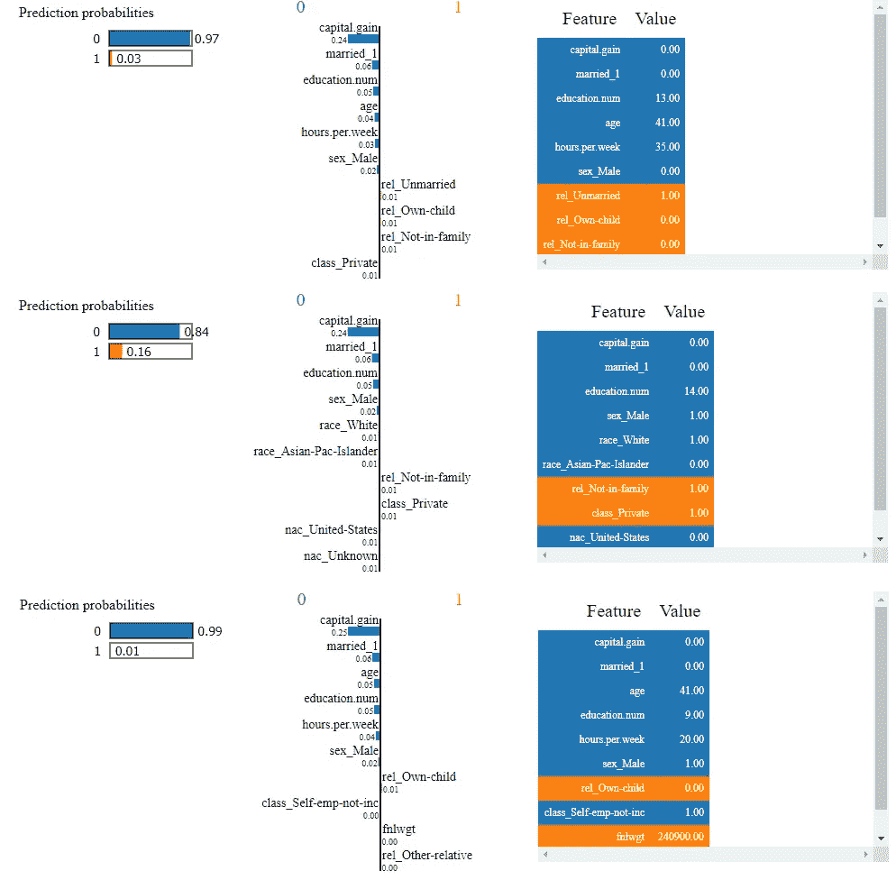

图 15:对抽样实例的单独解释。

据观察，在所有区分阶级的个人解释中，最有影响力的特征是*资本收益*。接下来，根据具体情况，最相关的预测值是*已婚*、*教育编号*、*年龄*和*性别*。这些特征与在全局重要性算法中识别的特征相同。

**4.2 -沙普利添加剂解释(SHAP)**

SHAP 是一种解释基于沙普利值计算的个人预测的方法，一种来自联合博弈论的方法。它试图回答问题**“相对于平均预测，每个特征值对预测的贡献有多大？”**。为此，Shapley 值根据“玩家”对“总支付”的贡献将“支付”分配给“玩家”。玩家在联盟中合作，并为此类合作获得一定的奖励。

在机器学习上下文中，“游戏”是数据集实例的预测任务。 ***“总支付额”是对该实例的预测，减去对整个数据集的平均预测。*** “玩家”是实例的特性值，它们联合起来接受“报酬”(预测)。Shapley 值是所有可能组合的特征值的平均边际贡献。它表示“总支出”(预测)如何在所有“玩家”(特征值)之间分配。

SHAP 带来的一项创新是，Shapley 值解释被表示为一种附加特征归因方法，即线性模型。就这样， ***SHAP 把石灰的好处与沙普利值*** 联系起来。

```
# Create explainer
explainer = shap.TreeExplainer(clf_xgb_df, model_output='probability', feature_dependence='independent', data=X_test)# Generate explanation for instance i
i= 150
data_for_prediction = X_test.iloc[i, :]shap_values = explainer.shap_values(data_for_prediction)
shap.initjs()
```

有几种方法可以把 SHAP 的解释形象化。我们将在本文中讨论其中的两个:力图和决策图。

**力图**

```
shap.force_plot(explainer.expected_value, shap_values, data_for_prediction)
```

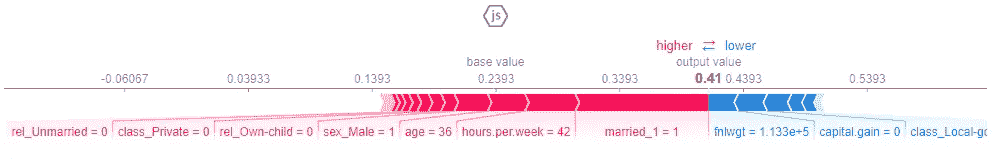

图 16:单个实例的 SHAP 力图解释

力图显示了每个特征对预测的影响。有两个相关值需要注意:输出值**(实例的模型预测)和基本值**(整个数据集的平均预测)。更大的条意味着更高的影响，颜色指示特征值是否将预测从基础值向 1 *(红色)*或 0 *(蓝色)*移动。****

******决定情节******

```
**shap.decision_plot(explainer.expected_value, shap_values, data_for_prediction)**
```

****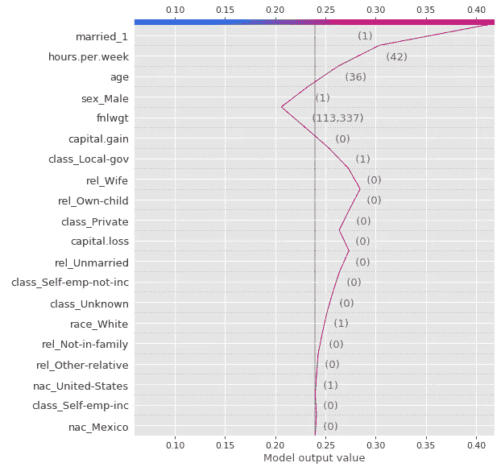****

****图 17:单个实例的 SHAP 决策图解释****

****决策图显示了与力图基本相同的信息。灰色垂直线是**基值**，红线表示每个特征是否将**输出值**移动到比平均预测值更高或更低的值。****

****这个图可以比前一个图更清晰和直观一点，尤其是当有许多特征要分析的时候。在力图中，当预测因子的数量很高时，信息可能看起来很浓缩。****

# ****结论****

****这篇文章旨在帮助数据科学家更好地理解他们的机器学习模型是如何工作的，并能够以一种清晰的方式解释这些结果。它对于调试模型和确保它们按预期工作也很有用。****

****我们已经介绍了可解释性方法的不同分类*(内在的/事后的，模型特定的/模型不可知的，局部的/全局的)*并且我们使用了几个库和技术来评估全局和局部的重要性。****

****总之，使用的库和技术有:****

*   ******XGBoost** :特性重要性****
*   ******ELI5** :排列重要性****
*   ******PDPBox** :部分依赖图****
*   ******全局代理模型**:逻辑回归，决策树****
*   ****石灰:当地的重要性****
*   ******SHAP** :特征重要性、概要图、部分依赖图、局部重要性****

****那么，哪一个库是解决 ML 模型可解释性的最好的库呢？ 在我看来，使用几个库和技术有助于建立模型输出的可信度*(前提是结果一致)*。然而，如果我必须选择一个，我肯定会去 SHAP。****

> ****SHAP 在可解释机器学习领域做出了巨大贡献。这是因为在这里**全局解释与个体解释是一致的，因为 Shapley 值是全局解释的“原子单位”(在博弈论中有坚实的理论基础)**。例如，如果 LIME 用于局部解释，而 PDP 或排列重要性用于全局解释，则这两种方法之间没有共同的理论基础。****

****我希望这篇文章能达到它的目的，作为破解黑盒模型的一般指南。完整代码可以在我的 [**GitHub**](https://github.com/fpretto/interpretable_and_fair_ml) 中找到****

****在我的下一篇文章中，我将讨论**模型公平性**、，它在过去的几年中已经获得了越来越多的关注。该领域旨在评估该模型在处理数据中预先存在的偏见时的公平性: ***职位匹配系统在 CEO 面试中偏向男性候选人，因为这与历史数据相匹配，这公平吗？*******

****敬请期待！****