# 揭秘印度尼西亚顶级电子商务——来自 Twitter 的观点

> 原文：<https://towardsdatascience.com/uncovering-top-e-commerce-in-indonesia-perspective-from-twitter-3312bc617c00?source=collection_archive---------34----------------------->

## 印度尼西亚顶级电子商务的 Twitter 分析(Tweets，Followers，和 Following)

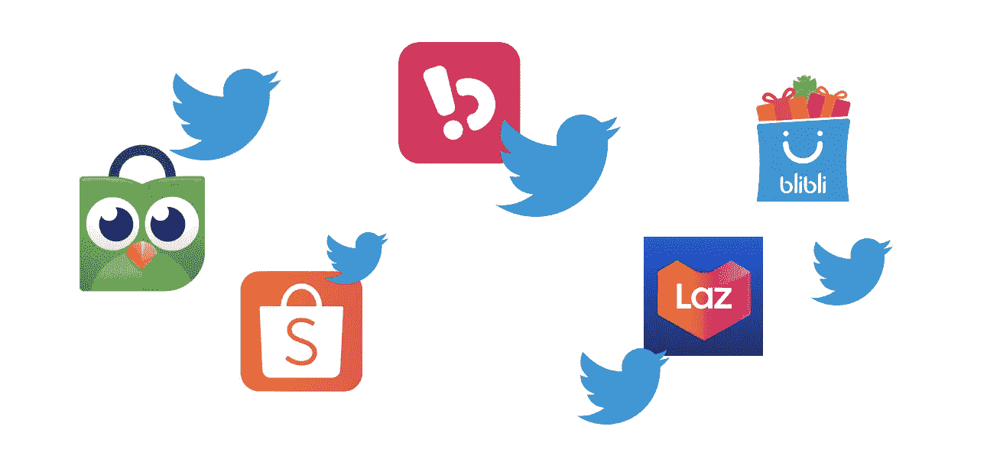

封面由作者创作，标识取自 Tokopedia.com、Shopee.co.id、Bukalapak.com、Lazada.co.id、Blibli.com 和 Twitter.com

# 印度尼西亚

印度尼西亚，一个截至 2020 年 5 月 9 日(星期六)总人口为 **273，097，566** 的国家[来源](https://www.worldometers.info/world-population/indonesia-population/)是一个电子商务初创公司成长的充满希望的地方。根据[统计](https://www.statista.com/outlook/243/120/ecommerce/indonesia)，2020 年印尼电子商务市场的收入约为 269.22 亿美元，预计年增长率(2020–2014)为 16.9%，到 2024 年市场规模将达到 503.61 亿美元。市场最大的部分是时装(2020 年为 67.71 亿美元)。由 [Cuponation](https://www.cuponation.co.id/magazin/situs-belanja-online-terpopuler-sepanjang-tahun-2019) 进行的一项研究报告了 2019 年印尼排名前 5 的电子商务网站，分别是 ***Tokopedia、Shopee、Bukalapak、Lazada、*** 和***bli bli***(Shopee 和 Lazada 分别指 Shopee Indonesia 和 Lazada Indonesia)。

# 数据

使用的数据是从 5 家电子商务公司的 Twitter 账户收集的推文，从他们的第一条推文开始，直到 2020 年 4 月 30 日*以及截至 2020 年 4 月 30 日的关注者和追随者列表。一系列预处理技术已经应用于收集的推文。在本文的其余部分，电子商务的名称指的是它的 Twitter 账户。*

****免责声明:*** *每个电子商务数据都是从每个电子商务 Twitter 账户中收集的，并以相同格式的代码平等对待。本文中的所有数字都是基于收集的数据。与 Twitter 上实际数字的差异是由于 Twitter 在数据采集过程中的一些政策限制。**

# *概观*

*就推文数量而言，Shopee 以 266，233 条推文领先，是 Tokopedia 的 9 倍，尽管 Shopee 是该国的最新玩家。排名前 5 的电商，关注的账号都不到 10 个。与此同时，Blibli 拥有最多的追随者。下面将提供更详细的分析。*

*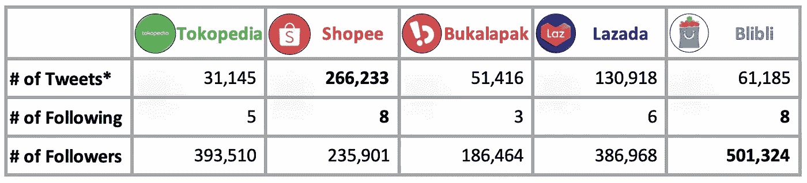*

***表 1** 各电商概况统计。*包括转发、提及和回复*

# *第一条推特*

> *千里之行始于足下——老子*

*让我们回到他们都开始的时候。*

*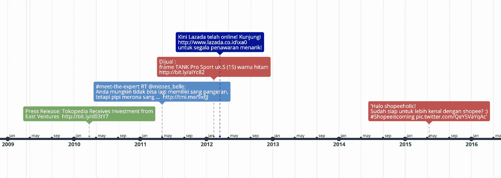*

***图 1** 各电商的第一条推文；tokopedia(2010 年 3 月 25 日)、Blibli(2011 年 4 月 30 日)、Bukalapak(2012 年 2 月 11 日)、laza da(2012 年 3 月 15 日)和 Shopee Indonesia(2015 年 5 月 12 日)*

*这条时间线不仅显示了他们发布第一条推文的时间，还显示了他们的内容。Tokopedia 正在宣布来自 East Ventures 的投资，Bukalapak 正在他们的市场上推广一种产品，Shopee 正在发送介绍性的推文，通知他们在该国的存在。*

# *值得注意的追随者*

*如表 1 所示，所有电子商务只有一位数的追随者。一些电子商务跟随其创始人/联合创始人/首席执行官，而一些电子商务跟随知名公众人物或团体，如印度尼西亚共和国总统和克里斯蒂亚诺罗纳尔多。表 2 列出了以下著名账户的详细情况*

*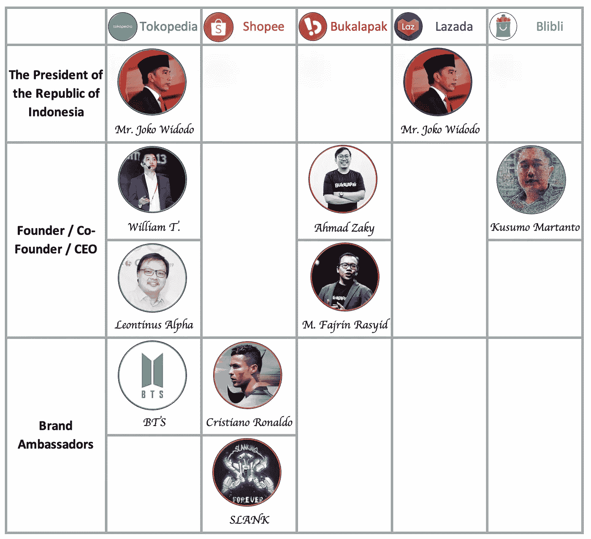*

***表 2** 各电商列表如下*

# *我们来谈谈这个数字*

*收集的推文包括一般推文、回复、提及和转发。为了简化分析，我将它们分为 3 类，即一般推文、提及(回复+提及)和转发。关于他们差异的全面解释可以在[推特网站](https://help.twitter.com/en/using-twitter/types-of-tweets)上看到。*

***趋势***

*这一小节将详细阐述一般推文、提及和转发的趋势。图 2 显示，在 2010 年至 2012 年期间，就一般推文而言，Bukalapak 是 Twitter 中最活跃的。自 2013 年以来，Blibli 一直保持着最活跃的地位，尽管自 2015 年以来所有电商(Shopee 除外)都呈下降趋势。很有可能在 2020 年底，Shopee 将拥有最多的通用推文。*

*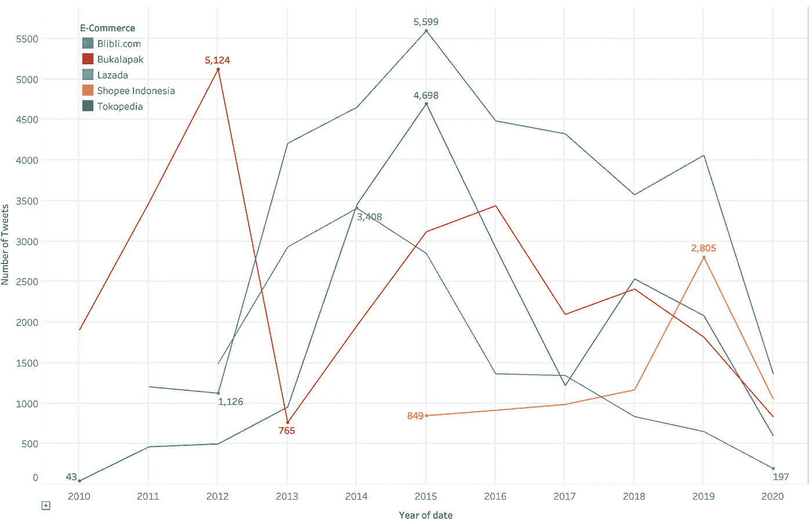*

***图 2**2010 年至 2020 年各电子商务的一般推文趋势*

*图 3 显示了每个帐户与其追随者之间的活跃程度。2015 年，Lazada 在提及其他 Twitter 账户/其关注者方面最为活跃。这包括回答其追随者的问题或与追随者的简单互动。然而，在接下来的一年中，这种参与水平急剧下降。与此同时，自进入中国以来，Shopee 与粉丝的互动逐年增加，并在 2019 年达到峰值，约有 12.7 万次提及。*

*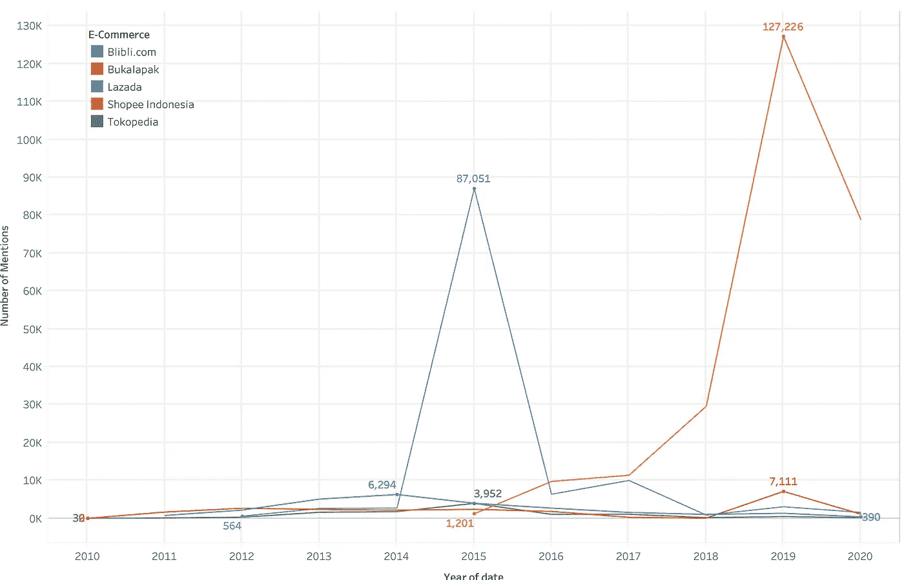*

***图 3**2010 年至 2020 年各电商的提及趋势*

*就转发而言，Bukalapak 在最初几年非常活跃，但此后数量呈下降趋势。Tokopedia 在 2015 年也曾一度领先，但之后数量也大幅下降。虽然其他人在转发中变得不那么活跃，但 contrasty Shopee 的转发数量在过去三年中呈上升趋势。*

*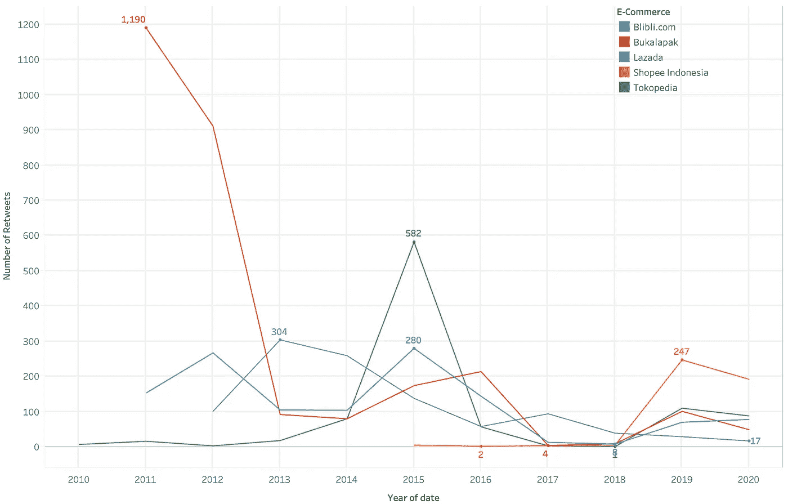*

***图 4**2010 年至 2020 年各电商的转发趋势*

***比例***

*为了简化分析并确保数据的相关性，从这一小节开始，我将只使用 2015 年至 2020 年的数据。*

*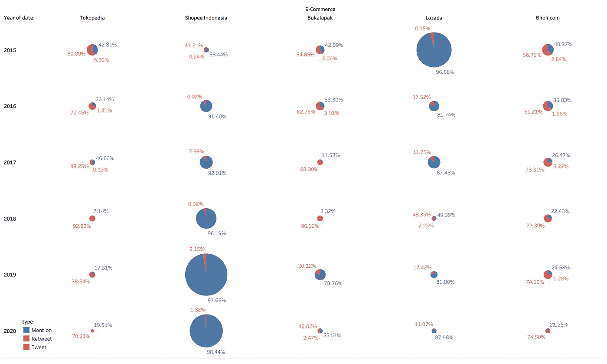*

***图 5**2005 年至 2020 年间来自各电子商务的推文类型比例*

*圆圈的大小代表推文总数。Tokopedia 和 Blibli 显示了类似的趋势，因为自 2015 年以来，它们的总推文数量逐年下降。有趣的是，Shopee 和 Lazada 有相反的趋势，Shopee 显示推文增加，Lazada 减少。与此同时，总体而言，Bukalapak 的趋势正在下降，尽管与前几年相比，2019 年他们更加活跃。*

*圆圈还显示了每个账户的推文类型的比例。自 2016 年以来，超过 90%的 Shopee 推文内容被提及，这一比例每年都在增加，2019 年达到 97.66%。与此类似的是 Lazada，他也花费了大约 80-87%的推文进行提及。这一发现表明 Shopee 和 Lazada 分配了相当多的时间与他们的追随者交流。相比之下，Tokopedia 和 Blibli 的推文大约有 75%是普通推文。从 2015 年到 2018 年，Bukalapak 显示一般推文的比例越来越高。然而，自 2019 年以来，他们转向更高比例的提及，而不是一般的推文。*

***点赞、回复和转发***

*从这一小节开始，我将只使用**一般推文**的数据，以便简化和确保分析的相关性。*

*由于有许多推文的粉丝 0 赞和/或 0 回复和/或 0 转发，我决定排除符合这些标准的推文。图 6 显示了 2015 年至 2020 年间每个电子商务推文的点赞、回复和转发的中位数。*

*很明显，在过去的 3 年中，Shopee 在所有变量中一直领先，其次是 Tokopedia，而 Blibli 和 Tokopedia 一直是垫底的两个。前 2 名和后 2 名之间的差距非常大。*

*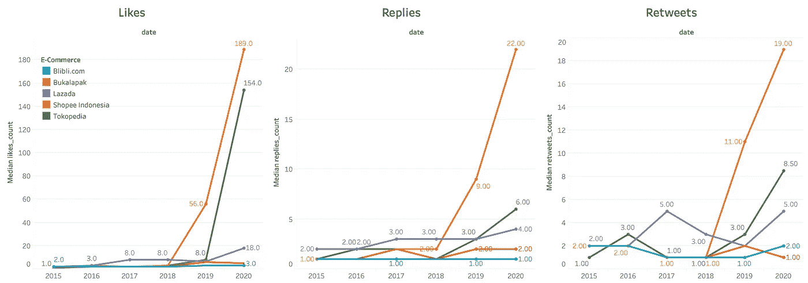*

***图 6**2015-2020 年各电商一般推文的点赞、回复、转发的中位数*

***内容***

*理解推文的内容很重要。就内容而言，有 3 种不同类型的推文，即纯文本推文、带文本和照片的推文以及带文本和视频的推文。*

*图 7 显示 Tokopedia 和 Lazada 有几乎相似的偏好。他们更喜欢发布带照片的推文，除了 2020 年 Tokopedia 在只有文字的推文中占了更大的比例。与此同时，布卡拉帕克在过去四年里一直专注于带照片的推特。另一方面，Shopee 从 2019 年开始从带照片的推文转向文字。自 2015 年以来，Blibli 更喜欢只有文本的推文，并继续每年增加其比例，并在 2020 年 4 月达到 86.10%。同样清楚的是，他们都在试图增加带有视频的推文的比例。*

*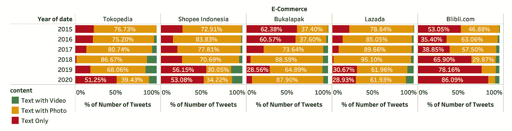*

***图 7**2015 年至 2020 年间，基于各电子商务内容的推文比例*

***内容与印象的关系***

> *内容会影响推文的印象吗？*

*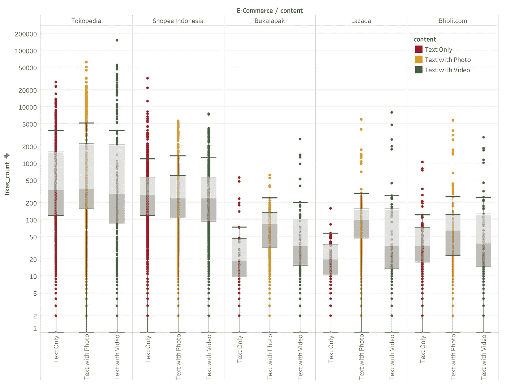*

***图 8** 各电商基于内容的点赞分布*

*根据 likes_count 的中位数，带有照片的推文获得了更多的喜欢。然而，这并不适用于 Shopee，它对所有不同类型的内容都获得了几乎相似的印象。*

*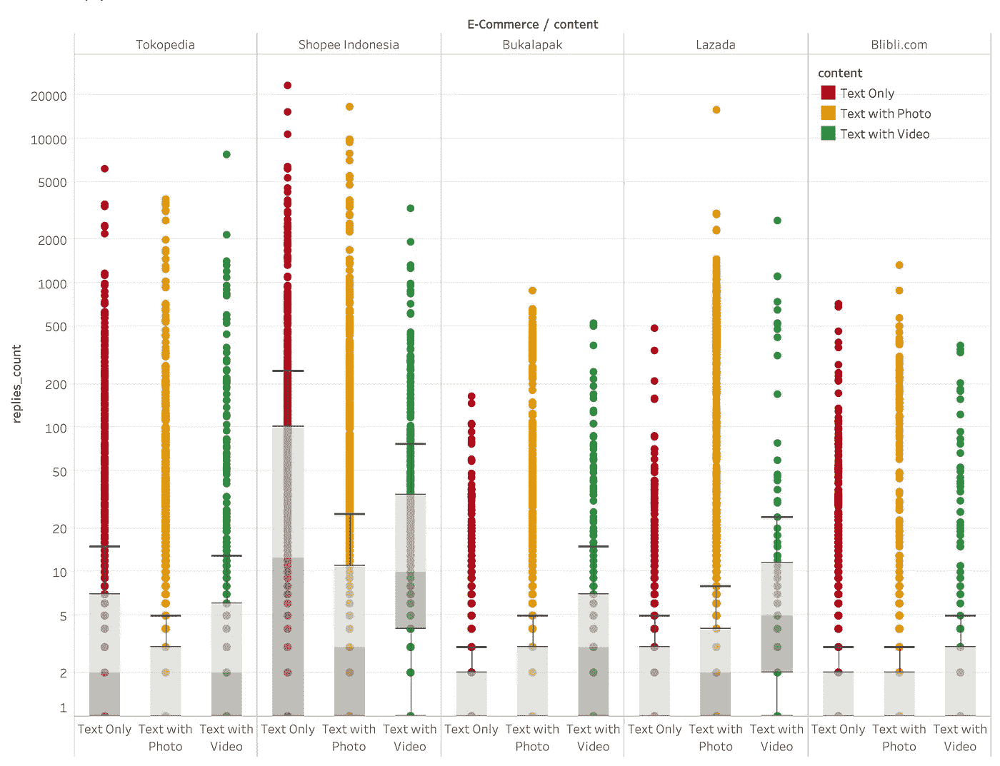*

***图 9** 每个电子商务基于内容的回复分布*

*从图 9 来看，根据 replies_count 的中位数，如果推文包含视频，Bukalapak、Lazada 和 Blibli 会获得更多回复。另一方面，Tokopedia 和 Shopee 在只有文字的推文中获得了更好的参与度。*

*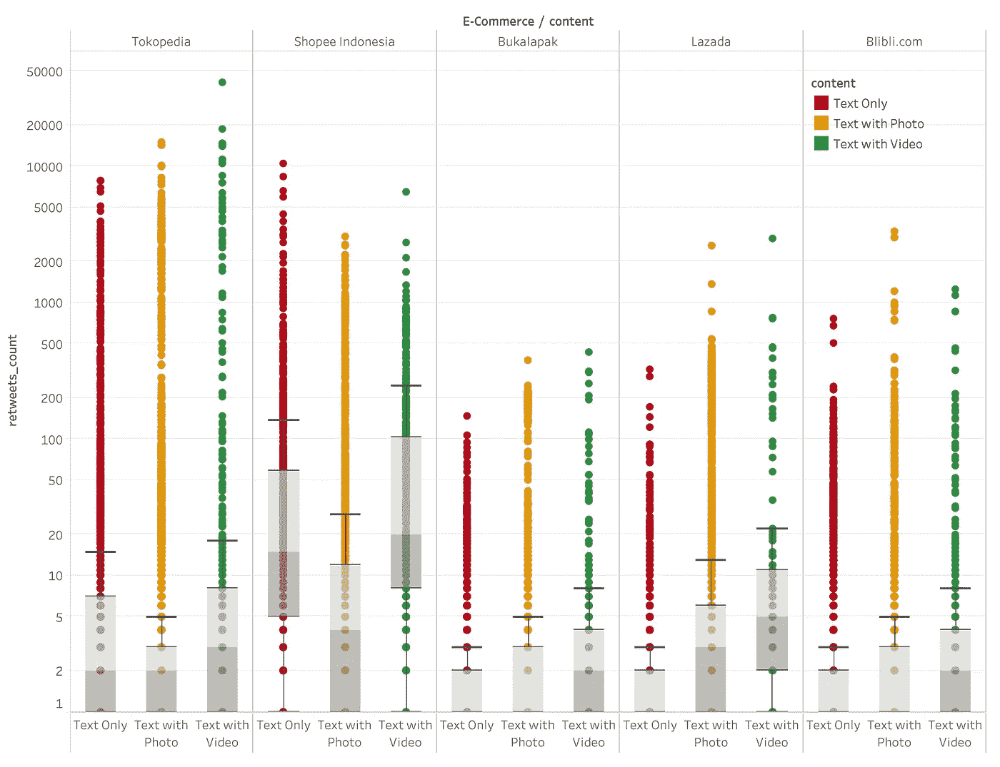*

***图 10** 基于每个电子商务内容的转发分布*

*就转发而言，如果推文中包含视频，所有电子商务都会获得更多的转发。与 replies_count 类似，如果推文仅由文本组成，Bukalapak、Lazada 和 Blibli 获得的转发量最少。*

*从图 8、9 和 10 中可以发现一个有趣的现象，Shopee 倾向于在只有文本的 tweet 上有更好的参与度。他们的推文可能包含吸引粉丝注意的有趣内容。然而，还需要进一步的分析来证实这一点。*

***日期和时间***

*一个有趣的发现，每个电子商务都有自己最喜欢的日子。与此同时，周日是他们所有人发微博数量最少的一天。这可能是因为周末。*

*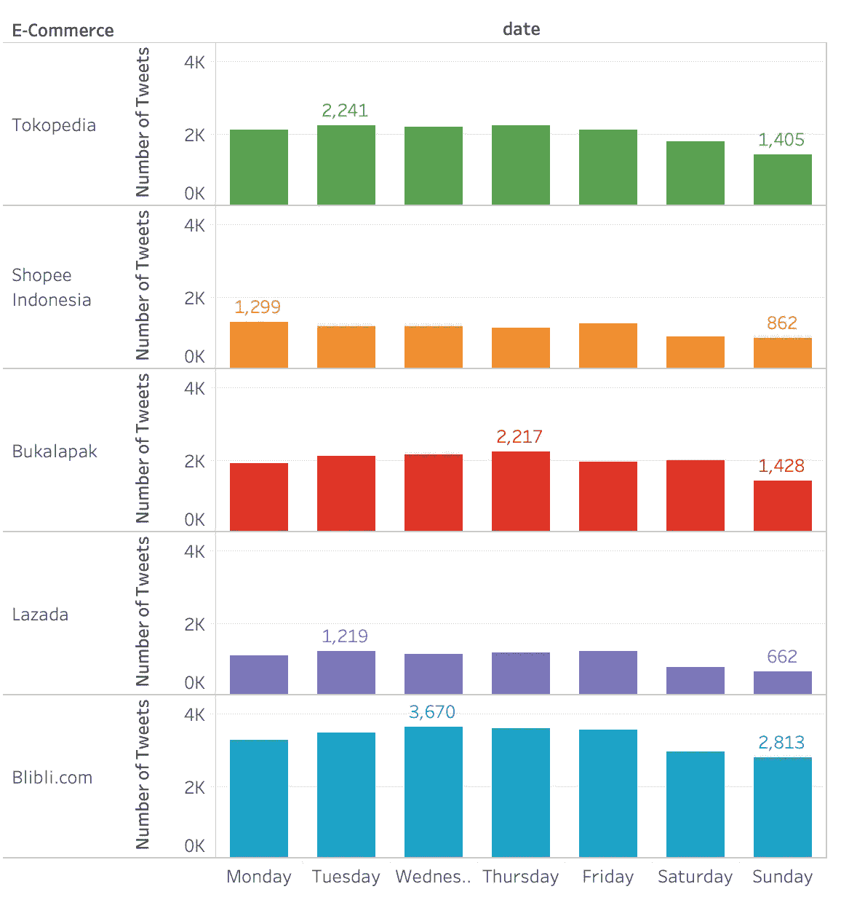*

***图 11** 每个电子商务工作日的推文数量*

*上午 10 点(GMT +7)是 Shopee 和 Lazada 最喜欢的时间，而晚上 7 点(GMT +7)是 Bukalapak 和 Lazada 最喜欢的时间。然而，Tokopedia 和 Bukalapak 的分布模式相似，Shopee 和 Lazada 的分布模式相似。*

*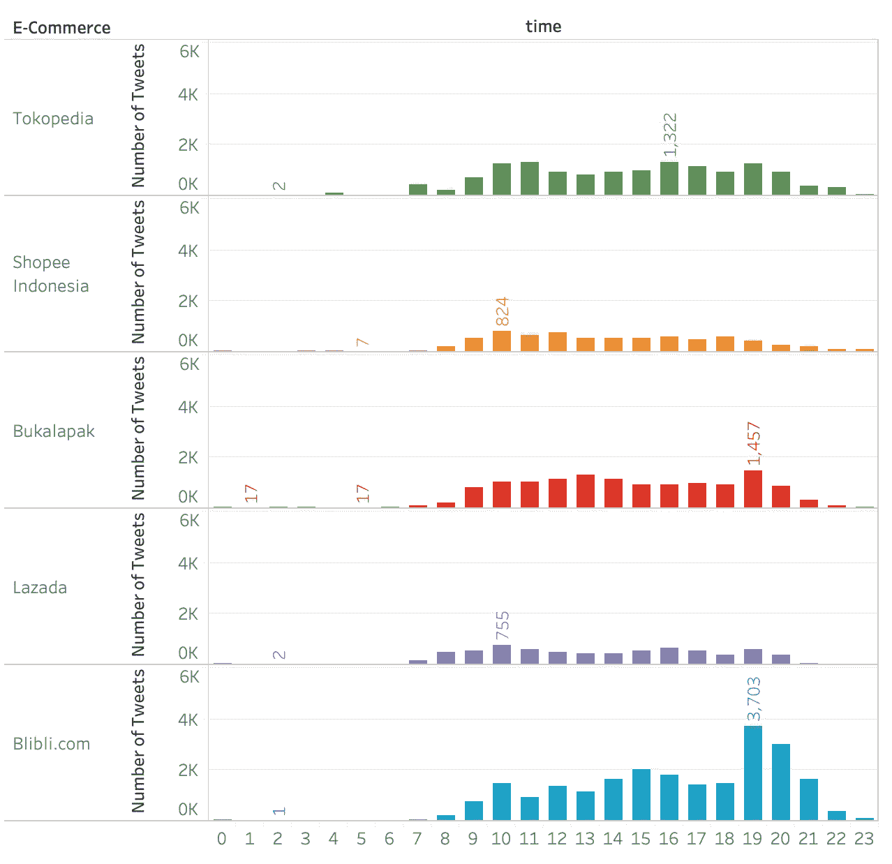*

***图 12** 每个电子商务每小时的推文数量*

*可以对此做进一步的分析，例如，哪一天/时间会获得更多的关注，但现在，我将限制在这里*

# *让我们来谈谈推文*

***长度***

*为了分析推文的长度，我删除了停用词。图 13 显示了大多数 tweets 的长度在 12-14 个单词之间。然而，Shopee 和 Bukalapak 似乎具有双峰分布。*

*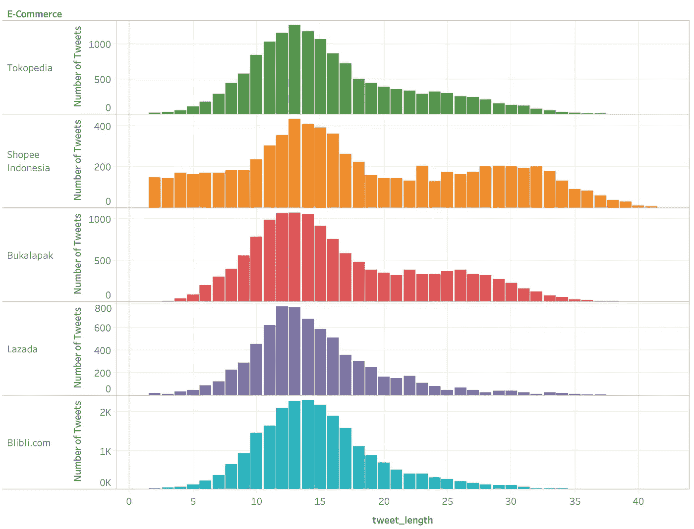*

***图 13** 各电商的推文长度分布*

***标签***

*图 14 显示从 2015 年到 2020 年，Shopee 与他们的 hashtag ( **#shopeeid** )一致。对于 Tokopedia 本身来说，在 2018 年和 2019 年之间，他们在 **#mulaiajadulu** 上开展了活动，但在 2020 年，他们一直在推广 **#tokopediasaja** 。在过去的两年里，Bukalapak 一直专注于他们的标签。在过去的 5 年里，Lazada 几乎在所有的推文中都加入了#lazadaid。最后，对于 Blibli 来说，在 2020 年，他们将推出 **#karenakamuno1** ，这与他们的客户满意度品牌有关。*

*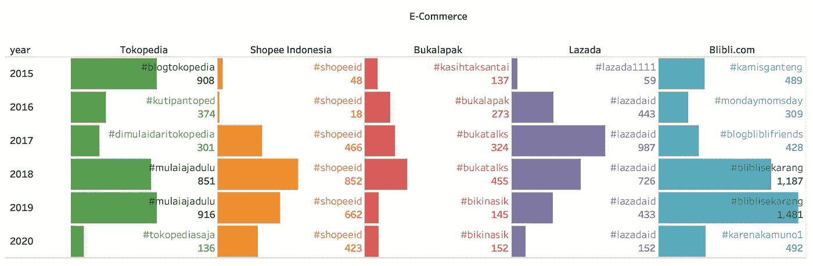*

***图 14**2015-2020 年各电商年度热门标签*

***表情符号***

*Shopee 倾向于在几乎一半的推文中包含表情符号，而其他的仍然低于 5%。一个有趣的未来分析是看到表情符号的存在与印象之间的关系，但不是在这个写作中😀。*

*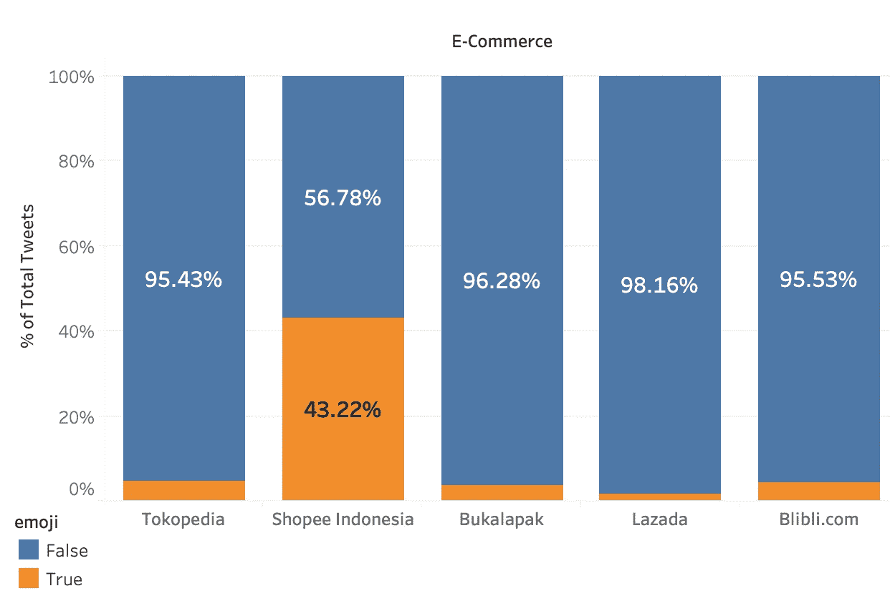*

***图 15** 各电子商务中使用和不使用表情符号的推文比例*

# *我们来谈谈追随者*

*在概述部分，我已经提到了每个电子商务的总关注者。在这里，我合并了所有关注者，唯一关注者总数为 **1，317，933** 。然后，我创建了一个维恩图来查看每个电子商务追随者之间的交集，如图 16 所示。所有电子商务共有 63 080 名关注者。从数量变量来看，Blibli 的忠诚者最多，而 Bukalapak 的忠诚者最少。Lazada 和 Blibli 共有 94060 名共同关注者，是其他两对中最多的。另一个发现是，Tokopedia、Bukalapak、Lazada 和 Blibli 共有 71，568 名共同追随者。这些追随者似乎是电子商务的早期追随者，这可能是他们不跟随 Shopee 的原因，Shopee 是印度尼西亚最新的电子商务玩家。更多信息可以在图 16 中看到*

*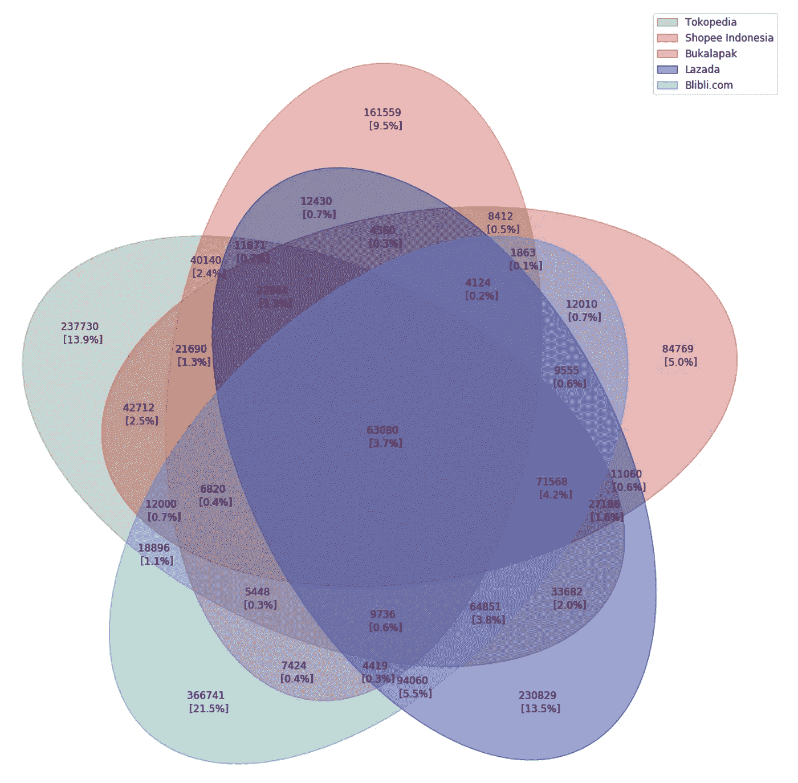*

***图 16** 所有电商的追随者分布维恩图。*

*有很多更深入的分析可以在追随者身上进行，例如，通过执行图形分析来找出一个电子商务的忠诚者到其他电子商务的距离，然而，对于这篇文章，我将把它限制在这里。也许在未来，我可以更深入地了解这一点:)*

# *评论*

*本文无意偏袒任何一方，不做任何判断，也不提供任何指导或建议。这篇文章的目的仅仅是分析和描述印度尼西亚五大电子商务的 Twitter 账户。我希望你喜欢并发现这篇文章有用！😀欢迎反馈。 [Linkedin](https://www.linkedin.com/in/robert1995/)*