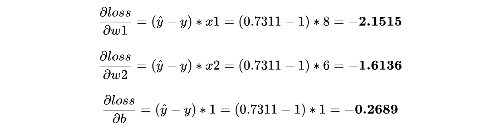
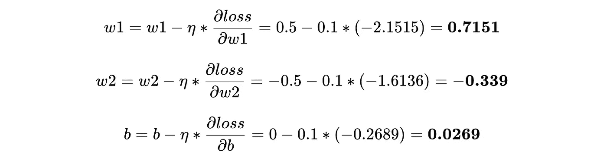
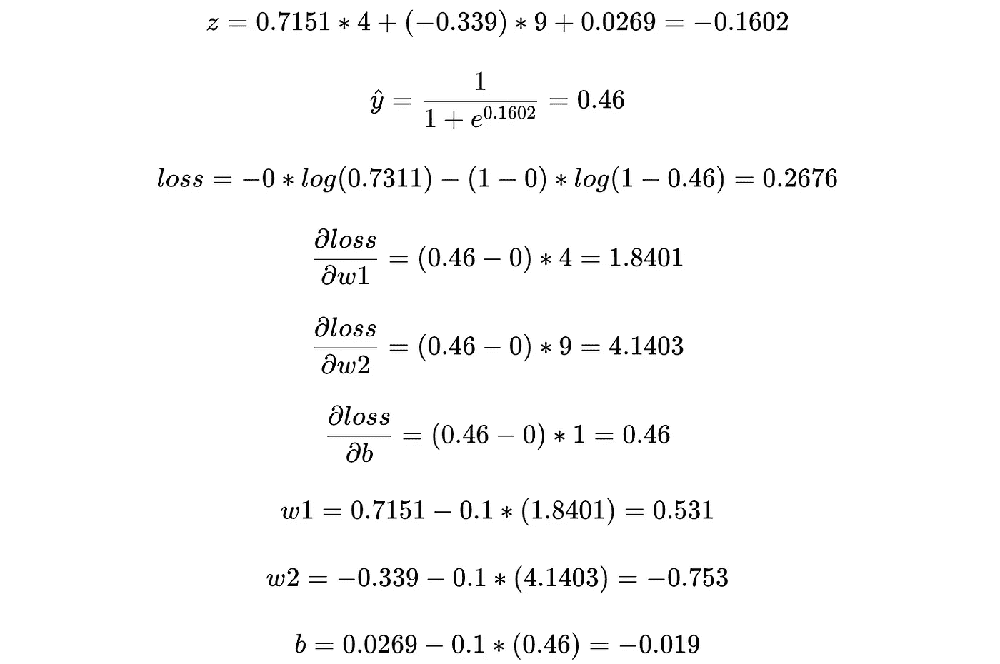
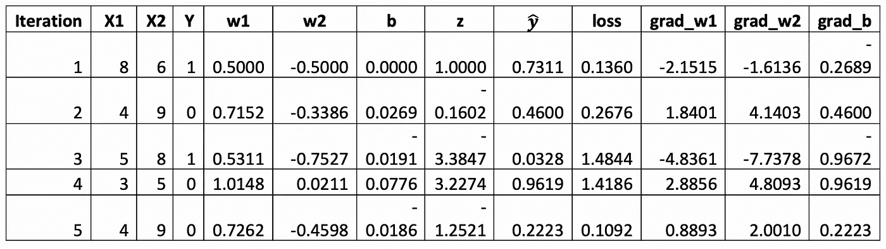

# 幕后——逻辑回归

> 原文：<https://towardsdatascience.com/under-the-hood-logistic-regression-407c0276c0b4?source=collection_archive---------26----------------------->

## 理解逻辑回归背后的数学原理，手动创建分类模型

乔尔·罗兰在 [Unsplash](https://unsplash.com/s/photos/repair?utm_source=unsplash&utm_medium=referral&utm_content=creditCopyText) 上拍摄的照片

这是一系列文章中的第二篇，在这一系列文章中，我们将使用各种 ML 算法的基本数学方程来理解它们的“幕后”工作。

1.  [引擎盖下——线性回归](/linear-regression-under-the-hood-583003d0bf38)
2.  [幕后——逻辑回归](/under-the-hood-logistic-regression-407c0276c0b4)
3.  [幕后——决策树](/under-the-hood-decision-tree-454f8581684e)

有这么多优化的实现，我们有时太关注库和它提供的抽象，而太少关注进入模型的底层计算。理解这些计算往往是一个好模型和一个伟大模型的区别。

在本系列中，我将重点放在手工实现算法上，以理解其背后的数学原理，这将有望帮助我们训练和部署更好的模型。

注意——本系列假设您了解机器学习的基础知识以及我们为什么需要它。如果没有，请阅读本文来了解我们为什么以及如何利用 ML。

# 逻辑回归

逻辑回归建立在[线性回归](/linear-regression-under-the-hood-583003d0bf38)的概念上，其中模型产生一个将输入特征(X)与目标变量(Y)相关联的线性方程。

逻辑回归算法的两个主要区别特征是—

1.  目标变量是离散值(0 或 1 ),与连续值不同，线性回归在计算线性方程的输出后增加了一个额外的步骤来获得离散值。
2.  该模型建立的方程侧重于分离 target 的各种离散值，试图确定一条线，使所有 1 都落在该线的一侧，所有 0 都落在另一侧。

考虑以下数据，具有两个输入特征— **X1，X2** ，和一个二进制(0/1)目标特征— **Y**

逻辑回归将试图找到参数 *w1* 、 *w2* 和 *b* 的最佳值，因此—

这里，函数 *H* ，也称为激活函数，将 *y* 的连续输出值转换为离散值。这将确保等式能够输出类似于输入数据的 1 或 0。

该算法通过以下步骤找到这些最佳值—

0.包含二进制(0，1)目标的样本数据

1.  将随机值分配给 *w1* 、 *w2* 和 *b.*

将随机值分配给 w1、w2 和 b

2.选取数据的一个实例，并计算连续输出(z)。

选择一个实例并计算 z

3.使用激活功能 *H()计算离散输出(ŷ)。*

使用 *H()* 计算ŷ

4.计算损失——当实际目标是 1 时，我们的假设是否让我们接近 1？

计算损失

5.计算 *w1* 、 *w2* 和 *b* 的斜率——我们应该如何改变参数以更接近实际输出？

6.更新 *w1* 、 *w2* 和 *b* 。

计算梯度并更新参数

7.重复步骤 2–6，直到收敛。

用另一个实例重复

让我们详细看一下这些步骤。

## **1。给 *w1* 、 *w2* 和 b** 分配随机值

我们从给模型参数分配随机值开始—

## 2.**选取一个数据实例，计算连续输出(z)**

让我们从数据的第一行开始——

输入我们假设的参数值，我们得到—

## 3.**使用激活函数 *H() —*** 计算离散输出( ŷ **)**

如果您一直在关注“幕后”系列，您会注意到步骤 1 和 2 与线性回归中的步骤完全相同。这一点会经常出现，因为线性回归形成了大多数算法的基础——从简单的 ML 算法到神经网络。

> *都是 Y = MX + c* 供电

有了我们的基础，我们现在关注的是什么使逻辑回归不同于线性回归，这就是“激活函数”的作用。

激活函数在具有连续目标值的线性世界和“逻辑”世界之间架起了一座桥梁(就像我们现在工作的这个世界！)具有离散的目标值。

激活函数的简单形式是阈值函数(也称为“阶跃函数”)—

但是，和所有 ML 的事情一样，*“不可能那么简单”*。

像这样的简单阈值函数的一个主要缺陷是，每次我们建立分类模型时，我们必须手动选择正确的阈值(基于输出的范围)。根据输入变量和权重，我们的值可以有任意范围。

另一个不利于这样一个简单函数的事实是，它在 *z=threshold* 处不可微。我们需要遵循损失的管道- > **梯度** - >权重更新，因此我们需要将这里的事情变得复杂一点，这样当我们计算损失的导数(梯度)时，我们的生活就简单了。

这就是稍微修改过的阈值版本 Sigmoid 函数——

就像阈值处理一样，sigmoid 函数将实数转换为 0 和 1 之间的值，中点在 z=0 处(这样就解决了我们的第一个问题)。从图中可以明显看出，该函数在所有点上都是平滑的，这在计算梯度时将是有益的(从而解决了我们的第二个问题)。

sigmoid 函数的另一个优点是，它告诉我们估计值有多接近 0 或 1。这有助于我们更好地理解模型损失(错误)—对于实际值为 1 的行，预测值为 0.9 比预测值为 0.7 要好。当使用阶跃函数时，这种复杂性就消失了。

让我们使用 sigmoid 函数来计算我们的估计输出—

## 4.**计算损耗**

基于线性回归，我们可以选择平方误差来表示我们的损失，但这总是会使误差变小，因为我们的值在 0-1 范围内。我们需要一个函数，当我们的假设提供一个接近于 0 的值，而实际是 1 时，输出一个大的损失，反之亦然。

一个这样的函数是 log-loss，它使用我们的预测输出(z)的对数变换来计算损失。

我们将损失函数定义为—

当输入接近 0 时，对数函数的输出接近负无穷大，当输入为 1 时，输出为 0。负号反转对数值，以确保我们的损失位于 0 到无穷大之间。

我们可以把这个函数写成一个方程—

我们现在可以计算我们的假设给我们带来的误差—

## 5.**计算 *w1* 、 *w2* 和*b*的斜率**

现在，我们通过计算每个参数对损耗的梯度来计算每个参数对预测输出(和损耗)的影响。

这就是管道中的微分函数使我们的生活变得简单的地方，为我们提供了每个参数的导数

## 6.**更新 *w1* 、 *w2* 和*b***

梯度告诉我们，我们应该改变多少参数假设，以减少损失，并使我们的预测输出更接近实际输出。

因为我们一次“训练”一个实例的模型，所以我们希望限制这个单独实例的损失对我们的参数的影响。因此，在更新参数之前，我们使用“学习率(**η)**”—

这完成了训练的一个迭代。

为了获得最佳参数值，我们重复上述步骤固定次数，或者直到我们的损失停止减少*，即*收敛。

让我们通过另一个迭代，使用更新的参数—

看来这次我们的损失增加了。这显示了二进制实例如何将权重拉向相反的方向，以在两个类之间生成决策边界。

重复这些步骤，再进行几次迭代*，从前 4 行中随机采样数据，我们得到最佳权重如下—

对我们最后一行数据(我们在训练时没有使用)使用这些值，我们得到—

这非常接近我们的实际类“1”。

选择截止值为 0.5(我们的 sigmoid 曲线的中点)，对于这种情况，我们的预测值为 1。

仅此而已。在其核心，这是所有的逻辑回归算法。

# **这真的是逻辑回归所做的“全部”吗？**

“引擎盖下”是本系列的焦点，我们看了看逻辑回归的基础，一次取一个样本，并更新我们的参数以适应数据。

虽然这确实是逻辑回归的核心，但是一个好的逻辑回归模型还有很多其他的东西，比如

1.正规化——L1 和 L2

2.学习率调度

3.为什么选择乙状结肠活化？

4.缩放和标准化变量

5.多类分类

我将在一个平行系列中介绍这些概念，重点是我们在这个系列中介绍的不同 ML 算法的各种复杂性。

# **下一步是什么？**

在本系列的下一篇文章中，我们将继续分类任务，并了解另一类算法— [**决策树**](/under-the-hood-decision-tree-454f8581684e) **，**，它们的工作方式非常类似于您和我如何使用推理来得出关于数据的结论。

**经过 5 次迭代，这是我们的损失、梯度和参数值的变化方式—*

** *在本文中，我还没有介绍我们如何获得损失函数相对于参数的导数，因为推导过程非常广泛，需要单独撰写一篇文章(将在另一篇文章中介绍:)*