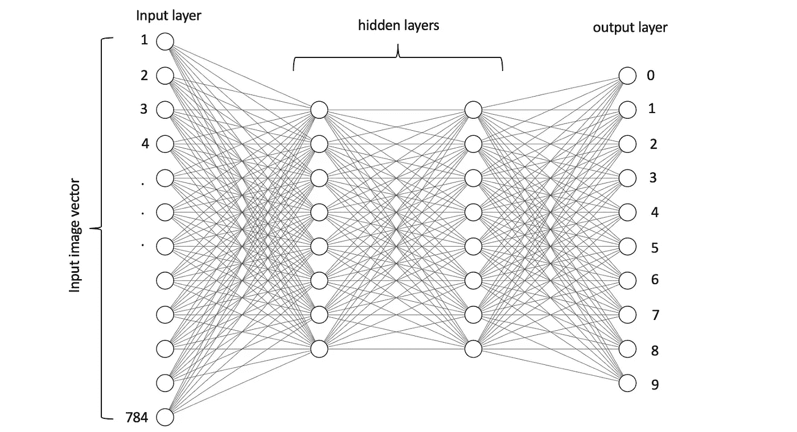
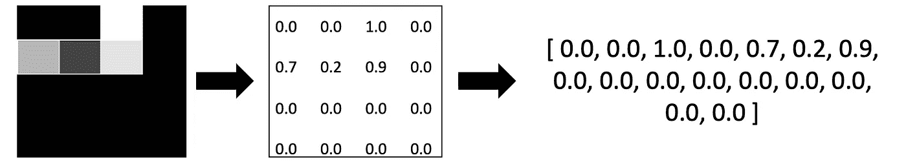
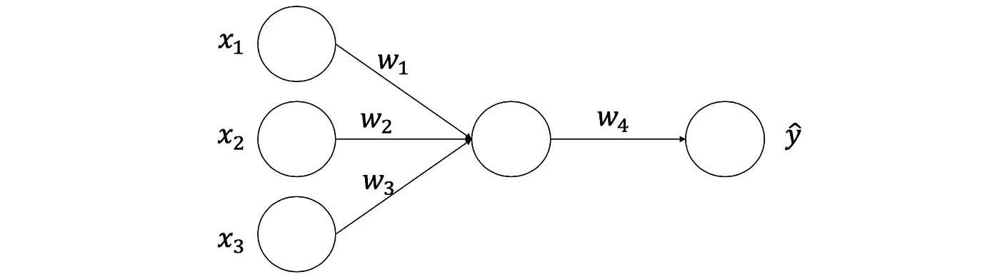
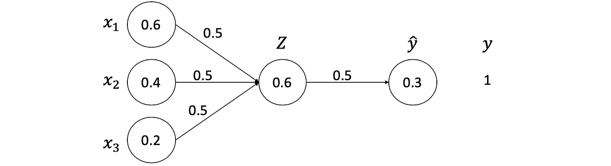
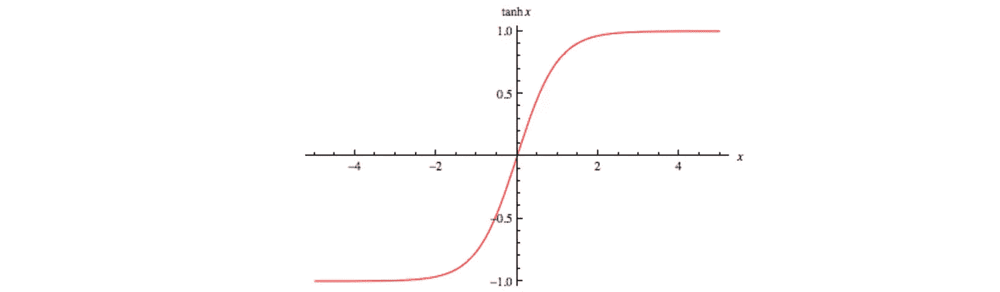
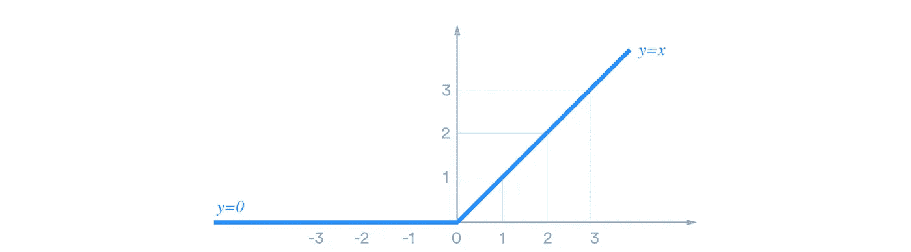
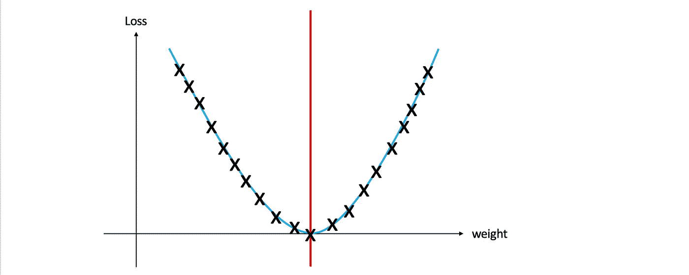
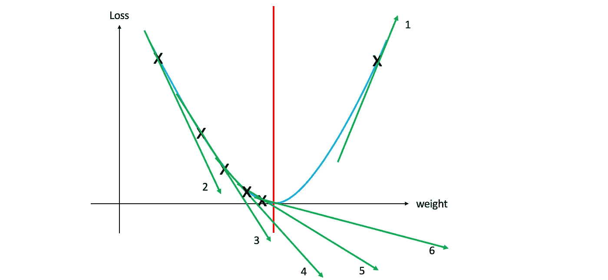
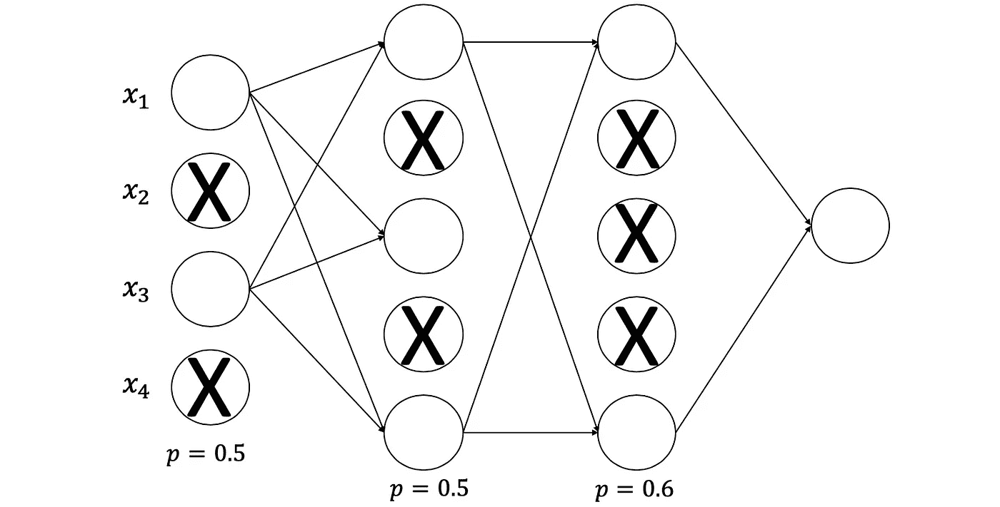

# 在深度学习的掩护下

> 原文：<https://towardsdatascience.com/under-the-hood-of-deep-learning-e8bb39aec5d2?source=collection_archive---------18----------------------->

## 理解神经网络的循序渐进教程

我用 Alexlenail 网站创建了这张图片

上图是深度神经网络的简单架构。这篇文章的目标是了解深度学习的细节并建立自己的网络，而不是将现有的模型用作黑箱！

## 准备输入数据

在这篇文章中，我们将介绍一个简单的神经网络，它可以学习识别手写数字(MNIST 数据集)。目前，有各种类型的神经网络，但为了简单起见，我们将从香草形式开始(又名*“多层感知器”*)。

请注意，之前图表中的圆圈称为神经元。每个神经元包含一个范围在 0 和 1 之间的数字，这就是所谓的“激活”。另外，请注意这些神经元之间的连线称为权重。每个权重是一个随机生成的数字，其值介于-1 和 1 之间。

MNIST 数据集中的每幅图像仅由黑白颜色组成，尺寸为(28 x 28 = 784 像素)。如果你仍然想知道为什么神经元激活的范围在 0 和 1 之间，那是因为它保持了图像的灰度，其中 0 是完全黑色的，1 是完全白色的。最后，要将图像输入到我们的神经网络中，我们需要通过获取每行像素并将其附加到上一行像素来将其转换为像素向量，请看以下示例:

## 图层说明

如上所述，网络的输入将是被转换成像素矢量(确切地说是 784)的图像，这是我们的神经网络的第一层。

输出层神经元的数量应该与我们试图预测的类的数量相关联。在我们的例子中，类的数量是 10 (0，1，2，…，9)。因此，最后一层(输出层)应该由 10 个神经元组成。

隐藏层是中间的层。现在，我们姑且说我们随机选择了隐藏层的数量和神经元的数量。

## 目标是什么？

我们希望建立一个模型，能够预测输入图像的数字(图像分类)。但是，很难展示整个网络的逐步示例。因此，我们将从一个更简单的神经网络开始，它由三个输入节点、一个具有单个神经元的单个隐藏层和一个单个输出组成。我们的网络将会是这样的

# 正向传播

前向传播是从输入开始，经过神经网络及其计算，并以做出单个预测结束的过程(用 *y^* 表示，读作 y-hat)。让我们从下面的向量[0.6，0.4，0.2]开始，实际输出(y)是 1。

这些数字都是从哪里来的？好了，输入节点已经给定， *Z* 是输入激活与权重相乘并相加的结果， *y^* 是 *Z* 与其权重相乘的结果。最后，也给出了 y，这是期望的输出。通常，为了计算任何输出，我们将激活与权重相乘，并将它们相加。这是第一层的公式。

很明显，我们在所有的输入和权重上重复相同的乘法。因此，我们只计算总和，因为我们可能有 3 个以上的输入。

## 偏见

每一个神经元都会在某个时候发光。当一个神经元触发时，意味着这个神经元检测到图像中的特定特征。例如，每当一个数字为 7 的图像进入网络，几乎相同的神经元就会激活并放电(这意味着它们触发了类似的事件、类似的角度等。).然而，当激活大于 0 时，你不希望每个神经元都触发(否则所有的正激活将保持触发)。你想让它们在某个阈值后启动，比如 10，这就是所谓的偏差( *b* )。我们将 b 加到求和中，以控制神经元何时触发。

## 激活功能

到目前为止，我们的方程将产生良好的结果。但是，结果可能小于 0 或大于 1。如前所述，每次激活应该在 0 到 1 的范围内，因为这是每个图像的灰度。因此，我们需要一个函数 *(f)* 将 *y* ^的结果挤压在 0 和 1 之间。这个函数被称为激活函数，特别是 Sigmoid 函数。在 y^*上调用 sigmoid*将会以如下结果结束

或者你可以这样写

注:我将左侧尺寸命名为 *(Z)* ，这是应用激活函数后隐藏层输出的约定名称。另外，请注意，我调用了 *f* 而不是 Sigmoid，因为我们有许多不同的激活函数可以应用。以下是常用激活功能的列表:

*   **Sigmoid:** 是一个在 0 和 1 之间传递输出的函数，它大量用于概率，因为这是概率的范围。

图片来自 [WolframMathWorld](http://mathworld.wolfram.com/SigmoidFunction.html)

*   **双曲正切:**在某种程度上类似于 Sigmoid，范围从-1 到 1。

图片由 [WolframMathWorld](http://mathworld.wolfram.com/HyperbolicTangent.html) 提供

*   **整流线性单元(RELU):** RELU 是最常用的激活功能。它的范围是 0 到无穷大。如果输入为负，RELU 返回 0，否则返回实际输入: *max (0，x)*

图片由刘丹青 —中:拍摄

*   **Softmax:** 是一个独特的激活函数，它采用一个由 *k* 个数字组成的向量，并将其归一化为 *k* 个概率。换句话说，它不是选择单个输出类，而是列出每个类的概率。

还有许多其他的激活函数，如漏 RELU，参数 RELU，SQNL，ArcTan 等。

## 计算损失

损失是什么？简单来说，损失就是模型离预测的正确答案有多远。如前所述，输出为 1，而预测输出为 0.3，因此本例中的损耗为 0.7。如果模型预测完美，那么损失为 0。因此，可以使用以下公式计算损耗( *L* 表示损耗)

就这样吗？基本上，是的，但有几件事有助于改善损失，对我们未来更有利:

*   绝对值:损失是模型预测与输出之间的差距。考虑有两个错误。第一个错误是 100，第二个错误是-100。将这些误差相加并求平均值得到 0，这意味着你的预测是 100%正确的，而不是。因此，我们只对正误差感兴趣。

*   平方值:考虑有两个误差(一个小误差和一个大误差)。你会更关注哪个错误？当然是更大的误差！因为更影响结果。因此，计算损失的平方值有助于我们摆脱符号，让大误差变大，小误差变小。考虑误差为 0.01 和 100。将这些误差平方，我们得到 0.0001 和 10000。区分这些错误的优先级对于了解是什么导致了错误的预测非常重要。

*   总结:在我们之前的例子中，我们计算了预测和输出之间的损失，但是如果我们有几个输出神经元呢？因此，我们计算神经网络中所有损失值之间的总和。(D 表示包含许多示例的数据集)。

*   平均值:数据集中样本的平均值。在我们的例子中，我们只有一个例子。但是现在，我们需要用它除以 d 中的例数(N)。

这个损失函数被称为**均方差(MSE)** ，它是最常用的损失函数之一。还有许多其他损失函数，如交叉熵、铰链、MAE 等。但是你想过成本函数是什么吗？损失函数和成本函数的区别是什么？区别在于，损失函数用于单个训练示例，而成本函数是整个训练数据集的平均损失。

恭喜你！我们完成了正向传播。但是，我们刚刚做出的预测可能不是很准确(考虑输出 1，但模型预测 0.7)。怎样才能做出更好的预测？我们不能改变输入值，但是我们可以改变权重！！维奥拉。现在你知道深度学习的秘密了。

# 反向传播

我们不能改变输入。然而，我们可以增加权重，然后将其乘以输入将得到更大的预测输出，比如 0.8。不断重复这个过程(调整权重)，会得到更好的结果。向相反的方向改变权重称为反向传播！但是具体怎么做呢？这可以通过优化算法来实现。有**梯度下降、随机梯度下降、Adam 优化器**等不同的优化器。

## 梯度下降

梯度下降是一种优化算法，旨在通过调整权重来减少损失。当然，手动改变权重是不可能的(我们在单个神经网络中有几十甚至几百个权重)。那么，我们怎样才能使这个过程自动化呢？以及如何告诉函数调整哪个权重，何时停止？

让我们开始调整权重，检查它如何影响损失，并绘制所有结果(检查下图)。正如你所看到的，在一个特定的点(红线)是最小的损失。在红线的左边，我们必须增加重量来减少损失，而在红线的右边，我们显然需要减少重量来减少损失。主要的问题仍然是:我们如何知道一个给定点是在红线的左边还是右边(为了知道我们应该增加还是减少重量)？以及我们应该增加或减少多少重量才能更接近最小损失？一旦我们回答了这个问题，那么我们就可以减少损失，获得更好的准确性。

请注意，在简单的 2D 维度中，很容易快速到达最小点。然而，大多数深度学习模型处理的是高维度。

幸运的是，数学上有一种方法可以回答这些问题，导数(你在高中忽略的东西:)。利用导数，我们可以用损失对重量的导数来计算图上切线的瞬时变化率。

如果你不熟悉导数，前面的句子听起来像是胡言乱语，那么就把它想象成一种测量在特定点接触图形的直线的斜率和方向的方法。根据给定点的倾斜方向，我们可以知道该点是在红线的左边还是右边。

在上图中，您可以看到 1 号切线的右侧向上，这意味着它是一个正斜率。而其余的线指向下方，负斜率。此外，请注意，斜率编号 2 的梯度大于斜率编号 6 的梯度。这就是我们如何知道我们需要多少来更新权重。梯度越大，该点离极小点越远。

## 学习率

将点定位在红线的左侧或右侧后，我们需要增加/减少权重，以减少损失。然而，让我们说对于红线左边的一个给定点，我们应该增加多少重量？请注意，如果您大幅增加重量，那么该点可能会将最小损失传递给另一方。然后你要减轻体重，等等。随机调整权重是没有效率的。相反，我们添加了一个称为“学习率”的变量，用“η”表示，以控制如何调整权重。一般你都是从小的学习率开始，避免过了最小损失。为什么叫学习率？那么，减少损失和做出更好预测的过程基本上就是模型学习的时候。在那时，学习率是控制模型学习速度的因素。

## 调整重量

最后，我们将斜率乘以学习率，并从旧的权重中减去该值，以获得新的权重。看看下面的等式，你会更好地理解它

## **随机梯度下降**

梯度下降使用整个数据集来计算梯度，而 SGD 在每次迭代中使用训练数据集的单个示例。SGD 通常比批量或标准梯度下降更快地达到收敛。批量梯度下降每次迭代使用一批训练样本。

## 过度拟合

当一个神经网络很深的时候，它有太多的权重和偏差。当这种情况发生时，神经网络往往会过度拟合它们的训练数据。换句话说，模型对于特定的分类任务将是如此精确，而不是一般化。该模型在训练数据中得分较高，而在测试数据中得分较低。退学是解决办法之一。

## 拒绝传统社会的人

避免过度拟合的一个简单而有效的方法是使用 dropout。对于每一层，都有一个脱失率，这意味着与该脱失率相关的神经元数量被停用。这些神经元将被随机选择，并在特定的迭代过程中被关闭。下一次迭代，另一组随机选取的神经元将被停用，以此类推。这有助于概括模型，而不是记住具体的特征。

我希望这篇文章是有帮助的。如果您有任何问题，请告诉我！

## 资源

*   [深度学习。伊恩·古德菲勒、约舒阿·本吉奥和亚伦·库维尔。](https://books.google.com/books/about/Deep_Learning.html?id=omivDQAAQBAJ&printsec=frontcover&source=kp_read_button&ppis=_c#v=onepage&q&f=false)
*   [钻研深度学习。作者安德鲁·柴斯克。](https://www.amazon.com/Grokking-Deep-Learning-Andrew-Trask/dp/1617293709)