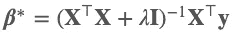
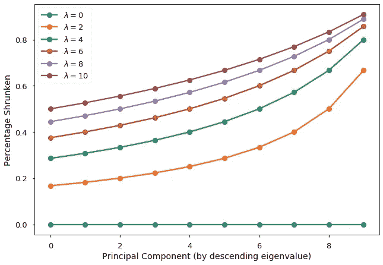
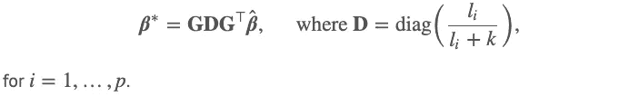
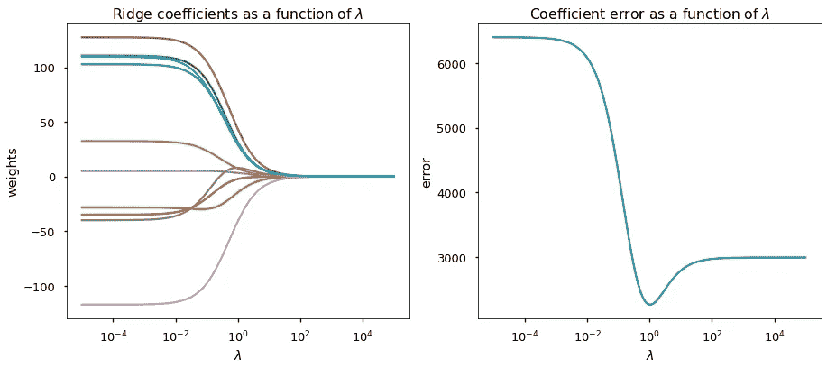

# 线性回归，岭回归，主成分分析有什么联系？

> 原文：<https://towardsdatascience.com/under-the-hood-what-links-ols-ridge-regression-and-pca-b64fcaf37b33?source=collection_archive---------34----------------------->

## [引擎盖下](https://towardsdatascience.com/tagged/under-the-hood)

## 从保存病态回归问题到启用正则化路径的快速计算，这是引擎盖下的链接。

图片来自 [Pixabay](https://pixabay.com/?utm_source=link-attribution&utm_medium=referral&utm_campaign=image&utm_content=3011368) 的 [doria150](https://pixabay.com/users/doria150-7337031/?utm_source=link-attribution&utm_medium=referral&utm_campaign=image&utm_content=3011368)

我正在写[一个新的系列](https://towardsdatascience.com/tagged/under-the-hood)(相对较短)帖子，围绕统计学习中的基础话题。特别是，这一系列将会有意想不到的发现，很少被谈论的联系，和统计学习的幕后概念。

我的第一篇文章从岭正则化开始，[数据科学中的一个基本概念](https://www.tandfonline.com/doi/abs/10.1080/00401706.2020.1791959)。**普通最小二乘(OLS)估计、岭估计和 PCA 之间简单而优雅的关系可以通过光谱分解的透镜找到。**我们通过[多元分析](https://books.google.com.sg/books/about/Multivariate_Analysis.html?id=bxjvAAAAMAAJ&source=kp_book_description&redir_esc=y)的练习 8.8.1 看到了这些关系。

这篇文章改编自我的一篇博文，省略了所有的证明。如果你喜欢 LaTex 格式的数学和 HTML 风格的页面，你可以在我的博客上阅读这篇文章。

# 设置

给定以下回归模型:

考虑一下 **X`X** (在本文中，`和上标 T 都表示转置)的列已经标准化为均值为 0，方差为 1。那么*的岭估计为*

**

*其中对于给定的 **X** ，λ≥0 为小的固定脊正则化参数。注意，当λ=0 时，它只是 OLS 公式。另外，考虑 var-cov 矩阵的谱分解 **X`X** = **GLG`** 。设 **W** = **XG** 为原始数据矩阵的主成分变换。*

# *结果 1.1*

*如果***α***=**g`*β***表示主分量的参数向量，那么我们可以表明，通过简单地用岭正则化参数对它们进行缩放，岭估计 ***α**** 可以从 OLS 估计 hat( ***α*** )中获得:*

**

*这个结果向我们展示了两个重要的见解:*

1.  *对于 PC 转换的数据，**我们可以通过 OLS 估计值的简单元素式缩放来获得岭估计值**。*
2.  *脊正则化的**收缩效果取决于λ和相应 PC 的特征值**:
    -较大的λ对应于每个参数的较大收缩。
    ——然而，给定相同的λ，对应于较大特征值的主成分得到最小的收缩。*

## *形象化*

*为了演示这两种收缩效应，我绘制了收缩百分比(1-hat(***α***)与有序主分量以及脊正则化参数值的函数关系。从该图中可以清楚地看到两种收缩效应。*

**

# *结果 1.2*

*从结果 1.1 可以得出，通过 var-cov 矩阵的谱分解，我们可以在 OLS 估计 hat(***【β】***)和岭估计***【β****之间建立直接联系(因此有了本文的标题)。具体来说，我们有*

**

# *结果 1.3*

*估计量***【β*】***质量的一个度量是跟踪均方误差(MSE):*

**

*现在，从前面的两个结果可以看出，岭估计的迹 MSE 可以分解为两部分:**方差**和**偏差**，并得到它们的显式公式。MSE 的精确公式的可用性允许诸如正则化路径之类的东西被容易地计算。具体来说，我们有*

**

*其中第一个分量是方差之和:*

**

*第二部分是偏差平方和:*

**

# *结果 1.4*

*这是从结果 1.3 得出的一个快速但有启发性的结果。对轨迹 MSE 函数对λ取偏导数，并取λ=0，我们得到*

**

*请注意，当λ为 0 时，跟踪 MSE 函数的梯度为负。这告诉我们两件事:*

1.  *我们可以通过采用非零λ值来降低轨迹 MSE。特别是，我们**用一点偏差换取方差**的减少，因为方差函数在λ中单调递减。然而，我们需要在方差和偏差之间找到正确的平衡，以便使总的跟踪 MSE 最小。*
2.  *当一些特征值(l_i)较小时，通过脊正则化的道 MSE 的减少较高。**也就是说，当预测量之间存在相当大的共线性时，岭正则化可以实现比 OLS 小得多的迹 MSE。***

## *形象化*

*使用`sklearn.metrics.make_regression`函数，我生成了一个包含 50 个样本和 10 个特征的噪声回归数据集。特别是，我要求大多数方差(在 PCA 意义上)只能由这 10 个特征中的 5 个来解释，即最后 5 个特征值相对较小。这是正则化路径和系数误差图。*

**

*从图中，我们可以清楚地看到:*

1.  *增加λ会使每个系数向 0 收缩。*
2.  *OLS 过程(两个图的左侧)产生错误的(并且具有大的方差)估计。估计量 MSE 明显大于岭回归的 MSE。*
3.  *在岭估计系数的均方误差最小的 1 附近发现一个最佳λ。*
4.  ***另一方面，大于和小于 1 的λ** **值是次优的，因为在这种情况下它们会导致过度正则化和欠正则化。***

*绘制该图的脚本附后。*

# *摘要*

*通过光谱分解的镜头，我们看到线性回归估计、岭回归估计和 PCA 之间有一个简单而优雅的联系。特别是:*

1.  *结果 1.2 表明，当你有数据 var-cov 矩阵的谱分解和通常的线性回归估计时，你可以通过简单的矩阵计算获得每个岭正则化参数值的岭估计。我们刚刚避免了很多矩阵求逆！*
2.  *我们对岭估计的迹 MSE 进行了偏差-方差分解。很明显，我们总是可以通过增加正则化强度来减小估计量的方差。*
3.  *虽然轨迹 MSE 函数在λ=0 处的梯度是负的，但是我们上面的可视化表明λ的值需要仔细选择，因为它可能导致过度正则化或欠正则化。*

*感谢您阅读本文！如果你有兴趣了解更多关于统计学习或数据科学的知识，你可以看看我下面的其他文章。尽情享受吧！*

* [## 线性判别分析，已解释

### 直觉、插图和数学:它如何不仅仅是一个降维工具，为什么它在现实世界中如此强大…

towardsdatascience.com](/linear-discriminant-analysis-explained-f88be6c1e00b)*