# 低估了 Tableau 的组合功能—点、线串和多边形映射

> 原文：<https://towardsdatascience.com/underrated-combined-functionalities-of-tableau-point-linestring-polygon-mapping-b4c0568a4de2?source=collection_archive---------44----------------------->

## Tableau 中的地理空间分析-无需地理编码/底图服务即可工作+在单一设置中渲染混合几何类型

> 完成了我的一个空间分析项目后，我已经准备好在 Tableau 中展示我的发现，但是面临着一个非常规的问题，那就是完全没有互联网接入。由于我们大多数人通常认为 Tableau 中内置的地理编码和底图服务是理所当然的，这比我最初预期的要复杂得多。

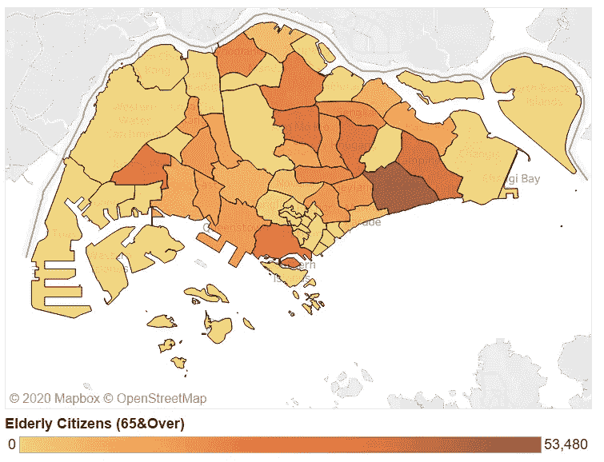

作者提供的图片|由空间数据文件以 Tableau 形式呈现的地图|按规划区域展示新加坡公民(65 岁及以上)的分布情况

基本上，当互联网不可用时，上面的地图会变成这样

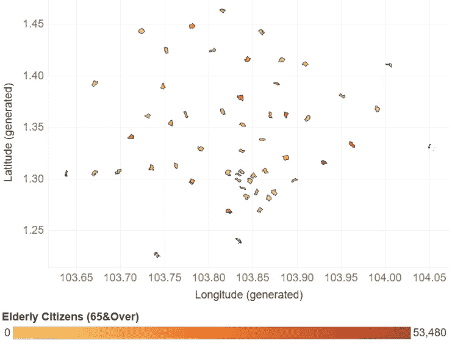

按作者分类的图像|在没有互联网连接的情况下由空间数据文件以 Tableau 形式呈现的地图-所有地理编码和底图服务均不可用。

哎呀…显然，这有一些毁灭性的影响。更糟糕的是，在没有内置地图功能的情况下，渲染空间数据的深入教程少得可怜。所以我开始自己做一些探索，主要是，我必须解决一些问题来完成我的项目:

1.  确保新加坡的地图多边形按比例渲染*和缩放*。
2.  显示缺失的底图详细信息-高速公路、街道名称等。因为它们不再自动显示在背景中。

# **解决问题 1** —绘制地图多边形并渲染其实际比例

基于上述背景，我必须处理的只是 GeoJSON 格式的空间数据文件(出于本教程的考虑，我已将一个示例上传到 GitHub 的[SG _ planning _ areas _ 2020 _ eldery _ distribution . geo JSON](https://gist.githubusercontent.com/incubated-geek-cc/a1ab578d20d977f586718be766ab5f03/raw/0ef3acbdf9b2e334bf0341837ccc93395b53c41e/sg_planning_areas_2020_elderly_distribution.geojson))并继续研究它。

从根本上来说， [GeoJSON FeatureCollection 对象](https://tools.ietf.org/html/rfc7946#section-3.3)是一个 JSON 对象，它包含所有必要的坐标(纬度和经度)以将其几何形状渲染到任何地图上。因此，我决定利用这些信息，用“多边形”代替“地图”来制作几何图形。这需要一种 Tableau 容易理解的数据格式，在这种情况下，我选定的格式是 CSV 文件:

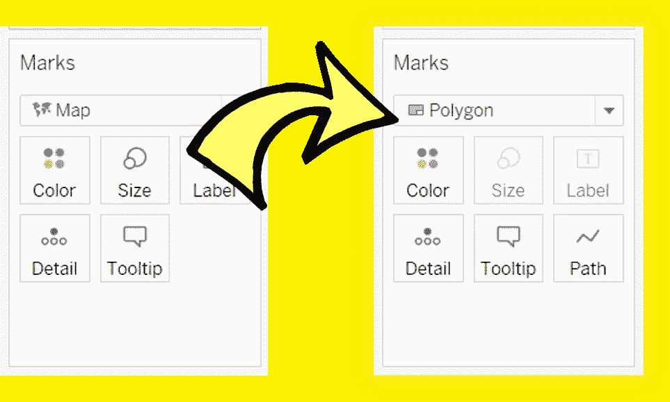

Image by Author |要在 Tableau 中使用“多边形”而不是“地图”渲染几何图形，必须首先将 GeoJSON 数据转换为 CSV 格式。

幸运的是，我在[https://tableau-data-utility.onrender.com/](https://tableau-data-utility.onrender.com/)创建了一个工具来加速这个过程。

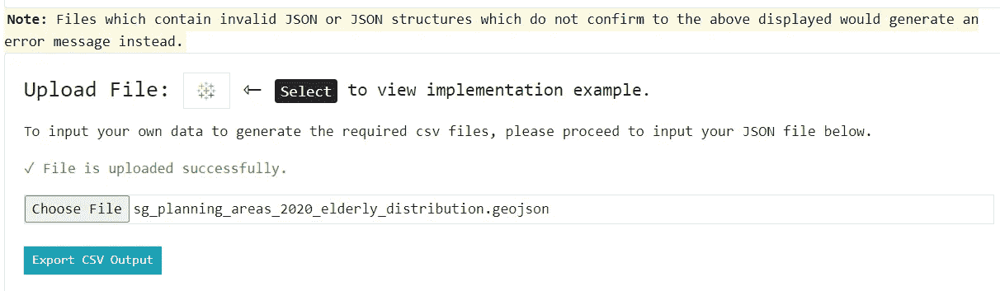

作者图片| GeoJSON 文件上传到 https://tableau-data-utility.onrender.com/[生成 CSV 输出文件|“导出 CSV 输出”然后选择保存 CSV 文件](https://tableau-data-utility.onrender.com/)

基本上，这是一个基于浏览器的应用工具，我创建了所有的指令和实施所需的信息。我现在需要做的就是上传上面的 GeoJSON 文件，通过选择“生成 CSV 输出”导出转换后的输出，并使用“多边形”在 Tableau 中渲染它:

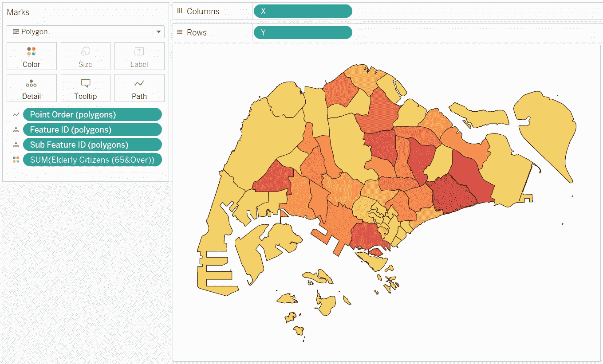

按作者分类的图像 CSV 文件中生成的字段用于在 Tableau 中渲染地图多边形-不依赖于任何地理编码服务

然后奇迹发生了！问题 1 已解决-地图多边形现在以正确的比例渲染，无需地理编码服务。

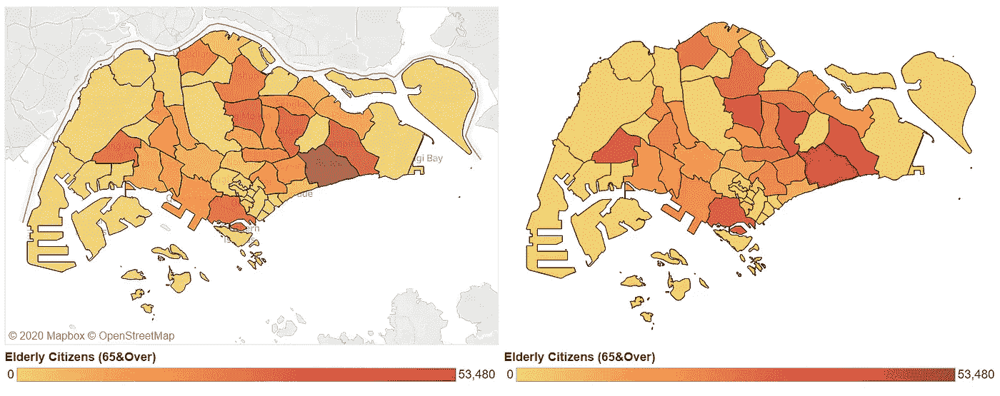

图片作者| ( **左**)用“地图”渲染的地图多边形| ( **右**)用“多边形”渲染的地图多边形

然而，随着问题 1 的解决，第二个问题很快取代了它——这就是缺少底图的**，将我们直接引向问题 2。**

# **解决问题 2-绘制在 Tableau 中渲染的空间数据的底图图层**

**乍看之下，这似乎不是什么大事，但当我受命调查和优化岛上的各种交通路线时，这很快就成了问题:**

**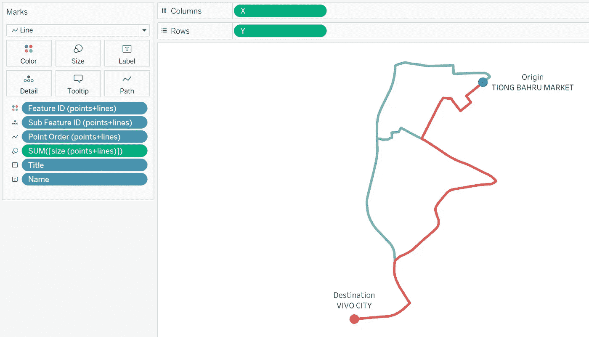**

**作者提供的图片|展示了从出发地到目的地的各种交通路线|以上示例展示了在新加坡驾车从中巴鲁市场到 Vivo City 的两条可能路线**

**显然，虽然国家/州/省的轮廓可以很容易地从其地图多边形中推断出来，但由**(多)点**和**(多)线串**表示的交通路线在没有如上图所示的详细地图图层的情况下并不明显。用于渲染上述的样本数据可以在我的 GitHub 上找到:[SG _ tiong _ Bahru _ mkt _ to _ vivo _ city . geo JSON](https://gist.github.com/incubated-geek-cc/050ac94b838fb0fa220b01c6dc961908/raw/c2a032f3be67fa2b4c267ef6e8dacee7d968dc1b/sg_tiong_bahru_mkt_to_vivo_city.geojson)。使用相同的工具，GeoJSON 文件现已转换为 [CSV 格式(SG _ tiong _ Bahru _ mkt _ to _ vivo _ city . CSV)](https://gist.github.com/incubated-geek-cc/050ac94b838fb0fa220b01c6dc961908/raw/c2a032f3be67fa2b4c267ef6e8dacee7d968dc1b/sg_tiong_bahru_mkt_to_vivo_city.csv)。**

**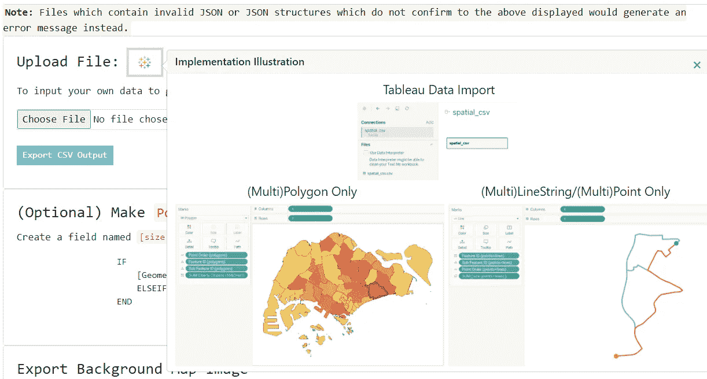**

**作者图片|我在[https://tableau-data-utility.onrender.com/](https://tableau-data-utility.onrender.com/)部署的工具的截图，该工具用于从用户上传的 JSON 文件中为 Tableau 输出 CSV 文件**

**因此，这为我们带来了一个简单但非常有用和方便的应用程序功能——导出 Tableau 的背景地图图像的能力:**

**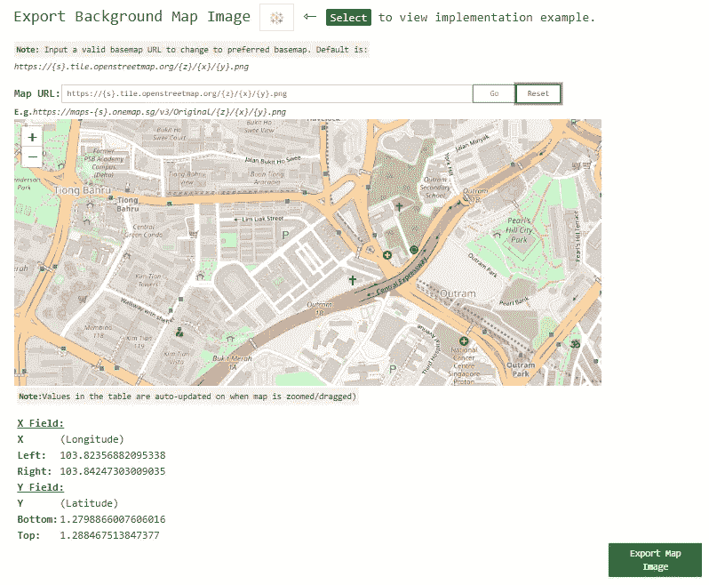**

**作者图片|展示了[网络应用](https://tableau-data-utility.onrender.com/)将地图导出为背景图片的功能**

**这里需要注意几个特殊的子功能:**

1.  ****可更改底图选择**-默认情况下，使用 OpenStreetMap (OSM)的底图。但是，用户可以通过输入有效的底图 URL 来更改底图，如下所示:**

**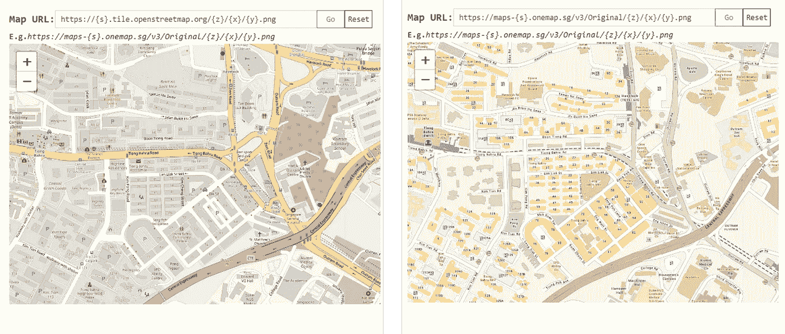**

**作者提供的图片| ( **左**)使用默认底图| ( **右**)使用备选地图服务，即 [OneMap](https://docs.onemap.sg/maps/index.html) —请注意，用户的输入必须与小册子兼容— [XYZ 底图切片服务](https://developers.planet.com/docs/basemaps/tile-services/xyz/)又称滑动地图**

**2.**地图边界的自动显示和更新** —在地图的正下方，有一个坐标表，当地图被缩放或移动时，它会自动更新。**

****

**按作者分类的图像|将背景图像绘制为底图时，这些坐标对应于 Tableau 中的精确坐标**

**因此，要为运输路线导出适当的地图图像，必须确保在地图查看端口中捕获的地图的**缩放级别** l 和**边界**都包括您的几何形状的所需边界。这最终将我们引向:**

**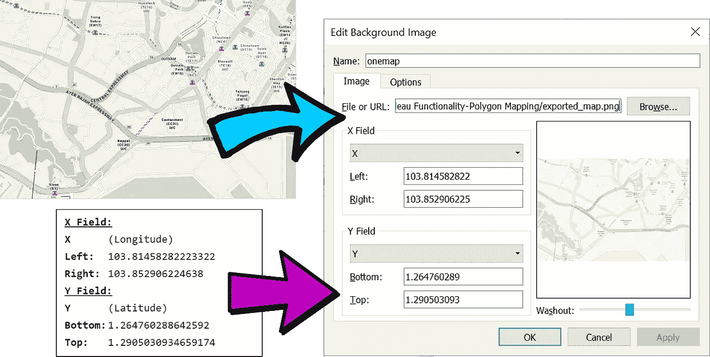**

**作者图片|导出的地图图像和渲染的坐标直接输入到 Tableau 中**

**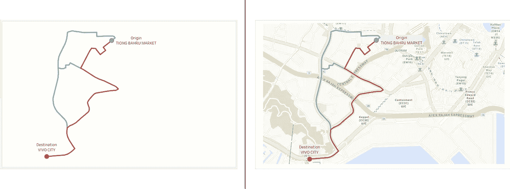**

**图片由作者提供| ( **左侧**)不带底图的路线| ( **右侧**)带有导入的地图图像的路线|清楚地显示了地图图层的细节，上面的起点-目的地路线向查看者显示了哪些道路、街道、建筑物、设施等。就在附近，为进一步的空间分析提供了更多的背景**

**因此，问题 2(缺少底图详细信息)现已解决。**

**最后，虽然我可以在这里结束这篇文章，但我也想分享我从这里得到的另一个启示— **通过 Tableau 中标准功能的组合绘制混合几何类型(“多边形”和“直线”)**。**

# **额外的发现—从单个 CSV 文件在 Tableau 中绘制混合几何图形类型**

**尽管 Tableau 声称有局限性**

> **[连接到混合几何类型](https://help.tableau.com/current/pro/desktop/en-us/maps_shapefiles.htm)**

**我对 Tableau 已经存在的功能的探索表明情况并非如此。Tableau 已经具有渲染混合几何类型的固有功能，我将使用这个空间文件来证明这一点，该文件是通过合并之前的两个 GeoJSON 文件创建的(实际的[文件](https://gist.github.com/incubated-geek-cc/99af3184e8c43e00aca59f18e583a796/raw/d8ce1ed16e045dba9b1bc62aea2c44879639f3b2/merged.geojson)在我的 GitHub 中)。重复相同的步骤— GeoJSON 被转换为 CSV 输出，底图图像通过 https://tableau-data-utility.onrender.com/的[工具导出，这为我们提供了:](https://tableau-data-utility.onrender.com/)**

**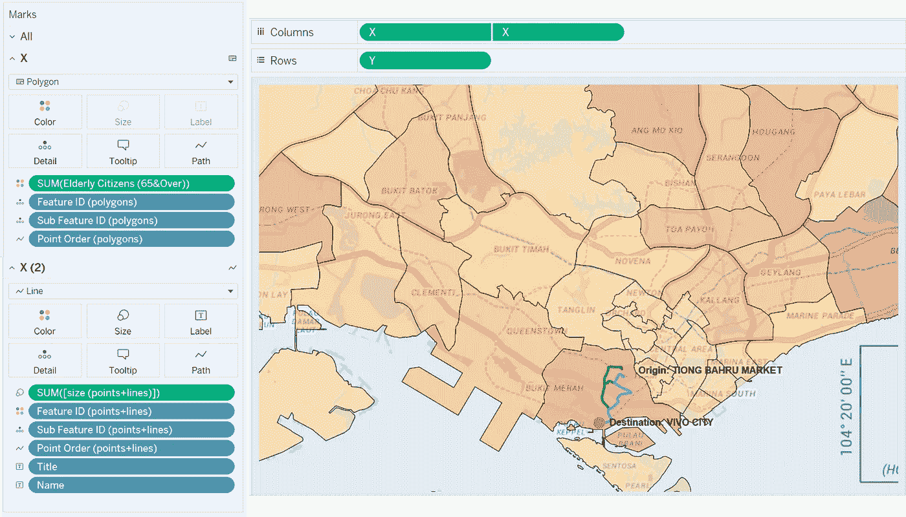**

**作者提供的图片|展示 Tableau 中具有“多边形”和“线”功能的混合几何类型的绘图|多边形和交通路线都在同一视图中呈现**

**需要注意的是，要仔细查看“标记”面板，因为每个必填字段都有专门的**后缀**，带有“**(点+线)**”或“**(多边形)**”。这是为了区分哪些字段应该由**“线”——即(点+线)**渲染，哪些字段应该由**“多边形”——即(多边形)** *(是的，我部署的工具确实基于几何类型生成字段)*。**

**简而言之，我试图通过其他方式在 Tableau 中呈现空间数据集，这向我展示了使用现有的多种功能进一步可视化的可能性。希望你们觉得这很有用，可以在 https://tableau-data-utility.onrender.com/[使用这个工具来生成你们需要的数据集！](https://tableau-data-utility.onrender.com/)**

**我之前发表的关于渲染网络图数据集的教程使用了部署在[https://tableau-data-utility.onrender.com/](https://tableau-data-utility.onrender.com/)的工具。如果你想在 Tableau 中用最少的努力来绘制网络图，请查看它。感谢阅读！**

** [## 通过我的推荐链接加入灵媒——李思欣·崔

### 获得李思欣·崔和其他作家在媒体上的所有帖子！😃您的会员费直接…

geek-cc.medium.com](https://geek-cc.medium.com/membership)**