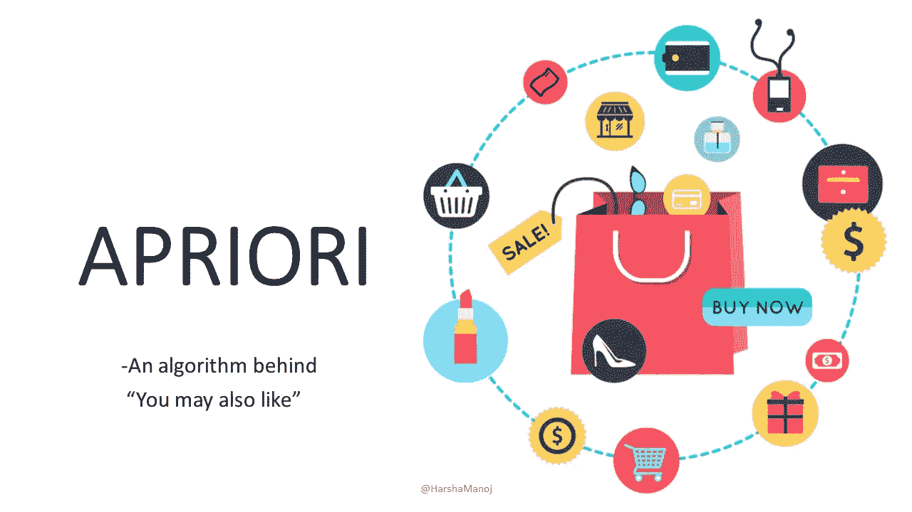
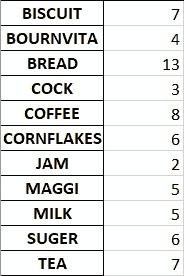
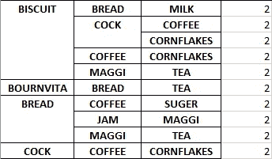
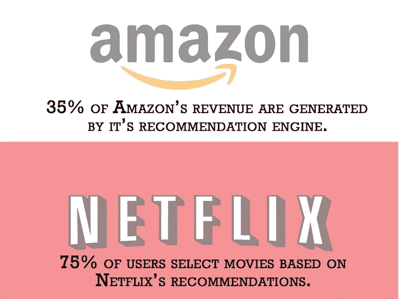

# 被低估的机器学习算法——APRIORI

> 原文：<https://towardsdatascience.com/underrated-machine-learning-algorithms-apriori-1b1d7a8b7bc?source=collection_archive---------3----------------------->

## 使用 Python 从头开始构建分步模块



# 先验导论

Apriori 是一种用于关联规则挖掘的算法。它在数据集中搜索一系列频繁出现的项目集。它建立在项目集之间的关联和相关性上。这是你在推荐平台上常见的“你可能也会喜欢”背后的算法。

# 什么是关联规则挖掘？

关联规则挖掘是数据科学中的重要技术之一。在 ARM 中，在项目集中识别数据集中模式和关联的频率，然后用于预测集合中的下一个相关项目。这种 ARM 技术主要用于根据客户购买情况做出商业决策。

例如:在沃尔玛，如果 Ashok 购买牛奶和面包，他购买黄油的机会是通过关联规则挖掘技术预测的。

> 在本模块中，我们将在给定的数据集上从头开始构建一个 apriori 算法，并将其用作客户购买的推荐系统。

# 有些定义需要记住

在我们开始之前，先看一下下面解释的一些术语。

SUPPORT _ COUNT 项目集出现的事务数。

MINIMUM _ SUPPORT _ COUNT 数据集中项目集的最小频率。

CANDIDATE_SET —数据集中每个项目的 C(k) support_count。

ITEM _ SET-L(k)将候选集支持计数中的每个项目与 minimum_support_count 进行比较，并过滤出不频繁项目集。

支持-数据库中的事务百分比遵循规则。

```
Support(A->B) = Support_count(A U B)
```

信心——购买了 A 的顾客也购买了 b 的顾客的百分比

```
Confidence(A->B) = [Support_count(AUB)/Support_count(A)]*100
```

# 获取数据

在这个实验中，我们考虑了来自 Kaggle 的名为[杂货店数据集](https://www.kaggle.com/shazadudwadia/supermarket)的数据集。它由一家超市的 20 笔一般商品交易组成。这个数据集更容易理解模式和关联。


[杂货店数据集](https://www.kaggle.com/shazadudwadia/supermarket)

在这里，我们可以看到 20 组食品杂货交易，即牛奶、面包、饼干、玉米片、茶、BOURNVITA、果酱、MAGGI、咖啡、公鸡和糖。

> 尽管这个数据集很小，但我们不需要生成参数数据集。这足以开发 Apriori 算法。

# 准备数据

需要处理这些数据以生成记录和项目列表。将 minimum_support_count 视为 2。Pandas 库用于导入 CSV 文件。

> 先决条件:PYTHON 中级
> 
> Geeksforgeeks: [Apriori 算法](https://www.geeksforgeeks.org/apriori-algorithm/amp/)(基于理论)

```
import pandas as pd
import itertoolsdata = pd.read_csv('GroceryStoreDataSet.csv')minimum_support_count = 2
records = []
for i in range(0, 20):
    records.append([str(data.values[i,j]) for j in range(0, 4)])items = sorted([item for sublist in records for item in sublist if item != 'nan'])
```

# 构建算法

让我们在构建算法之前修改 Apriori 的关键属性，

> 频繁项目集的所有子集必须是频繁的。如果一个项目集是不频繁的，那么它的所有超集都是不频繁的。

## 第一步

在阶段 1 中，通过测量数据集中每个项目的 support_count 来生成候选集 C1。通过比较 C1 支持计数和最小支持计数，生成项目集 L1。这里 k=1。

```
def stage_1(items, minimum_support_count):
    c1 = {i:items.count(i) for i in items}
    l1 = {}
    for key, value in c1.items():
        if value >= minimum_support_count:
           l1[key] = value 

    return c1, l1c1, l1 = stage_1(items, minimum_support_count)
```

步骤 1 的结果是项目集 L1，



项目集 L1

在这种情况下，candidate_set 中不存在最小支持计数的低频率项目。因此，候选人集 C1 =项目集 L1。

## 第二步

在此阶段，使用上一步中的项目集 L1 生成候选集 C2。检查项目集中的所有子集是否是频繁的，如果不是，从列表中删除相应的项目集。项目集 L2 是通过将候选集 C2 与最小值支持计数进行比较而生成的。这里 k=2。

```
def stage_2(l1, records, minimum_support_count):
    l1 = sorted(list(l1.keys()))
    L1 = list(itertools.combinations(l1, 2))
    c2 = {}
    l2 = {}
    for iter1 in L1:
        count = 0
        for iter2 in records:
            if sublist(iter1, iter2):
                count+=1
        c2[iter1] = count
    for key, value in c2.items():
        if value >= minimum_support_count:
            if check_subset_frequency(key, l1, 1):
                l2[key] = value 

    return c2, l2c2, l2 = stage_2(l1, records, minimum_support_count)
```

为了检查一个项集的子集是否频繁，我们应该传递当前阶段的项集、前一阶段的项集(在本例中是 L1)和 k-1。

```
def check_subset_frequency(itemset, l, n):
    if n>1:    
        subsets = list(itertools.combinations(itemset, n))
    else:
        subsets = itemset
    for iter1 in subsets:
        if not iter1 in l:
            return False
    return True
```

步骤 2 的结果是项目集 L2，


项目集 L2

在这种情况下，由于低频率类别，即低于 minimum_support_count，需要消除项目集中的 31 个项目。

## 第三步

在此阶段，使用上一步中的项目集 L2 生成候选集 C3。检查项目集中的所有子集是否是频繁的，如果不是，从列表中删除相应的项目集。通过将候选集 C3 与最小支持计数进行比较，生成项目集 L3。这里 k=3。

```
def stage_3(l2, records, minimum_support_count):
    l2 = list(l2.keys())
    L2 = sorted(list(set([item for t in l2 for item in t])))
    L2 = list(itertools.combinations(L2, 3))
    c3 = {}
    l3 = {}
    for iter1 in L2:
        count = 0
        for iter2 in records:
            if sublist(iter1, iter2):
                count+=1
        c3[iter1] = count
    for key, value in c3.items():
        if value >= minimum_support_count:
            if check_subset_frequency(key, l2, 2):
                l3[key] = value 

    return c3, l3c3, l3 = stage_3(l2, records, minimum_support_count)
```

步骤 3 的结果是项目集 L3，



项目集 L3

## 步骤 4

在此阶段，使用上一步中的项目集 L3 生成候选集 C4。检查项目集中的所有子集是否是频繁的，如果不是，从列表中删除相应的项目集。项目集 L4 是通过将候选集 C4 与最小支持计数进行比较而生成的。这里 k=4。

```
def stage_4(l3, records, minimum_support_count):
    l3 = list(l3.keys())
    L3 = sorted(list(set([item for t in l3 for item in t])))
    L3 = list(itertools.combinations(L3, 4))
    c4 = {}
    l4 = {}
    for iter1 in L3:
        count = 0
        for iter2 in records:
            if sublist(iter1, iter2):
                count+=1
        c4[iter1] = count
    for key, value in c4.items():
        if value >= minimum_support_count:
            if check_subset_frequency(key, l3, 3):
                l4[key] = value 

    return c4, l4c4, l4 = stage_4(l3, records, minimum_support_count)
```

步骤 4 的结果是项目集 L4，


项目集 L4

我们可以在这里停下来，因为没有进一步发现频繁子集。

# 生成关联规则

为了生成数据集的关联规则，我们需要计算每个规则的置信度。

```
''' Rule generation of itemset ''''''
Confidence:Confidence(A->B)=Support_count(A∪B)/Support_count(A)Confidence((COCK, COFFEE)->CORNFLAKES) = Support_count(‘COCK’, ‘COFFEE’, ‘CORNFLAKES’)/Support_count(‘COCK’, ‘COFFEE’)'''
```

让我们考虑关联规则的项目集 L3。

```
sets = []
for iter1 in list(l3.keys()):
    subsets = list(itertools.combinations(iter1, 2))
    sets.append(subsets)
```

在 L3 生成的集合上实现关联规则

```
def support_count(itemset, itemlist):
    return itemlist[itemset]list_l3 = list(l3.keys())
for i in range(0, len(list_l3)):
    for iter1 in sets[i]:
        a = iter1
        b = set(list_l3[i]) - set(iter1)
        confidence = (support_count(list_l3[i], itemlist)/support_count(iter1, itemlist))*100
        print("Confidence{}->{} = ".format(a,b), confidence)
```

假设最小置信度为 50%

## 结果

信心('饼干'，'公鸡')--> { '玉米片' } = 100.0
信心('饼干'，'玉米片')- > { '公鸡' } = 66.666666666666666
信心('饼干'，'玉米片')- > { '饼干' } = 100.0
信心('饼干'，'马奇')- > { '茶' } = 100.0
信心('饼干'，'茶')-【信心 奶')- > { '饼干' } = 50.0
信心('面包'，'咖啡')- > { '糖' } = 66.66666666666666666
信心('面包'，'糖')- > { '咖啡' } = 50.0
信心('咖啡'，'糖')- > { '面包' } = 50.0
信心('面包'，'糖')-【MAGGI)-> 茶')- > { '面包' } = 100.0
信心('面包'，'茶')- > {'BOURNVITA'} = 50.0
信心('饼干'，'公鸡')- > { '咖啡' } = 100.0
信心('饼干'，'咖啡')- > { '公鸡' } = 100.0
信心('公鸡'，'咖啡')- > { '饼干' } = 66.66

# 结论

这种关联规则挖掘技术是由亚马逊、网飞、谷歌、Flipkart 和 Spotify 等巨头在其推荐平台中实现的。



[吸气进给](https://inspirationfeed.com/dynamic-content-the-secret-ingredient-for-email-marketing/impact-of-recommendation-engine-on-amazon-and-netflix-3/)

这种算法也用作大多数销售产品组合的折扣营销技术。

今天，我们已经学习了如何构建 Apriori 算法，并在超市的一般杂货数据集上实现关联规则挖掘。

数据集和全部代码可以在我的 [Git 仓库](https://github.com/HarshaManoj/apriori)中找到。