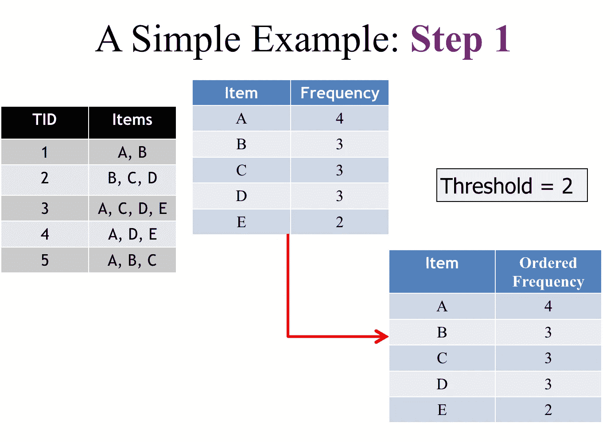
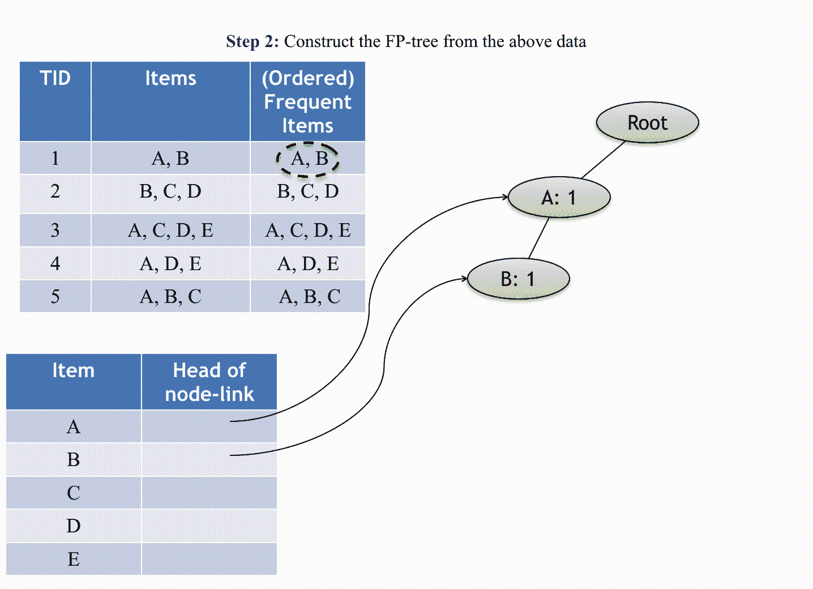
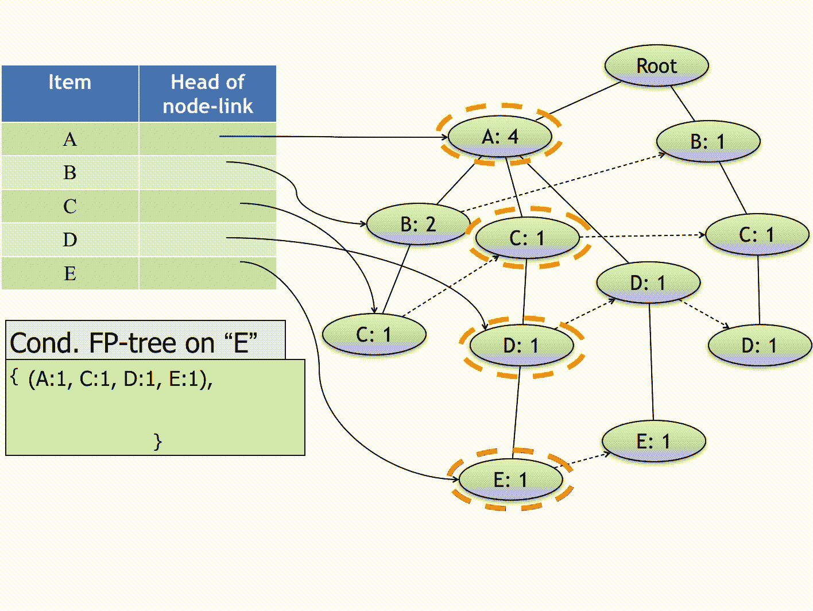
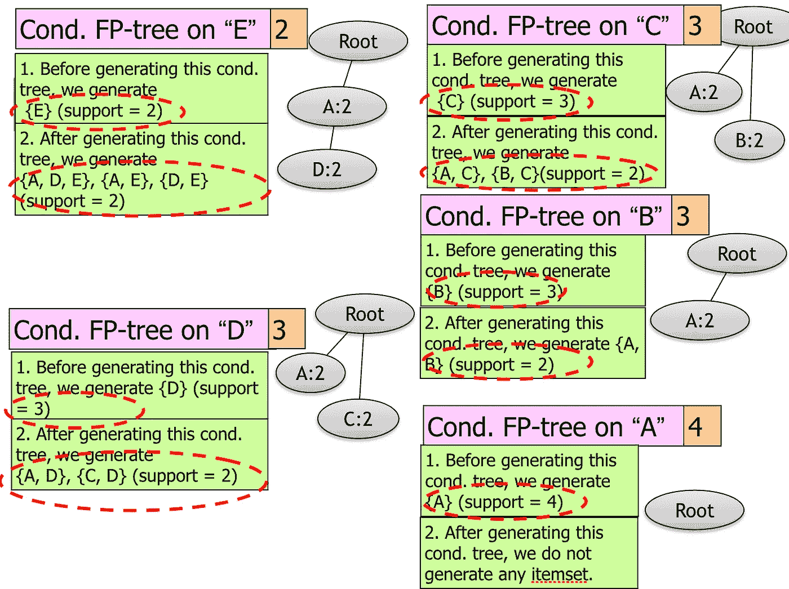

# 理解并在 Python 中构建 FP-Growth 算法

> 原文：<https://towardsdatascience.com/understand-and-build-fp-growth-algorithm-in-python-d8b989bab342?source=collection_archive---------5----------------------->

## Python 中使用 FP-树和条件 FP-树的频率模式挖掘

卢克·理查森在 [Unsplash](https://unsplash.com?utm_source=medium&utm_medium=referral) 上的照片

## 什么是 FP 增长

FP-growth 是 Apriori 算法的改进版本，广泛用于频繁模式挖掘(也称为关联规则挖掘)。它被用作从数据集中发现频繁模式或关联的分析过程。例如，杂货店交易数据可能有一个频繁模式，即人们通常一起购买薯条和啤酒。Apriori 算法通过生成项目集并发现超过阈值“最小支持计数”的最频繁项目集来产生频繁模式。它通过一个简单的原则极大地减小了数据库中项目集的大小:

**如果一个项集是频繁的，那么它的所有子集也一定是频繁的。**

然而，Apriori 算法有一个主要的不足。使用 Apriori 需要多次扫描数据库，以检查每个项目和项目集的支持计数。当数据库很大时，这将消耗大量的磁盘 I/O 和计算能力。因此，FP-Growth 算法被创建来克服这个不足。它只扫描数据库两次，并使用一个树结构(FP-tree)来存储所有的信息。根代表空，每个节点代表一个项，而节点的关联是在形成树时保持顺序的项集。FP-tree 简洁，用于直接生成大项目集。一旦 FP-tree 被构建，它就使用递归的分治方法来挖掘频繁项目集。

## FP-tree 伪代码及解释

*   第一步:推导出有序的频繁项。对于频率相同的项目，按字母顺序排列。
*   步骤 2:从上面的数据构建 FP 树
*   步骤 3:从上面的 FP-tree 中，为每个项目(或项目集)构建 FP-conditional 树。
*   第四步:确定频繁模式。

让我们看一个如何生成 FP 树的例子。查找支持度≥2 的所有频繁项集。首先，找到支持计数≥ 2 的所有项目。

查找项目频率

在构建 FP 树之前，根据项目频率对事务进行重新排序。当开始构建 FP-tree 时，我们需要创建一个标题表，用一个链表记录所有项目节点的位置。每次向树中添加新节点时，都需要将它链接到具有相同项目的最后一个节点。标题表对于在后面的步骤中构建条件 FP-tree 是必不可少的。

构建 FP 树

现在我们已经扫描了数据库两次，并建立了 FP 树。所有交易信息都包含在树中。剩下要做的唯一事情是递归地构造条件 FP-tree，以找到支持计数大于 2 的所有频繁项目集。使用我们在上一步中创建的标题表，从最少次数到最多次数(E，D，C，B，A)的项目开始。

构建一棵条件 FP 树

最后，我们可以很容易地从那些条件 FP 树{E}、{A，D，E}、{A，E}、{D，E}、{D}、{A，D}、{C，D}、{C}、{A，C}、{B}、{A，B}、{A}中生成所有频繁项集。

生成频繁项目集

## Python 实现

下面是一些示例代码，用于从头开始构建 FP-tree，并在 Python 3 中找到所有的频率项集。

总之，FP-tree 仍然是挖掘数据集中完整的频繁模式集的最有效和可伸缩的方法。大多数编程语言包括 Python、R 甚至 Pyspark 都有很好支持的库来生成 FP-tree。

感谢您的阅读，我期待听到您的问题和想法。如果你想了解更多关于数据科学和云计算的知识，可以在 [**Linkedin**](https://www.linkedin.com/in/andrewngai9255/) **上找我。**

杰克·洛里菲茨在 [Unsplash](https://unsplash.com?utm_source=medium&utm_medium=referral) 上拍摄的照片

*参考*

[*https://en.wikipedia.org/wiki/Apriori_algorithm*](https://en.wikipedia.org/wiki/Apriori_algorithm)

[*https://www . software testing help . com/FP-growth-algorithm-data-mining/*](https://www.softwaretestinghelp.com/fp-growth-algorithm-data-mining/)