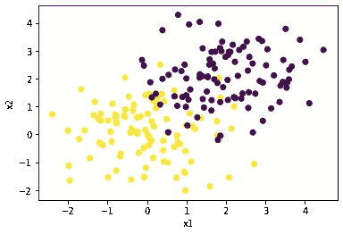
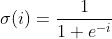
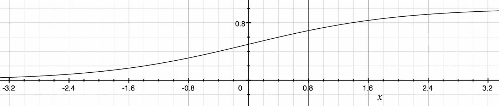
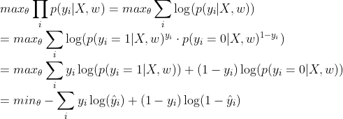
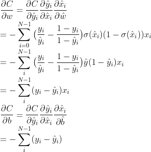
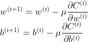
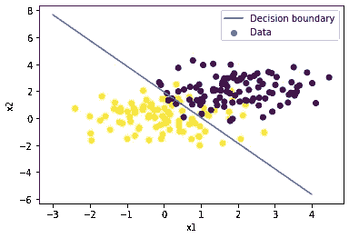

# 从零开始的逻辑回归

> 原文：<https://towardsdatascience.com/understand-and-build-logistic-regression-from-scratch-4ca4a7a40a4?source=collection_archive---------35----------------------->

## 在 NumPy 中从零开始建立逻辑回归。这比你想象的要容易得多！


[的照片](https://pixabay.com/users/Pexels-2286921/)在[的照片](https://pixabay.com/)

在许多方面，逻辑回归模型是数据科学家工具箱中最简单的机器学习分类工具之一。理解这些如何直接工作有助于我们理解用于分类任务的深度神经网络。

在这里，我们将讨论模型的数学，如何训练它，以及如何使用 numpy 在 Python 中构建它。

## 模型背后的数学



让我们首先想象一下，我们有一个像上面这样的数据集，其中黄色点对应于类 0，紫色点对应于类 1。为了预测类标签，我们需要一个模型，它将两个数据维度作为输入，并预测一个介于 0 和 1 之间的数字。考虑这是给定数据和模型参数的标签的概率:ŷ = p( **y =** 1| **X** ， **w** )。

逻辑回归模型旨在拟合两个类别之间的直线(或平面/超平面),以便线上的点的概率为 0.5，而远离线的点的概率为 0 或 1，具体取决于它们位于线的哪一侧。

现在我们理解了这个概念，让我们试着稍微形式化一下。

我们的直线/平面/超平面可以表示为:x̂ = **w** ᵀ **x** + b 其中 **w** 是权重的向量，b 是偏差。

“这很好，但我如何获得分配给标签的概率的封闭形式？”，我听到你问。

很棒的问题！

好了，我们现在需要的是一种方法来映射我们的线性模型到一个有效的概率。这意味着该函数必须具有以下属性:

1.  在给定连续输入的情况下，它只能输出[0，1]范围内的值
2.  它必须是光滑的和可微的(其原因将在后面变得更加清楚)

这就是乙状结肠或逻辑功能发挥作用的地方。sigmoid 函数的图形及其函数形式如下所示。这意味着我们有了一个表示某个点属于某个特定类的概率的表达式。



Sigmoid 激活函数

所以我们整个模型可以表述为:ŷ = σ( **w** ᵀ **x** + b)。

## 训练我们的模型

我们知道模型有能力为两类中的每一类输出一个概率，但是我们如何选择模型的权重( **w** ，b)？

为此，我们需要为模型定义一个成本函数，并根据模型参数最小化该函数。

为我们的模型选择成本函数是为了最大化指定类别的可能性:



从对数似然到二元交叉熵。x 是数据，w 是可训练的权重，ŷ是模型输出，y 是标签。

这种损失也被称为二进制交叉熵。

好消息是，我们就快成功了！我们现在需要使用梯度下降来优化基于成本函数的参数。这种优化过程是训练网络式机器学习模型的最常见方式。它包括计算成本函数相对于每个模型参数的导数——因此，sigmoid 函数的平滑和可微性非常重要。

对于那些懂一点微积分的人来说，你可能知道这是链式法则的一个应用，但多亏了 Geoff Hinton [1]，在机器学习领域，我们称之为反向传播。



成本函数相对于模型参数的梯度。如果你想自己证明一个 sigmoid 函数的导数是σ(1-σ)，我推荐[这篇](/derivative-of-the-sigmoid-function-536880cf918e)文章。

既然我们有了关于模型权重的梯度，我们可以采取小的步骤来降低成本函数。μ是指算法的学习速率。如果学习率太小，模型的训练时间就会太长，并且可能会陷入局部极小值。如果它太大，那么训练过程可能根本不收敛或者它可能收敛到一个差的最小值。



更新模型的权重。I 表示反向传播算法的第 I 次迭代。

如果我们有很多数据，我们可以创建小批量，并为训练数据中的每个批量采取一个步骤。或者，我们可以选择更简单的方法，计算整个数据集的成本函数，并在每个时期采取一个梯度步骤。我们重复计算成本、梯度，然后更新权重的过程，直到成本函数收敛。

## 从逻辑回归到深度神经网络

正如我们刚刚看到的，逻辑回归将线性模型拟合到数据，并将输出传递给 sigmoid 激活，以预测每个类别的概率。

如果我们想要从输入维度到输出维度进行更复杂的映射，那么我们可以在逻辑回归层之前添加额外的转换。为了训练这些层的权重，我们可以使用相同的反向传播原理来找到这些权重的梯度，并以与我们之前完全相同的方式更新它们。

## 代码

这是理论，但我们如何把它付诸实践呢？

让我们实现向前传递，用模型进行预测。

```
import numpy as npdef _sigmoid(x):
    return 1/(1 + np.exp(-x))def predict(X,W):
        X = np.asarray(X)
        if len(X.shape) != 2:
            raise ValueError("Shape must be (dims,n_data_points)")
        X = np.concatenate([X,np.ones([1,X.shape[-1]])],axis=0) X_hat = np.matmul(W,X)
        y_hat = _sigmoid(X_hat)

        return y_hat
```

在实施过程中，有两件事需要特别注意:

首先，我们没有包括单独的偏差，而是做了一个小小的简化，增加了一个额外的权重，并将 1 附加到特征维度的数据上。这使得我们有一个单一的权重向量，而不是两个。对于读者来说，这是一个练习(因为你已经读得太久了)，以检查简化后的梯度是否仍然正确。

其次，请注意，在数据点上没有循环，相反，计算是矢量化的，以提高性能。这通常在机器学习中很重要，以便在训练期间可以利用 GPU 的能力，但对于这个更简单的模型来说不是必要的。

现在让我们定义成本函数…

```
cost = -np.sum(y*np.log(y_hat) + (1-y)*np.log(1-y_hat))
```

…梯度下降步骤:

```
dc_dw = -np.sum((y-y_hat)*X,axis=-1)[np.newaxis,:]
self.W = self.W - dc_dw * lr
```

我们现在可以用一个类中的`fit`和`predict`方法来模仿 sk-learn 类型的 API。

```
class LogisticRegressor():
    def __init__(self):
        self.loss = []
        self.W = None

    def _sigmoid(self,x):
        return 1/(1 + np.exp(-x))def fit(self,X:np.ndarray,y:np.ndarray,epochs: int=100,lr: float=0.01):
        self.epochs = epochs
        self.lr = lr
        X = np.asarray(X)
        y = np.asarray(y)
        if len(X.shape) != 2:
            raise ValueError("Shape must be (dims,n_data_points)")
        X = np.concatenate([X,np.ones([1,X.shape[-1]])],axis=0)
        dims, n_data_points = X.shape

        if self.W is None:
            self.W = np.random.randn(1,dims)

        for i in range(epochs):
            X_hat = np.matmul(self.W,X)
            y_hat = self._sigmoid(X_hat)

            cost = -np.sum(y*np.log(y_hat) + (1-y)*np.log(1-y_hat))
            self.loss.append(cost)

            dc_dw = -np.sum((y-y_hat)*X,axis=-1)[np.newaxis,:]
            self.W = self.W - dc_dw * self.lr

    def plot_loss(self):
        plt.scatter(list(range(len(self.loss))),self.loss)

    def predict(self,X:np.ndarray)-> np.ndarray:
        X = np.asarray(X)
        if len(X.shape) != 2:
            raise ValueError("Shape must be (dims,n_data_points)")
        X = np.concatenate([X,np.ones([1,X.shape[-1]])],axis=0) X_hat = np.matmul(self.W,X)
        y_hat = self._sigmoid(X_hat)

        return y_hat
```

让我们来测试一下！以本文开头所示的模拟数据集为例，我们已经准备好测试我们的模型…



在这种情况下，我们已经可视化了两个类之间的决策边界。这可以在分类器预测 0.5 概率的地方找到。换句话说，就是 **w** ᵀ **x** + b = 0 的那条线。所以我们的努力看起来是有回报的，我们的模型可以正确识别 0.89%的数据点，并在对接近决策边界的点进行分类时具有表达不确定性的能力！

## 那么，我们学到了什么？

如果你已经做到了这一步，那么希望你能更好地理解逻辑回归是如何工作的，以及为什么二元交叉熵只是表达模型预测的对数似然性的一种不同方式。

训练逻辑回归模型允许我们尝试反向传播，这为理解如何训练更复杂的深度神经网络提供了基础。

[1]:鲁梅尔哈特博士、辛顿博士和威廉斯博士，1986 年出版。通过反向传播误差学习表征。*自然*，323(6088)，第 533–536 页。