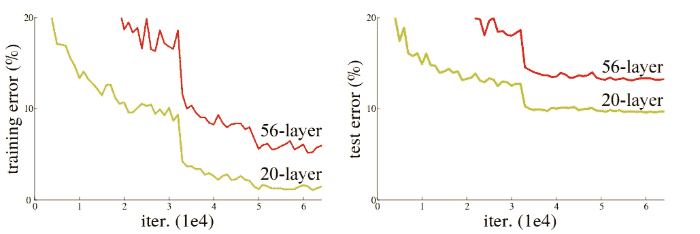
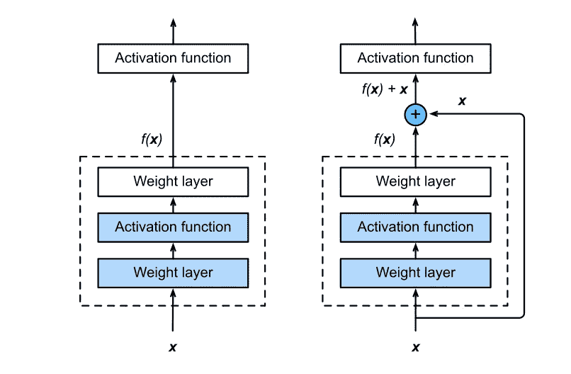
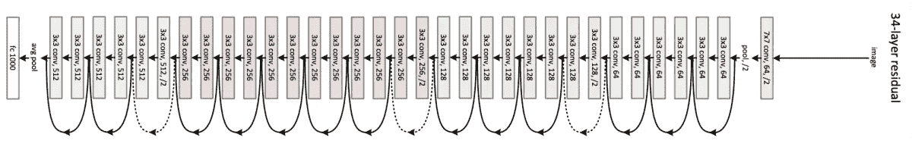
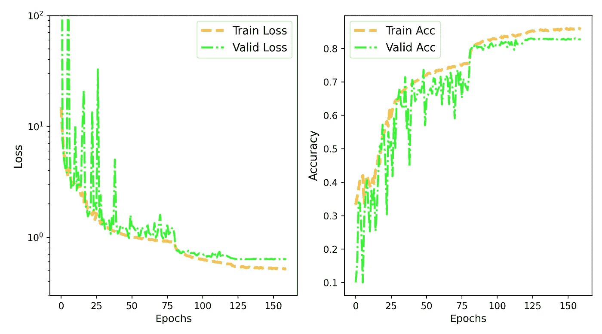
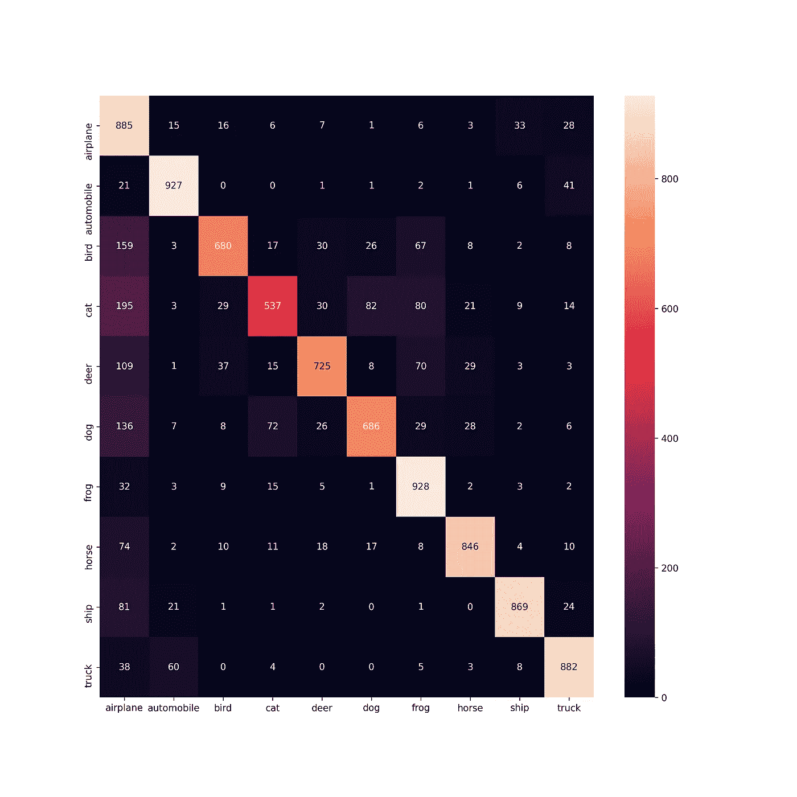

# 理解并使用 TensorFlow 2.0 实现 ResNet-50

> 原文：<https://towardsdatascience.com/understand-and-implement-resnet-50-with-tensorflow-2-0-1190b9b52691?source=collection_archive---------3----------------------->

## 基于深度神经网络的图像分类

京都的清晨:来源(作者)

我们的直觉可能表明，较深的神经网络应该能够捕捉更复杂的特征，因此与较浅的神经网络相比，它们可以用于表示更复杂的功能。应该出现的问题是——如果学习一个更好的网络就等同于越堆越多的层？这种方法有什么问题和好处？这些问题和一些非常重要的其他概念在 2017 年 K. He 等人的[用于图像识别的深度残差学习](https://arxiv.org/pdf/1512.03385.pdf)论文中讨论过。这种架构被称为 ResNet，本文介绍了许多与深度神经网络(DNN)相关的重要概念，这些都将在本文中讨论，包括在 TensorFlow 2.0 中实现 50 层 ResNet。你可以从这篇文章中学到什么—

1.  深度神经网络的问题。
2.  ResNet 背后的数学直觉。
3.  剩余块和跳过连接。
4.  构造 ResNet 和 1×1 卷积的重要性。
5.  用 TensorFlow 实现 ResNet。

我们开始吧！

**使用`tf.data`的图像分类管道的更快版本在这里[讨论](/time-to-choose-tensorflow-data-over-imagedatagenerator-215e594f2435)。

## 退化问题:

ResNet 最初工作的主要动机是解决深层网络中的退化问题。向足够深的神经网络添加更多层将首先看到精度饱和，然后精度下降。何等人展示了以下使用普通网络的 Cifar-10 数据集的训练和测试误差图

图 1:在平原 DNN，Cifar-10 数据的分类误差随着训练(左)和测试数据(右)的层数的增加而增加。参考:[1]

正如我们可以看到的，较深网络(56 层)的训练(左)和测试误差(右)高于 20 层网络。深度越大，历元越多，误差越大。首先，似乎随着层数的增加，参数的数量也增加，因此这是一个过拟合的问题。但其实不是，我们来理解一下。

思考这个问题的一种方式是考虑深度 DNN，它可以计算手头任务所需的足够强的特征集(例如:图像分类)。如果我们在已经非常 DNN 的基础上再增加一层网络，这一层会有什么作用呢？**如果网络已经可以计算强特征，则该附加层不需要计算任何额外的特征，而是，仅复制已经计算的特征，即*执行身份映射*(添加层中的内核产生与先前内核完全相同的特征)**。这似乎是一个非常简单的操作，但在一个深层的神经网络中，这与我们的预期相差甚远。

## ResNet 背后的数学直觉:

让我们考虑一个包括学习率和其他超参数的 DNN 架构，它可以达到一类函数 *F* 。因此，对于所有的 *f∈ F，*存在参数 *W* ，我们可以在针对特定数据集训练网络之后获得这些参数。如果 *f** 表示我们真正想要找到的函数(最佳可能优化的结果)，但是如果它不在 *F* 内，那么我们试图找到在 F 内的最佳情况 *f1，*，如果我们设计一个更强大的架构 G，我们应该会得到更好的结果 *g1* ，这比 *f1* 更好。但是如果 f·⊈g，那么就不能保证上述假设会成立。事实上 *g1* 可能比 *f1* 更差，这是退化问题。所以要点是——*如果更深的神经网络函数类包含更简单和更浅的网络函数类，那么我们可以保证更深的网络将增加原始浅网络的特征发现能力。*一旦我们在下一节介绍残差块，这将变得更加清楚。

## 剩余块:

剩余块的想法完全基于之前解释的直觉。较简单的函数(较浅的网络)应该是复杂函数(较深的网络)的子集，以便可以解决退化问题。让我们考虑输入 *x* ，并且从输入到输出的期望映射由 *g(x)* 表示。我们将处理一个更简单的函数 *f(x) = g(x)-x* ，而不是处理这个函数。然后，原始映射被重新转换为 *f(x)+x* 。在 ResNet 论文中 He et al. ***假设优化残差 f(x)比优化原 g 本身更容易。*** 优化残差还考虑到了这样一个事实，即我们不需要担心在非常深的网络中可怕的身份映射 *f(y)→ y* 。让我们看看下面剩余部分的示意图—

图 2:用于身份映射的剩余块和跳过连接。已重新创建以下引用:[3]

残差学习公式确保当恒等式映射是最优的(即 *g(x) = x* )时，该优化将使残差函数的权重趋向于零。ResNet 由许多残差块组成，其中残差学习被采用到每几个(通常 2 或 3 层)堆叠层。构建模块如图 2 所示，最终输出可以认为是 *y = f(x，W) + x* 。这里的 *W 的*是重量，这些是在训练中学会的。运算 *f + x* 通过快捷方式(“跳过”2/3 层)连接和元素相加来执行。这是一个最简单的块，跳过连接中不涉及任何附加参数。只有当 *f* 和 *x* 的尺寸相同时，元素相加才是可能的，如果不是这种情况，那么我们将输入 *x* 乘以投影矩阵 *Ws，*使得 *f* 和 *x* 的尺寸匹配。在这种情况下，输出将从之前的等式变为 *y = f(x，W) + Ws * x* 。投影矩阵中的元素也是可训练的。

## 构建 ResNet 和 1× 1 卷积:

我们将按照何在原论文中所采用的方法建立一个 50 层的 ResNet。ResNet-50 采用的体系结构不同于 34 层体系结构。快捷连接跳过了 3 个街区而不是 2 个，下面的示意图将帮助我们澄清一些问题-

图 3:左:跳过 2 层，ResNet-34。右图:跳过 3 层，包括 ResNet-50 中的 1× 1 卷积。参考:[1]

在 ResNet-50 中，残差块中的堆叠层将始终具有 1×1、3×3 和 1×1 卷积层。1×1 卷积首先降低维度，然后在瓶颈 3×3 层中计算特征，然后在下一个 1×1 层中再次增加维度。使用 1×1 过滤器来减少和增加瓶颈层前后的特征图的维度，如 Szegedy 等人在其[初始论文](https://arxiv.org/abs/1409.4842)中的 GoogLeNet 模型所述。由于残差块内没有汇聚层， ***用步长 2*** 进行 1×1 卷积降维。记住这几点，让我们使用 TensorFlow 2.0 构建 ResNet-50。

## 建筑 ResNet-50:

在编码之前，让我们看看原始论文中呈现的 ResNet-34 架构—

ResNet-34(摘自 K. He 等人的《[深度剩余学习](https://arxiv.org/abs/1512.03385)》)

*仅池化层放置在架构末端的最开始和密集连接之前。*如前所述，使用 1×1 卷积来改变其他地方的尺寸。对于过滤器的数量和其他参数，我遵循了 [Keras 的例子](https://keras.io/examples/cifar10_resnet/)。现在是编码的时候了。首先，我们定义一个最简单的单位块，其中输入的维度不变，只有深度，下面是代码块-

最简单的残余块，尺寸没有任何变化，只有深度。

通过使用步长为 2 的 1×1 卷积，另一个残差块将包括输入维度的变化。因此，跳过连接也将经历尺寸变化——

与步幅 2 卷积。输入变化的维度

结合这两个剩余模块，我们现在可以构建完整的 50 层 ResNet，如下所示

使用 64，160 个时期的批量大小和数据扩充，在训练数据和测试数据上实现了 85%和 82%的准确度。下面是训练和验证曲线—

示出了 Cifar-10 数据 50 层 ResNet 的训练和验证精度/损失。(来源:作者)

此外，可以绘制 Cifar-10 数据中所有 10 个类别的混淆矩阵

使用 ResNet-50 训练的用于 Cifar-10 数据的 CM。(来源:作者)

## 讨论:

在这里，我们看到了一个使用 TensorFlow 实现 ResNet-50 并使用 Cifar-10 数据训练模型的示例。一个重要的讨论点是卷积-批处理-激活的顺序，这仍然是一个争论点。许多人认为最初的[批次标准文件](https://arxiv.org/abs/1502.03167)中使用的顺序不是最好的。看 GitHub 的一个问题[这里](https://github.com/titu1994/Wide-Residual-Networks/issues/4)。我建议您尝试不同于笔记本中使用的参数，以了解它们的效果。

你能从中得到的几个要点是—

1.  退化和过度拟合之间的区别以及为什么退化发生在非常深的网络中。
2.  使用 1×1 卷积来增加和减少特征图的维数。
3.  残余块如何有助于防止退化问题？

暂时就这样吧！希望这能帮到你一点，保持坚强！！

页（page 的缩写）如果你想使用`tf.data`建立一个更快的图像分类管道，那么查看[这篇文章](/time-to-choose-tensorflow-data-over-imagedatagenerator-215e594f2435)。

## 参考:

[1] [ResNet 原创论文](https://arxiv.org/abs/1512.03385):何等。

[2] [Keras 示例实现](https://keras.io/examples/cifar10_resnet/)。

[3] Alex Smola: [ResNet 直觉讲座](https://www.youtube.com/watch?v=lugkZaFj4x8)

[4]笔记本所用代码: [GitHub Link](https://github.com/suvoooo/Learn-TensorFlow/blob/master/resnet/Implement_Resnet_TensorFlow.ipynb) 。

***如果你对更深入的基础机器学习概念感兴趣，可以考虑加盟 Medium 使用*** [***我的链接***](https://saptashwa.medium.com/membership) ***。你不用额外付钱，但我会得到一点佣金。感谢大家！！***

 [## 通过我的推荐链接加入媒体

### 更多来自 Saptashwa(以及 Medium 上的许多其他作者)。你的会员费直接支持 Saptashwa 和其他…

medium.com](https://medium.com/@saptashwa/membership?source=publishing_settings-------------------------------------)