# 了解并可视化色彩空间，以改进您的机器学习和深度学习模型

> 原文：<https://towardsdatascience.com/understand-and-visualize-color-spaces-to-improve-your-machine-learning-and-deep-learning-models-4ece80108526?source=collection_archive---------12----------------------->

## 解释、分析和实验 14 种流行的颜色空间以及它们对我们模型的准确性的影响。

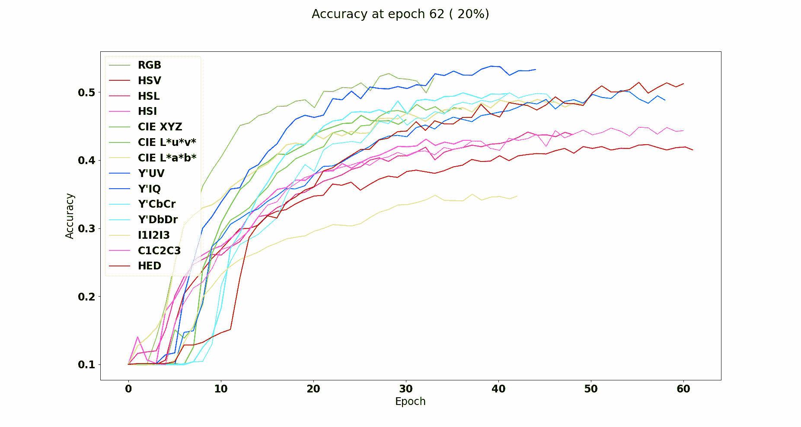

不同色彩空间的模型训练(自制测试)

# 介绍

> “为什么我们在训练模型中使用 RGB 颜色空间作为标准？当然，这是最简单的颜色空间，因为它是默认的颜色空间。但是有没有其他可能更合适的色彩空间呢？它能改善我们的模型吗？”

这些问题浮现在我的脑海中，我必须找到答案。于是我**调查了**，做了一些**实验**。我愿意**与你分享我的成果**。💭

起初，我从探索不同的色彩空间开始，我发现**启发了**。所以在这篇文章的第一部分，我将**向你简要介绍**这些颜色空间以及它们在机器学习和深度学习中的**可能的应用。**

有大量(无限)的颜色空间，所以我为你选择了最有趣的颜色空间。😇

*   RGB - CMYK
*   国际照明委员会 XYZ -国际照明委员会 L*a*b -国际照明委员会 L*u*v
*   HSV- HSL- HSI
*   YCbCr - YDbDr
*   C1C2C3 - I1I2I3
*   皮肤单位剂量

在这篇文章的第二部分，我用**相同的型号**和**相同的配置**体验了**这些色彩空间。我们会看到，从一个颜色空间到另一个颜色空间，我们的模型的精度可以从简单到两倍。**

# RGB — BGR —CMYK

那么一张 **RGB** 的图像是如何构造的呢？基本上是通过**加上**不同“比例”的红绿蓝。但是我想我不会告诉你比你已经知道的更多的东西。你添加的颜色越多，你得到的颜色就越浅。这是因为它们发出光(这是同样的原理，我们可以通过仔细观察屏幕来观察)。

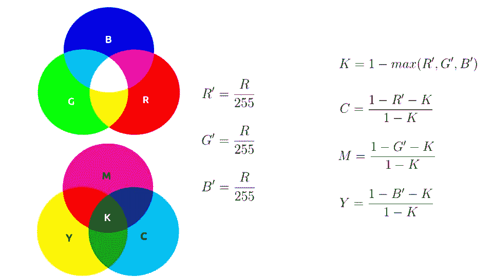

RGB 和 CMYK —转换

这与原色**反光**不同。它是反向机制，即**减法**。你把颜色加在一起越多，你得到的颜色就越暗。这是用于打印、 **CMYK** (青色、洋红色、黄色和黑色)的**系统。**

那么**为什么**是 RGB 呢？事实是，你想要多少颜色空间就有多少颜色空间。我们将看到我们如何建造它们。但是 RGB 是关于简单的**。我们的**电脑硬件**就是这样组成的。**

**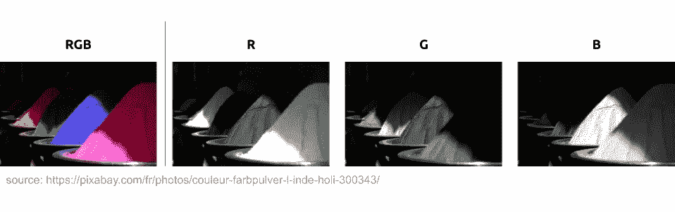**

**RGB 分解(来源: [Pixabay](https://pixabay.com/fr/photos/couleur-farbpulver-l-inde-holi-300343/)**

**RGB 是**默认的颜色空间**，即使在机器学习和深度学习中也是如此。但是看一看**的替代品**。**

# **XYZ 国际照明委员会—国际照明委员会 L*a*b —国际照明委员会 L*u*v**

**我们看到 RGB 是面向**设备的**。国际照明委员会 **CIE** 因其法语名称“Commission International e de l ' eclairage”而设立了色度学标准**。它设计了更抽象的色彩空间**来打破 RGB 标准的界限**。****

**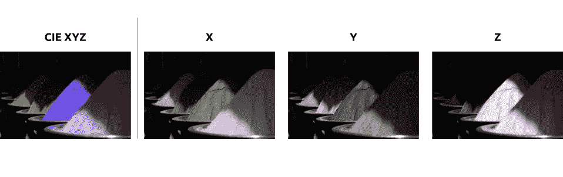**

**CIE XYZ 分解(来源: [Pixabay](https://pixabay.com/fr/photos/couleur-farbpulver-l-inde-holi-300343/)**

**编码在 3 个字节上的 RGB 空间允许表示人眼能够感知的 **40%** 的颜色。这就是为什么 CIE 建议用颜色空间来扩展人类实际感知的可能性领域。因此有了颜色空间 **CIE XYZ** 。它将颜色空间的边界扩展到**包含所有可见的**。如果我们简化一下:**

*   **x 大致对应于**红色**刺激**
*   **y 或多或少对应于**亮度****
*   **z 大致对应于**蓝色**刺激**

**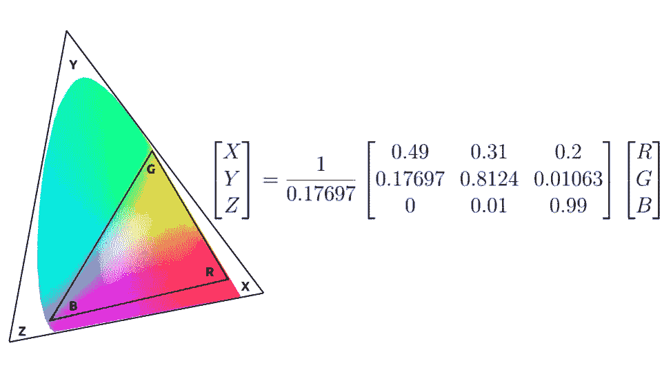**

**RGB 和 CIE XYZ——转换和模式(来源:[维基百科](https://fr.wikipedia.org/wiki/CIE_xy)**

**看一看原理图和我们从一个色彩空间切换到另一个色彩空间的方式，你就会理解**两个关键要素**:**

*   **三种“原色”的任何选择只能产生一个可用颜色的子集**。****
*   ****有一个矩阵通道有无限个不同的颜色空间****

****CIE XYZ 空间是一个**工具空间** e，作为其他空间的支持:CIE L*a*b 和 CIE L * u * v**将会很有趣，因为它引入了**亮度**的概念。******

**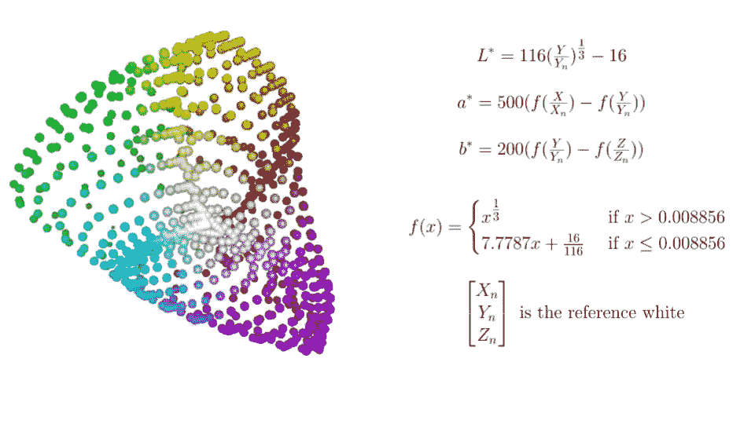**

**RGB 和 CIE L*a*b*—转换和模式(来源:[维基百科](https://fr.wikipedia.org/wiki/L*a*b*_CIE_1976))**

**眼睛有三个不同的视锥细胞来感知颜色。一个红色，一个绿色，一个蓝色。但是这些视锥细胞没有同样的**反应**。所以对颜色的**感知**不同于真实的颜色(用波长来说)。CIE L*a*b*颜色空间试图扭曲 CIE XYZ 空间以**更好地代表人眼的颜色感知**:**

*   ***L** 为**亮度**黑色→白色**
*   ***a** 表示**轴上的值绿色→红色**；**
*   ***b** 表示**轴上的数值蓝色→黄色**。**

**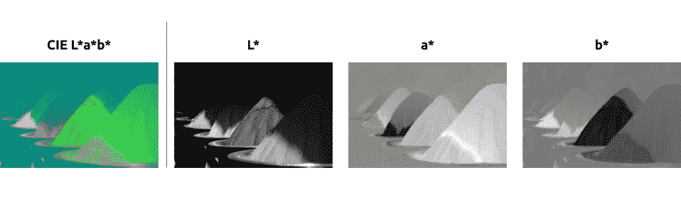**

**CIE L*a*b*分解(来源: [Pixabay](https://pixabay.com/fr/photos/couleur-farbpulver-l-inde-holi-300343/)**

**为了训练学习模型，CIE L*a*b 可能是合适的。这一点可以从威尔逊·卡斯特罗的论文中看出，他们试图根据成熟程度对好望角醋栗进行分类。他和他的团队尝试了 SVM，安，DT 和 KNN。在这些模型中的每一个上，CIE L*a*b*色彩空间被证明比 RGB 色彩空间**更有效。****

**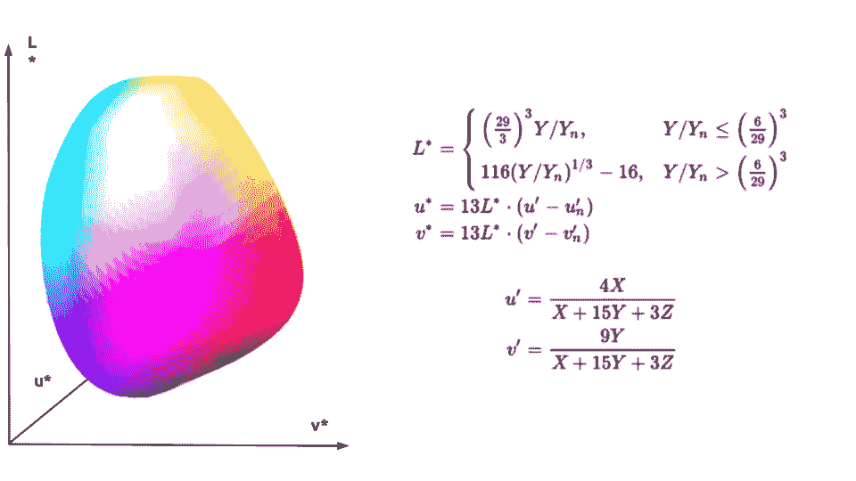**

**RGB 和 CIE L*u*v* —转换和模式(来源:[维基百科](https://en.wikipedia.org/wiki/CIELUV)**

**最后，CIE L*u*v*空间是接近人眼感知的另一种尝试。它的优点是善于表现**自然场景**的图像。颜色距离更容易估计，尤其是**绿色**之间的距离。在 M.P. Rico-Fernándeza 的论文中，他们使用 SVM 方法对栽培物种进行分类，CIE L*u*v*颜色空间使得精确度更高。**

**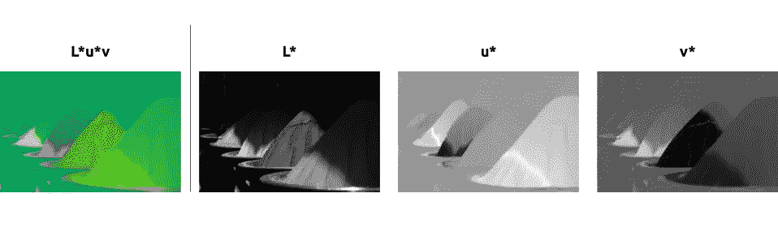**

**CIE L*u*v*分解(来源: [Pixabay](https://pixabay.com/fr/photos/couleur-farbpulver-l-inde-holi-300343/) )**

# **HSV- HSL- HSI**

**其他颜色空间基于**心理学方法**。这是 **HSV** 、 **HSL** 和 **HSI 空间**的情况。所有这些都基于**色彩心理学**的概念，这是**解释你所看到的**的最佳方式:**

*   ****色调**:主色调**
*   ****饱和度**:颜色的纯度**
*   ****亮度**:颜色的亮度**

**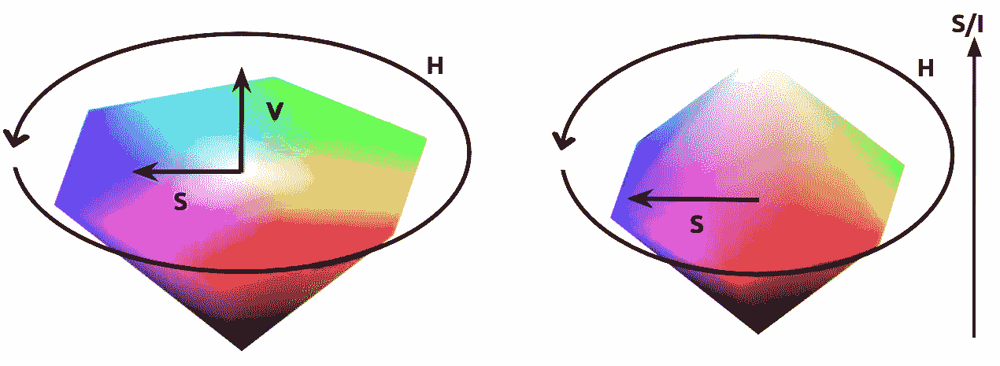**

**模式 HSV-HSL-HSI(来源: [mathworks](https://www.mathworks.com/matlabcentral/mlc-downloads/downloads/submissions/28790/versions/5/previews/colorspace/colorspace.html) )**

**这些颜色空间被称为**圆柱形**，因为它们由围绕色调的圆柱形或**圆锥形**形状**表示。所有这些空间都有相同的基础:代表主要波长的色调。****

**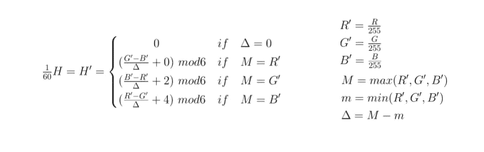**

**RGB —色调转换**

**但是这些空间偏离了亮度的定义。**

*   ****值**对应最强**震级****
*   ****亮度**对应于星等的**范围****
*   ****强度**对应于**平衡的**星等**

****

**RGB 值亮度强度转换**

****饱和度**因此也根据亮度的定义而有不同的定义。**

****

**RGB —饱和度转换**

**这三个色彩空间都有这个基础:色彩心理学。这有助于**轻松设定亮度阈值**。在机器人学中，可以使用这个颜色空间。作为例子，我们可以看看 L. Nalpantidis 写的论文。他们使用 HSV 颜色空间来设计立体摄像机系统，并考虑到了**非理想照明条件**。**

**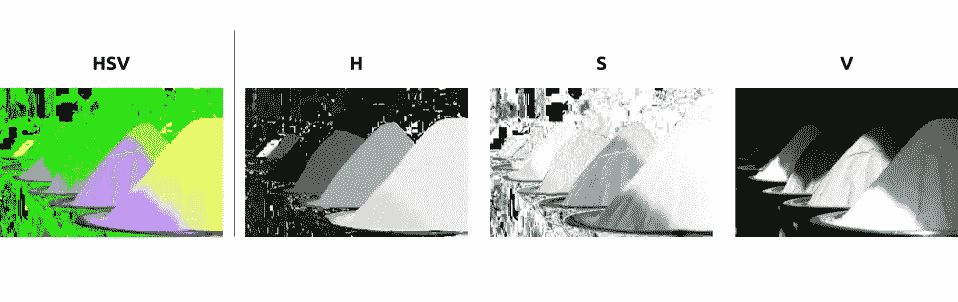**

**HSV 分解(来源: [Pixabay](https://pixabay.com/fr/photos/couleur-farbpulver-l-inde-holi-300343/) )**

**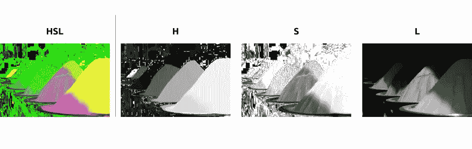**

**HSL 分解(来源: [Pixabay](https://pixabay.com/fr/photos/couleur-farbpulver-l-inde-holi-300343/) )**

**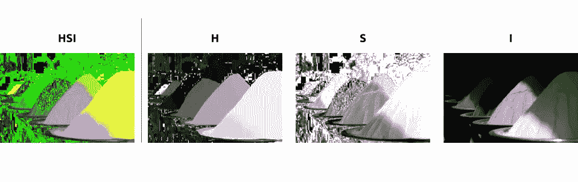**

**HSI 分解(来源: [Pixabay](https://pixabay.com/fr/photos/couleur-farbpulver-l-inde-holi-300343/) )**

# **Y'UV — Y'IQ — Y'CbCr — Y'DbDr**

**这些色彩空间生来就有野心**压缩视频传输所涉及的带宽**。我们以 Y'CbCr 为例。该色彩空间是一种标准，旨在确保与黑色&白色和彩色电视兼容。**

****

**寻找色度的比例校正思想**

**所以你有一个信号**Y’**，它代表黑白的**亮度**。然后使用两个 **chromas** 传输颜色信息的另外两个组件:蓝色 **Cb** 和红色 **Cr** 。它允许**从 B & W 彩色图像中恢复丢失的信息**。但实际上，磷光体(为电视屏幕着色)的效率不是线性的，因此我们应用**校正系数**。**

**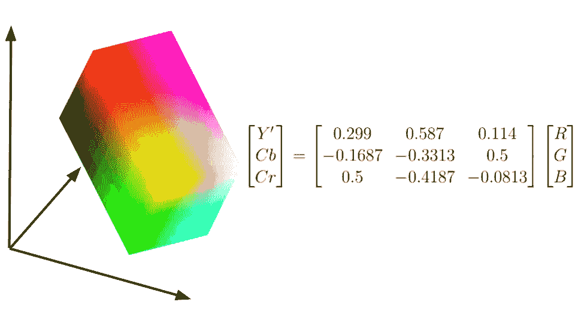**

**RGB 和 YCbCr——转换和模式(来源:[维基百科](https://en.wikipedia.org/wiki/Talk%3AYCbCr)**

**几个标准都有相同的亮度 Y’和校正基础，有两种色度:**

*   ****Y'UV** (模拟格式 PAL)**
*   ****Y'IQ** (模拟格式 NTSC)**
*   ****Y'CbCr** (数字格式，JPEG……)**
*   ****Y'DbDr** (模拟格式 SECAM)**

**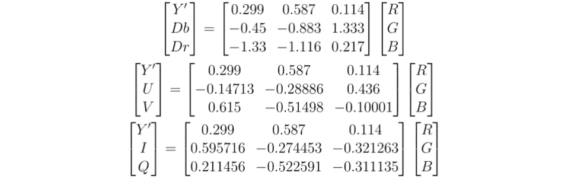**

**RGB — Y'DbDr - Y'UV - Y'IQ 转换**

**因此，所有这些空间都或多或少有些相似，但也能在我们的模型中扮演重要角色。A. M. Aibinu 的论文表明，与 RGB 空间相比，基于 YCbCr 色彩空间的人工神经网络对于皮肤检测具有最佳性能。**

**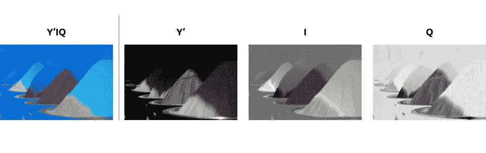**

**Y'IQ 分解(来源: [Pixabay](https://pixabay.com/fr/photos/couleur-farbpulver-l-inde-holi-300343/) )**

**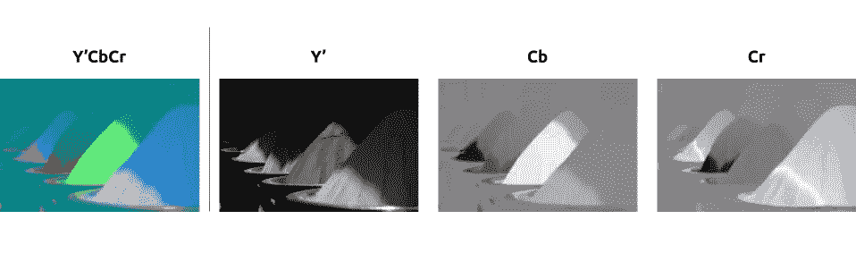**

**Y'CbCr 分解(来源: [Pixabay](https://pixabay.com/fr/photos/couleur-farbpulver-l-inde-holi-300343/) )**

**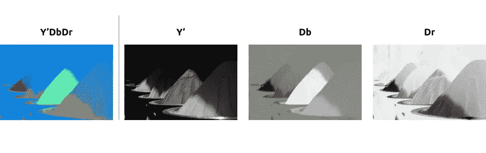**

**Y'DbDr 分解(来源: [Pixabay](https://pixabay.com/fr/photos/couleur-farbpulver-l-inde-holi-300343/) )**

**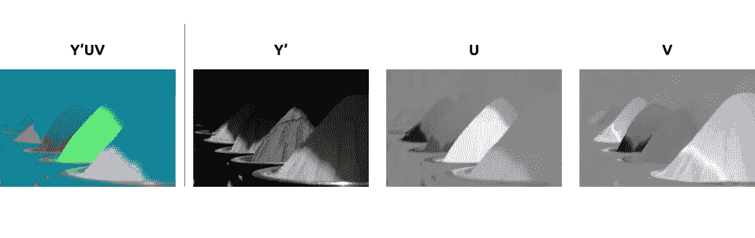**

**Y'UV 分解(来源: [Pixabay](https://pixabay.com/fr/photos/couleur-farbpulver-l-inde-holi-300343/) )**

# **C1C2C3 — I1I2I3**

****I1I2I3** 由 Y-I. Ohta 推出用于**图像分割**。媒体整合与传播中心(MICC)也提出了另一种形式，它建议**不变，以突出效果**。**

**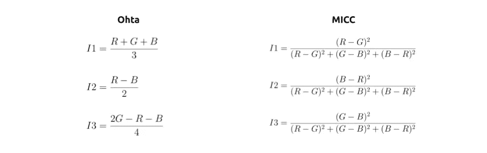**

**RGB — I1I2I3 Otha 和 MICC 转换**

**MICC 还建议 **C1C2C3** 颜色空间对于阴影效果**是不变的。****

****

**RGB — C1C2C3 转换**

**I1I2I3 和 C1C2C3 有时被用作与其他颜色空间的**补充**或**混合**组合，如你在 A. Rasouli 的论文中所见。他和他的团队评估了大量的颜色空间，以测量它们检测和区分不同**颜色物体**的适用性。在所研究的组合中， **C1C2C3 和 XYZ** 的组合效果最好。**

**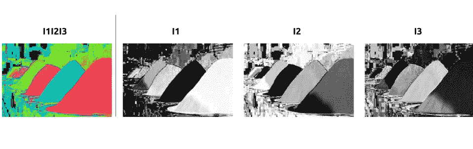**

**I1I2I3 分解(来源: [Pixabay](https://pixabay.com/fr/photos/couleur-farbpulver-l-inde-holi-300343/) )**

**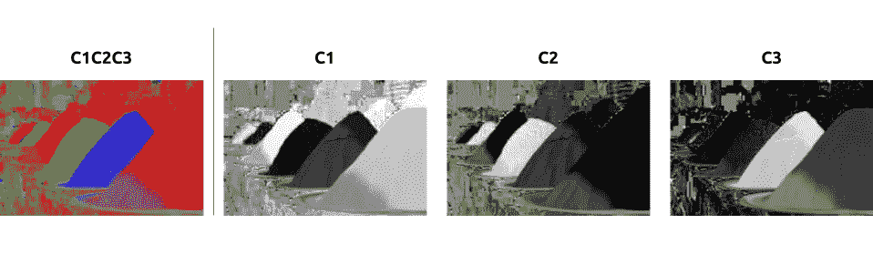**

**C1C2C3 分解(来源: [Pixabay](https://pixabay.com/fr/photos/couleur-farbpulver-l-inde-holi-300343/) )**

**然后我决定测试 MICC 提出的色彩空间。**

# **皮肤单位剂量**

**最后一个。 **HED** 用于**苏木精-伊红-DAB** 是由 A.C.C. Ruifrok 和 D. A. Johnston 设计的颜色空间，用于分析医学领域的特定**组织。****

**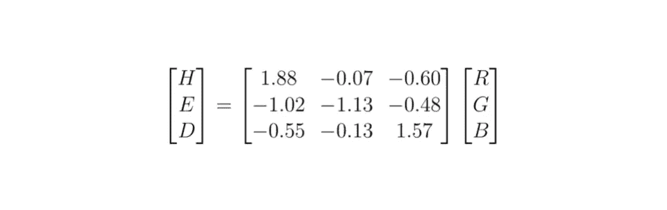**

**RGB-HED 转换**

**这种颜色空间可以通过图像用于血液分析，例如 K. Ben-Suliman 和 A. Krzyżak 的论文处理在显微镜下看到的图像。**

**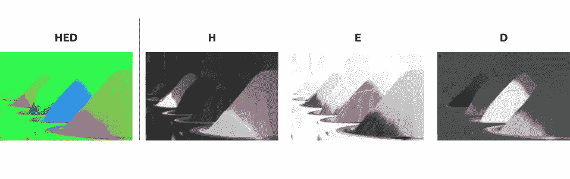**

**HED 分解(来源: [Pixabay](https://pixabay.com/fr/photos/couleur-farbpulver-l-inde-holi-300343/) )**

# **方法**

**现在小旅行结束了，建议你**在**相同条件下**和**尝试这些色空间**评估**对**同型号**的影响。**

**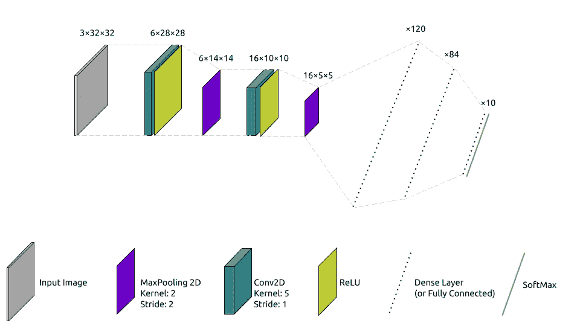**

**模型**

**我决定训练一个 **CNN** ，更准确的说是受到 Yann Le Cun 的 **LeNet5** 的启发。有趣的是，这种模型多年来一直被用来分拣邮件。它被用来识别美国邮政服务手写的邮政编码。**

**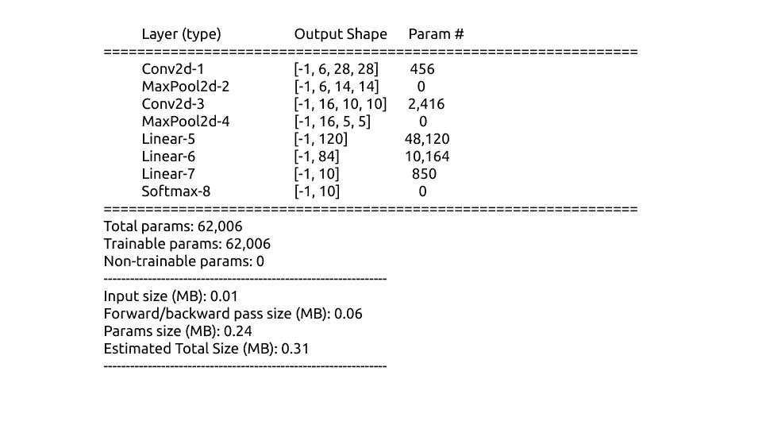**

**模型摘要**

**将使用 **CIFAR-10** 数据库建立分类模型。
培训将在**相同的条件下进行**:**

*   **预处理中输入图像的通道**归一化****
*   **批量:128 个**
*   **损失:分类交叉熵**
*   **优化器:SGD**
*   **学习率:1e-2**
*   **动量:0.9**
*   **混洗数据集:假**
*   **相同的训练和测试集**
*   **度量:准确性**
*   **在**测试集**上每个时期的度量计算**
*   ****每次**度量增加**时，模型被**保存******
*   ****只有当**在 5 个时期**内没有增加，并且如果**度量已经达到 0.11 阈值**时，训练循环才停止，以避免在**启动太慢的情况下停止训练** (0.11，因为有 10 个等级)****

# ****结果和讨论****

********

****根据颜色空间训练模型的进化****

****所以我在完全相同的条件下为这个模型训练了不同的颜色空间。我不想对你撒谎。我暗暗希望 RGB 色彩空间会比其他几个色彩空间**更远。😐******

******完全没有。**在我的例子中，RGB 空间仍然是满足色彩空间的**。然而，我们可以注意到**Y ' uv 颜色空间对于我在 CIFAR-10 数据集上的模型是最合适的**。👼******

**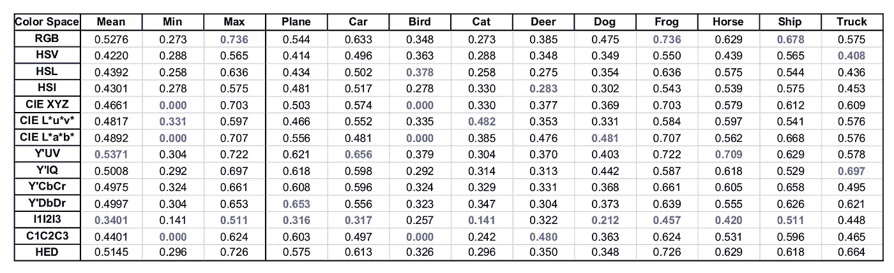**

**不同颜色空间下的全局和类精度**

**在分析了我们的颜色空间的平均精度之后，我想知道我们的模型在依赖于类别的颜色空间上的精度是否有变化。**

**我们的两个最佳颜色空间(RGB 和 Y'UV)非常擅长对车辆进行分类，但在对动物的分类方面相对较弱。**

**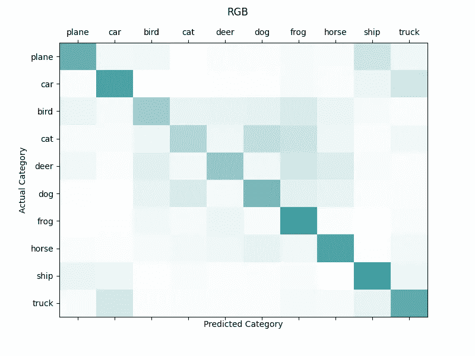**

**基于 RGB 颜色空间的模型精度混淆矩阵**

**让我们仔细看看 RGB 空间:**

*   **船和车很少有**误报或漏报**…**
*   **假阳性和假阴性对鸟、猫、狗、鹿和青蛙来说是很重要的。**

**好了，现在是时候看看另一个颜色空间对分类动物是否有意思了。**

**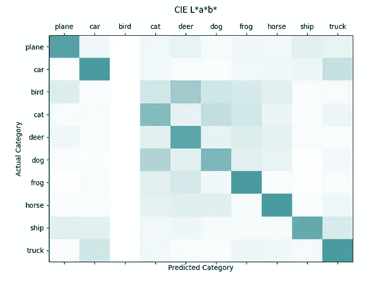****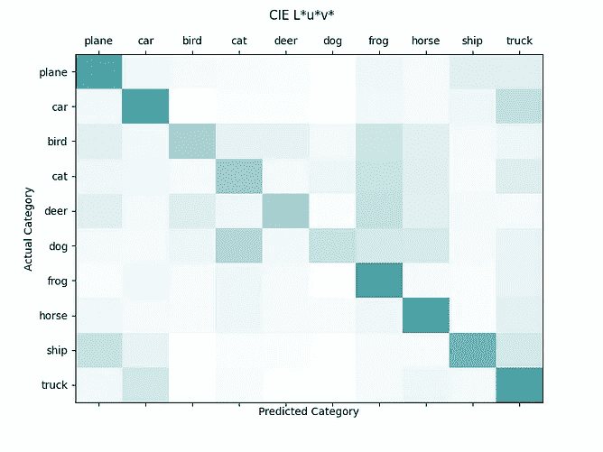****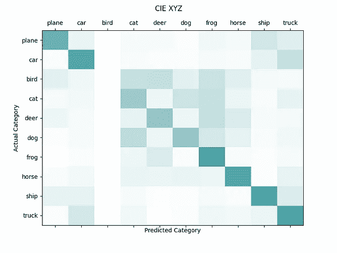**

**在我们的例子中，颜色空间 CIE XYZ、CIE L*a*b*、CIE L*u*v*非常有趣:**

*   **CIE L*u*v*:根据不同等级，其精度分布非常均匀(即使它仍然不是最佳的)**
*   **CIE L*a*b*和 CIE XYZ: **鸟是永远预测不到的！**它们在这个颜色空间里大概很难分辨。**

**我不知道你怎么想，但在这种情况下，我会尝试为我的模型提供 **Y'UV** 图像输入，以获得其**整体精度**和 **CIE L*u*v*** 颜色空间，以获得其**稳定性**的精度。**

**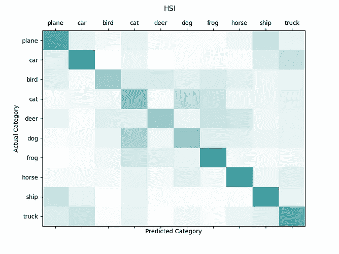****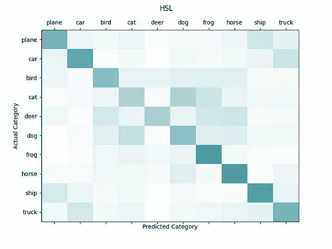****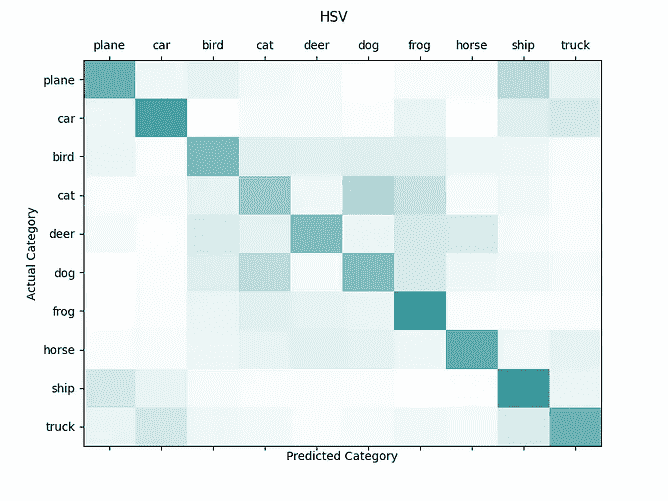**

# **你也可以看看其他的混淆矩阵👊**

**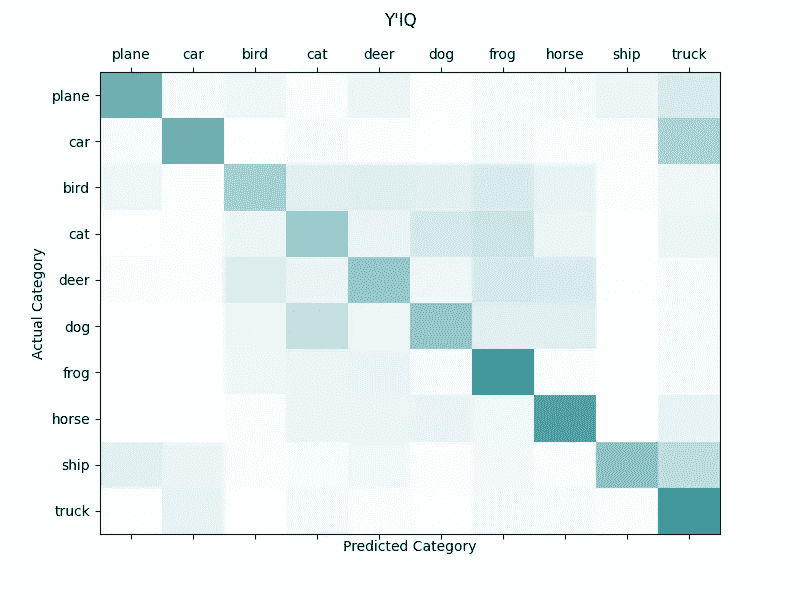****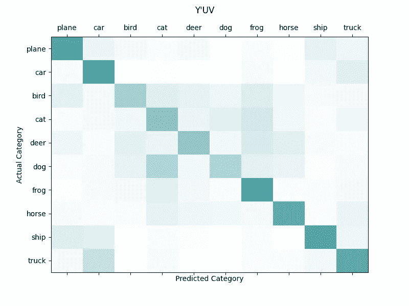****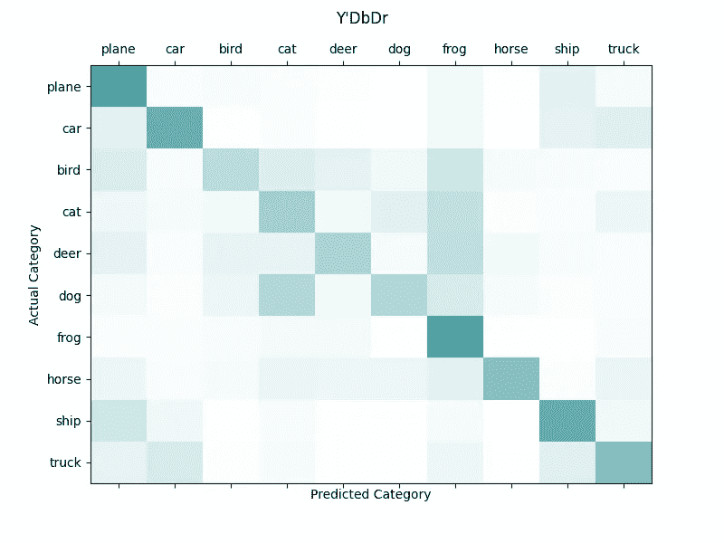****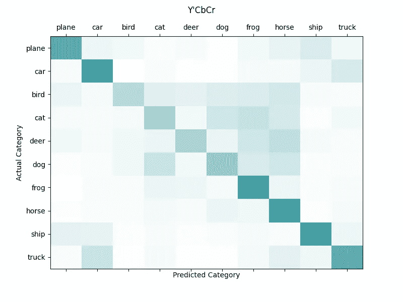****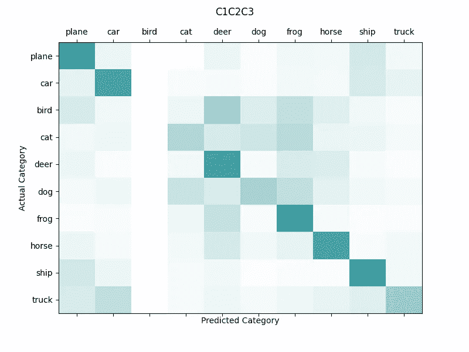****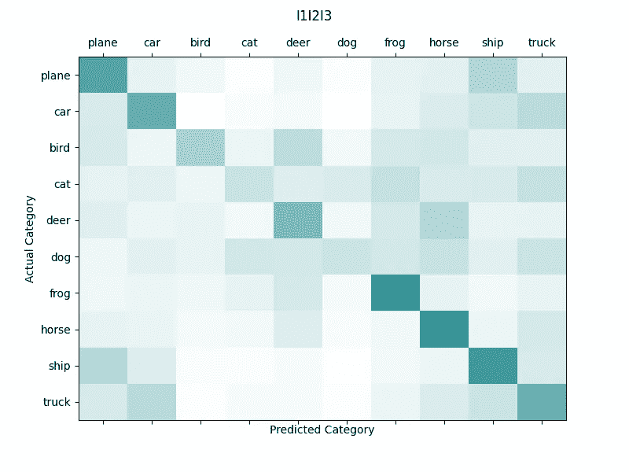****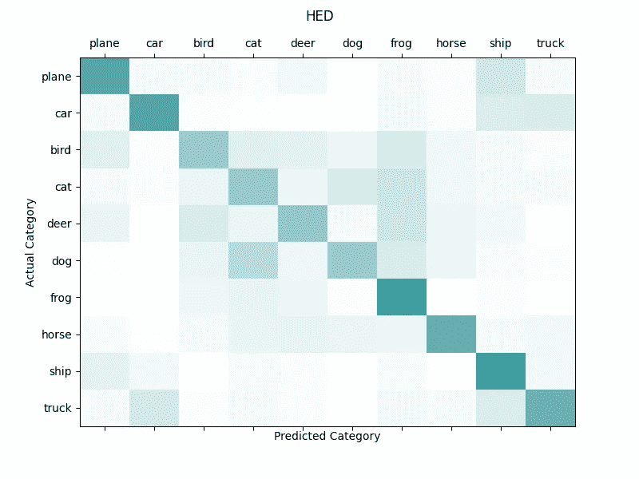**

**最后，我想以最后一个小图来结束，它总结了我们的模型在不同颜色空间和这些**点**下的训练:**

*   **可以用**几个色彩空间**来**馈给**你的模型。这就是 S.N .高达在他的论文中所做的，其中他提出了具有 RGB+HSV+YUV+LAB+HED 的分类模型。注:**多不代表好**。通过增加空间 CIE XYZ，他获得了较低的精度。**
*   **在深度学习的情况下，网络越深，就越会扭曲空间。因此，色彩空间的影响将**最小化**。但是研究颜色仍然非常有趣，主要是在**机器学习**或者用**定义的规则**中。**
*   **从一个型号到另一个型号，色彩空间的**对准确度的**影响**不一定相同**。换句话说，对于同一数据集，RGB 空间可能更适合 SVM，而 HSL 空间更适合 KNN。**

**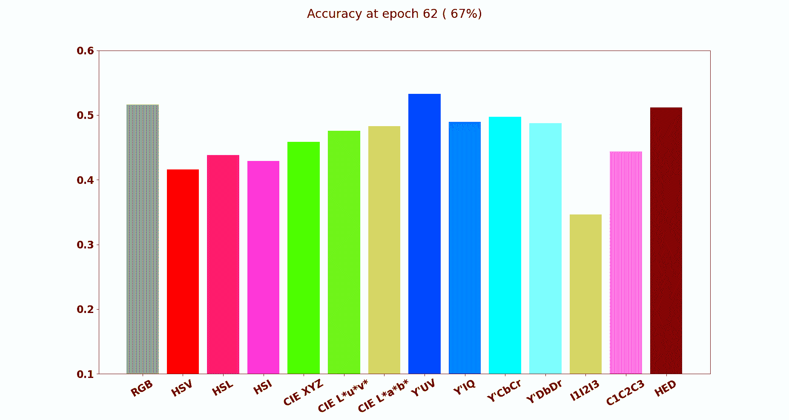******

> **知识就是分享。
> **支持**我，获得 [**中我所有文章的**访问**一键点击此处**](https://axel-thevenot.medium.com/membership) 。**

****

# **来源和参考**

*   **[国际照明委员会](http://cie.co.at/)
    [颜色通道表征对可转移性的影响](https://www.researchgate.net/publication/332622912_The_Effect_of_Color_Channel_Representations_on_the_Transferability_of_Convolutional_Neural_Networks)**
*   **[卷积神经网络](https://www.researchgate.net/publication/332622912_The_Effect_of_Color_Channel_Representations_on_the_Transferability_of_Convolutional_Neural_Networks)，J. Diaz-Cely，C. Arce-Lopera，J.C. Mena，L. Quintero**
*   **[使用机器学习技术和不同的颜色空间根据成熟程度对鹅莓果进行分类](https://peerj.com/preprints/26691.pdf)，W. Castro，J. Oblitas，M. De-la-Torre，C. Cotrina，k .巴赞，H. Avila-George**
*   **[不同作物品种叶片分割的情境化方法](https://www-sciencedirect-com.devinci.idm.oclc.org/science/article/pii/S0168169918301911)，M.P. Rico-Fernándeza，R. Rios-Cabreraa，M. Castelána，H.-I. Guerrero-Reyesa，A. Juarez-Maldonado**
*   **[非理想光照条件下机器人应用的立体视觉](https://www-sciencedirect-com.devinci.idm.oclc.org/science/article/pii/S0262885609002674)，L. Nalpantidis，A. Gasteratos**
*   **给动画世界上色:通过动画电影探索人类对颜色的感知和偏好。**
*   **[基于人工神经网络的 YCbCr 皮肤检测
    算法的性能分析](https://www-sciencedirect-com.devinci.idm.oclc.org/science/article/pii/S1877705812026999)，A. M. Aibinu，A. A. Shafie 和 M. J. E. Salami**
*   **[用于区域分割的颜色信息](https://www-sciencedirect-com.devinci.idm.oclc.org/science/article/pii/0146664X80900477)，Y-I. Ohta，T. Kanade T. Sakai**
*   **[颜色空间选择对有色物体的可检测性和可辨别性的影响](https://arxiv.org/abs/1702.05421)，A. Rasouli 和 J.K. Tsotsos**
*   **[色彩](https://www.google.com/url?sa=t&rct=j&q=&esrc=s&source=web&cd=1&cad=rja&uact=8&ved=2ahUKEwjpntrcz7HpAhXF7eAKHfNBBcMQFjAAegQIAxAB&url=http%3A%2F%2Fwww.micc.unifi.it%2Fdelbimbo%2Fwp-content%2Fuploads%2F2011%2F10%2Fslide_corso%2FA11_color_feature.pdf&usg=AOvVaw3kXCYQlrmgqio6fUr6PlCE)，媒体整合与传播中心(MICC)**
*   **[ColorNet:探讨颜色空间对图像分类的重要性](https://www.google.com/url?sa=t&rct=j&q=&esrc=s&source=web&cd=5&ved=2ahUKEwjPivfC3rHpAhUFyIUKHTb4DmwQFjAEegQIAxAB&url=https%3A%2F%2Farxiv.org%2Fpdf%2F1902.00267&usg=AOvVaw3zmKdCqMk2lkm5hz-CT7RN)，S.N .高达，袁春华**
*   **[通过颜色去卷积对组织化学染色进行定量，](https://www.semanticscholar.org/paper/Quantification-of-histochemical-staining-by-color-Ruifrok-Johnston/71786049c8c73a007807463c4281431f2b66cc25)
    A.C.C. Ruifrok，D. A. Johnston**
*   **[用于显微血液图像中急性淋巴细胞白血病检测的基于计算机计数的系统](https://www.researchgate.net/publication/327879830_Computerized_Counting-Based_System_for_Acute_Lymphoblastic_Leukemia_Detection_in_Microscopic_Blood_Images_27th_International_Conference_on_Artificial_Neural_Networks_Rhodes_Greece_October_4-7_2018_Pro)，K. Ben-Suliman，A. Krzyżak**
*   **机器学习:人工神经元的进化和研究进展**
*   **所有的色彩空间图片都是从维基百科和 Mathworks 图片中创建的**
*   **方程式是自制的:用乳胶写的**
*   **所有其他没有来源的内容都是自制的，可以免费使用**